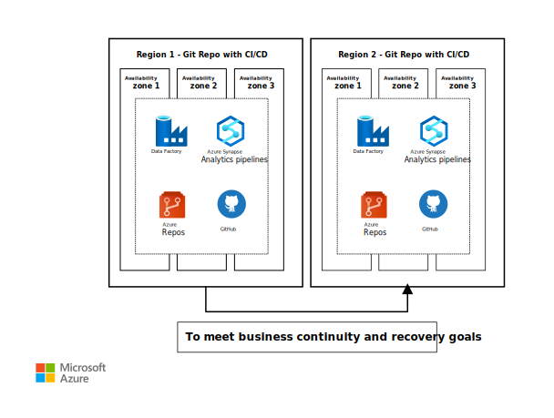
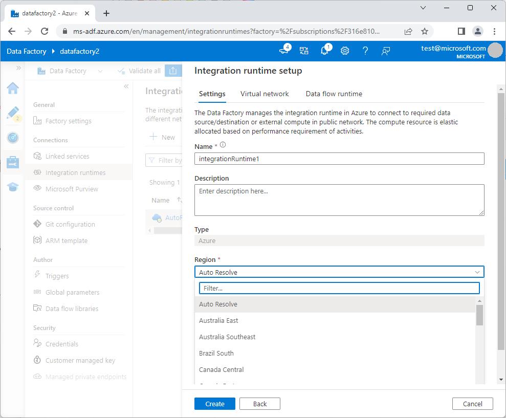

Disasters can be hardware failures, natural disasters, or software failures. The process of preparing for and recovering from a disaster is called disaster recovery (DR). This article discusses recommended practices to achieve business continuity and disaster recovery (BCDR) for Azure Data Factory and Azure Synapse Analytics pipelines.

BCDR strategies include availability zone redundancy, automated recovery provided by Azure disaster recovery, and user-managed recovery by using continuous integration/continuous delivery (CI/CD).

## Architecture

*Download a [Visio file](https://arch-center.azureedge.net/azure_synapse_data_factory.vsdx) of this architecture.*

### Workflow

1. Data Factory and Azure Synapse pipelines achieve resiliency by using Azure regions and Azure availability zones.

   - Each Azure region has a set of datacenters that are deployed within a latency-defined perimeter.
   - Azure availability zones are physically separate locations within each Azure region that are tolerant to local failures.
   - All Azure regions and availability zones are connected through a dedicated, regional low-latency network and by a high-performance network.
   - All availability zone-enabled regions have at least three separate availability zones to ensure resiliency.

1. When a datacenter, part of a datacenter, or an availability zone in a region goes down, failover happens with zero downtime for zone-resilient Data Factory and Azure Synapse pipelines.

### Components

- [Azure Data Factory](https://azure.microsoft.com/services/data-factory)
- [Azure Synapse Analytics](https://azure.microsoft.com/products/synapse-analytics) and [Azure Synapse pipelines](/azure/synapse-analytics/get-started-pipelines)
- [GitHub](https://github.com)
- [Azure Repos](https://azure.microsoft.com/services/devops/repos)

## Scenario details

Data Factory and Azure Synapse pipelines store artifacts that include the following data:

**Metadata**

  - Pipeline
  - Datasets
  - Linked services
  - Integration runtime
  - Triggers

**Monitoring data**

  - Pipeline
  - Triggers
  - Activity runs

Disasters can strike in different ways, such as hardware failures, natural disasters, or software failures that result from human error or cyberattack. Depending on the types of failures, their geographical impact can be regional or global. When planning a disaster recovery strategy, consider both the nature of the disaster and its geographic impact.

BCDR in Azure works on a shared responsibility model. Many Azure services require customers to explicitly set up their DR strategy, while Azure provides the baseline infrastructure and platform services as needed.

You can use the following recommended practices to achieve BCDR for Data Factory and Azure Synapse pipelines under various failure scenarios. For implementation, see [Deploy this scenario](#deploy-this-scenario).

### Automated recovery with Azure disaster recovery

With automated recovery provided Azure backup and disaster recovery, when there is a complete regional outage for an Azure region that has a paired region, Data Factory or Azure Synapse pipelines automatically fail over to the paired region when you [Set up automated recovery](#deploy-this-scenario). The exceptions are Southeast Asia and Brazil regions, where data residency requirements require data to stay in those regions.

In DR failover, Data Factory recovers the production pipelines. If you need to validate your recovered pipelines, you can back up the Azure Resource Manager (ARM) templates for your production pipelines in secret storage, and compare the recovered pipelines to the backups.

The Azure Global team conducts regular BCDR drills, and Azure Data Factory and Azure Synapse Analytics participate in these drills. The BCDR drill simulates a region failure and fails over Azure services to a paired region without any customer involvement. For more information about the BCDR drills, see [Testing of services](/azure/availability-zones/business-continuity-management-program#testing-of-services).

### User-managed redundancy with CI/CD

To achieve BCDR in the event of an entire region failure, you need a data factory or an Azure Synapse workspace in the secondary region. In case of accidental Data Factory or Azure Synapse pipeline deletion, outages, or internal maintenance events, you can use Git and CI/CD to recover the pipelines manually.

Optionally, you can use an active/passive implementation. The primary region handles normal operations and remains active, while the secondary DR region requires pre-planned steps, depending on specific implementation, to be promoted to primary. In this case, all the necessary configurations for infrastructure are available in the secondary region, but they aren't provisioned.

### Potential use cases

User-managed redundancy is useful in scenarios like:

- Accidental deletion of pipeline artifacts through human error.
- Extended outages or maintenance events that don't trigger BCDR because there's no disaster reported.

You can quickly move your production workloads to other regions and not be affected.

## Considerations

These considerations implement the pillars of the Azure Well-Architected Framework, which is a set of guiding tenets that can be used to improve the quality of a workload. For more information, see [Microsoft Azure Well-Architected Framework](/azure/architecture/framework).

### Reliability

Reliability ensures your application can meet the commitments you make to your customers. For more information, see [Overview of the reliability pillar](/azure/architecture/framework/resiliency/overview).

Data Factory and Azure Synapse pipelines are mainstream Azure services that support availability zones, and they're designed to provide the right level of resiliency and flexibility along with ultra-low latency.

The user-managed recovery approach allows you to continue operating if there are any maintenance events, outages, or human errors in the primary region. By using CI/CD, the Data Factory and Azure Synapse pipelines can integrate to a Git repository and deploy to a secondary region for immediate recovery.

### Cost optimization

Cost optimization is about looking at ways to reduce unnecessary expenses and improve operational efficiencies. For more information, see [Overview of the cost optimization pillar](/azure/architecture/framework/cost/overview).

User-managed recovery integrates Data Factory with Git by using CI/CD, and optionally uses a secondary DR region that has all the necessary infrastructure configurations as a backup. This scenario might incur added costs. To estimate costs, use the [Azure pricing calculator](https://azure.microsoft.com/pricing/calculator).

For examples of Data Factory and Azure Synapse Analytics pricing, see:

- [Understanding Azure Data Factory pricing through examples ](/azure/data-factory/pricing-concepts)
- [Azure Synapse Analytics pricing](https://azure.microsoft.com/pricing/details/synapse-analytics)

### Operational excellence

Operational excellence covers the operations processes that deploy an application and keep it running in production. For more information, see [Overview of the operational excellence pillar](/azure/architecture/framework/devops/overview).

By using the user-managed CI/CD recovery approach, you can integrate to Azure Repos or GitHub. For more information about best CI/CD practices, see [Best practices for CI/CD](/azure/data-factory/continuous-integration-delivery#best-practices-for-cicd).

## Deploy this scenario

Take the following actions to set up automated or user-managed DR for Data Factory and Azure Synapse pipelines.

### Set up automated recovery

In Data Factory, you can set the Azure integration runtime (IR) region for your activity execution or dispatch in the **Integration runtime setup**. To enable automatic failover in the event of a complete regional outage, set the **Region** to **Auto Resolve**.

In the context of the integration runtimes, IR fails over automatically to the paired region when you select **Auto Resolve** as the IR region. For other specific location regions, you can create a secondary data factory in another region, and use CI/CD to provision your data factory from the Git repository.

- For managed virtual networks, Data Factory also automatically switches over to the managed IR.

-  Azure managed automatic failover doesn't apply to self-hosted integration runtime (SHIR), because the infrastructure is customer-managed. For guidance on setting up multiple nodes for higher availability with SHIR, see [Create and configure a self-hosted integration runtime](/azure/data-factory/create-self-hosted-integration-runtime#high-availability-and-scalability).

- To configure BCDR for Azure-SSIS IR, see [Configure Azure-SSIS integration runtime for business continuity and disaster recovery (BCDR)](/azure/data-factory/configure-bcdr-azure-ssis-integration-runtime).

Linked services aren't fully enabled after failover, because of pending private endpoints in the newer network of the region. You need to configure private endpoints in the recovered region. You can automate private endpoint creation by using the [approval API](/powershell/module/az.network/approve-azprivateendpointconnection).

### Set up user-managed recovery through CI/CD

You can use Git and CI/CD to recover pipelines manually in case of Data Factory or Azure Synapse pipeline deletion or outage.

- To use Data Factory pipeline CI/CD, see [Continuous integration and delivery in Azure Data Factory](/azure/data-factory/continuous-integration-delivery) and [Source control in Azure Data Factory](/azure/data-factory/source-control).

- To use Azure Synapse pipeline CI/CD, see [Continuous integration and delivery for an Azure Synapse Analytics workspace](/azure/synapse-analytics/cicd/continuous-integration-delivery). Make sure to initialize the Azure Synapse workspace first. For more information, see [Source control in Synapse Studio](/azure/synapse-analytics/cicd/source-control).

When you deploy user-managed redundancy by using CI/CD, take the following actions:

#### Disable triggers

Disable triggers in the original primary data factory once it comes back online. You can disable the triggers manually, or implement automation to periodically check the availability of the original primary. Disable all triggers on the original primary data factory immediately after the factory recovers.

To use Azure PowerShell to turn Data Factory triggers off or on, see [Sample pre- and post-deployment script](/azure/data-factory/continuous-integration-delivery-sample-script) and [CI/CD improvements related to pipeline triggers deployment](https://techcommunity.microsoft.com/t5/azure-data-factory-blog/ci-cd-improvements-related-to-pipeline-triggers-deployment/ba-p/3605064).

#### Handle duplicate writes

Most extract, transform, load (ETL) pipelines are designed to handle duplicate writes, because backfill and restatement require them. Data sinks that support transparent failover can handle duplicate writes with records merge or by deleting and inserting all records in the specific time range.

For data sinks that change endpoints after failover, primary and secondary storage might have duplicate or partial data. You need to merge the data manually.

#### Check the witness and control the pipeline flow (optional)

In general, you need to design your pipelines to include activities, like fail and lookup activities, for restarting failed pipelines from the point of interest.

1. Add a global parameter in your data factory to indicate the region, for example `region='EastUS'` in the primary and `region='CentralUS'` in the secondary data factory.

1. Create a witness in a third region. The witness can be a REST call or any type of storage. The witness returns the current primary region, for example `'EastUS'`, by default.

1. When a disaster happens, manually update the witness to return the new primary region, for example `'CentralUS'`.

1. Add an activity in your pipeline to look up the witness and compare the current primary value to the global parameter.

   - If the parameters match, this pipeline is running on the primary region. Proceed with the real work.
   - If the parameters don't match, this pipeline is running on the secondary region. Just return the result.

> [!Note]
> This approach introduces a dependency on the witness lookup into your pipeline. Failure to read the witness halts all pipeline runs.

## Contributors

*This article is maintained by Microsoft. It was originally written by the following contributors.*

Principal authors:

- [Krishnakumar Rukmangathan](https://www.linkedin.com/in/krishnakumar-rukmangathan) | Senior Program Manager - Azure Data Factory team 

- [Sunil Sabat](https://www.linkedin.com/in/sunilsabat) | Principal Program Manager - Azure Data Factory team 

Other contributors: 

- [Mario Zimmermann](https://www.linkedin.com/in/mario-zimmermann-11614755) | Principal Software Engineering Manager - Azure Data Factory team 

- [Wee Hyong Tok](https://www.linkedin.com/in/weehyongtok) | Principal Director of PM - Azure Data Factory team

*To see non-public LinkedIn profiles, sign in to LinkedIn.*

## Next steps

- [Business continuity management in Azure](/azure/availability-zones/business-continuity-management-program)
- [Resiliency in Azure](/azure/availability-zones/overview)
- [Azure resiliency terminology](/azure/availability-zones/glossary)
- [Regions and availability zones](/azure/availability-zones/az-overview)
- [Cross-region replication in Azure](/azure/availability-zones/cross-region-replication-azure#azure-cross-region-replication-pairings-for-all-geographies)
- [Azure regions decision guide](/azure/cloud-adoption-framework/migrate/azure-best-practices/multiple-regions)
- [Azure services that support availability zones](/azure/availability-zones/az-region)
- [Shared responsibility in the cloud](/azure/security/fundamentals/shared-responsibility)
- [Azure Data Factory data redundancy](/azure/data-factory/concepts-data-redundancy)
- [Integration runtime in Azure Data Factory](/azure/data-factory/concepts-integration-runtime)
- [Pipelines and activities in Azure Data Factory and Azure Synapse Analytics](https://learn.microsoft.com/azure/data-factory/concepts-pipelines-activities)
- [Data integration in Azure Synapse Analytics versus Azure Data Factory](/azure/synapse-analytics/data-integration/concepts-data-factory-differences)

## Related resources

- [Enterprise-scale disaster recovery](../../solution-ideas/articles/disaster-recovery-enterprise-scale-dr.yml)
- [SMB disaster recovery with Azure Site Recovery](../../solution-ideas/articles/disaster-recovery-smb-azure-site-recovery.yml)
- [Build high availability into your BCDR strategy](../../solution-ideas/articles/build-high-availability-into-your-bcdr-strategy.yml)
- [High availability and disaster recovery scenarios for IaaS apps](../infrastructure/iaas-high-availability-disaster-recovery.yml)
- [Choose a data pipeline orchestration technology in Azure](../../data-guide/technology-choices/pipeline-orchestration-data-movement.md)
- [Business continuity and disaster recovery for Azure Logic Apps](/azure/logic-apps/business-continuity-disaster-recovery-guidance?toc=https:%2f%2flearn.microsoft.com%2fazure%2farchitecture%2ftoc.json&bc=https:%2f%2flearn.microsoft.com%2fazure%2farchitecture%2fbread%2ftoc.json)
