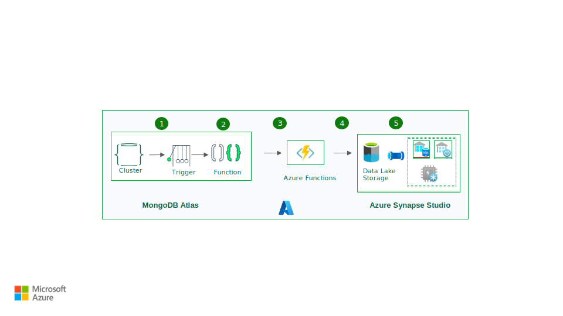
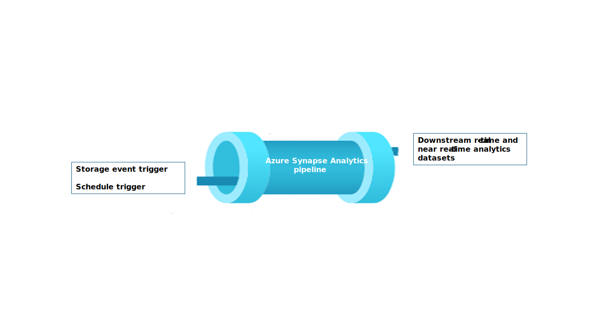

Real-time analytics can help you make quick decisions and perform autmomated actions based on current insights. It can also help you deliver enhanced customer experiences. This solution shows how to keep Azure Synapse Analytics data pools in sync with operational data changes in MongoDB.

## Architecture

The following diagram shows how to implement a real-time sync from Atlas to Azure Synapse Analytics. This simple flow ensures that any changes that occur in the MongoDB Atlas collection are replicated to the default Azure Data Lake Storage repository in the Azure Synapse Analytics workspace. After the data is in Data Lake Storage, you can use Azure Synapse Analytics pipelines to push the data to dedicated SQL pools, Spark pools, or other solutions, depending on your analytics requirements.

*Figure 1*

*Download a [PowerPoint file](https://arch-center.azureedge.net/azure-synapse-analytics-mongodb.pptx) of this architecture.* 

### Dataflow

Real-time changes in the MongoDB Atlas operational data store (ODS) are captured and made available to Data Lake Storage in an Azure Synapse Analytics workspace for real-time analytics use cases, live reports, and dashboards.

1. Data changes in the MongoDB Atlas operational/transactional datastore are captured by [Atlas triggers](https://www.mongodb.com/docs/atlas/app-services/triggers/).

1. When an [Atlas database trigger](https://www.mongodb.com/docs/atlas/app-services/triggers/database-triggers/) observes an event, it passes the change type and the document that's changed (full or delta) to an [Atlas function](https://www.mongodb.com/docs/atlas/app-services/functions/).

1. The Atlas function triggers an Azure function, passing the change event and a JSON document.

1. Azure Functions uses the Azure Storage Files Data Lake client library to write the changed document to the configured Data Lake Storage in the Azure Synapse Analytics workspace.

1. After the data is in Data Lake Storage, it can be sent to dedicated SQL pools, Spark pools, and other solutions. Alternatively, you can convert the data from JSON to Parquet or Delta formats by using Azure Synapse Analytics data flows or Copy pipelines to run additional BI reporting or AI / machine learning on the current data.

### Components

- [MongoDB Atlas](https://www.mongodb.com/docs/manual/changeStreams/)[change streams](https://www.mongodb.com/docs/manual/changeStreams/) enable you to notify applications of changes to a collection, database, or deployment cluster. Change streams gives applications access to real-time data changes and enables them to immediately react to changes. This functionality is critical in use cases like IoT event tracking and financial data changes, where alarms need to be raised and responsive actions need to be taken immediately. Atlas Triggers use change streams to watch collections for changes and automatically invoke the associated Atlas function in response to the trigger event.
- [Atlas triggers](https://www.mongodb.com/docs/atlas/app-services/triggers/database-triggers/) respond to document inserts, updates, and deletes in a specific collection and can automatically invoke an Atlas function in response to the change event. 
- [Atlas functions](https://www.mongodb.com/docs/atlas/app-services/functions/) are serverless, server-side JavaScript code that can take actions based on the events that invoke an Atlas trigger. Combining Atlas triggers with Atlas functions simplifies the implementation of event-driven architectures.
- [Azure Functions](https://azure.microsoft.com/products/functions/) is an event-driven, serverless compute platform that you can use to develop applications efficiently with programming language of your choice. You can also use it to connect seamlessly with other Azure services. In this scenario, an Azure function captures a change event and uses it to write a blob containing the changed data into Data Lake Storage by using the Azure Storage Files Data Lake client library.
- [Data Lake Storage](https://azure.microsoft.com/products/storage/data-lake-storage/) is the default storage solution in Azure Synapse Analytics. You can use serverless pools to query the data directly.
- [Pipelines](/azure/synapse-analytics/get-started-pipelines) and [data flows](/azure/synapse-analytics/concepts-data-flow-overview) in [Azure Synapse Analytics](https://azure.microsoft.com/products/synapse-analytics/) can be used to push the blob that contains the MongoDB changed data to dedicated SQL pools or Spark pools for further analysis. Pipelines enable you to act on changed datasets in Data Lake Storage by using both [storage event triggers](/azure/data-factory/how-to-create-event-trigger?tabs=data-factory) and [scheduled triggers](/azure/data-factory/how-to-create-schedule-trigger?tabs=data-factory) to build solutions for both real-time and near real-time use cases. This integration accelerates downstream consumption of change datasets. 

*Figure 2*

### Alternatives

This solution uses Atlas triggers to wrap the code for listening to Atlas change streams and trigger Azure Functions in response to the change event. It's therefore much easier to implement than the previously provided [alternative solution](/azure/architecture/example-scenario/analytics/azure-synapse-analytics-integrate-mongodb-atlas). For that solution, you need to write code to listen to change streams in an [Azure App Service](https://azure.microsoft.com/products/app-service) app.

Another alternative is to use the [MongoDB Spark Connector](https://www.mongodb.com/blog/post/introducing-mongodb-spark-connector-version-10-1) to read MongoDB stream data and write it to Delta tables. The code is run continuously in a Spark Notebook that's part of a pipeline in Azure Synapse Analytics. For more information on implementing this solution, see [Sync from Atlas to Azure Synapse Analytics using Spark streaming](https://github.com/mongodb-partners/Synapse-Spark-Streaming).

However, using Atlas triggers with Azure Functions provides a completely serverless solution. Because it's serverless, the solution provides robust scalability and cost optimization. Pricing is based on a pay-as-you-go cost model. You can save more mondy by using the Atlas function to combine a few change events before invoking the Azure Functions endpoint. This strategy can be useful in a heavy-traffic scenario.

Also, [Microsoft Fabric](https://www.microsoft.com/microsoft-fabric) unifies your data estate and makes it easier to run analytics and AI over the data, so you get insights quickly. Azure Synapse Analytics data engineering, data science, data warehousing, and real-time analytics in Fabric can now make better use of MongoDB data that's pushed to OneLake. You can use both Dataflow Gen2 and data pipeline connectors for Atlas to load Atlas data directly to OneLake. This no-code mechanism provides a powerful way to ingest data from Atlas to OneLake.  

*Figure 3*

In Fabric, you can directly reference data that's pushed to Data Lake Storage by using [OneLake shortcuts](https://learn.microsoft.com/fabric/onelake/onelake-shortcuts), without any ETL.

You can push the data to Power BI to create reports and visualizations for BI reporting.

## Scenario details 

MongoDB Atlas, the operational data layer of many enterprise applications, stores data from internal applications, customer-facing services, and third-party APIs from multiple channels. You can use the data pipelines in Azure Synapse Analytics to combine this data with relational data from other traditional applications and with unstructured data from sources like logs, object stores, and clickstreams.

Enterprises use MongoDB capabilities like [aggregations](https://www.mongodb.com/docs/manual/aggregation/), [analytical nodes](https://www.mongodb.com/docs/atlas/cluster-config/multi-cloud-distribution/), [Atlas Search](https://www.mongodb.com/atlas/search), [Vector Search](https://www.mongodb.com/products/platform/atlas-vector-search), [Atlas Data Lake](https://www.mongodb.com/atlas/data-lake), [Atlas SQL Interface](https://www.mongodb.com/atlas/sql), [Data Federation](https://www.mongodb.com/atlas/data-federation), and [Charts](https://www.mongodb.com/products/charts) to enable application-driven intelligence. However, the transactional data in MongoDB is extracted, transformed, and loaded to Azure Synapse Analytics dedicated SQL pools or Spark pools for batch, AI / machine learning, and data-warehouse BI analytics and intelligence.

There are two scenarios for data movement between Atlas and Azure Synapse Analytics: batch integration and real-time sync.

### Batch integration

You can use batch and micro-batch integration to move data from Atlas to Data Lake Storage in Azure Synapse Analytics. You can fetch the entire historical data at once or fetch incremental data based on filter criteria.

MongoDB on-premises instances and MongoDB Atlas can be integrated as a source or a sink resource in Azure Synapse Analytics. For information about the connectors, see [Copy data from or to MongoDB](/azure/data-factory/connector-mongodb?tabs=data-factory) or [Copy data from or to MongoDB Atlas](/azure/data-factory/connector-mongodb-atlas?tabs=data-factory).

The source connector makes it convenient to run Azure Synapse Analytics on operational data that's stored in on-premises MongoDB and/or in Atlas. You can fetch data from Atlas by using the source connector and load the data to Data Lake Storage in Parquet, Avro, JSON, and text formats or as CSV blob storage. These files can then be transformed or joined with other files from other data sources in multi-database, multi-cloud, or hybrid cloud scenarios. This use case is common in enterprise data warehouse (EDW) and analytics-at-scale scenarios. You can also use the sink connector to store the results of the analytics back in Atlas. For more information about batch integration, see [Analyze operational data on MongoDB Atlas using Azure Synapse Analytics](/azure/architecture/example-scenario/analytics/azure-synapse-analytics-integrate-mongodb-atlas#batch-integration).  

### Real-time sync

The architecture described in this article can help you implement real-time sync to keep your Azure Synapse Analytics storage current with MongoDB's operational data.  

This solution is composed of two primary functions:
- Capturing the changes in Atlas 
- Triggering the Azure function to propagate the changes to Azure Synapse Analytics  

#### Capture the changes in Atlas  

You can capture the changes by using an Atlas trigger, which you can configure in the **Add Trigger** UI or by using the [Atlas App Services Admin API](https://www.mongodb.com/docs/atlas/app-services/admin/api/v3/). Triggers listen to database changes caused by database events like inserts, updates, and deletes. Atlas triggers also trigger an Atlas function when a change event is detected. You can use the **Add Trigger** UI to add the function. You can also create an Atlas function and associate it as the trigger invocation endpoint by using the [Atlas Admin API](https://www.mongodb.com/docs/atlas/app-services/admin/api/v3/).

The following screenshot shows the form that you can use to create and edit an Atlas trigger. **Trigger Source Details** specify the collection that the trigger will watch for change events and the database events it will watch for (Insert, Update, Delete or Replace).

:::image type="content" source="media/image3.png" alt-text="form for creating an Atlas trigger." border="true":::

*Figure* *4*

The trigger can invoke an Atlas function as a response to the event it is enabled for. Figure 3 shows the simple JavaScript code added as Atlas function to be invoked in response to the database trigger. The Atlas function just invokes another Azure function passing it the metadata of the change event along with the actual document that was inserted/ updated or deleted depending on what the trigger was enabled for.

:::image type="content" source="media/image4.png" alt-text="Java code added" border="true":::

*Figure* *5*

 Atlas function code:

The Atlas function code triggers the Azure function associated with the Azure function end point by passing the entire changeEvent in the body of the request to the Azure function.

The `<<azure function url endpoint>>` needs to be replaced with the actual Azure function url/ endpoint.

    exports =  function(changeEvent) {
    
        // Invoke Azure function inserting the change stream into ADLS gen2
        console.log(typeof fullDocument);
        const response =  context.http.post({
          url: "<<azure function url endpoint>>",
          body: changeEvent,
          encodeBodyAsJSON: true
        });
        return response;
    };

#### Trigger the Azure function to Propagate the Changes to Synapse

Atlas function is coded to invoke an Azure function which writes the change document to Synapse ADLS Gen2. The Azure function uses the [ADLS Gen2 Python ](/azure/storage/blobs/data-lake-storage-directory-file-acl-python?tabs=azure-ad)SDK and creates an instance of the *DataLakeServiceClient* class in the SDK representing your storage account.

The Azure function uses a storage key as the mechanism for authentication. However, it can be changed with Microsoft Entra ID-based OAuth implementations also. The storage_account_key and other ADLS Gen2 storage related attributes are fetched from the set OS environment variables. After decoding the request body, the *fullDocument* (the entire document that was inserted or updated) is parsed from the request body and then written to ADLS Gen 2 using the Data Lake client functions of *append_data* and *flush_data*.

You will notice in the code that for a Delete operation the *fullDocumentBeforeChange* is used instead of *fullDocument*. The *fullDocument* will not have any value for Delete and thus, we need to fetch the document that was deleted which is captured in *fullDocumentBeforeChange*. Note that the fullDocumentBeforeChange is only populated when the *Document Preimage* setting is set to ON as in *Figure 3*.

    import json
    import logging
    import os
    import azure.functions as func
    from azure.storage.filedatalake import DataLakeServiceClient
    
    def main(req: func.HttpRequest) -> func.HttpResponse:
     logging.info('Python HTTP trigger function processed a new request.')
     logging.info(req)
     storage_account_name = os.environ["storage_account_name"]
     storage_account_key = os.environ["storage_account_key"]
     storage_container = os.environ["storage_container"]
     storage_directory = os.environ["storage_directory"]
     storage_file_name = os.environ["storage_file_name"]
     service_client = DataLakeServiceClient(account_url="{}://{}.dfs.core.windows.net".format(
             "https", storage_account_name), credential=storage_account_key)
     json_data = req.get_body()
     logging.info(json_data)
     object_id = "test"
     try:
         json_string = json_data.decode("utf-8")
         json_object = json.loads(json_string)
    
         if json_object["operationType"] == "delete":
             object_id = json_object["fullDocumentBeforeChange"]["_id"]["$oid"]
             data = {"operationType": json_object["operationType"], "data":json_object["fullDocumentBeforeChange"]}
         else:
             object_id = json_object["fullDocument"]["_id"]["$oid"]
             data = {"operationType": json_object["operationType"], "data":json_object["fullDocument"]}
         
         logging.info(object_id)
         encoded_data = json.dumps(data)
     except Exception as e:
         logging.info("Exception occured : "+ str(e)) 
         
     file_system_client = service_client.get_file_system_client(file_system=storage_container)
     directory_client = file_system_client.get_directory_client(storage_directory)
     file_client = directory_client.create_file(storage_file_name + "-" + str(object_id) + ".txt")
     file_client.append_data(data=encoded_data, offset=0, length=len(encoded_data))
     file_client.flush_data(len(encoded_data))
     return func.HttpResponse(f"This HTTP triggered function executed successfully.")

So far, we saw how the Atlas trigger captures any change that occurred and passes it to Azure function via an Atlas function and that the Azure function writes the change document as a new file in ADLS Gen 2 storage of the Synapse Analytics workspace. 

Once the file is added to the ADLS Gen 2, a [storage trigger](/azure/data-factory/how-to-create-event-trigger?tabs=data-factory) can be set up to trigger a Pipeline which can then write the change document to a Dedicated SQL Pool or to a Spark Pool table. The Pipeline can use the flexible Copy activity and transform the data using a Data flow as detailed in the article here. Alternatively, if your final target is the Dedicated SQL Pool, you can modify the Azure function to write directly to the Dedicated SQL Pool in Synapse. Use [link](/azure/synapse-analytics/sql/connection-strings?view=azuresql) to get the ODBC connection string for the SQL Pool connection and refer [here](/azure/azure-sql/database/connect-query-python?context=%2Fazure%2Fsynapse-analytics%2Fcontext%2Fcontext&view=azuresql) for an example python code to query the SQL Pool table using the connection string. This code can be modified to use Insert query to write to the Dedicated SQL Pool. There are configuration settings and adequate roles that need to be assigned to be able to use the function to write to Azure Dedicated SQL Pool, which is out of scope of this paper. 

Note that if you are looking for a near real-time solution and there isn’t a requirement to have the data synchronized in real-time, having scheduled Pipeline runs might be a good option. You can set up scheduled triggers to trigger a Pipeline with Copy activity or Dataflow, at a frequency which is at the near real-time frequency that your business can afford to use the [MongoDB connector](/azure/data-factory/connector-mongodb?tabs=data-factory) to fetch the data from MongoDB that was inserted/updated/deleted since last scheduled run to the current run. The Pipeline uses the MongoDB connector as source connector to fetch the delta data from MongoDB Atlas and push it to ADLS Gen2 or Synapse Dedicated SQL Pools using these as sink connections. This will be a PULL mechanism (as opposed to the solution described in this article which is a PUSH mechanism) from MongoDB Atlas as changes occur in the MongoDB Atlas collection being listened to by the Atlas trigger.

### Potential use cases

Using MongoDB's versatility and Azure Synapse’s Enterprise Data Warehouse (EDW) and Analytical services, we can serve numerous use cases that can directly benefit the customers. 

The use cases span across multiple industries including Retail, Financial Services, Automotive, Manufacturing etc. 

A short summary of the prominent use cases is listed below: 

Retail

* Building intelligence into product bundling and product promotion
* Customer 360 and hyper-personalisation
* Predicting stock depletion and optimizing supply-chain orders
* Dynamic discount pricing and smart search in ecommerce

Banking and finance

* Customizing customer financial services
* Detecting and blocking fraudulent transactions

Telecommunications

* Optimizing next-generation networks
* Maximizing the value of edge networks

Automotive

* Optimizing parameterization of connected vehicles
* Detecting anomalies in IoT communication in connected vehicles

Manufacturing

* Providing predictive maintenance for machinery
* Optimizing storage and inventory management  

## Considerations

These considerations implement the pillars of the Azure Well-Architected Framework, which is a set of guiding tenets that can be used to improve the quality of a workload. For more information, see[ Microsoft Azure Well-Architected Framework](/azure/well-architected/). 

### Security

The solution is based on Azure functions with MongoDB Atlas triggers and functions. Azure functions, being serverless managed services by Azure, the app resources and platform components are actively secured and hardened. However, it is recommended to ensure HTTPS protocol and latest TLS versions are used. It is also a good practice to validate the input to ensure it is a MongoDB change document. Refer [here](/azure/azure-functions/security-concepts?tabs=v4) for multiple Security considerations for Azure functions. MongoDB Atlas, being a managed database as a service, the platform security is well ensured by MongoDB. MongoDB provides multiple mechanisms to ensure 360-degree security for the data stored including Database access, Network security, encryption at rest and in transit and Data sovereignty.  Refer [here](https://www.mongodb.com/collateral/mongo-db-atlas-security) for the MongoDB Atlas security whitepaper and other articles which will help you understand and ensure that the data in MongoDB is secure throughout the data lifecycle.

### Performance efficiency

Atlas Triggers and Azure functions being serverless functions are time tested for performance and scalability. Refer [here](/azure/azure-functions/durable/durable-functions-perf-and-scale) to understand performance and scalability considerations for Azure functions. Refer [here](https://www.mongodb.com/cloud/atlas/performance) for some of the considerations for enhancing the performance of your MongoDB atlas instances and also refer [here](https://www.mongodb.com/basics/best-practices) for some best practices for MongoDB Atlas setup. 

### Cost optimization

To estimate the cost of Azure products and configurations, visit the[Azure pricing calculator](https://azure.microsoft.com/pricing/calculator/). Azure helps you avoid unnecessary costs by identifying the correct number of resources, analyzing spending over time, and scaling to meet business needs without overspending. Azure functions being serverless, will incur costs only when invoked. However, depending on the volume of changes in the MongoDB Atlas, you can evaluate using a batching mechanism in the Atlas function to store changes in another temporary collection and trigger the Azure function only if the Batch exceeds a certain limit. Refer [here](https://www.mongodb.com/developer/products/atlas/5-ways-reduce-costs-atlas/) for ways to reduce your Atlas cluster costs and [here](https://www.mongodb.com/docs/atlas/billing/cluster-configuration-costs/) to understand the cluster configuration costs. [MongoDB pricing page](https://www.mongodb.com/pricing?utm_source=google&utm_campaign=search_gs_pl_evergreen_atlas_core_prosp-brand_gic-null_apac-in_ps-all_desktop_eng_lead&utm_term=atlas%20mongodb%20pricing&utm_medium=cpc_paid_search&utm_ad=e&utm_ad_campaign_id=12212624347&adgroup=115749713263&cq_cmp=12212624347&gad=1&gclid=Cj0KCQjwz8emBhDrARIsANNJjS6R53mr3nEGpwqvdpsjQpORFwAQRrM4M7cjrn4p9273HWFoHTxqJe4aAhfiEALw_wcB) helps you understand the pricing options for MongoDB Atlas clusters and other offerings of the MongoDB Atlas developer data platform. [Atlas Data Federation](https://www.mongodb.com/cloud/atlas/lp/data-federation?utm_source=google&utm_campaign=search_gs_pl_evergreen_data-lake_product_prosp-brand_gic-null_ww-multi_ps-all_desktop_eng_lead&utm_term=mongodb%20atlas%20data%20federation&utm_medium=cpc_paid_search&utm_ad=e&utm_ad_campaign_id=11759330849&adgroup=134320821261&cq_cmp=11759330849&gad=1&gclid=Cj0KCQjwy4KqBhD0ARIsAEbCt6gHmj9m4zGeJmsRLHTypKe6EOacWsygPeaOzdIg5sUl7rXbEY45P0oaAmkLEALw_wcB) now [supports Azure Blob storage](https://www.mongodb.com/blog/post/atlas-data-federation-can-be-deployed-azure-supports-azure-blob-storage-private-preview) also as a target in private preview. Writing to Azure Blob storage instead of a MongoDB temporary collection, may also be considered if Batching is being looked at for cost optimization options.

**Conclusion** 

MongoDB Atlas seamlessly integrates into Azure Synapse Analytics enabling Atlas customers to easily use Atlas as their source or sink for Synapse Analytics. To be able to use Atlas Operation Data Layer’s dynamic schema and versatile data in Synapse analytics in real-time, enables customers to be able to use scalable and rich analytics for their real-time business requirements. This solution empowers them to use MongoDB operational data in real-time from Synapse Analytics for complex analytics and AI inferences.

## Deploy this scenario

[Link to Deploy Process](https://github.com/Azure/Azure_Synapse_RealTimeSync_Using_AtlasTrigger_and_AzureFunction) 

## Contributors 

*This article is maintained by Microsoft. It was originally written by the following contributors.* 

Principal authors:  

- [Diana Annie Jenosh](http://www.linkedin.com/in/diana-jenosh-0b014814) | Senior Solutions Architect - MongoDB Partners team 
- [Venkatesh Shanbag](https://www.linkedin.com/in/venkatesh-shanbhag?lipi=urn%3Ali%3Apage%3Ad_flagship3_profile_view_base_contact_details%3BN6lzuIoYT0Sr6RvASXfXQw%3D%3D)| Senior Solutions Architect - MongoDB Partners team 

Other contributors:  

- [Sunil Sabat](https://www.linkedin.com/in/sunilsabat/) | Principal Program Manager - ADF team 
- [Wee Hyong Tok](https://www.linkedin.com/in/weehyongtok/) | Principal Director of PM - ADF team 

