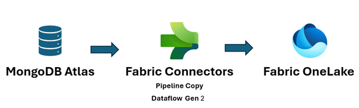

Real-time analytics can help you make quick decisions and perform automated actions based on current insights. It can also help you deliver enhanced customer experiences. This solution describes how to keep Azure Synapse Analytics data pools in sync with operational data changes in MongoDB.

## Architecture

The following diagram shows how to implement real-time sync from Atlas to Azure Synapse Analytics. This flow ensures that any changes that occur in the MongoDB Atlas collection are replicated to the default Azure Data Lake Storage repository in the Azure Synapse Analytics workspace. After the data is in Data Lake Storage, you can use Azure Synapse Analytics pipelines to push the data to dedicated SQL pools, Spark pools, or other solutions, depending on your analytics requirements.

:::image type="content" source="media/azure-synapse-analytics-mongodb.svg" alt-text="Diagram that shows an architecture for implementing real-time sync from MongoDB Atlas to Azure Synapse Analytics." lightbox="media/azure-synapse-analytics-mongodb.svg" border="false":::

*Download a [PowerPoint file](https://arch-center.azureedge.net/azure-synapse-analytics-mongodb.pptx) of this architecture.*

### Dataflow

Real-time changes in the MongoDB Atlas operational data store (ODS) are captured and made available to Data Lake Storage in an Azure Synapse Analytics workspace for real-time analytics use cases, live reports, and dashboards.

1. Data changes in the MongoDB Atlas operational/transactional datastore are captured by [Atlas triggers](https://www.mongodb.com/docs/atlas/app-services/triggers/).

1. When an [Atlas database trigger](https://www.mongodb.com/docs/atlas/app-services/triggers/database-triggers/) observes an event, it passes the change type and the document that's changed (full or delta) to an [Atlas function](https://www.mongodb.com/docs/atlas/app-services/functions/).

1. The Atlas function triggers an Azure function, passing the change event and a JSON document.

1. Azure Functions uses the Azure Storage Files Data Lake client library to write the changed document to the configured Data Lake Storage in the Azure Synapse Analytics workspace.

1. After the data is in Data Lake Storage, it can be sent to dedicated SQL pools, Spark pools, and other solutions. Alternatively, you can convert the data from JSON to Parquet or Delta formats by using Azure Synapse Analytics data flows or Copy pipelines to run additional BI reporting or AI / machine learning on the current data.

### Components

- [MongoDB Atlas change streams](https://www.mongodb.com/docs/manual/changeStreams/) enable you to notify applications of changes to a collection, database, or deployment cluster. Change streams give applications access to real-time data changes and enable them to immediately react to changes. This functionality is critical in use cases like IoT event tracking and financial data changes, where alarms need to be raised and responsive actions need to be taken immediately. Atlas triggers use change streams to monitor collections for changes and automatically invoke the associated Atlas function in response to the trigger event.
- [Atlas triggers](https://www.mongodb.com/docs/atlas/app-services/triggers/database-triggers/) respond to document inserts, updates, and deletes in a specific collection and can automatically invoke an Atlas function in response to the change event.
- [Atlas functions](https://www.mongodb.com/docs/atlas/app-services/functions/) are serverless, server-side JavaScript code implementations that can perform actions based on the events that invoke an Atlas trigger. Combining Atlas triggers with Atlas functions simplifies the implementation of event-driven architectures.
- [Azure Functions](/azure/well-architected/service-guides/azure-functions-security) is an event-driven, serverless compute platform that you can use to develop applications efficiently with the programming language of your choice. You can also use it to integrate with other Azure services. In this scenario, an Azure function captures a change event and uses it to write a blob containing the changed data into Data Lake Storage by using the Azure Storage Files Data Lake client library.
- [Data Lake Storage](/azure/storage/blobs/data-lake-storage-introduction) is the default storage solution in Azure Synapse Analytics. You can use serverless pools to query the data directly.
- [Pipelines](/azure/synapse-analytics/get-started-pipelines) and [data flows](/azure/synapse-analytics/concepts-data-flow-overview) in [Azure Synapse Analytics](/azure/synapse-analytics/overview-what-is) can be used to push the blob that contains the MongoDB changed data to dedicated SQL pools or Spark pools for further analysis. Pipelines enable you to act on changed datasets in Data Lake Storage by using both [storage event triggers](/azure/data-factory/how-to-create-event-trigger) and [scheduled triggers](/azure/data-factory/how-to-create-schedule-trigger) to build solutions for both real-time and near real-time use cases. This integration accelerates downstream consumption of change datasets.

:::image type="content" source="media/azure-synapse-analytics-pipelines.svg" alt-text="Diagram that shows how Azure Synapse Analytics pipelines can push data to pools." border="false" lightbox="media/azure-synapse-analytics-pipelines.svg":::

### Alternatives

This solution uses Atlas triggers to wrap the code for listening to Atlas change streams and triggering Azure Functions in response to the change event. Compared to the previously provided [alternative solution](../../databases/architecture/azure-synapse-analytics-integrate-mongodb-atlas.yml), it reduces the custom code required to listen to change streams in an [Azure App Service](/azure/well-architected/service-guides/app-service-web-apps) web app.

Another alternative is to use the [MongoDB Spark Connector](https://www.mongodb.com/blog/post/introducing-mongodb-spark-connector-version-10-1) to read MongoDB stream data and write it to Delta tables. The code is run continuously in a Spark Notebook that's part of a pipeline in Azure Synapse Analytics. For more information on implementing this solution, see [Sync from Atlas to Azure Synapse Analytics using Spark streaming](https://github.com/mongodb-partners/Synapse-Spark-Streaming).

However, using Atlas triggers with Azure Functions provides a serverless solution. Because it's serverless, the solution can scale and help optimize costs. Pricing is based on a pay-as-you-go cost model. You can reduce invocations by using the Atlas function to combine multiple change events before invoking the Azure Functions endpoint. This strategy can be useful in heavy-traffic scenarios.

Also, [Microsoft Fabric](https://www.microsoft.com/microsoft-fabric) unifies your data estate and provides tools to run analytics and AI over the data, so you can get additional insights. Azure Synapse Analytics data engineering, data science, data warehousing, and real-time analytics in Fabric can use MongoDB data that's pushed to OneLake. You can use both Dataflow Gen2 and data pipeline connectors for Atlas to load Atlas data directly to OneLake. This no-code mechanism provides a way to ingest data from Atlas to OneLake.



In Fabric, you can directly reference data that's pushed to Data Lake Storage by using [OneLake shortcuts](/fabric/onelake/onelake-shortcuts), without any extract, transform, load (ETL).

You can push the data to Power BI to create reports and visualizations for BI reporting.

## Scenario details

MongoDB Atlas, the operational data layer of many enterprise applications, stores data from internal applications, customer-facing services, and third-party APIs from multiple channels. You can use the data pipelines in Azure Synapse Analytics to combine this data with relational data from other traditional applications and with unstructured data from sources like logs, object stores, and clickstreams.

Enterprises use MongoDB capabilities like [Aggregations](https://www.mongodb.com/docs/manual/aggregation/), [analytical nodes](https://www.mongodb.com/docs/atlas/cluster-config/multi-cloud-distribution/), [Atlas Search](https://www.mongodb.com/atlas/search), [Vector Search](https://www.mongodb.com/products/platform/atlas-vector-search), [Atlas Data Lake](https://www.mongodb.com/atlas/data-lake), [Atlas SQL Interface](https://www.mongodb.com/atlas/sql), [Data Federation](https://www.mongodb.com/atlas/data-federation), and [Charts](https://www.mongodb.com/products/charts) to enable application-driven intelligence. However, the transactional data in MongoDB is extracted, transformed, and loaded to Azure Synapse Analytics dedicated SQL pools or Spark pools for batch, AI / machine learning, and data-warehouse BI analytics and intelligence.

There are two scenarios for data movement between Atlas and Azure Synapse Analytics: batch integration and real-time sync.

### Batch integration

You can use batch and micro-batch integration to move data from Atlas to Data Lake Storage in Azure Synapse Analytics. You can fetch the entire historical data at once or fetch incremental data based on filter criteria.

MongoDB on-premises instances and MongoDB Atlas can be integrated as a source or a sink resource in Azure Synapse Analytics. For information about the connectors, see [Copy data from or to MongoDB](/azure/data-factory/connector-mongodb?tabs=data-factory) or [Copy data from or to MongoDB Atlas](/azure/data-factory/connector-mongodb-atlas?tabs=data-factory).

The source connector makes it convenient to run Azure Synapse Analytics on operational data that's stored in on-premises MongoDB or in Atlas. You can fetch data from Atlas by using the source connector and load the data to Data Lake Storage in Parquet, Avro, JSON, and text formats or as CSV blob storage. These files can then be transformed or joined with other files from other data sources in multi-database, multicloud, or hybrid cloud scenarios. This use case is common in enterprise data warehouse (EDW) and analytics-at-scale scenarios. You can also use the sink connector to store the results of the analytics back in Atlas. For more information about batch integration, see [Analyze operational data on MongoDB Atlas using Azure Synapse Analytics](../../databases/architecture/azure-synapse-analytics-integrate-mongodb-atlas.yml#batch-integration).

### Real-time sync

The architecture described in this article can help you implement real-time sync to keep your Azure Synapse Analytics storage current with the MongoDB operational data.

This solution is composed of two primary functions:
- Capturing the changes in Atlas
- Triggering the Azure function to propagate the changes to Azure Synapse Analytics

#### Capture the changes in Atlas

You can capture the changes by using an Atlas trigger, which you can configure in the **Add Trigger** UI or by using the [Atlas App Services Admin API](https://www.mongodb.com/docs/atlas/app-services/admin/api/v3/). Triggers listen for database changes caused by database events like inserts, updates, and deletes. Atlas triggers also trigger an Atlas function when a change event is detected. You can use the **Add Trigger** UI to add the function. You can also create an Atlas function and associate it as the trigger invocation endpoint by using the [Atlas Admin API](https://www.mongodb.com/docs/atlas/app-services/admin/api/v3/).

The following screenshot shows the form that you can use to create and edit an Atlas trigger. In the **Trigger Source Details** section, you specify the collection that the trigger watches for change events and the database events it watches for (insert, update, delete, and/or replace).

:::image type="content" source="media/create-atlas-trigger.png" alt-text="Screenshot that shows the form for creating an Atlas trigger." border="false" lightbox="media/create-atlas-trigger.png":::

The trigger can invoke an Atlas function in response to the event that it's enabled for. The following screenshot shows the simple JavaScript code, added as an Atlas function, to invoke in response to the database trigger. The Atlas function invokes an Azure function, passing it the metadata of the change event together with the document that was inserted, updated, deleted, or replaced, depending on what the trigger is enabled for.

:::image type="content" source="media/javascript-atlas-function.png" alt-text="Screenshot that shows JavaScript code added to the trigger." border="false" lightbox="media/javascript-atlas-function.png":::

##### Atlas function code

The Atlas function code triggers the Azure function that's associated with the Azure function endpoint by passing the entire `changeEvent` in the body of the request to the Azure function.

You need to replace the `<Azure function URL endpoint>` placeholder with the actual Azure function URL endpoint.

```javascript
exports =  function(changeEvent) {

    // Invoke Azure function that inserts the change stream into Data Lake Storage.
    console.log(typeof fullDocument);
    const response =  context.http.post({
        url: "<Azure function URL endpoint>",
        body: changeEvent,
        encodeBodyAsJSON: true
    });
    return response;
};
```

#### Trigger the Azure function to propagate the changes to Azure Synapse Analytics

The Atlas function is coded to invoke an Azure function that writes the change document to Data Lake Storage in Azure Synapse Analytics. The Azure function uses the [Azure Data Lake Storage client library for Python](/azure/storage/blobs/data-lake-storage-directory-file-acl-python) SDK to create an instance of the `DataLakeServiceClient` class that represents your storage account.

The Azure function uses a storage key for authentication. You can also use Microsoft Entra ID OAuth implementations. The `storage_account_key` and other attributes related to Dake Lake Storage are fetched from the configured OS environment variables. After the request body is decoded, the `fullDocument` (the entire inserted or updated document) is parsed from the request body and then written to Data Lake Storage by the Data Lake client functions `append_data` and `flush_data`.

For a delete operation, `fullDocumentBeforeChange` is used instead of `fullDocument`. `fullDocument` doesn't have any value in a delete operation, so the code fetches the document that was deleted, which is captured in `fullDocumentBeforeChange`. Note that `fullDocumentBeforeChange` is only populated when the **Document Preimage** setting is set to on, as shown in the previous screenshot.

```javascript
import json
import logging
import os
import azure.functions as func
from azure.storage.filedatalake import DataLakeServiceClient

def main(req: func.HttpRequest) -> func.HttpResponse:
    logging.info('Python HTTP trigger function processed a new request.')
    logging.info(req)
    storage_account_name = os.environ["storage_account_name"]
    storage_account_key = os.environ["storage_account_key"]
    storage_container = os.environ["storage_container"]
    storage_directory = os.environ["storage_directory"]
    storage_file_name = os.environ["storage_file_name"]
    service_client = DataLakeServiceClient(account_url="{}://{}.dfs.core.windows.net".format(
            "https", storage_account_name), credential=storage_account_key)
    json_data = req.get_body()
    logging.info(json_data)
    object_id = "test"
    try:
        json_string = json_data.decode("utf-8")
        json_object = json.loads(json_string)

        if json_object["operationType"] == "delete":
            object_id = json_object["fullDocumentBeforeChange"]["_id"]["$oid"]
            data = {"operationType": json_object["operationType"], "data":json_object["fullDocumentBeforeChange"]}
        else:
            object_id = json_object["fullDocument"]["_id"]["$oid"]
            data = {"operationType": json_object["operationType"], "data":json_object["fullDocument"]}

        logging.info(object_id)
        encoded_data = json.dumps(data)
    except Exception as e:
        logging.info("Exception occurred : "+ str(e))

    file_system_client = service_client.get_file_system_client(file_system=storage_container)
    directory_client = file_system_client.get_directory_client(storage_directory)
    file_client = directory_client.create_file(storage_file_name + "-" + str(object_id) + ".txt")
    file_client.append_data(data=encoded_data, offset=0, length=len(encoded_data))
    file_client.flush_data(len(encoded_data))
    return func.HttpResponse(f"This HTTP triggered function executed successfully.")
```

So far, you've seen how the Atlas trigger captures any change that occurs and passes it to an Azure function via an Atlas function, and that the Azure function writes the change document as a new file in Data Lake Storage in the Azure Synapse Analytics workspace.

After the file is added to Data Lake Storage, you can set up a [storage event trigger](/azure/data-factory/how-to-create-event-trigger) to trigger a pipeline that can then write the change document to a dedicated SQL pool or to a Spark pool table. The pipeline can use the [Copy activity and transform the data by using a data flow](/azure/data-factory/connector-azure-sql-data-warehouse). Alternatively, if your final target is a dedicated SQL pool, you can modify the Azure function to write directly to the dedicated SQL pool in Azure Synapse Analytics. For a SQL pool, get the ODBC [connection string](/azure/synapse-analytics/sql/connection-strings) for the SQL pool connection. See [Use Python to query a database](/azure/azure-sql/database/connect-query-python) for an example of Python code that you can use to query the SQL pool table by using the connection string. You can modify this code to use an Insert query to write to a dedicated SQL pool. There are configuration settings and roles that need to be assigned to enable the function to write to a dedicated SQL pool. Information about these settings and roles is outside the scope of this article.

If you want a near real-time solution and you don't need the data to be synchronized in real time, using scheduled pipeline runs might be a good option. You can set up scheduled triggers to trigger a pipeline with the Copy activity or a data flow, at a frequency that's at the near real-time frequency that your business can afford, to use the [MongoDB connector](/azure/data-factory/connector-mongodb) to fetch the data from MongoDB that was inserted, updated, or deleted between the last scheduled run and the current run. The pipeline uses the MongoDB connector as source connector to fetch the delta data from MongoDB Atlas and push it to Data Lake Storage or Azure Synapse Analytics dedicated SQL pools, using these as sink connections. This solution uses a pull mechanism (as opposed to the main solution described in this article, which is a push mechanism) from MongoDB Atlas as changes occur in the MongoDB Atlas collection that the Atlas trigger is listening to.

### Potential use cases

MongoDB and the Azure Synapse Analytics EDW and analytical services can serve numerous use cases:

Retail

* Building intelligence into product bundling and product promotion
* Implementing customer 360 and hyper-personalization
* Predicting stock depletion and optimizing supply-chain orders
* Implementing dynamic discount pricing and smart search in e-commerce

Banking and finance

* Customizing customer financial services
* Detecting and blocking fraudulent transactions

Telecommunications

* Optimizing next-generation networks
* Maximizing the value of edge networks

Automotive

* Optimizing the parameterization of connected vehicles
* Detecting anomalies in IoT communication in connected vehicles

Manufacturing

* Providing predictive maintenance for machinery
* Optimizing storage and inventory management

## Considerations

These considerations implement the pillars of the Azure Well-Architected Framework, which is a set of guiding tenets that you can use to improve the quality of a workload. For more information, see [Well-Architected Framework](/azure/well-architected/).

### Security

Security provides assurances against deliberate attacks and the misuse of your valuable data and systems. For more information, see [Design review checklist for Security](/azure/well-architected/security/checklist).

Azure Functions is a serverless managed service, so the app resources and platform components are protected by enhanced security. However, we recommend that you use HTTPS protocol and the latest TLS versions. It's also a good practice to validate the input to ensure that it's a MongoDB change document. See [Securing Azure Functions](/azure/azure-functions/security-concepts) for security considerations for Azure Functions.

MongoDB Atlas is a managed database as a service, so MongoDB provides enhanced platform security. MongoDB provides multiple mechanisms to help ensure 360-degree security for stored data, including database access, network security, encryption at rest and in transit, and data sovereignty. See [MongoDB Atlas Security](https://www.mongodb.com/collateral/mongo-db-atlas-security) for the MongoDB Atlas security whitepaper and other articles that can help you ensure that the data in MongoDB is secure throughout the data lifecycle.

### Cost Optimization

Cost Optimization focuses on ways to reduce unnecessary expenses and improve operational efficiencies. For more information, see [Design review checklist for Cost Optimization](/azure/well-architected/cost-optimization/checklist).

To estimate the cost of Azure products and configurations, use the [Azure pricing calculator](https://azure.microsoft.com/pricing/calculator/). Azure helps you avoid unnecessary costs by determining the correct number of resources to use, analyzing spending over time, and scaling to meet business needs without overspending. Azure Functions incur costs only when they're invoked. However, depending on the volume of changes in MongoDB Atlas, you can evaluate using a batching mechanism in the Atlas function to store changes in another temporary collection and trigger the Azure function only if the batch exceeds a certain limit.

For information about Atlas clusters, see [5 Ways to Reduce Costs With MongoDB Atlas](https://www.mongodb.com/developer/products/atlas/5-ways-reduce-costs-atlas/) and [Cluster Configuration Costs](https://www.mongodb.com/docs/atlas/billing/cluster-configuration-costs/). The [MongoDB pricing page](https://www.mongodb.com/pricing?utm_source=google&utm_campaign=search_gs_pl_evergreen_atlas_core_prosp-brand_gic-null_apac-in_ps-all_desktop_eng_lead&utm_term=atlas%20mongodb%20pricing&utm_medium=cpc_paid_search&utm_ad=e&utm_ad_campaign_id=12212624347&adgroup=115749713263&cq_cmp=12212624347&gad=1&gclid=Cj0KCQjwz8emBhDrARIsANNJjS6R53mr3nEGpwqvdpsjQpORFwAQRrM4M7cjrn4p9273HWFoHTxqJe4aAhfiEALw_wcB) can help you understand pricing options for MongoDB Atlas clusters and other offerings of the MongoDB Atlas developer data platform. [Atlas Data Federation](https://www.mongodb.com/cloud/atlas/lp/data-federation?utm_source=google&utm_campaign=search_gs_pl_evergreen_data-lake_product_prosp-brand_gic-null_ww-multi_ps-all_desktop_eng_lead&utm_term=mongodb%20atlas%20data%20federation&utm_medium=cpc_paid_search&utm_ad=e&utm_ad_campaign_id=11759330849&adgroup=134320821261&cq_cmp=11759330849&gad=1&gclid=Cj0KCQjwy4KqBhD0ARIsAEbCt6gHmj9m4zGeJmsRLHTypKe6EOacWsygPeaOzdIg5sUl7rXbEY45P0oaAmkLEALw_wcB) can be deployed in Azure and [supports Azure Blob Storage](https://www.mongodb.com/blog/post/atlas-data-federation-can-be-deployed-azure-supports-azure-blob-storage-private-preview) (in preview). If you're considering using batching to optimize costs, consider writing to Blob Storage instead of a MongoDB temporary collection.

### Performance Efficiency

Performance Efficiency refers to your workload's ability to scale to meet user demands efficiently. For more information, see [Design review checklist for Performance Efficiency](/azure/well-architected/performance-efficiency/checklist).

Atlas triggers and Azure Functions are time-tested for performance and scalability. See [Performance and scale in Durable Functions (Azure Functions)](/azure/azure-functions/durable/durable-functions-perf-and-scale) to understand performance and scalability considerations for Azure Functions. See [Scale On-Demand](https://www.mongodb.com/cloud/atlas/performance) for some considerations for enhancing the performance of your MongoDB Atlas instances. See [Best Practices Guide for MongoDB Performance](https://www.mongodb.com/basics/best-practices) for best practices for MongoDB Atlas configuration.

## Conclusion

MongoDB Atlas integrates with Azure Synapse Analytics, enabling Atlas customers to use Atlas as a source or a sink for Azure Synapse Analytics. This solution enables you to use MongoDB operational data in real-time from Azure Synapse Analytics for complex analytics and AI inference.

## Contributors

*This article is maintained by Microsoft. It was originally written by the following contributors.*

Principal authors:

- [Diana Annie Jenosh](https://www.linkedin.com/in/diana-jenosh-0b014814) | Senior Solutions Architect - MongoDB Partners team
- [Venkatesh Shanbag](https://www.linkedin.com/in/venkatesh-shanbhag?lipi=urn%3Ali%3Apage%3Ad_flagship3_profile_view_base_contact_details%3BN6lzuIoYT0Sr6RvASXfXQw%3D%3D)| Senior Solutions Architect - MongoDB Partners team

Other contributors:

- [Sunil Sabat](https://www.linkedin.com/in/sunilsabat/) | Principal Program Manager - ADF team
- [Wee Hyong Tok](https://www.linkedin.com/in/weehyongtok/) | Principal Director of PM - ADF team

*To see non-public LinkedIn profiles, sign in to LinkedIn.*

## Next steps
- [Creating a Synapse workspace](/azure/synapse-analytics/get-started-create-workspace)
- [MongoDB Atlas](https://www.mongodb.com/atlas)

## Related resource

- [Real-time analytics on data with Azure Service Bus and Azure Data Explorer](../../solution-ideas/articles/analytics-service-bus.yml)
