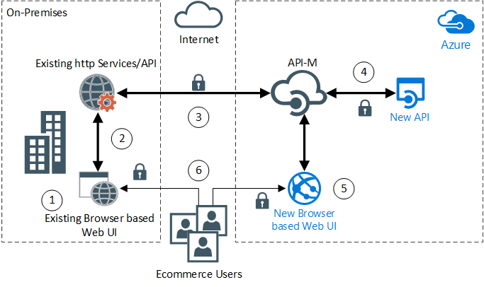

In this scenario, an e-commerce company in the travel industry migrates a legacy web application by using Azure API Management. The company hosts the new user interface (UI) as a platform as a service (PaaS) application on Azure. The new UI depends on both existing and new HTTP APIs. These APIs deploy with more effectively designed interfaces that improve performance, simplify integration, and allow future extensibility.

## Architecture

*[Download a Visio file](https://arch-center.azureedge.net/architecture-apim-api-scenario.vsdx) of this architecture.*

### Workflow

1. The existing on-premises web application continues to directly consume the existing on-premises web services.

1. Calls from the existing web app to the existing HTTP services remain unchanged. These calls are internal to the corporate network.

1. API Management makes inbound calls from Azure to the existing internal services.

    - The security team allows traffic from the API Management instance to pass through the corporate firewall to the existing on-premises services [by using secure transport protocols](/azure/api-management/api-management-howto-manage-protocols-ciphers) like Hypertext Transfer Protocol Secure (HTTPS) or Secure Shell (SSH).

    - The operations team allows inbound calls to the services only from the API Management instance. It meets this requirement by [adding the IP address of the API Management instance to the allow list](/azure/api-management/api-management-faq#how-can-i-secure-the-connection-between-the-api-management-gateway-and-my-backend-services) within the corporate network perimeter.

    - A new module in the on-premises request pipeline for Hypertext Transfer Protocol (HTTP) services acts only on connections that originate externally. The pipeline validates [a certificate that API Management provides](/azure/api-management/api-management-howto-mutual-certificates).

1. The new API has the following characteristics:

    - Only the the API Management instance, which provides the API façade, surfaces the new API. You don't directly access the new API.

    - You develop and publish the new API as an [Azure PaaS web API app](/azure/app-service).

    - You set up the new API by using the [settings for the Web Apps feature of Azure App Service](/azure/app-service/app-service-ip-restrictions) to accept only the [API Management virtual IP (VIP)](/azure/api-management/api-management-faq#how-can-i-secure-the-connection-between-the-api-management-gateway-and-my-backend-services).

    - Web Apps hosts the new API with secure transport protocols like HTTPS or SSL turned on.

    - [Azure App Service](/azure/app-service/app-service-authentication-overview#identity-providers) provides authorization capabilities via Microsoft Entra ID and Open Authorization (OAuth) 2.

1. The new browser-based web application depends on the API Management instance for both the existing HTTP API and the new API.

1. The travel e-commerce company can now direct some users to the new UI for preview or testing while preserving the old UI and existing functionality side by side.

Set up the API Management instance to map the legacy HTTP services to a new API contract. In this configuration, the new web UI is unaware of the integration with a set of legacy services or APIs and new APIs.

In the future, the project team can gradually move functionality to the new APIs and retire the original services. The team handles these changes within the API Management configuration, leaving the front-end UI unaffected and avoiding redevelopment work.

### Components

- [API Management](/azure/well-architected/service-guides/api-management/reliability) is a management platform and gateway for APIs across all environments. In this solution, it serves as a [façade](../../patterns/strangler-fig.md) for the existing legacy APIs and the new APIs. The new client application consumes a single consistent interface, and the team can modernize legacy back ends incrementally behind that façade with minimal impact on front-end development.

- [App Service](/azure/well-architected/service-guides/app-service-web-apps) is a turnkey PaaS solution for web hosting that provides out-of-the-box features like security, load balancing, autoscaling, and automated management. In this solution, App Service provides flexible turnkey hosting so that the DevOps team can focus on feature delivery.

### Alternatives

- If the organization plans to move its infrastructure, including the virtual machines (VMs) that host the legacy applications, entirely to Azure, API Management can act as a façade for any addressable HTTP endpoint.

- If the organization decides to keep the existing endpoints private and not expose them publicly, the organization's API Management instance can link to an [Azure virtual network](/azure/virtual-network/virtual-networks-overview).

  - When [API Management is linked to an Azure virtual network](/azure/api-management/virtual-network-concepts), the organization can directly address the back-end service through private IP addresses.

  - In the on-premises scenario, the API Management instance can reach back to the internal service privately via [Azure VPN Gateway and a site-to-site Internet Protocol Security (IPsec) VPN connection](/azure/vpn-gateway/tutorial-site-to-site-portal) or [Azure ExpressRoute](/azure/expressroute/expressroute-introduction). This scenario then becomes a [hybrid of Azure and on-premises](../../reference-architectures/hybrid-networking/index.yml).

- The organization can keep the API Management instance private by deploying it in internal mode. The organization can then use deployment with [Azure Application Gateway](/azure/application-gateway/overview) to allow public access for some APIs while others remain internal. For more information, see [Integrate API Management in an internal virtual network by using Application Gateway](/azure/api-management/api-management-howto-integrate-internal-vnet-appgateway).

- The organization might decide to host its APIs on-premises. One reason for this change might be that the organization can't move downstream database dependencies that are in scope for this project to the cloud. In that case, the organization can still take advantage of API Management locally by using a [self-hosted gateway](/azure/api-management/self-hosted-gateway-overview).

  The self-hosted gateway is a containerized deployment of the API Management gateway that connects back to Azure on an outbound socket. The first prerequisite is that self-hosted gateways must be deployed with a parent resource in Azure, which carries an extra charge. Second, the Premium tier of API Management is required.

## Scenario details

An e-commerce company in the travel industry is modernizing its legacy browser-based software stack. Although the existing stack is mostly monolithic, some [Simple Object Access Protocol (SOAP)-based HTTP services](https://en.wikipedia.org/wiki/SOAP) exist from a recent project. The company is considering the creation of extra revenue streams to monetize some of the internal intellectual property that it has developed.

Goals for the project include addressing technical debt, improving ongoing maintenance, and accelerating feature development with fewer regression bugs. The project uses an iterative process to avoid risk, with some steps performed in parallel:

- The development team modernizes the application's back end, which consists of relational databases hosted on VMs.
- The in-house development team writes new business functionality that is exposed over new HTTP APIs.
- A contract development team builds a new browser-based UI, which is hosted in Azure.

New application features are delivered in stages. These features gradually replace the existing browser-based client/server UI functionality (hosted on-premises) that now powers the company's e-commerce business.

Members of the management team don't want to modernize unnecessarily. They also want to maintain control of scope and costs. To do this, they've decided to preserve their existing SOAP HTTP services. They also intend to minimize changes to the existing UI. They can use [API Management](/azure/api-management/api-management-key-concepts) to address many of the project's requirements and constraints.

### Potential use cases

This scenario highlights modernizing legacy browser-based software stacks.

You can use this scenario to:

- See how your business can benefit from using the Azure ecosystem.
- Plan for migrating services to Azure.
- Learn how a shift to Azure would affect existing APIs.

## Considerations

These considerations implement the pillars of the Azure Well-Architected Framework, which is a set of guiding tenets that you can use to improve the quality of a workload. For more information, see [Well-Architected Framework](/azure/well-architected/).

### Reliability

Reliability helps ensure that your application can meet the commitments that you make to your customers. For more information, see [Design review checklist for Reliability](/azure/well-architected/reliability/checklist).

- Consider deploying your API Management instance with [Availability zones enabled](/azure/api-management/high-availability). The option to deploy API Management into Availability zones is only available in the Premium service tier.

- Availability zones can be used with [additional gateway instances deployed to different regions](/azure/api-management/api-management-howto-deploy-multi-region). This combination improves service availability if one region goes offline. Multi-region deployment is also only available in the Premium service tier.

- Consider [Integrating with Azure Application Insights](/azure/api-management/api-management-howto-app-insights), which also surfaces metrics through [Azure Monitor](/azure/monitoring-and-diagnostics/monitoring-overview) for monitoring. For example, the capacity metric can be used to determine the overall load on the API Management resource and whether [additional scale-out units are required](/azure/api-management/upgrade-and-scale). Tracking the resource capacity and health improves reliability.

- Ensure that downstream dependencies, for example the backend services hosting the APIs that API Management façades, are also resilient.

### Cost Optimization

Cost Optimization focuses on ways to reduce unnecessary expenses and improve operational efficiencies. For more information, see [Design review checklist for Cost Optimization](/azure/well-architected/cost-optimization/checklist).

API Management is offered in four tiers: Developer, Basic, Standard, and Premium. For more information about the differences in these tiers, see [API Management pricing guidance](https://azure.microsoft.com/pricing/details/api-management).

You can scale API Management by adding and removing units. Each unit has capacity that depends on its tier.

> [!NOTE]
> You can use the Developer tier for evaluation of the API Management features. Don't use it for production.

To view projected costs and customize to your deployment needs, you can modify the number of scale units and App Service instances in the [Azure pricing calculator](https://azure.com/e/0e916a861fac464db61342d378cc0bd6).

## Contributors

*This article is maintained by Microsoft. It was originally written by the following contributors.*

Principal author:

* [Ben Gimblett](https://uk.linkedin.com/in/benjamin-gimblett-0414992) | Senior Customer Engineer

*To see non-public LinkedIn profiles, sign in to LinkedIn.*

## Next steps

Product documentation:

- [App Service overview](/azure/app-service/overview)
- [API Management overview](/azure/api-management/api-management-key-concepts)

Learn modules:

- [Explore App Service](/training/modules/introduction-to-azure-app-service/)
- [Deploy a website to Azure with App Service](/training/paths/deploy-a-website-with-azure-app-service/)
- [Protect your APIs on API Management](/training/modules/protect-apis-on-api-management/)

## Related resource

- [Design great API developer experiences using API Management and GitHub](../../example-scenario/web/design-api-developer-experiences-management-github.yml)
