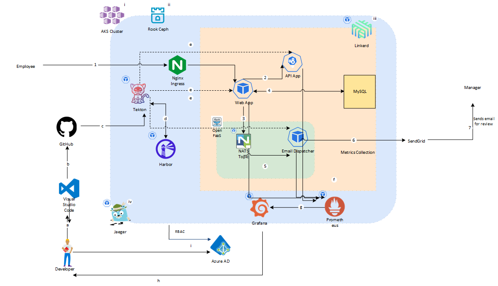

This article demonstrates how to conceptualize, architect, build, and deploy an application that uses projects from the [Cloud Native Computing Foundation](https://www.cncf.io/projects/) after deployment of Azure Kubernetes Service. The article references the repo the [CNCF Projects App](https://www.cncf.io/), that walks you through the steps in deploying such an architecture. This is just one type of a reference architecture, and it can be deployed on any Kubernetes cluster, not just Azure Kubernetes Service. After reviewing this article, you will have a good understanding of deploying a typical application that comprises mostly of CNCF projects.

## Potential use cases

## Architecture

link to visio

The workload is a simple expense manager web application which allows users to view/submit expenses. Upon submission of the expense an email will be sent to the manager. Step-by-step detail below:

Application flow

1. Employee access Web App through NGINX Ingress to submit expenses
2. Web App calls the API App to retrieve the employees’ manager
3. Web App pushes the message generated for expense creation to NATS queue
4. Expenses Saved in MySOL
5. NATS-Connector invokes the Email Dispatcher OpenFaaS function with the expense message as the payload
6. Email dispatcher creates a SendGrid Message
7 SendGrid sends email to retrieved Manager for review

DevOps flow

a. Engineers develop/update code in Visual Studio Code

b. Pushes the code to GitHub, from their local workspace in Visual Studio Code

c. GitHub code is used by Tekton pipelines

d. Pipelines push and pull container image from Harbor registry

e. Tekton deploys Web App, API App, and Email Dispatcher applications

f. Application metrics are captured by Promethius

g. Metrics can be viewed at Grafana Dashboard

h. DevOps Engineers monitor Grafana Dashboard

Infrastructure components

i. AKS cluster based on infrastructure presented in the AKS Baseline

ii. ROOKS Ceph used for Cluster Storage needs

iii. Linkerd’s Service mesh enabling reliable and secured services

iv. Jæger’s tracing capability for overall Application tracing on the K8s cluster

Cluster operations components

Clusters often benefit from being placed under GitOps management as a controlled and observable mechanism to manage cluster bootstrapping and managing those foundational components. Flux is a popular GitOps operator, and is often paired with GitHub Actions to perform validation on updated manifests and Helm charts.

### OSS components
- [Kubernetes] - Container Orchestration Cluster (CNCF)
- [Rook] - Storage Management (CNCF)
- [Harbor] - Container Registry (CNCF)
- [NATS] - Pub/Sub Messaging (CNCF)
- Linkerd] - Service Mesh (CNCF)
- Prometheus] - Monitoring (CNCF)
- [Jaeger] - Observability/Tracing (CNCF)
- [OpenFaaS] - Functions
- [MySQL] - Database
- [Nginx] - Kubernetes Ingress Controller
- [Tekton] CI/CD (CD Foundation)
- [Grafana] - Metrics Dashboard
- [SendGrid] - External Email Service
- [GitHub] - Code Repository and infrastructure deployment pipelines
- [Flux] – GitOps operator
- Web Front-End & Web API - [.NET Core]

### Alternatives
This project uses CNCF Graduated and Incubated projects and there could be multiple alternatives for the services used. Please refer **[CNCF](https://www.cncf.io/) Projects** for other alternatives. Few of the considerations are below.

* [Service mesh references](https://www.cncf.io/blog/2021/07/15/networking-with-a-service-mesh-use-cases-best-practices-and-comparison-of-top-mesh-options)
* [Function as a Service (Serverless)](https://landscape.cncf.io/serverless)
* [Vitess: sharded MySQL on Kubernetes](https://www.cncf.io/online-programs/vitess-sharded-mysql-on-kubernetes)
* [Tracing your microservices](https://www.cncf.io/blog/2018/03/19/trace-your-microservices-application-with-zipkin-and-opentracing)
* [Gitops with Developer centric Experience](https://www.cncf.io/blog/2020/12/22/argocd-kubevela-gitops-with-developer-centric-experience)

There are first party Azure services (eg. AGIC, ACR, Monitor) and Microsoft supported OSS projects (eg. Open Service Mesh) which can be considered as alternatives. 

## Considerations

* A minimum of 3 node user node pool with VM SKU DS2_v2 or larger is required
* Volumes using Azure Managed Disks cannot be attached across zones and must be co-located in the same zone.
* Rook Installation could take ~20 to ~25 mins. Ensure that the Ceph cluster is completely provisioned before moving on to the next step.
* Jaeger could take ~5 mins to complete setup
* Linkerd takes approximately ~12 mins to show up on dashboard

## Deploy this scenario
Deploy this scenario from the GitHub repo at Azure/cloud-native-app. Follow the instructions here in sequence to deploy the CNCF Projects App in your environment. Please do note that this repo is a community project accepting and approving PRs for enhancements and modifications from the community

## Pricing
In general, use the [Azure pricing calculator](https://azure.microsoft.com/ pricing/calculator) to estimate costs. Below are some considerations for running this project in
Azure. Additionally, there is almost negligible bandwidth cost.

### VM Scale Sets
* There will be cost associated with VMs used in VMSSs for the AKS cluster. Please refer to [VM Scale Set pricing](https://azure.microsoft.com/ pricing/details/virtual-machine-scale-sets/linux) for more information.

### Storage
* There will be storage costs associated with each data disk required by Rook Installation. For this 3 Node AKS cluster, the Rook configuration used utilizes two data disks per node, 1 GB and 200 GB. Please refer to [Storage Cost Pricing](https://azure.microsoft.com/pricing/details/managed-disks) for more information.

### Load Balancer
* There is cost for the Load Balance associated with this AKS Cluster. Please refer to [Load Balancer Prining](https://azure.microsoft.com/pricing/details/load-balancer/) for more information.

### Virtual Network
* There will be a charge for the Virtual Network used by the AKS cluster. Please refer to [Virtual Network Pricing](https://azure.microsoft.com/ 

## Next steps
## Related resources 
