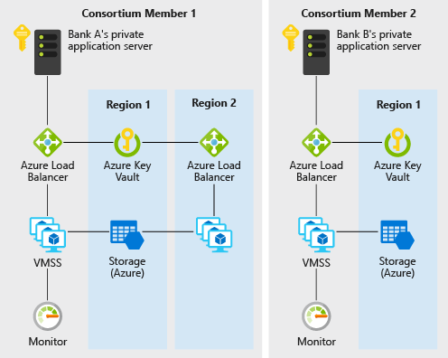

This example will show you how Azure services such as virtual machine scale sets, Virtual Network, Key Vault, Storage, Load Balancer, and Monitor can be quickly provisioned for the deployment of an efficient private Corda network where member banks can establish their own nodes.

## Architecture

*Access the [Visio diagram](https://office.live.com/start/Visio.aspx?omkt=en-us&templatetitle=Decentralized%20trust%20between%20banks%20on%20Azure&templateid=TM45269685) online, through Microsoft 365. Note that you must have a Visio license to access this diagram. Or, download a [Visio file](https://arch-center.azureedge.net/architecture-decentralized-trust.vsdx) of this architecture.*

This scenario covers the back-end components that are necessary to create a scalable, secure, and monitored private, enterprise distributed ledger technology (DLT) network within a consortium of two or more members. Details of how these components are provisioned (that is, within different subscriptions and resource groups), as well as the connectivity requirements (that is, VPN or ExpressRoute), that are left for your consideration, are based on your organization's policy requirements.

### Dataflow

1. Bank A creates/updates an individual's credit record by creating a transaction.
1. Data flows from Bank A's private application server to the [Azure Load Balancer](/azure/load-balancer/), and then to a node VM on the virtual machine scale set.
1. A transaction proposal is created on the network ledger.
1. The transaction is committed to the ledger, when all the required signatures are gathered.
1. Bank B can read the credit record created by bank A by communicating with its own node.

### Components

- [Virtual machines](https://azure.microsoft.com/services/virtual-machines), within virtual machine scale sets, provide the on-demand compute facility to host the node for the DLT network.
- [Azure Key Vault](https://azure.microsoft.com/services/key-vault/#product-overview) is used as the secure storage facility for private keys.
- [Load Balancer](https://azure.microsoft.com/services/load-balancer/#overview) spreads communication requests to the VMs.
- [Azure Storage](https://azure.microsoft.com/product-categories/storage) hosts persistent network information and coordinates leasing.
- Application Insights (part of Azure Monitor) can be used to provide insight into available nodes, transactions per minute, and consortium members.

### Alternatives

The Corda approach is chosen for this example because it is a good entry point for a consortium of organizations that want to create an environment where information can be exchanged and shared with one another easily in a trusted, decentralized, and easy to understand way. Other alternatives to Corda, such as Quorum or Hyperledger, can be considered too.

## Scenario details

This example scenario is useful for banks or any other institutions that want to establish a trusted environment for information sharing without resorting to a centralized database. In this example, we will describe the scenario in the context of maintaining credit score information between banks, but the architecture can be applied to any scenario where a consortium of organizations wants to share information with one another without resorting to the use of a central system ran by one single party.

Traditionally, banks within a financial system rely on centralized sources, such as credit bureaus, for information on an individual's credit score and history. A centralized approach presents a concentration of operational risk and sometimes an unnecessary third party.

With DLTs (distributed ledger technology), a consortium of banks can establish a decentralized system that can be more efficient, less susceptible to attack, and serve as a new platform where innovative structures can be implemented to solve traditional challenges with privacy, speed, and cost.

### Potential use cases

Other relevant use cases include:

- Movement of allocated budgets between different business units of a multinational corporation
- Cross-border payments
- Trade finance scenarios
- Loyalty systems involving different companies
- Supply chain ecosystems (such as manufacturing)

## Considerations

These considerations implement the pillars of the Azure Well-Architected Framework, which is a set of guiding tenets that can be used to improve the quality of a workload. For more information, see [Microsoft Azure Well-Architected Framework](/azure/architecture/framework).

### Availability

[Azure Monitor][monitor] is used to continuously monitor all components of the DLT network for issues to ensure availability. 

### Scalability

For general guidance on designing scalable solutions, see the [performance efficiency checklist][scalability] in the Azure Architecture Center.

### Security

Security provides assurances against deliberate attacks and the abuse of your valuable data and systems. For more information, see [Overview of the security pillar](/azure/architecture/framework/security/overview).

[Azure Key Vault][vault] is used to easily store and manage the private keys. 

For a production scenario, where a private network is desired, members can be connected to each other via VNet-to-VNet VPN gateway connections. The steps for configuring a VPN are included in the deployment section below.

For general guidance on designing secure solutions, see the [Azure Security Documentation][security].

### Resiliency

The Corda network can itself provide some degree of resilience as the nodes can be deployed in different regions. Azure has options for deployments in over 54 regions worldwide. A DLT, such as the one in this scenario, provides unique and refreshing possibilities of cooperation to increase resilience. The resilience of the network is not just provided for by a single centralized party but all members of the consortium. DLT allows network resilience to be even more planned and deliberate.

For general guidance on designing resilient solutions, see [Designing reliable Azure applications](/azure/architecture/framework/resiliency/app-design).

### Cost optimization

Cost optimization is about looking at ways to reduce unnecessary expenses and improve operational efficiencies. For more information, see [Overview of the cost optimization pillar](/azure/architecture/framework/cost/overview).

To explore the cost of running this scenario, all of the services are pre-configured in the cost calculator. To see how the pricing would change for your particular use case, change the appropriate variables to match your expected performance and availability requirements.

We have provided three sample cost profiles based on the number of scale set VM instances that run your applications (the instances can reside in different regions).

- [Small][small-pricing]: this pricing example correlates to 2 VMs per month with monitoring turned off
- [Medium][medium-pricing]: this pricing example correlates to 7 VMs per month with monitoring turned on
- [Large][large-pricing]: this pricing example correlates to 15 VMs per month with monitoring turned on

The above pricing is for one consortium member to start or join a DLT network. Typically in a consortium where there are multiple companies or organizations involved, each member will get their own Azure subscription.

## Deploy this scenario

To deploy a pre-configured network of Corda nodes, review the [guide that is available in Corda's documentation][corda].

## Contributors

*This article is maintained by Microsoft. It was originally written by the following contributors.*

Principal author:

* [Vito Chin](https://www.linkedin.com/in/vitochin) | Senior Cloud Solution Architect

*To see non-public LinkedIn profiles, sign in to LinkedIn.*

## Next steps

Product documentation of Azure services:

- [Virtual machines](/azure/virtual-machines)
- [About Azure Key Vault](/azure/key-vault/general/overview)
- [What is Azure Load Balancer?](/azure/load-balancer/load-balancer-overview)
- [Introduction to Azure Storage](/azure/storage/common/storage-introduction)

## Related resources

- [Data management in banking](../../industries/finance/data-management-banking-overview.yml)
- [Patterns and implementations for a banking cloud transformation](../../example-scenario/banking/patterns-and-implementations.yml)
- [Zero-trust network for web applications with Azure Firewall and Application Gateway](../../example-scenario/gateway/application-gateway-before-azure-firewall.yml)

<!-- links -->
[small-pricing]: https://azure.com/e/4e429d721eb54adc9a1558fae3e67990
[medium-pricing]: https://azure.com/e/bb42cd77437744be8ed7064403bfe2ef
[large-pricing]: https://azure.com/e/e205b443de3e4adfadf4e09ffee30c56
[corda]: https://docs.r3.com/en/platform/corda/4.7/enterprise/network/azure-vm.html
[monitor]: /azure/monitoring-and-diagnostics/monitoring-overview-azure-monitor
[scalability]: /azure/architecture/framework/scalability/performance-efficiency
[security]: /azure/security
[vault]: https://azure.microsoft.com/services/key-vault
