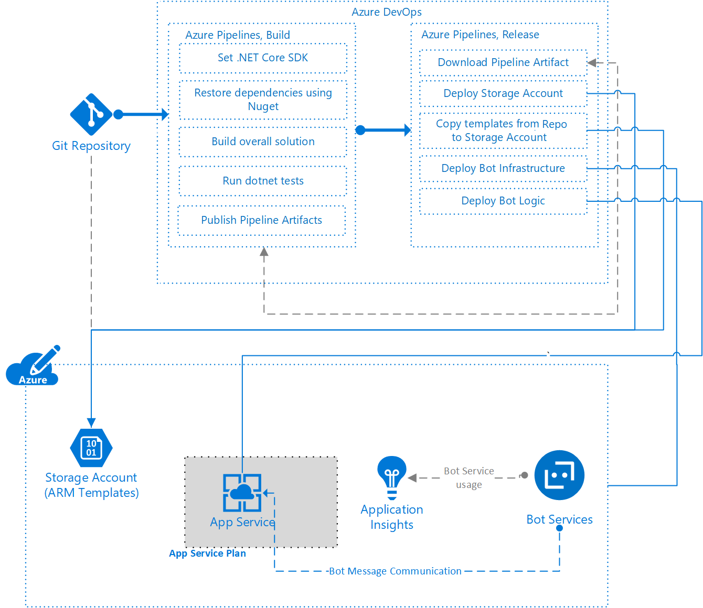
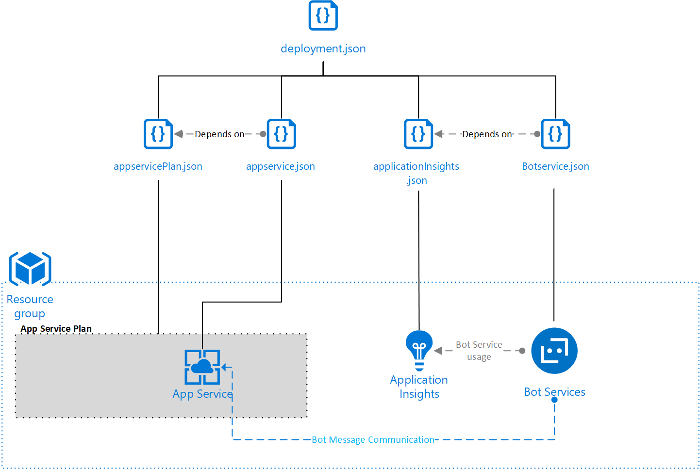

<!-- cSpell:ignore MariaVrabie appservice botservice cicdbots azurewebsites -->

This article presents a DevOps approach to setting up a continuous integration and continuous deployment (CI/CD) pipeline that deploys a chatbot app and its [*infrastructure as code*](/azure/architecture/framework/devops/automation-infrastructure).

DevOps is a common development strategy for building custom applications like bots. [Azure Pipelines](/azure/devops/pipelines/) uses modern CI/CD processes to manage software builds, deployments, testing, and monitoring. Azure Pipelines can help you accelerate your software delivery and focus on your code, rather than the supporting infrastructure and operations.

Infrastructure as code uses Azure Resource Manager templates ([ARM templates](/azure/azure-resource-manager/templates/)) or open-source alternatives to define and deploy an app's underlying infrastructure. You can colocate the software and infrastructure code in the same source control repository, and deploy both through your pipelines.

## Architecture

In this example:

1. Developers create a new chatbot, ARM templates for infrastructure, and code the multi-stage YAML pipeline, all hosted from a GitHub repository.
1. As a second step in day-0, they will provision the initial required infrastructure in Azure using the generated ARM templates.
1. A GitHub webhook notifies Azure Pipelines on top of changes in the repository, which triggers the first stage. It then builds the chatbot application, archives it, and publishes a new drop for the build as a new artifact, which enables continuous integration.
1. Continuous deployment is materialized at the second stage in the multi-stage YAML pipeline. It is the automated deployment of the chatbot application into the Azure infrastructure that was just provisioned.
1. Azure Bot Service channels messages from the Microsoft Teams chat to the Azure Web App, where the chatbot logic is running.
1. A Microsoft Teams app package is created, validated, and ultimately published by uploading it as a custom app. Once it gets successfully installed, users can start interacting with the chatbot from its chat window.

### Source control

Source control lets development teams track software code changes and inspect older code versions. With infrastructure as code, you can define and deploy your underlying infrastructure using ARM templates or open-source alternatives, and also maintain those templates in source control. You can store unit test and build pipeline code in the same source control repository.

[The example scenario in GitHub](https://github.com/mspnp/solution-architectures/tree/master/cicdbots) provides the instructions to create the bot application, infrastructure, and the pipeline code.

### Azure Resource Manager templates

In this example, the generated ARM templates deploy the following resources:

- Azure App Service Plan
- Azure App Service instance
- Azure Bot Service

If you want your chatbot to use Azure Application Insights or Cognitive Services, such as LUIS and QnA Maker, be sure to add them in the template as well. In such a case, you might want to consider using multiple [linked ARM templates](/azure/azure-resource-manager/templates/linked-templates) to deploy the solution. Typically it will consist of creating *Capability templates*, similar to units or modules that implement specific pieces of functionality. An *end-to-end solution* or *orchestrator* template brings those underlying capabilities together. Some of benefits of following this approach are listed below:

- The underlying capability templates can be evaluated and deployed individually.
- The underlying capability templates could be defined as standards for an organization, and reused in multiple solutions.

### Bot development and testing

The example goes through the process of installing the Bot Framework samples, specifically the Echo Bot template, to generate a simple C# chatbot that's designed to work in the Microsoft Teams channel.

To develop a new bot, create a C# Bot Framework project in Visual Studio. You can use the Echo Bot template, or start an empty project. For a comprehensive tutorial on creating a Bot Framework project, see [Create a bot with the Bot Framework SDK for .NET](/azure/bot-service/dotnet/bot-builder-dotnet-sdk-quickstart?view=azure-bot-service-4.0). For information on configuring a bot to run on multiple channels, see [Manage channels in Bot Service](/azure/bot-service/bot-service-manage-channels). Adding a bot in Microsoft Teams requires a few extra steps and considerations. For details, see [Bots in Microsoft Teams](/microsoftteams/platform/concepts/bots/bots-overview).

You can test and debug your chatbot during development with the [Bot Framework emulator](https://github.com/Microsoft/BotFramework-Emulator). The emulator is a desktop app that lets you test and debug bots built with the Bot Framework SDK.

In general, a chatbot is a Web Api that implements logic in code to receive, process, and respond to specific messages. It could be an ASP.NET Core application like in this example, and as such it is always recommended to plan for unit testing the code against an expected outcome. As mentioned it just like any other Web Api project, so unit testing chatbots use the same principles and approaches as testing other apps. For more information about unit testing, see [Unit testing in .NET](/dotnet/core/testing/) and [Unit testing best practices](/dotnet/core/testing/unit-testing-best-practices).

You can add a unit test project to a chatbot solution in Visual Studio, and choose between MSTest or XUnit for the project. For a live view of the unit tests, [configure Live Unit Testing](/visualstudio/test/live-unit-testing).

### Continuous integration and build

[Azure Pipelines](/azure/devops/pipelines/get-started/index) is a DevOps service, where it is possible to implement and execute the desired stages, such as build, deployment, and so on, which constitute the pipeline for your apps.

You define the triggers, stages, and tasks for pipelines in a [YAML build definition file](/azure/devops/pipelines/get-started-yaml). This file can be versioned in source control, typically seated along side or under the specific project folder structure. In some cases, an organization might prefer to store them from a separated repository, or they could also opt for using the [Classic](/azure/devops/pipelines/get-started/pipelines-get-started#define-pipelines-using-the-classic-interface) visual interface to create a build pipeline. To use this interface, select **Use the classic editor** on the pipeline creation page.

If you enable continuous integration in the `triggers` section of your build pipeline, new commits to the repository automatically kick off the build. YAML build pipelines have a CI trigger on all branches by default. This example will be listening to changes in the `main` branch under a specific folder. Once you check in your code, the build pipeline could run tests to validate the code, and builds the appropriate parts of the software. The number and types of tests and tasks you run depend on your wider build and release strategy.

### Continuous deployment and release

A [multi-stage YAML pipeline](/azure/devops/pipelines/get-started/multi-stage-pipelines-experience?view=azure-devops) executes all the defined stages such as build and deploy. While another option is to use an Azure Pipelines [release pipeline](/azure/devops/pipelines/release) to automate your deployment process. In both cases, the result is the same since it enables continuous deployment.

In the deploy stage or release pipeline, you define tasks to deploy your app to the underlying infrastructure. You can define many variables for the overall pipeline, so you don't have to input them for every task.

The deployment depends on the build execution to get the output artifact that contains a drop. In this example, it is a zip file with the chatbot compressed into it.

Organizations embracing GitOps could automate the deployment of the underlaying infrastructure as well. Typically, a different pipeline is created for that purpose, and it is initially executed on day-zero or as part of future revisions, while modifying the infrastructure, in case it needs to be patched or evolve. There are no impediments for these ARM templates to reside in a completely separated repository, which offers a better separation of concerns for configuration management assets. However, organizations seeking to reduce the number of repositories, or to give more ownership over infrastructure to the dev team, could opt to store them under the same Git repo. Note that during the deployment of linked ARM templates, they need to be accessible from a public endpoint, such as a Git repo or an Azure Blob Storage account.

### App Service Plan and App Service instance

An Azure App Service Plan is the underlying server farm used to deploy an Azure App Service instance. In this example, the ARM templates are being generated using the EchoBot templates. Later you could adapt them to your specific case scenario by modifying the tier, compute, platform, or scale, or break them down into several linked ARM templates, as presented above.

### Bot Services

The Azure Bot Service provides an endpoint for the bot to communicate through the chosen channels. The Bot Service also provides a mechanism to associate the bot to a pricing tier, based upon the expected requests and throughput.

To deploy to Azure, the bot needs an Application ID and password, and the ability to register channels to run in. All the instructions are provided as part of [this example](https://github.com/mspnp/solution-architectures/tree/master/cicdbots). For more information, see [App registration](/azure/bot-service/bot-service-resources-bot-framework-faq#app-registration).

### Application Insights

Azure Application Insights allows you to send telemetry from the chatbot app, which helps you to understand how it's performing. You can also connect Application Insights directly to the Bot Service to collect more information. For more information, see [Enable Bot Analytics](/azure/bot-service/bot-service-manage-analytics?view=azure-bot-service-4.0#enable-analytics).

## Issues and considerations

- Although ARM templates don't need to be compiled, you can validate their quality. For example, you could do [linting](https://jsonlint.com/) on the ARM templates. See the [ARM template toolkit](https://github.com/Azure/arm-ttk) for more ARM template analysis and test tools from the Azure Resource Manager team. Consider which pipeline, build, or release, is most appropriate for the tests, based on your development lifecycle.

- When using linked ARM templates for deploying the infrastructure, they need to be accessible from a public endpoint, like a Git repository or an Azure Blob Storage account. If you upload the templates to a storage account, they remain secure, as they are held in a private mode but can be accessed using some form of SAS token.

- A common practice is to use [Azure KeyVault](/azure/key-vault) instead of storing secrets in Azure DevOps. If the Service Principal connection to your Azure Subscription has appropriate access policies to the Azure KeyVault, it can download secrets from the KeyVault to use as variables in your pipeline. Doing so avoids storing secrets in source control. The name of the secret will be set with the associated value. For example, a secret in the KeyVault called `botMicrosoftAppPassword` could be referenced by `$(botMicrosoftAppPassword)` in the release pipeline definition.

- You can set up [Bot Analytics](/azure/bot-service/bot-service-manage-analytics) to gain more insight into the performance of your bot. To set up Bot Analytics, you need an API Key from Application Insights, but you can't create this key by using an ARM template. You can create the key manually from your Application Insights resource in the Azure portal.

## Deploy this scenario

You can build and deploy the [example scenario from GitHub](https://github.com/mspnp/solution-architectures/tree/master/cicdbots).

## Next steps

Here are some ways to further enhance the scenario:

- Deploy other services to enhance your bot, including LUIS.
- Set up [Bot Analytics](/azure/bot-service/bot-service-manage-analytics) to gain more insight into the performance of your bot.
- Deploy a back-end store for your bot to interact with, such as Azure Cosmos DB.
- Automate the generation of the Application Insights API Key, and consider storing the key in an Azure KeyVault that you can reference during deployment time.

## Related resources

- [Design a CI/CD pipeline using Azure DevOps](../apps/devops-dotnet-webapp.yml)
- [What is source control?](/azure/devops/user-guide/source-control)
- [Understand the structure and syntax of Azure Resource Manager templates](/azure/azure-resource-manager/resource-group-authoring-templates)
- [ARM template reference guide for Microsoft.Storage resource types](/azure/templates/microsoft.storage/allversions)
- [Repeatable infrastructure](/azure/architecture/framework/devops/automation-infrastructure)
- [Microsoft Learn module: Deploy applications with Azure DevOps](/learn/paths/deploy-applications-with-azure-devops/)
