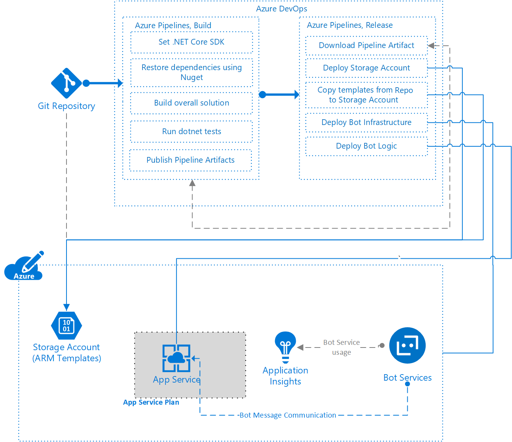

<!-- cSpell:ignore MariaVrabie appservice botservice cicdbots azurewebsites -->

This article presents a DevOps approach to setting up a continuous integration and continuous deployment (CI/CD) pipeline that deploys a chatbot app and its *infrastructure as code*.

DevOps is a common development strategy for building custom applications like bots. DevOps pipelines use modern CI/CD processes to manage software builds, deployments, testing, and monitoring. Azure DevOps tools can help you accelerate your software delivery and focus on your code, rather than the supporting infrastructure and operations.

Infrastructure as code uses Azure Resource Manager (ARM) templates or open-source alternatives to define and deploy an app's underlying infrastructure. You can co-locate the software and infrastructure code in the same source control repository, and deploy both through your pipelines.

## Architecture

In this example:

1. Developers check in the bot logic, test code, ARM infrastructure templates, and build pipeline code to a Git repository.
1. Continuous integration triggers the Azure Pipelines build pipeline to build and test the bot solution.
1. Continuous deployment through an Azure Pipelines release pipeline triggers automated deployment of the app and infrastructure to Azure App Service and Azure Bot Services.
1. Azure Bot Services runs the bot.
1. Azure Application Insights collects telemetry on app and bot performance.

### Source control

Source control lets development teams track software code changes and inspect older code versions. With infrastructure as code, you can define and deploy your underlying infrastructure using ARM templates or open-source alternatives, and also maintain those templates in source control. You can store unit test and build pipeline code in the same source control repository.

[The example scenario in GitHub](https://github.com/mspnp/solution-architectures/tree/master/cicdbots) stores application, test, infrastructure, and build pipeline code in three main folders:

- The *application* folder contains the bot logic and unit test code.
- The *arm-templates* folder stores the infrastructure as code.
- The *pipelines* folder contains the definition for the YAML build pipeline.

### ARM templates

The example uses several [linked ARM templates](/azure/azure-resource-manager/templates/linked-templates) to deploy the solution. *Capability templates*, similar to units or modules, implement specific pieces of functionality. An *end-to-end solution* or *orchestrator* template brings those underlying capabilities together. There are a couple of benefits to this approach:

- The underlying capability templates can be individually unit tested.
- The underlying capability templates could be defined as standards for an organization, and reused in multiple solutions.

In this example, the [deployment.json](https://github.com/mspnp/solution-architectures/blob/master/cicdbots/arm-templates/deployment.json) orchestrator template deploys the following capability templates:

- [Azure App Service Plan](https://github.com/mspnp/solution-architectures/blob/master/cicdbots/arm-templates/appservicePlan.json)
- [Azure App Service instance](https://github.com/mspnp/solution-architectures/blob/master/cicdbots/arm-templates/appservice.json)
- [Azure Bot Service](https://github.com/mspnp/solution-architectures/blob/master/cicdbots/arm-templates/botservice.json)
- [Azure Application Insights](https://github.com/mspnp/solution-architectures/blob/master/cicdbots/arm-templates/applicationInsights.json)

If you want your chatbot to use Cognitive Services such as LUIS and QnA Maker, be sure to add them in the template as well.

### Bot development and testing

The example uses a simple C# chatbot designed to work in the Microsoft Teams channel. You can open the [example solution](https://github.com/mspnp/solution-architectures/blob/master/cicdbots/application/Devopsbot.sln) in Visual Studio.

To develop a new bot, create a C# Bot Framework project in Visual Studio. You can use the Echo Bot template, or start an empty project. For a comprehensive tutorial on creating a Bot Framework project, see [Create a bot with the Bot Framework SDK for .NET](/azure/bot-service/dotnet/bot-builder-dotnet-sdk-quickstart?view=azure-bot-service-4.0). For information on configuring a bot to run on multiple channels, see [Manage channels in Bot Service](/azure/bot-service/bot-service-manage-channels). Adding a bot in Microsoft Teams requires a few additional steps and considerations. For details, see [Bots in Microsoft Teams](/microsoftteams/platform/concepts/bots/bots-overview).

You can test and debug your chatbot during development with the [Bot Framework emulator](https://github.com/Microsoft/BotFramework-Emulator), a desktop app that lets you test and debug bots built with the BotBuilder SDK.

[Unit testing](https://en.wikipedia.org/wiki/Unit_testing) tests specific parts of source code against a desired outcome. Unit testing chatbots uses the same principles and best practices as testing other apps. For more information about unit testing, see [Unit testing in .NET](/dotnet/core/testing/) and [Unit testing best practices](/dotnet/core/testing/unit-testing-best-practices).

You can add a unit test project to a chatbot solution in Visual Studio, and choose between MSTest or XUnit for the project. For a live view of the unit tests, [configure Live Unit Testing](/visualstudio/test/live-unit-testing). 

### Continuous integration and build
[Azure Pipelines](/azure/devops/pipelines/get-started/index) is the Azure DevOps service that implements build, test, and deployment pipelines for your apps.

You define the triggers and tasks for build pipelines in a [YAML build definition file](/azure/devops/pipelines/get-started-yaml) that you can store in source control. You can also use the [Classic](/azure/devops/pipelines/get-started/pipelines-get-started#define-pipelines-using-the-classic-interface) visual interface to create a build pipeline by selecting **Use the classic editor** on the pipeline creation page.

If you enable continuous integration in the `triggers` section of your build pipeline, new commits to the repository automatically kick off the build. YAML build pipelines have a CI trigger on all branches by default. Once you check in your code, the build pipeline runs tests to validate the code, and builds the appropriate parts of the software. The number and types of tests and tasks you run depend on your wider build and release strategy.

### Continuous deployment and release

An Azure Pipelines [release pipeline](/azure/devops/pipelines/release) automates your release process and enables continuous delivery.

In the release pipeline, you define a number of tasks to deploy your app and underlying infrastructure. You can define many variables for the overall pipeline, so you don't have to input them for every task.

The release pipeline depends on the build pipeline to get the output for the bot logic, and it links to the Git repo to get the ARM templates to deploy the infrastructure. For deployment, the ARM templates need to be accessible from a public endpoint such as a Git repo or Azure Blob Storage account.

### App Service Plan and App Service instance

An Azure App Service Plan is the underlying server farm used to deploy an Azure App Service instance. The *appservicePlan.json* and *appservice.json* ARM templates create the App Service Plan and App Service instance for the chatbot app.

### Bot Services

The Azure Bot Service provides an endpoint for the bot to communicate through the chosen channels. The Bot Service also provides a mechanism to associate the bot to a pricing tier, based upon the expected requests and throughput. The deployed *botservicePlan.json* ARM template creates the Bot Service for the chatbot app.

To deploy to Azure, the bot needs an Application ID and password, and the ability to register channels to run in. The example *botservice.json* template includes channel registration, but you also need to register the app in the Azure portal. To register an app in the Azure portal, see [App registration](/azure/bot-service/bot-service-resources-bot-framework-faq#app-registration).

### Application Insights

Azure Application Insights can collect telemetry from the app about what the bot logic is doing and how it is performing. You can also connect Application Insights directly to the Bot Service. The deployed *applicationInsights.json* ARM template creates Application Insights for the chatbot app. The template also outputs the Application Insights Instrumentation Key and Resource ID. You use these to configure the Bot Service endpoint and collect telemetry directly from Azure Bot Service.

## Issues and considerations

- Although ARM templates don't need to be compiled, you can validate their quality. For example, you could do [linting](https://jsonlint.com/) on the ARM templates. See the [ARM template toolkit](https://github.com/Azure/arm-ttk) for more ARM template analysis and test tools from the Azure Resource Manager team. Consider which pipeline, build or release, is most appropriate for the tests, based on your development lifecycle.

- The linked ARM templates for deploying the infrastructure need to be accessible from a public endpoint, like a Git repository or an Azure Blob Storage account. If you upload the templates to a storage account, they remain secure, as they are held in a private mode but can be accessed using some form of SAS token.

- A common practice is to use [Azure KeyVault](/azure/key-vault) instead of storing secrets in Azure DevOps. If the Service Principal connection to your Azure Subscription has appropriate access policies to the Azure KeyVault, it can download secrets from the KeyVault to use as variables in your pipeline, which avoids storing them in source control. The name of the secret will be set with the associated value. For example, a secret in the KeyVault called `botMicrosoftAppPassword` could be referenced by `$(botMicrosoftAppPassword)` in the release pipeline definition.

- You can set up [Bot Analytics](/azure/bot-service/bot-service-manage-analytics) to gain additional insight into the performance of your bot. To set up Bot Analytics, you need an API Key from Application Insights, but you can't create this key by using an ARM template. You can create the key manually from your Application Insights resource in the Azure portal.

## Deploy this scenario

You can build and deploy the [example scenario from GitHub](https://github.com/mspnp/solution-architectures/tree/master/cicdbots).

### Prerequisites

This solution requires an existing Azure account, and an Azure DevOps organization and team project.

- [Create a free Azure account](https://azure.microsoft.com/free/?WT.mc_id=A261C142F)
- [Create an Azure DevOps Organization](/azure/devops/organizations/accounts/create-organization)
- [Create a project in Azure DevOps](/azure/devops/organizations/projects/create-project)

### Bot development and registration

The example uses a simple C# chatbot designed to work in the Microsoft Teams channel. The chatbot replies to anyone writing *VSTS* with the phrase **You mentioned "VSTS" above, but I think you meant Azure DevOps**. You can open the [example solution](https://github.com/mspnp/solution-architectures/blob/master/cicdbots/application/Devopsbot.sln) in Visual Studio.

To deploy to Azure, the bot needs an Application ID and password, and the ability to register channels to run in. The example [botservice.json](https://github.com/mspnp/solution-architectures/blob/master/cicdbots/arm-templates/botservice.json) ARM template includes channel registration, but you also need to register the app in the Azure portal. To register an app in the Azure portal, see [App registration](/azure/bot-service/bot-service-resources-bot-framework-faq#app-registration). When you register the app, note the Application ID and password, as you'll use them to set Azure Pipelines variables for deployment.

### Bot testing

Test and debug your chatbot during development with the [Bot Framework emulator](https://github.com/Microsoft/BotFramework-Emulator), a desktop app that lets you test and debug bots built with the BotBuilder SDK. Download the emulator from the [GitHub releases page](https://github.com/Microsoft/BotFramework-Emulator/releases/tag/v4.2.1). Once installed, start talking to your bot either by connecting to an endpoint or by opening a bot saved locally. The emulator provides information in JSON format, which is easy to read and comprehend.

The [example solution](https://github.com/mspnp/solution-architectures/blob/master/cicdbots/application/Devopsbot.sln) also includes a unit test project, and the example build pipeline runs the unit tests.

### Build pipeline

To use the example YAML file to create a build pipeline:

1. In the left navigation of your Azure DevOps project, select **Pipelines** and then select **New pipeline**.
1. Under **Where is your code**, select **GitHub**, and then select your local clone of the [example repository](https://github.com/mspnp/solution-architectures/blob/master/cicdbots/).
1. Under **Configure your pipeline**, select **Existing Azure Pipelines YAML file** and then select or type the */cicdbots/pipelines/bot-logic.build.yml* file from the repo. Select **Continue**.
1. Review the code, and then select **Run**.

### Release pipeline

The release pipeline deploys the bot and infrastructure code. It can also create an Azure Storage account and copy the ARM templates to it.

To create the release pipeline:

1. In the left navigation of your Azure DevOps project, select **Pipelines** > **Releases**, and then select **New pipeline**.
1. Under **Select a template**, select **Empty job**. Change the stage name to something meaningful, like **Dev**.
1. Under **Artifacts** on the left, select **Add**, then under **Add an artifact**, select **Build**.
1. Select your build pipeline from the dropdown. Make a note of the **Source Alias**, as you will need it when creating the release tasks. Select **Add**.
1. Select **Artifacts** > **Add** again, then under **Add an artifact**, select **GitHub**. You may have to authorize the GitHub connection.
1. Under **Source (repository)**, select the example repository that contains the ARM templates, and then select **Add**.
1. On the pipeline page, select the **Variables** tab. Select **Add**, and set the following name/value pairs:

   |Name|Value|
   |----|-----|
   |**appInsightsName**|Name for the Application Insights resource for logging bot telemetry|
   |**appServiceName**|Name for the web app, which will become part of the end website name: *\<appServiceName>.azurewebsites.net*|
   |**appServicePlanName**|Name for the App Service Plan to contain the web app|
   |**botAppInsightsApiKey**|The API Key for Application Insights, which you create manually and copy from your Application Insights resource in the Azure portal|
   |**botMicrosoftAppId**|The Application ID that you got from the Azure portal when you registered your app|
   |**botMicrosoftAppPassword**|The password that you set in the Azure portal when you registered your app. Set the padlock on this variable to hide the value.|
   |**botServiceDisplayName**|Name for the bot as it appears in a channel
   |**botServiceName**|Name for the Azure Bot Service in the Azure portal
   |**developerAppInsightsApplicationId**|The Application ID output when you created the Application Insights resource
   |**location**|Azure region in which to create the Azure resources
   |**resourceGroupName**|Name for the resource group to create to contain the Azure resources
   |**storageAccountName**|Storage account for the linked ARM templates

1. On the pipeline page, select the **Tasks** tab. Select the **+** next to **Agent job**, and under **Add tasks**, select and configure the following tasks. After selecting each task, select **Add** and then fill out the form, using variables where appropriate.
   - **Download pipeline artifacts** to download the bot logic
   - **Azure resource group deployment** to deploy the bot infrastructure ARM templates
   - **Azure App Service deploy** to deploy the bot to the App Service

You can also add **Azure resource group deployment** and **Azure file copy** tasks to create an Azure Storage account and copy the ARM templates to the storage account. You can use the *storageAccount.json* ARM template in the example repo to create the storage account.

## Next steps

Here are some additional items to further enhance the scenario:

- Deploy additional services to enhance your bot, including LUIS.
- Deploy a back-end store for your bot to interact with, such as Azure Cosmos DB.
- Automate the generation of the Application Insights API Key, and consider storing the key in an Azure KeyVault that you can reference during deployment time.

## Related resources

- [Design a CI/CD pipeline using Azure DevOps](../apps/devops-dotnet-webapp.yml)
- [What is source control?](/azure/devops/user-guide/source-control)
- [Understand the structure and syntax of Azure Resource Manager templates](/azure/azure-resource-manager/resource-group-authoring-templates)
- [ARM template reference guide for Microsoft.Storage resource types](/azure/templates/microsoft.storage/allversions)