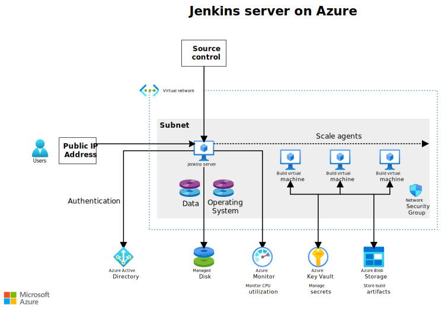

This scenario explains the architecture and considerations to take into account when [installing and configuring Jenkins][install-jenkins-section].

## Architecture

*Download a [Visio file](https://arch-center.azureedge.net/jenkins-architecture.vsdx) of this architecture.*

### Workflow

The architecture consists of the following aspects:

- **Resource group.** A [resource group][rg] is used to group Azure assets so they can be managed by lifetime, owner, and other criteria. Use resource groups to deploy and monitor Azure assets as a group and track billing costs by resource group. You can also delete resources as a set, which is useful for test deployments.

- **Jenkins server.** A virtual machine is deployed to run [Jenkins][azure-market] as an automation server and serves as Jenkins Primary. In the section [Install and configure Jenkins][install-jenkins-section], you'll see how to install Jenkins on a new VM.

  > [!NOTE]
  > Nginx is installed on the VM to act as a reverse proxy to Jenkins. You can configure Nginx to enable SSL for the Jenkins server.
  >

- **Virtual network.** A [virtual network][vnet] connects Azure resources to each other and provides logical isolation. In this architecture, the Jenkins server runs in a virtual network.

- **Subnets.** The Jenkins server is isolated in a [subnet][subnet] to make it easier to manage and segregate network traffic without affecting performance.

- **Network security groups.** Use [network security groups][nsg] to restrict network traffic from the Internet to the subnet of a virtual network.

- **Managed disks.** A [managed disk][managed-disk] is a persistent virtual hard disk (VHD) used for application storage and also to maintain the state of the Jenkins server and provide disaster recovery. Data disks are stored in Azure Storage. For high performance, [premium storage][premium] is recommended.

- **Azure Blob storage.** The [Microsoft Azure Storage][configure-storage] Learn how to Azure Blob storage to store the build artifacts that are created and shared with other Jenkins builds.

- **Azure Active Directory (Azure AD).** [Azure AD][azure-ad] supports user authentication, allowing you to set up SSO. Azure AD [service principals][service-principal] define the policy and permissions for each role authorization in the workflow, using [Azure role-based access control (Azure RBAC)][rbac]. Each service principal is associated with a Jenkins job.

- **Azure Key Vault.** To manage secrets and cryptographic keys used to provision Azure resources when secrets are required, this architecture uses [Azure Key Vault][key-vault].

- **Azure monitoring services**. This service [monitors][monitor] the Azure virtual machine hosting Jenkins. This deployment monitors the virtual machine status and CPU utilization and sends alerts.

## Scenario details

This architecture supports disaster recovery with Azure services but does not cover more advanced scale-out scenarios involving multiple primaries or high availability (HA) with no downtime. For general insights about the various Azure components, including a step-by-step tutorial about building out a CI/CD pipeline on Azure, see [Jenkins on Azure][jenkins-on-azure].

The focus of this document is on the core Azure operations needed to support Jenkins, including the use of Azure Storage to maintain build artifacts, the security items needed for SSO, other services that can be integrated, and scalability for the pipeline. The architecture is designed to work with an existing source control repository. For example, a common scenario is to start Jenkins jobs based on GitHub commits.

### Potential use cases

- Automate CI/CD pipelines
- Ensure high availability (HA) for mission-critical services

## Considerations

These considerations implement the pillars of the Azure Well-Architected Framework, which is a set of guiding tenets that can be used to improve the quality of a workload. For more information, see [Microsoft Azure Well-Architected Framework](/azure/architecture/framework).

### Scalability

Jenkins can dynamically scale to support workloads as needed. For elastic builds, do not run builds on the Jenkins primary server. Instead, offload build tasks to Jenkins agents, which can be elastically scaled in and out as need. Consider two options for scaling agents:

- [Scale Jenkins deployments with Azure VM Agents][vm-agent]. VM Agents enable elastic scale-out for agents and can use distinct types of virtual machines. You can specify a different base image from Azure Marketplace or use a custom image. For details about how the Jenkins agents scale, see [Architecting for Scale][scale] in the Jenkins documentation.

- Run a container as an agent in either [Azure Container Service with Kubernetes](/azure/container-service/kubernetes/), or [Azure Container Instances](/azure/container-instances/).

Virtual machines generally cost more to scale than containers. To use containers for scaling, however, your build process must run with containers.

Also, use Azure Storage to share build artifacts that may be used in the next stage of the pipeline by other build agents.

#### Scale the Jenkins server

When you [create a VM and install Jenkins][install-jenkins-section], you can specify the size of the VM. Selecting the correct VM server size depends on the size of the expected workload. The Jenkins community maintains a [selection guide][selection-guide] to help identify the configuration that best meets your requirements. Azure offers many [sizes for Linux VMs][sizes-linux] to meet any requirements. For more information about scaling the Jenkins primary, see the Jenkins community of [best practices][best-practices], which also includes details about scaling Jenkins.

### Availability

Availability in the context of a Jenkins server means being able to recover any state information associated with your workflow, such as test results, libraries you have created, or other artifacts. Critical workflow state or artifacts must be maintained to recover the workflow if the Jenkins server goes down. To assess your availability requirements, consider two common metrics:

- Recovery Time Objective (RTO) specifies how long you can go without Jenkins.

- Recovery Point Objective (RPO) indicates how much data you can afford to lose if a disruption in service affects Jenkins.

In practice, RTO, and RPO imply redundancy and backup. Availability is not a question of hardware recovery - that is part of Azure - but rather ensuring you maintain the state of your Jenkins server. Microsoft offers a [service level agreement][sla] (SLA) for single VM instances. If this SLA doesn't meet your uptime requirements, make sure you have a plan for disaster recovery, or consider using a [multi-primary Jenkins server][multi-primary] deployment (not covered in this document).

Consider using the disaster recovery [scripts][disaster] in step 7 of the deployment to create an Azure Storage account with managed disks to store the Jenkins server state. If Jenkins goes down, it can be restored to the state stored in this separate storage account.

### Security

Security provides assurances against deliberate attacks and the abuse of your valuable data and systems. For more information, see [Overview of the security pillar](/azure/architecture/framework/security/overview).

Use the following approaches to help lock down security on a basic Jenkins server, since in its basic state, it is not secure.

- Set up a secure way to log into the Jenkins server. This architecture uses HTTP and has a public IP, but HTTP is not secure by default. Consider setting up [HTTPS on the Nginx server][nginx] being used for a secure logon.

    > [!NOTE]
    > When adding SSL to your server, create a network security group rule for the Jenkins subnet to open port 443. For more information, see [How to open ports to a virtual machine with the Azure portal][port443].

- Ensure that the Jenkins configuration prevents cross site request forgery (Manage Jenkins \> Configure Global Security). This option is the default for Microsoft Jenkins Server.

- Configure read-only access to the Jenkins dashboard by using the [Matrix Authorization Strategy Plugin][matrix].

- Use Azure RBAC to restrict the access of the service principal to the minimum required to run the jobs. This level of security helps limit the scope of damage from a rogue job.

Jenkins jobs often require secrets to access Azure services that require authorization, such as Azure Container Service. Use [Key Vault][key-vault] to manage these secrets securely. Use Key Vault to store service principal credentials, passwords, tokens, and other secrets.

To get a central view of the security state of your Azure resources, use [Microsoft Defender for Cloud][security-center]. Defender for Cloud monitors potential security issues and provides a comprehensive picture of the security health of your deployment. Defender for Cloud is configured per Azure subscription. Enable security data collection as described in the [Microsoft Defender for Cloud quick start guide][quick-start]. When data collection is enabled, Defender for Cloud automatically scans any virtual machines created under that subscription.

The Jenkins server has its own user management system, and the Jenkins community provides best practices for [securing a Jenkins instance on Azure][secure-jenkins].

### Manageability

Use resource groups to organize the Azure resources that are deployed. Deploy production environments and development/test environments in separate resource groups, so that you can monitor each environment's resources and roll up billing costs by resource group. You can also delete resources as a set, which is useful for test deployments.

Azure provides several features for [monitoring and diagnostics][monitoring-diag] of the overall infrastructure. To monitor CPU usage, this architecture deploys Azure Monitor. For example, you can use Azure Monitor to monitor CPU utilization, and send a notification if CPU usage exceeds 80 percent. (High CPU usage indicates that you might want to scale up the Jenkins server VM.) You can also notify a designated user if the VM fails or becomes unavailable.

## Deploy this solution

### Install and configure Jenkins

To create a VM and install Jenkins, follow the instructions in the article, [Quickstart: Configure Jenkins using Azure CLI](/azure/developer/jenkins/configure-on-linux-vm).

## Next steps

The following online communities can answer questions and help you configure a successful deployment:

- [Jenkins Community Blog](https://jenkins.io/node)
- [Azure Forum](https://azure.microsoft.com/support/forums)
- [Stack Overflow Jenkins](https://stackoverflow.com/tags/jenkins/info)

## Related resources

- [Design a CI/CD pipeline using Azure DevOps](./devops-dotnet-baseline.yml)
- [Container CI/CD using Jenkins and Kubernetes on Azure Kubernetes Service](../../solution-ideas/articles/container-cicd-using-jenkins-and-kubernetes-on-azure-container-service.yml)
- [Immutable Infrastructure CI/CD using Jenkins and Terraform on Azure Virtual Architecture overview](../../solution-ideas/articles/immutable-infrastructure-cicd-using-jenkins-and-terraform-on-azure-virtual-architecture-overview.yml)
- [Java CI/CD using Jenkins and Azure Web Apps](../../solution-ideas/articles/java-cicd-using-jenkins-and-azure-web-apps.yml)

<!-- links -->

[acs]: https://aka.ms/azjenkinsacs
[ad-sp]: /azure/active-directory/develop/active-directory-integrating-applications
[azure-ad]: /azure/active-directory
[azure-market]: /azure/developer/jenkins/deploy-to-azure-app-service-using-plugin
[best-practices]: https://jenkins.io/doc/book/architecting-for-scale
[blob]: /azure/storage/common/storage-java-jenkins-continuous-integration-solution
[container-agents]: https://aka.ms/azcontaineragent
[configure-storage]: /azure/developer/jenkins/azure-storage-blobs-as-build-artifact-repository
[create-jenkins]: /azure/jenkins/install-jenkins-solution-template
[create-metric]: /azure/monitoring-and-diagnostics/insights-alerts-portal
[disaster]: https://github.com/Azure/jenkins/tree/master/disaster_recovery
[functions]: https://aka.ms/azjenkinsfunctions
[index]: https://plugins.jenkins.io
[install-jenkins-section]: #install-and-configure-jenkins
[jenkins-on-azure]: /azure/jenkins
[key-vault]: /azure/key-vault
[managed-disk]: /azure/virtual-machines/linux/managed-disks-overview
[matrix]: https://plugins.jenkins.io/matrix-auth
[monitor]: /azure/monitoring-and-diagnostics
[monitoring-diag]: ../../best-practices/monitoring.yml
[multi-primary]: https://jenkins.io/doc/book/architecting-for-scale
[nginx]: https://www.digitalocean.com/community/tutorials/how-to-create-an-ssl-certificate-on-nginx-for-ubuntu-14-04
[nsg]: /azure/virtual-network/virtual-networks-nsg
[quick-start]: /azure/security-center/security-center-get-started
[port443]: /azure/virtual-machines/windows/nsg-quickstart-portal
[premium]: /azure/virtual-machines/linux/premium-storage
[rbac]: /azure/role-based-access-control/overview
[rg]: /azure/azure-resource-manager/resource-group-overview
[scale]: https://jenkins.io/doc/book/architecting-for-scale
[scale-agent]: /azure/jenkins/jenkins-azure-vm-agents
[selection-guide]: https://jenkins.io/doc/book/hardware-recommendations
[service-principal]: /azure/active-directory/develop/active-directory-application-objects
[secure-jenkins]: https://jenkins.io/blog/2017/04/20/secure-jenkins-on-azure
[security-center]: /azure/security-center/security-center-intro
[sizes-linux]: /azure/virtual-machines/linux/sizes
[solution]: https://azure.microsoft.com/blog/announcing-the-solution-template-for-jenkins-on-azure
[sla]: https://azure.microsoft.com/support/legal/sla/virtual-machines
[subnet]: /azure/virtual-network/virtual-network-manage-subnet
[vm-agent]: https://plugins.jenkins.io/azure-vm-agents/
[vnet]: /azure/virtual-network/virtual-networks-overview
