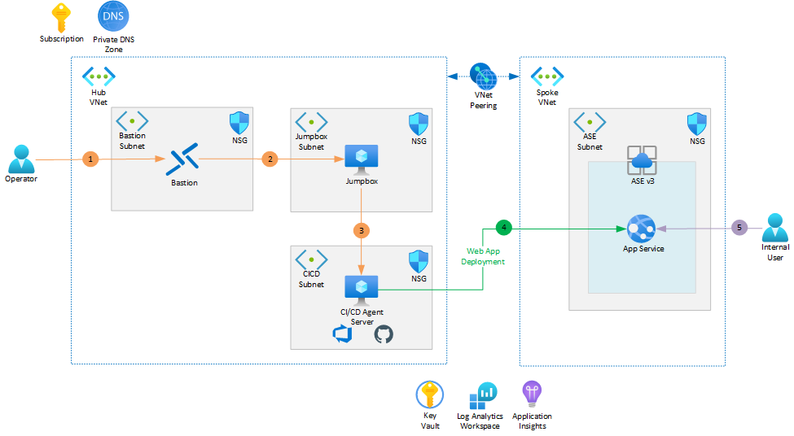

# Line of Business Applications using App Service Environment v3
This article focuses on a solution based on App Service Environment (ASE) v3, the newest version of App Service Environment with foundational improvements from previous versions. The changes to ASE v3 include the removal of the stamp fee and simplified networking configurations, making ASE a compelling offer for enterprise customers who require additional security and network isolation around their App Services. 

The architecture presented in this solution is typically applicable to a Line of Business application using an internal load balancer. Customers will have the flexibility to leverage existing resources in the Azure Landing Zone (ie. Resources in the Hub VNet) or deploy this solution as a self-contained workload. 

## Architecture

_Download a [Visio file](https://arch-center.azureedge.net/architecture.vsdx) that contains this architecture diagram._

### Components

The solution uses the following Azure services:

- **[App Service Environment v3 (ASEv3)](https://docs.microsoft.com/en-us/azure/app-service/environment/overview)** is a single tenant  service for customers that require high scale, network isolation and security, and/or high memory utilization. Apps are hosted in [App Service plans](https://docs.microsoft.com/en-us/azure/app-service/overview-hosting-plans) created in ASEv3 with options of using different tiers within an Isolated v2 Service Plan. Compared to earlier version of ASE numerous improvements have been made including, but not limited to, network dependency, scale time, and the removal of the stamp fee. This reference architecture uses an App Service Environment v3, configured for internal access. 
  
 - **[Azure Private DNS Zones](https://docs.microsoft.com/en-us/azure/dns/private-dns-privatednszone)** allow users to manage and resolve domain names within a virtual network without needing to implement a custom DNS solution. A Private Azure DNS zone can be aligned to one or more virtual networks through [virtual network links](https://docs.microsoft.com/en-us/azure/dns/private-dns-virtual-network-links). Due to the internal nature of the ASEv3 this reference architecture uses, a private DNS zone is required to resolve the domain names of applications hosted on the App Service Environment.

- **[Application Insights](https://docs.microsoft.com/en-us/azure/azure-monitor/app/app-insights-overview)** is a feature of Azure Monitor that helps Developers detect anomalies, diagnose issues, and understand usage patterns with extensible application performance management and monitoring for live web apps. A variety of platforms including .NET, Node.js, Java, and Python are supported for apps that are hosted in Azure, on-prem, hybrid, or other public clouds. Application Insights is included as part of this reference architecture to monitor behaviors of the deployed application.

- **[Log Analytics](https://docs.microsoft.com/en-us/azure/azure-monitor/logs/log-analytics-overview)** is a feature of Azure Monitor that allows users to edit and run log queries with data in Azure Monitor Logs, optionally from within the Azure portal. Developers can run simple queries for a set of records or use Log Analytics to perform advanced analysis and visualize the results. Log Analytics is configured as part of this reference architecture to aggregate all the monitoring logs for additional analysis and reporting.

- **[Azure Virtual Machine](https://docs.microsoft.com/en-us/azure/virtual-machines/windows/overview)** is an on-demand, scalable computing resource that can be used to host a number of different workloads. In this reference architecture, virtual machines are used to provide a management jumpbox server, and to provide a host for the DevOps Agent / GitHub Runner. 

- **[Azure Key Vault](https://docs.microsoft.com/en-us/azure/key-vault/general/basic-concepts)** is a cloud service to securely store and access secrets ranging from API keys and passwords to certificates and cryptographic keys. While this reference architecture does not store secrets in Azure Key Vault, an Azure Key Vault is deployed as part of this architecture's infrastructure deployment to facilitate secret management for future code deployments. 

- **[Azure Bastion](https://docs.microsoft.com/en-us/azure/bastion/bastion-overview)** is a Platform-as-a-Service service provisioned within the developer's virtual network which provides secure RDP/SSH connectivity to the developer's virtual machines over TLS from the Azure portal. With Azure Bastion, virtual machines no longer require a public IP address to connect via RDP/SSH. This reference architecture uses Azure Bastion to access the DevOps Agent / GitHub Runner server or the management jumpbox server. 

## Considerations

These considerations implement the pillars of the Azure Well-Architected Framework, which is a set of guiding tenets that can be used to improve the quality of a workload. For more information, see [Microsoft Azure Well-Architected Framework](/azure/architecture/framework).

- Review the reference implementation resources at [LOB-ILB-ASEv3](https://github.com/Azure/appservice-landing-zone-accelerator/tree/docs-update/docs) to better understand the specifics of this implementation.
- It is recommended that you clone this repo and modify the reference implementation resources to suit your requirements and your organization's specific landing zone guidelines.
- Ensure that the service principal used to deploy the solution has the required permissions to create the resource types listed above.
- Consider the CI/CD service you will use for deploying the reference implementation. As this reference implementation is an internal ASE, a self-hosted agent is needed to execute the deployment pipelines.  As such there is a choice to use either a DevOps Agent or a GitHub Runner. Refer to the [user guide](https://github.com/Azure/appservice-landing-zone-accelerator/tree/docs-update/docs) on specific configuration values required for each.
- Consider the region(s) to which you intend deploying this reference implementation, and consult the [ASEv3 Regions list](https://docs.microsoft.com/en-us/azure/app-service/environment/overview#regions) to ensure the selected region(s) are enabled for deployment.

### Reliability

- Consider your requirements for zone redundancy in this reference implementation, as well as the zone redundancy capabilities of any other Azure Services in your solution. ASEv3 supports zone redundancy by spreading instances to all three zones in the target region. This can only be set at the time of ASE creation, and may not be available in all regions. See [Availability zone support for App Service Environment](https://docs.microsoft.com/en-us/azure/app-service/environment/overview-zone-redundancy) for more detail. This reference implementation does implement  zone redundancy, but this can be changed by cloning this repo and setting the `zoneRedundant` property to `false`.

### Security

- Employ the appropriate use of access restrictions so that the app service is only reachable from valid locations. For example, if the app service is hosting APIs, and is fronted by APIM, setup an access restriction so that the app service is only accessible from APIM.
- Since this reference implementation deploys an ASE into a virtual network (referred to as an internal ASE), all applications deployed to the ASE are inherently network-isolated at the scope of the virtual network.
- Store application secrets (database credentials, API tokens, private keys) in Azure Key Vault and configure your App Service app to access them securely with a Managed Identity. Determine when to use [Azure Key Vault vs Azure App Configuration](https://docs.microsoft.com/en-us/azure/architecture/solution-ideas/articles/appconfig-key-vault) with the guidance in mind.

### Cost optimization

- While there is no stamp fee for an ASEv3 instance, there is a charge levied when there are no App Service Plans configured within the ASEv3 instance. This charge is levied at the same rate as one instance of a Windows I1v2 instance for the region in which the ASEv3 instance is deployed.
- When configured to be zone redundant, the charging model is adjusted to account for the underlying infrastructure deployed in this configuration, and you may therefore be liable for additional instances, as per [ASEv3 Pricing](https://docs.microsoft.com/en-us/azure/app-service/environment/overview#pricing)
- Consider the option of reserved instance pricing for ASEv3 App Service Plans (aka Isolated v2 App Service Plans) as per [How reservation discounts apply to Isolated v2 instances](https://docs.microsoft.com/en-us/azure/cost-management-billing/reservations/reservation-discount-app-service#how-reservation-discounts-apply-to-isolated-v2-instances)

### Operational excellence

- Use Application Insights or another Application Performance Management solution to monitor and learn how your application behaves in different environments.
    - Two ways to enable [Application Insights](https://docs.microsoft.com/en-us/azure/azure-monitor/app/app-insights-overview) currently exist.
For different environments collect telemetry data into different Application Insights instances.
    - If your application has multiple components separated into different services but you would like to examine their behavior together, then collect their telemetry data into same Application Insights instance but label them with different cloud role names.
    - Export Application Insights data to an [Azure Log Analytics](https://docs.microsoft.com/en-us/azure/azure-monitor/logs/log-analytics-overview) Workspace. A single Workspace for the organization is recommended.
    - Include operational dashboards in application and feature design to ensure the solution can be supported in production.
    - Implement health checks for your endpoints and use them for health probes, dependency checks and availability tests.
- Use a different Application Insights instance for each environment, and potentially for each solution within an environment, to ensure no cross-pollination of telemetry data.
- Consider using prefixes and suffixes with well-defined conventions to uniquely identify every deployed resource. These naming conventions avoid conflicts when deploying solutions next to each other and improve overall team agility and throughput.
- Depending on the network configuration, App Services might not be reachable from the public internet and the use of public hosted agents will not work for deployments. Plan to use [self-hosted agents](https://azure.github.io/AppService/2021/01/04/deploying-to-network-secured-sites.html) in that scenario.

## Deploy this scenario

A deployment for the reference architecture that implements these recommendations and considerations is available on [GitHub](https://github.com/Azure/appservice-landing-zone-accelerator/tree/main/reference-implementations/LOB-ILB-ASEv3).

## Next steps

* [Security in Azure App Service](/azure/app-service/overview-security)
* [Networking for App Service](/azure/app-service/networking-features)

## Related resources

* [High availability enterprise deployment using App Services Environment](docs/reference-architectures/enterprise-integration/ase-high-availability-deployment.yml)
* [Enterprise deployment using App Services Environment](docs/reference-architectures/enterprise-integration/ase-standard-deployment.yml)
* [Landing zone accelerator for App Service](https://docs.microsoft.com/en-us/azure/cloud-adoption-framework/scenarios/app-platform/app-services/landing-zone-accelerator)