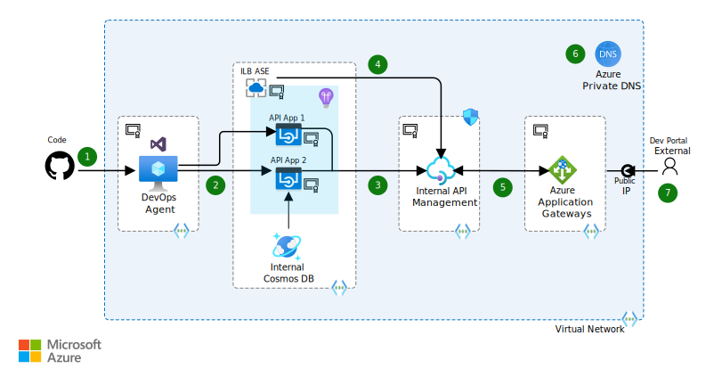

In this scenario, an organization has hosted multiple APIs using [Azure Application Service Environment][ase] (ILB ASE), and they want to consolidate these APIs internally, by using [Azure API Management (APIM)][apim] deployed inside a Virtual Network. The internal API Management instance could also be exposed to external users to allow for utilization of the full potential of the APIs. This external exposure could be achieved using [Azure Application Gateway][appgtwy] forwarding requests to the internal API Management service, which in turn consumes the APIs deployed in the ASE.

## Potential use cases

- Synchronize customer address information internally after a change made by the customer.
- Attract developers to your platform by exposing unique data assets.

## Architecture

*Download a [Visio file](https://archcenter.blob.core.windows.net/cdn/architecture-publish-internal-apis-externally.vsdx) of this architecture.*

The above scenario covers a complete lifecycle of internal APIs that are consumed by the external users.

### Dataflow

The data flows as follows:

1. Developers check in code to a GitHub repository that's connected to a CI/CD pipeline agent that's installed on an Azure VM.
2. The agent pushes the build to the API application that's hosted on ILB ASE.
3. Azure API Management consumes the above APIs via HOST headers that are specified in API Management policy.
4. API Management uses the App Service Environment's DNS name for all the APIs.
5. Application Gateway exposes API Management's developer and API portal.
6. Azure Private DNS is used to route the traffic internally between ASE, API Management, and Application Gateway.
7. External users utilize the exposed developer portal to consume the APIs via Application Gateway's public IP.

### Components

- [Azure Virtual Network][vnet] enables Azure resources to securely communicate with each other, the internet, and on-premises networks.
- [Azure Private DNS][dns] allows domain names to be resolved in a virtual network without needing to add a custom DNS solution.
- [Azure API Management][apim] helps organizations publish APIs to external, partner, and internal developers to use their data and services.
- [Application Gateway][appgtwy] is a web traffic load balancer that enables you to manage traffic to your web applications.
- Internal Load Balancer [App Service Environment][ase] is an Azure App Service feature that provides a fully isolated and dedicated environment for securely running App Service apps at high scale.
- [Azure DevOps][devops] is a service for managing your development lifecycle and includes features for planning and project management, code management, build, and release.
- [Application Insights][appinsights] is an extensible Application Performance Management (APM) service for web developers on multiple platforms.
- [Azure Cosmos DB][cosmos-db] is Microsoft's globally distributed, multi-model database service.

### Alternatives

- In an [Azure lift and shift scenario][azure-vm-lift-shift] deployed into an Azure Virtual Network, back-end servers could be directly addressed through private IP addresses.
- If using on-premises resources, the API Management instance could reach back to the internal service privately via an [Azure VPN gateway and site-to-site IPSec VPN connection][azure-vpn] or [ExpressRoute][azure-er] making a [hybrid Azure and on-premises scenario][azure-hybrid].
- Existing or open-source DNS providers could be used instead of the Azure-based DNS Service.
- Internal APIs deployed outside of Azure can still benefit by exposing the APIs through API Management Service.

## Considerations

- The web APIs are hosted over secured HTTPS protocol and will be using a [TLS Certificate][ssl].
- The Application Gateway also is configured over port 443 for secured and reliable outbound calls.
- The API Management service is configured to use custom domains using TLS certificates.
- Review the suggested [network configuration][ntwkcons] for App Service Environments
- There needs to be an explicit mention about [port 3443 allowing API Management][apim-port-nsg] to manage via the Azure portal or PowerShell.
- Leverage policies within APIM to add a HOST header for the API hosted on ASE.  This ensures that the ASE's load balancer will properly forward the request.
- The API Management accepts ASE's DNS entry for all the apps hosted under App Service Environments. Add an [APIM policy][apim-policy] to explicitly set the HOST header to allow the ASE load balancer to differentiate between Apps under the App Service Environment.
- Consider [Integrating with Azure Application Insights][azure-apim-ai], which also surfaces metrics through [Azure Monitor][azure-mon] for monitoring.
- If you use CI/CD pipelines for deploying Internal APIs, consider [building your own Hosted Agent on a VM][hosted-agent] inside the Virtual Network.

### Availability

Azure API Management service could be deployed as a [Multi-Region deployment][apim-multiregion] for higher availability and also to reduce latencies. This feature is only available in Premium Mode. The API Management service in this specific scenario consumes APIs from App Service Environments. One could also use APIM for APIs hosted on the internal on-premises infrastructure.

App Service Environments could make use of [Traffic Manager][ase-trafficmanager] profiles to distribute the traffic hosted on App Service Environments for higher scale and availability.

### Scalability

API Management instances could be [scaled out][apim-scale] depending upon a number of factors like number and rate of concurrent connections, the kind and number of configured policies, request and response sizes, and back-end latencies on the APIs. Scaling out instance options are available in Basic, Standard, and Premium Tiers but are bound by an upper scale limit in tiers below premium. The instances are referred to as Units and can be scaled up to a max of two units in Basic tier, four units in Standard tier and any number of units in the Premium tier. [Auto Scaling][apim-autoscale] options are also available to enable scale out based on rules.

App Service Environments are designed for scale with limits based on the pricing tier and the apps hosted under the App Service Environments can be [configured to scale out (number of instances) or scale up (instance size)][ase-scale] depending upon the requirements of the application.

Azure Application Gateway auto scaling is available as a part of the Zone redundant SKU in all global Azure regions. See the [public preview feature][appgtwy-scale] regarding App gateway Auto scaling.

### Security

Since the above example scenario is hosted completely on an internal network, API Management and ASE are already deployed on [secured infrastructure (Azure VNet)][vnet-security]. Application Gateways can be [integrated with Microsoft Defender for Cloud][appgtwy-asc] to provide a seamless way to prevent, detect, and respond to threats to the environment.  For general guidance on designing secure solutions, see the [Azure Security Documentation][security].

### Resiliency

This example scenario though talks more about configuration, the APIs hosted on the App Service Environments should be resilient enough to handle errors in the requests, which eventually is managed by the API Management service and Application Gateway. Consider [Retry and Circuit breaker patterns][api-pattern] in the API design. For general guidance on designing resilient solutions, see [Designing resilient applications for Azure][resiliency].

### Cost optimization

API Management is offered in four tiers: developer, basic, standard, and premium. You can find detailed guidance on the difference in these tiers at the [Azure API Management pricing guidance here.][apim-pricing]

Customers can scale API Management by adding and removing units. Each unit has capacity that depends on its tier.

> [!NOTE]
> The Developer tier can be used for evaluation of the API Management features. The Developer tier should not be used for production.

To view projected costs and customize to your deployment needs, you can modify the number of scale units and App Service instances in the [Azure Pricing Calculator][pricing-calculator].

Similarly, the [App Service Environments pricing guidance is provided here][ase-pricing]

Application Gateway pricing can be [configured here][appgtwy-pricing] depending upon the required tier and resources.

## Deploy this scenario

### Prerequisites and assumptions

1. A custom domain name will need to be purchased.
1. A TLS certificate (we used a wild-card certificate from Azure Certificates Service) to use one for all our custom domains. You could also procure a self-signed certificate for Dev Test scenarios.
1. This specific deployment uses the domain name contoso.org and a wild-card TLS certificate for the domain.
1. The deployment is using the resource names and address spaces mentioned in the deployment section, which can be configured.

### Deployment and putting the pieces together

The components deployed using the above Resource Manager template needs to be further configured as below

1. VNet with the following configurations:
   - Name: `ase-internal-vnet`
   - Address space for VNet: 10.0.0.0/16
   - Four Subnets
     - `backendSubnet` for DNS Service: 10.0.0.0/24
     - `apimsubnet` for Internal API Management Service: 10.0.1.0/28
     - `asesubnet` for ILB ASE: 10.0.2.0/24
     - VMSubnet for Test VMs and Internal DevOps Hosted Agent VM: 10.0.3.0/24
2. Private DNS service (Public Preview) since adding a DNS service requires the VNet to be empty.
   - Refer to the [deployment guidelines][dnsguide] for more information
3. App Service Environment with Internal Load Balancer (ILB) option: `aseinternal` (DNS: `aseinternal.contoso.org`). Once the Deployment is complete, upload the wild-card cert for the ILB
4. App Service Plan with ASE as location
5. An API App (App Services for simplicity) - `srasprest` (URL: `https://srasprest.contoso.org`) – ASP.NET MVC-based web API. After the deployment, configure
   - web app to use the TLS certificate
   - Application Insights to the above apps: api-insights
   - Create an Azure Cosmos DB service for web APIs hosted internal to VNet: `noderestapidb`
   - Create DNS entries on the Private DNS zone created
   - You could make use of Azure Pipelines to configure the agents on Virtual Machines to deploy the code for Web App on internal Network
   - For testing the API App internally, create a test VM within the VNet subnet
6. Creates API Management service: `apim-internal`
7. Configure the service to connect to internal VNet on Subnet: `apimsubnet`. After the deployment is complete, perform the below additional steps
   - Configure custom domains for APIM Services using TLS
     - API portal (api.contoso.org)
     - Dev Portal (portal.contoso.org)
     - In the APIs section, configure the ASE Apps using ASE's DNS name added Policy for HOST Header for the Web app
     - Use the above created test VM to test the API Management service internal on the Virtual Network

    > [!NOTE]
    > The testing the APIM APIs from Azure portal will still *not* work as api.contoso.org isn't able to be publicly resolved.*

8. Configure Application Gateway (WAF V1) to access the API service: apim-gateway on Port 80. Add TLS certs to the App Gateway and corresponding Health probes and Http settings. Also configure the Rules and Listeners to use the TLS cert.

Once the above steps are successfully completed, Configure the DNS entries in GoDaddy CNAME entries of api.contoso.org and portal.contoso.org with App Gateway's public DNS name: `ase-appgtwy.westus.cloudapp.azure.com` and verify if you are able to reach the Dev Portal from Public and are able to test the APIM services APIs using Azure portal

*It is not a good practice to use same URL for Internal and External endpoints for the APIM services (currently in the above demo, both URLs are same). If we want to choose to have different URLs for internal and external endpoints, we could make use of App Gateway WAF v2, which supports http redirection and much more.*

## Next steps

- [Tutorial: Import and publish your first API](/azure/api-management/import-and-publish)
- [Tutorial: Create and publish a product](/azure/api-management/api-management-howto-add-products?tabs=azure-portal)
- [Tutorial: Publish multiple versions of your API](/azure/api-management/api-management-get-started-publish-versions)

## Related resources

Check out the related scenario on [Migrating legacy web APIs to API Management][related-scenario]

<!-- links -->

[dns]: /azure/dns/private-dns-overview
[ase]: /azure/app-service/environment/intro
[apim]: /azure/api-management/api-management-key-concepts
[appgtwy]: /azure/application-gateway/overview
[ssl]: /azure/app-service/web-sites-purchase-ssl-web-site
[ntwkcons]: /azure/app-service/environment/network-info
[apim-port-nsg]: /azure/api-management/api-management-using-with-vnet#-common-network-configuration-issues
[apim-policy]: /azure/api-management/api-management-transformation-policies#SetHTTPheader
[hosted-agent]: /azure/devops/pipelines/agents/v2-windows
[vnet]: /azure/virtual-network/virtual-networks-overview
[devops]: /azure/devops/index
[appinsights]: /azure/azure-monitor/app/app-insights-overview
[cosmos-db]: /azure/cosmos-db/introduction
[dnsguide]: /azure/dns/private-dns-getstarted-cli
[related-scenario]: ../../example-scenario/apps/apim-api-scenario.yml
[apim-pricing]: https://azure.microsoft.com/pricing/details/api-management
[pricing-calculator]: https://azure.com/e/0e916a861fac464db61342d378cc0bd6
[azure-er]: /azure/expressroute/expressroute-introduction
[azure-mon]: /azure/monitoring-and-diagnostics/monitoring-overview
[ase-pricing]: https://azure.microsoft.com/pricing/details/app-service/windows
[appgtwy-pricing]: https://azure.microsoft.com/pricing/details/application-gateway
[security]: /azure/security
[resiliency]: /azure/architecture/framework/resiliency/principles
[azure-vpn]: /azure/vpn-gateway/vpn-gateway-howto-site-to-site-resource-manager-portal
[azure-hybrid]: ../../reference-architectures/hybrid-networking/index.yml
[azure-vm-lift-shift]: https://azure.microsoft.com/resources/azure-virtual-datacenter-lift-and-shift-guide
[azure-apim-ai]: /azure/api-management/api-management-howto-app-insights
[apim-multiregion]: /azure/api-management/api-management-howto-deploy-multi-region
[ase-trafficmanager]: /azure/app-service/environment/app-service-app-service-environment-geo-distributed-scale
[apim-scale]: /azure/api-management/upgrade-and-scale
[apim-autoscale]: /azure/api-management/api-management-howto-autoscale
[ase-scale]: /azure/app-service/environment/app-service-web-scale-a-web-app-in-an-app-service-environment
[vnet-security]: /azure/security/azure-network-security
[appgtwy-asc]: /azure/application-gateway/application-gateway-integration-security-center
[appgtwy-scale]: /azure/application-gateway/application-gateway-autoscaling-zone-redundant
[api-pattern]: https://azure.microsoft.com/blog/using-the-retry-pattern-to-make-your-cloud-application-more-resilient
