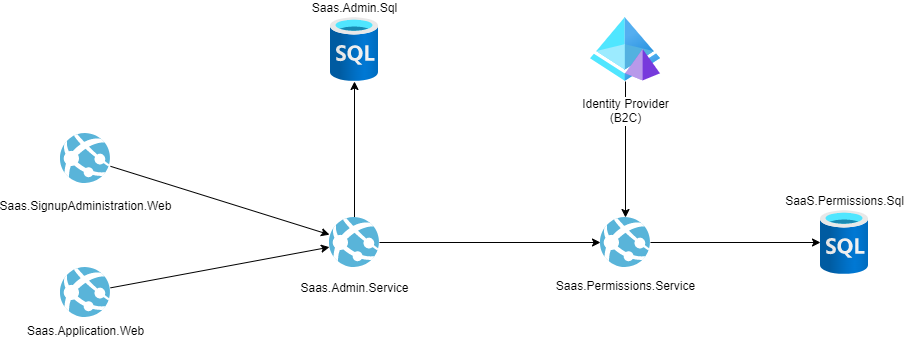
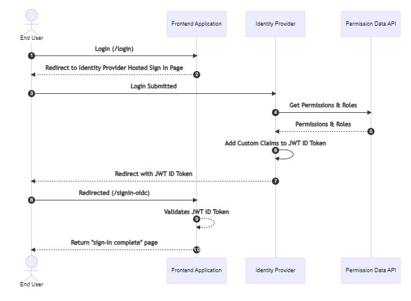
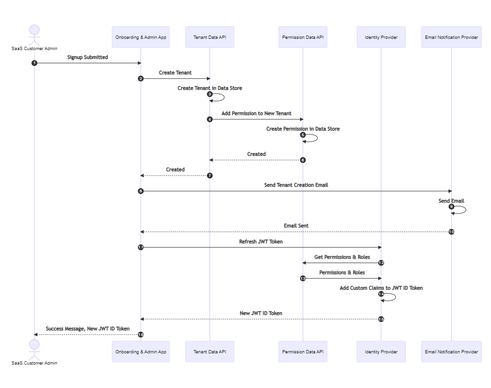
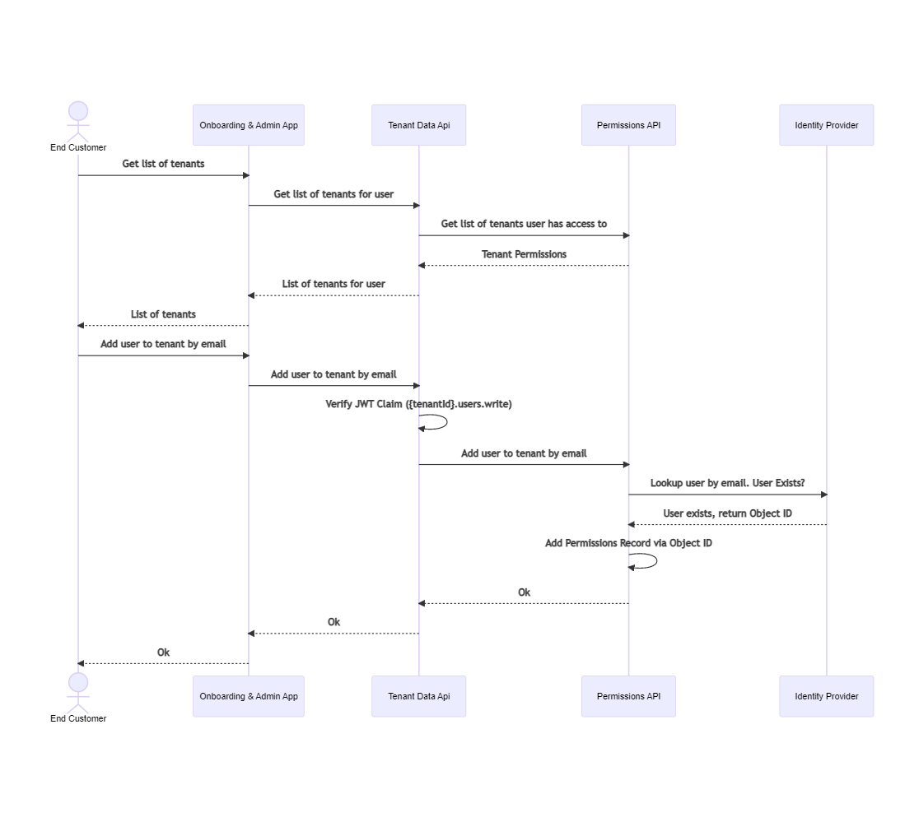

Software as a Service (SaaS) is a complex topic with many points to consider. Independent software vendors (ISVs) building their SaaS solutions on Azure need to solve similar problems and make decisions such as:

1. Which [tenancy model](../../guide/multitenant/considerations/tenancy-models.yml) should be used?
1. How do you set up an identity solution for use in a multitenant architecture?
1. How do you handle onboarding new customers?

This reference architecture aims to answer some of these questions and is meant to provide a starting place into the world of SaaS. However, as there is no "one size fits all" approach to this subject, this architecture is meant to be adaptable to fit a wide range of scenarios.

## Potential use cases

Here are some example use cases in which this architecture could be used:

- Modernizing an existing application to support full multitenancy as part of a shift to a SaaS based business model.
- Developing a greenfield SaaS offering for the first time.
- Migrating a SaaS offering from another cloud to Azure.

## Architecture

### Workflow

#### User sign in

#### Onboard a new tenant

#### Add a user to tenant

### Components

This architecture uses the following Azure services:

- [Azure App Service](https://azure.microsoft.com/services/app-service) enables you to build and host web apps and API apps in the programming language that you choose without needing to manage infrastructure.
- [Azure Active Directory B2C](https://azure.microsoft.com/services/active-directory/external-identities/b2c/) easily enables identity and access management for end user applications.
- [Azure SQL Database](https://azure.microsoft.com/products/azure-sql/database/) is a general-purpose relational database managed service that supports relational data, spatial data, JSON, and XML.
- [Azure Key Vault](https://azure.microsoft.com/services/key-vault/) lets you safely manage application keys, secrets, and certificates for your application.
- [Azure Logic Apps](https://azure.microsoft.com/services/logic-apps/) lets you quickly build powerful integrations using a simple GUI tool.

### Alternatives

The effectiveness of any alternative choices will depend greatly on the [tenancy model](../../guide/multitenant/considerations/tenancy-models.yml) you're aiming for your SaaS application to support. Here are some example alternative approaches you can follow when you implement this solution:

- The current solution uses Azure Active Directory B2C as the identity provider. Other identity providers, such as [Azure Active Directory](https://azure.microsoft.com/services/active-directory/), could be used instead as well.
- This solution uses two Azure Key Vault instances: one for the identity framework, and another for the web and API modules. For added security, you could consider deploying one key vault per module.
- For stricter security and compliance requirements, you could choose to also implement private networking for cross-service communication.
- Instead of using REST calls between services, another approach would be to use an [event-driven architectural style](https://docs.microsoft.com/azure/architecture/guide/architecture-styles/event-driven) for cross-service messaging.

## Considerations

These considerations implement the pillars of the Azure Well-Architected Framework, which is a set of guiding tenets that can be used to improve the quality of a workload. For more information, see [Microsoft Azure Well-Architected Framework](/azure/architecture/framework).

### Security

Security provides assurances against deliberate attacks and the abuse of your valuable data and systems. For more information, see [Overview of the security pillar](/azure/architecture/framework/security/overview).

This solution relies on identity as its security paradigm. Authentication and authorization for the web apps and APIs is governed by the [Microsoft Identity Platform](/azure/active-directory/develop/v2-overview), which is responsible for issuing and verifying user JWT tokens.

### Cost optimization

Cost optimization is about looking at ways to reduce unnecessary expenses and improve operational efficiencies. For more information, see [Overview of the cost optimization pillar](/azure/architecture/framework/cost/overview).

The components in this solution have some cost associated with their operation, but the cost is modest for most web applications and SaaS solutions. Additionally, you can control the cost by managing the following resource settings:

- The [App Service plan](/azure/app-service/overview-hosting-plans) that runs the application can be scaled to fit the throughput that you need. In addition, you could run each app on a separate plan if you require a higher throughput, but you will incur a higher cost as a result.
- [Azure AD B2C provides two SKUs](https://azure.microsoft.com/pricing/details/active-directory/external-identities/), Premium P1 and Premium P2. Both SKUs include a free allowance for the number of monthly active users (MAUs), but you need to evaluate which features each SKU provides to determine which is required for your use case.
- [Azure SQL has several purchasing models](/azure/azure-sql/database/purchasing-models) to fit a wide array of use cases, including the ability to autoscale. You need to evaluate the usage on your own databases to ensure you size them correctly.

### Performance efficiency

Performance efficiency is the ability of your workload to scale to meet the demands placed on it by users in an efficient manner. For more information, see [Performance efficiency pillar overview](/azure/architecture/framework/scalability/overview).

This architecture should be able to scale to meet most medium to medium/large workloads easily. Since it mostly uses Azure's platform (PaaS) services, you have many options to adjust the scale of the solution based on your requirements and load. 

For high throughput scenarios, or scenarios in which you need to serve customers in multiple geographies, you could also consider deploying the applications and databases in multiple regions. See the [Multi-region web app with private database](../sql-failover/app-service-private-sql-multi-region.yml) for a great example of this architecture.

## Deploy this scenario

If you'd like to deploy this scenario, the [Azure SaaS Dev Kit](https://github.com/Azure/azure-saas) is a deployable reference implementation of this architecture.

## Next steps

Here are some additional recommended resources for building a SaaS application on Azure:

- [Best practices for architecting multitenant solutions on Azure](../../guide/multitenant/overview.md)
- [ISV Considerations for Azure landing zones](/azure/cloud-adoption-framework/ready/landing-zone/isv-landing-zone)
- [Azure Well-Architected Framework](/azure/architecture/framework/)
- [WingTips Tickets SaaS Application](/azure/azure-sql/database/saas-tenancy-welcome-wingtip-tickets-app) - Provides details into tradeoffs with various tenancy models within the database layer.