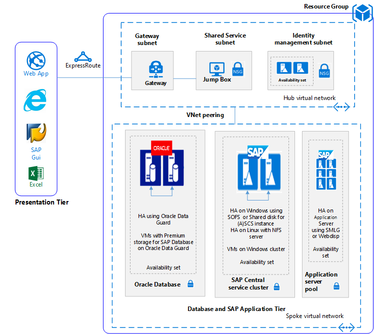

<!---
title: <SAP on Azure in a 4-Tier Architecture>
description: <Article Description>
author: Andrew-Dibbins, Dharmesh-Bhagat
ms.date: <publish or update date>
--->

# SAP deployment for Windows/Linux with Oracle database

This is sample scenario to show case SAP deployment on Windows or Linux virtual machines on Azure with Oracle database with High Availability (HA). Oracle database is approved and supported DBMS by SAP. Depending upon organization needs customer can use multiple virtual machines (VM) of different sizes. 

<!---
As this is sample scenario it can used for non-production environments.
--->

## Production use cases

Why High Availability is required?

SAP systems runs mission critical business application and any outage causes disruption in business flow and processes which in turn is loss in business value and its capabilities
* Successful HA prevents downtime and data loss to eliminate single point of failure.
* Single point of failure could be due to human error, system error or even site failure.

Refer [High availability](https://docs.microsoft.com/en-us/azure/virtual-machines/workloads/sap/high-availability-guide?toc=%2Fazure%2Fvirtual-machines%2Fwindows%2Ftoc.json) for SAP NetWeaver on Azure VMs for more information.

For other SAP on Azure production use cases review the SAP reference architectures available below:
* [SAP NetWeaver for AnyDB](https://review.docs.microsoft.com/en-us/azure/architecture/reference-architectures/sap/sap-netweaver) 
* [SAP S/4Hana](https://review.docs.microsoft.com/en-us/azure/architecture/reference-architectures/sap/sap-s4hana)
* [SAP on Azure large instances](https://review.docs.microsoft.com/en-us/azure/architecture/reference-architectures/sap/hana-large-instances)

## Related use cases
You should consider this scenario for the following use cases:

* Non-critical SAP non-productive workloads for Windows and/or Linux Virtual machines and Oracle as database.
* Non-critical SAP business workload to test high availability functionality.

## Architecture diagram

The solution diagram below is an example of this solution:

## Architecture

This sample scenario covers high level architecture of a SAP system with highly available configuration for Oracle database, SAP Central services and multiple SAP application Servers each on differnt virtual machines, the data flows through the solution as follows:

1. Customers from the Presentation Tier use their SAP gui, or other user interfaces (Internet Explorer, Excel or other web application) on premise to access the Azure based SAP system.
2. Connectivity is provided through the use of the established Express Route. The Express Route is terminated in Azure at the Express Route Gateway. Network traffic routes through the Express Route gateway to the Gateway Subnet and from the gateway subnet to the Application Tier Spoke subnet and via a Network Security Gateway to the SAP application virtual machine.
3. The identity management servers provide authentication services to the solution.
4. The Jump Box provides local management capabilities to the solution.
5. High availability, Refers to a set of technologies that minimize IT disruptions by providing business continuity of IT services through redundant, fault-tolerant, or failover-protected components inside the same data center.

### Components

* [Resource Groups](https://docs.microsoft.com/en-us/azure/azure-resource-manager/resource-group-overview#resource-groups) is a logical container for Azure resources.
* [Virtual Networks](https://docs.microsoft.com/en-us/azure/virtual-network/virtual-networks-overview) is the basis of network communications within Azure
* [Virtual Machine](https://docs.microsoft.com/en-us/azure/virtual-machines/windows/overview) Azure Virtual Machines provides on-demand, high-scale, secure, virtualized infrastructure using Windows or Linux Server
* [Express Route](https://docs.microsoft.com/en-us/azure/expressroute/expressroute-introduction) lets you extend your on-premises networks into the Microsoft cloud over a private connection facilitated by a connectivity provider.
* [Network Security Group](https://docs.microsoft.com/en-us/azure/virtual-network/security-overview) lets you limit network traffic to resources in a virtual network. A network security group contains a list of security rules that allow or deny inbound or outbound network traffic based on source or destination IP address, port, and protocol. 
* [High availability of SAP applications on Azure IaaS](https://docs.microsoft.com/en-us/azure/virtual-machines/workloads/sap/sap-high-availability-architecture-scenarios
) to achieve full SAP system high availability, you must protect all critical SAP system components. 
* [Design and implement an Oracle database in Azure](https://docs.microsoft.com/en-us/azure/virtual-machines/workloads/oracle/oracle-design). Oracle Data Guard is the most comprehensive solution available to eliminate single points of failure for mission critical Oracle Databases.

## SAP on Azure compatibility for Oracle
Microsoft Azure offers infrastructure services that can be utilized for deployment of SAP products with the Oracle Database. This [SAP note 2039619](https://launchpad.support.sap.com/#/notes/2039619) - SAP Applications on Microsoft Azure using the Oracle Database: Supported Products and Versions describes, which Oracle products Database versions and operating system are supported in a Microsoft Azure environment for SAP

### Alternatives
SAP gives flexibility to use DB/OS combinations, and Azure VM types in a Microsoft Azure VM Services (IaaS) environment. This [SAP note 1928533](https://launchpad.support.sap.com/#/notes/1928533) - SAP Applications on Azure: Supported Products and Azure VM types describes, which SAP products, DB/OS combinations and Azure VM types are currently supported.

## Considerations

### Availability
Microsoft offers a service level agreement (SLA) for single VM instannces. For more information on Microsoft Azure Service Level Agreement for Virtual Machines [SLA For Virtual Machines](https://azure.microsoft.com/en-us/support/legal/sla/virtual-machines/v1_8/)

### Scalability

For general guidance on designing scalable solutions, see the [Scalability Checklist](https://review.docs.microsoft.com/en-us/azure/architecture/checklist/scalability) in the Azure Architecture Center.

### Security

For general guidance on designing secure solutions, see the [Azure Security](https://review.docs.microsoft.com/en-us/azure/security/).

### Resiliency

For general guidance on designing resilient solutions, see [Designing resilient applications for Azure](https://review.docs.microsoft.com/en-us/azure/architecture/resiliency/)

## Pricing

Explore the cost of running this solution, all of the services are pre-configured in the cost calculator.  To see how the pricing would change for your particular use case change the appropriate variables to match your expected traffic. 

We have provided four sample cost profiles based on amount of traffic you expect to get:

|Size|SAPs|DB VM Type|DB Storage|(A)SCS VM|(A)SCS Storage|App VM Type|App Storage|Azure Pricing Calculator|
|----|----|-------|-------|-----|---|---|--------|---------------|
|Small|30000|DS13_v2|4xP20, 1xP20|DS11_v2|1x P10|DS13_v2|1x P10|[Small](https://azure.com/e/45880ba0bfdf47d497851a7cf2650c7c)|
|Medium|70000|DS14_v2|6xP20, 1xP20|DS11_v2|1x P10|4x DS13_v2|1x P10|[Medium](https://azure.com/e/9a523f79591347ca9a48c3aaa1406f8a)|
Large|180000|E32s_v3|5xP30, 1xP20|DS11_v2|1x P10|6x DS14_v2|1x P10|[Large](https://azure.com/e/f70fccf571e948c4b37d4fecc07cbf42)|
Extra Large|250000|M64s|6xP30, 1xP30|DS11_v2|1x P10|10x DS14_v2|1x P10|[Extra Large](https://azure.com/e/58c636922cf94faf9650f583ff35e97b)|

Note: pricing is a guide and only indicates the VMs and storage costs (excludes, networking, backup storage and data ingress/egress charges).

* [Small](https://azure.com/e/45880ba0bfdf47d497851a7cf2650c7c): A small system consists of VM type DS13_v2 for the db server with 8x vCPUs, 56GB RAM and 112GB temp storage, additionally five 512GB premium storage disks. An SAP Central Instance servers using a DS11_v2 VM types with 2x vCPUs 14GB RAM and 28GB temp storage. A single VM type DS13_v2 for the SAP application server with 8x vCPUs, 56GB RAM and 400GB temp storage, additionally one 128GB premium storage disk.

* [Medium](https://azure.com/e/9a523f79591347ca9a48c3aaa1406f8a): A medium system consists of VM type DS14_v2 for the db server with 16x vCPUs, 112GB RAM and 800GB temp storage, additionally seven 512GB premium storage disks. An SAP Central Instance server using a DS11_v2 VM types with 2x vCPUs 14GB RAM and 28GB temp storage. Four VM type DS13_v2 for the SAP application server with 8x vCPUs, 56GB RAM and 400GB temp storage, additionally one 128GB premium storage disk.

* [Large](https://azure.com/e/f70fccf571e948c4b37d4fecc07cbf42): A large system consists of VM type E32s_v3 for the db server with 32x vCPUs, 256GB RAM and 800GB temp storage, additionally three 512GB and one 128GB premium storage disks. An SAP Central Instance server using a DS11_v2 VM types with 2x vCPUs 14GB RAM and 28GB temp storage. Six VM type DS14_v2 for the SAP application servers with 16x vCPUs, 112GB RAM and 224GB temp storage, additionally six 128GB premium storage disk.

* [Extra Large](https://azure.com/e/58c636922cf94faf9650f583ff35e97b): An extra large system consists of a VM type M64s for the db server with 64x vCPUs, 1024GB RAM and 2000GB temp storage, additionally seven 1024GB premium storage disks. An SAP Central Instance server using a DS11_v2 VM types with 2x vCPUs 14GB RAM and 28GB temp storage. Ten VM type DS14_v2 for the SAP application servers with 16x vCPUs, 112GB RAM and 224GB temp storage, additionally ten 128GB premium storage disk.

## Deployment Example

You can deploy the underlying infrastructure similar to the scenario above, please use the deploy button

Note: SAP and Oracle will not be installed, you'll need to do this after the infrastructure is built manually.

