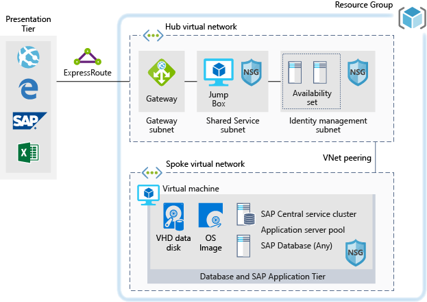

This example shows how to establish a development and test environment for SAP NetWeaver in a Windows or Linux environment on Azure. The database used is AnyDB. (AnyDB is the SAP term for any supported DBMS that isn't SAP HANA.) Because this architecture is designed for non-production environments, it's deployed with only one virtual machine (VM). The VM size can be changed to accommodate your organization's needs.

For production use cases review the SAP reference architectures available below:

- [SAP NetWeaver for AnyDB][sap-netweaver]
- [SAP S/4HANA][sap-hana]
- [SAP on Azure large instances][sap-large]

## Relevant use cases

Other relevant use cases include:

- Noncritical SAP nonproduction workloads (such sandbox, development, test, and quality assurance).
- Noncritical SAP business workloads.

## Architecture

This scenario demonstrates provisioning a single SAP system database and SAP application server on a single virtual machine. The data flows through the scenario as follows:

1. Customers use the SAP user interface or other client tools (Excel, a web browser, or other web application) to access the Azure-based SAP system.
2. Connectivity is provided by using an established ExpressRoute. The ExpressRoute connection is ended in Azure at the ExpressRoute gateway. Network traffic routes through the ExpressRoute gateway to the gateway subnet, and from the gateway subnet to the application-tier spoke subnet (see the [hub-spoke network topology][hub-spoke]) and via a Network Security Gateway to the SAP application virtual machine.
3. The identity management servers provide authentication services.
4. The jump box provides local management capabilities.

### Components

- [Virtual networks](/azure/virtual-network/virtual-networks-overview) are the basis of network communication within Azure.
- [Azure Virtual Machines](/azure/virtual-machines/windows/overview) provide on-demand, high-scale, secure, virtualized infrastructure using Windows or Linux servers.
- [ExpressRoute](/azure/expressroute/expressroute-introduction) extends your on-premises networks into the Microsoft cloud over a private connection, which is facilitated by a connectivity provider.
- [Network security groups](/azure/virtual-network/security-overview) limit network traffic to specific resources in a virtual network. A network security group contains a list of security rules that allow or deny inbound or outbound network traffic. The security rules are based on source or destination IP address, port, and protocol.
- [Resource groups](/azure/azure-resource-manager/resource-group-overview#resource-groups) act as logical containers for Azure resources.
- [Azure Files](https://docs.microsoft.com/azure/storage/files/storage-files-introduction) or [Azure NetApp Files](https://docs.microsoft.com/azure/azure-netapp-files/azure-netapp-files-introduction) are recommended solutions to provide the storage for the SAP executables and HANA data and logs.

## Considerations

### Availability

Microsoft offers a service level agreement (SLA) for single VM instances. For more information on Microsoft Azure Service Level Agreement for Virtual Machines [SLA For Virtual Machines](https://azure.microsoft.com/support/legal/sla/virtual-machines)

### Scalability

For general guidance on designing scalable solutions, see the [performance efficiency checklist][scalability] in the Azure Architecture Center.

### Security

For general guidance on designing secure solutions, see the [Azure Security Documentation][security].

### Resiliency

For general guidance on designing resilient solutions, see [Designing resilient applications for Azure][resiliency].

### Data protection and cloning

For general guidance on protecting your application data, see [Azure Application Consistent Snapshot tool](https://docs.microsoft.com/en-us/azure/azure-netapp-files/azacsnap-introduction), which provides application consistent snapshots when used in combination with Azure NetApp Files.

## Pricing

To help you explore the cost of running this scenario, all services are preconfigured in the cost calculator examples below. Change the appropriate variables to match the expected traffic for your use case.

We've provided four sample cost profiles based on amount of traffic you expect to receive:

|Size|SAPs|VM Type|Storage|Azure Pricing Calculator|
|----|----|-------|-------|---------------|
|Small|8000|D8s_v3|2xP20, 1xP10|[Small](https://azure.com/e/9d26b9612da9466bb7a800eab56e71d1)|
|Medium|16000|D16s_v3|3xP20, 1xP10|[Medium](https://azure.com/e/465bd07047d148baab032b2f461550cd)|
Large|32000|E32s_v3|3xP20, 1xP10|[Large](https://azure.com/e/ada2e849d68b41c3839cc976000c6931)|
Extra Large|64000|M64s|4xP20, 1xP10|[Extra Large](https://azure.com/e/975fb58a965c4fbbb54c5c9179c61cef)|

> [!NOTE]
> This pricing is a guide that only indicates the VMs and storage costs. It excludes networking, backup storage, and data ingress/egress charges.

- [Small](https://azure.com/e/9d26b9612da9466bb7a800eab56e71d1): A small system consists of VM type D8s_v3 with 8x vCPUs, 32-GB RAM, and 200 GB of temporary storage. It also contains premium storage: two 512-GB disks and one 128-GB disk.
- [Medium](https://azure.com/e/465bd07047d148baab032b2f461550cd): A medium system consists of VM type D16s_v3 with 16x vCPUs, 64-GB RAM, and 400 GB of temporary storage. It also contains premium storage: three 512-GB disks and one 128-GB disk.
- [Large](https://azure.com/e/ada2e849d68b41c3839cc976000c6931): A large system consists of VM type E32s_v3 with 32x vCPUs, 256-GB RAM, and 512 GB of temporary storage. It also contains premium storage: three 512-GB disks and one 128-GB disk.
- [Extra Large](https://azure.com/e/975fb58a965c4fbbb54c5c9179c61cef): An extra-large system consists of a VM type M64s with 64x vCPUs, 1024-GB RAM, and 2000 GB of temporary storage. It also contains premium storage: four 512-GB disks and one 128-GB disk.

## Deployment

Select the link below to deploy the solution.

> [!NOTE]
> SAP and Oracle are not installed during this deployment. You will need to deploy these components separately.

## Next steps

Learn more about the component technologies:

- [What is Azure Virtual Network?](/azure/virtual-network/virtual-networks-overview)
- [Linux virtual machines in Azure](/azure/virtual-machines/linux/overview)
- [Windows virtual machines in Azure](/azure/virtual-machines/windows/overview)
- [What is Azure ExpressRoute?](/azure/expressroute/expressroute-introduction)
- [Network security groups](/azure/virtual-network/network-security-groups-overview)
- [Use Azure to host and run SAP workload scenarios](/azure/virtual-machines/workloads/sap/get-started)
- [Installation of SAP HANA on Azure virtual machines](/azure/virtual-machines/workloads/sap/hana-get-started)
- [Manage Azure Resource Manager resource groups by using Azure CLI](/azure/azure-resource-manager/management/manage-resource-groups-cli)
- [High-availability architecture and scenarios for SAP NetWeaver](/azure/virtual-machines/workloads/sap/sap-high-availability-architecture-scenarios)

Explore related architectures:

- [Run a Linux VM on Azure](../../reference-architectures/n-tier/linux-vm.yml)
- [Run SAP NetWeaver in Windows on Azure](../../reference-architectures/sap/sap-netweaver.yml)
- [SAP on Azure Architecture Guide](../../reference-architectures/sap/sap-overview.yml)

<!-- links -->

[resiliency]: /azure/architecture/framework/resiliency/principles
[security]: /azure/security
[scalability]: /azure/architecture/framework/scalability/performance-efficiency
[sap-netweaver]: ../../reference-architectures/sap/sap-netweaver.yml
[sap-hana]: ../../reference-architectures/sap/sap-s4hana.yml
[sap-large]: ../../reference-architectures/sap/hana-large-instances.yml
[hub-spoke]: ../../reference-architectures/hybrid-networking/hub-spoke.yml
