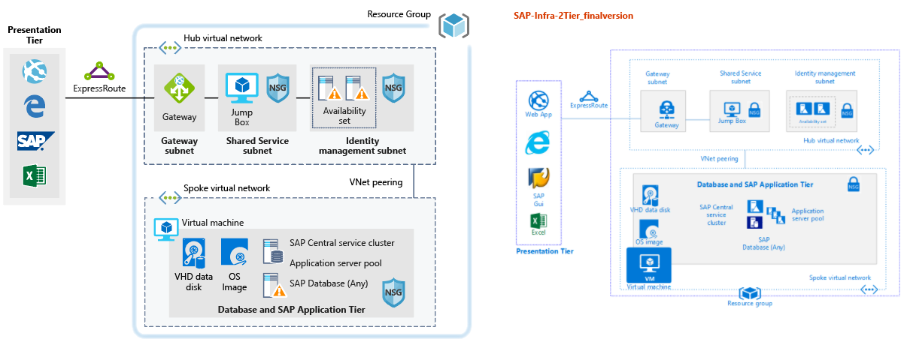

# SAP for a dev/test workload

This architectural design shows a set of proven practices for running SAP NetWeaver in a Windows or Linux environment on Azure. The database is AnyDB, the SAP term for any supported DBMS (that isn't SAP HANA). This architecture is deployed with specific virtual machine (VM) sizes that can be changed to accommodate your organization's needs.

## Potential use cases

Consider this solution for the following use cases:

* Non-Critical SAP non-productive workloads (Sandbox, Development, Test, Quality Assurance)
* Non-critical SAP Business One workloads

## Architecture

This solution covers the provision of a single SAP system database and SAP application Server on a single virtual machine, the data flows through the solution as follows:

1. Customers from the Presentation Tier use their SAP gui, or other user interfaces (Internet Explorer, Excel or other web application) on premise to access the Azure based SAP system.
2. Connectivity is provided through the use of the established Express Route. The Express Route is terminated in Azure at the Express Route Gateway. Network traffic routes through the Express Route gateway to the Gateway Subnet and from the gateway subnet to the Application Tier Spoke subnet and via a Network Security Gateway to the SAP application virtual machine.
3. The identity management servers provide authentication services to the solution.
4. The Jump Box provides local management capabilities to the solution.

### Components

* [Resource Groups](https://docs.microsoft.com/en-us/azure/azure-resource-manager/resource-group-overview#resource-groups) is a logical container for Azure resources.
* [Virtual Networks](https://docs.microsoft.com/en-us/azure/virtual-network/virtual-networks-overview) is the basis of network communications within Azure
* [Virtual Machine](https://docs.microsoft.com/en-us/azure/virtual-machines/windows/overview) Azure Virtual Machines provides on-demand, high-scale, secure, virtualized infrastructure using Windows or Linux Server
* [Express Route](https://docs.microsoft.com/en-us/azure/expressroute/expressroute-introduction) lets you extend your on-premises networks into the Microsoft cloud over a private connection facilitated by a connectivity provider.
* [Network Security Group](https://docs.microsoft.com/en-us/azure/virtual-network/security-overview) lets you limit network traffic to resources in a virtual network. A network security group contains a list of security rules that allow or deny inbound or outbound network traffic based on source or destination IP address, port, and protocol. 

### Alternatives

* List of alternative options and why you might use them.

## Considerations

### Availability

For any Single Instance Virtual Machine using premium storage for all Operating System Disks and Data Disks, we guarantee you will have Virtual Machine Connectivity of at least 99.9%.

For more information on Microsoft Azure Service Level Agreement for Virtual Machines [SLA For Virtual Machines](https://azure.microsoft.com/en-us/support/legal/sla/virtual-machines/v1_8/)

### Scalability

### Security

For a deeper discussion on [Azure Security][security] please see the relevant article in the architecure center.

### Resiliency

## Pricing

Explore the cost of running this solution, all of the services are pre-configured in the cost calculator.  To see how the pricing would change for your particular use case change the appropriate variables to match your expected traffic.

We have provided four sample cost profiles based on amount of traffic you expect to get:

|Size|SAPs|VM Type|Storage|Azure Pricing Calculator|
|----|----|-------|-------|---------------|
|Small|8000|D8s_v3|2xP20, 1xP10|[Small](https://azure.com/e/9d26b9612da9466bb7a800eab56e71d1)|
|Medium|16000|D16s_v3|3xP20, 1xP10|[Medium](https://azure.com/e/465bd07047d148baab032b2f461550cd)|
Large|32000|E32s_v3|3xP20, 1xP10|[Large](https://azure.com/e/ada2e849d68b41c3839cc976000c6931)|
Extra Large|64000|M64s|4xP20, 1xP10|[Extra Large](https://azure.com/e/975fb58a965c4fbbb54c5c9179c61cef)|

Note: * pricing is a guide, indicates only the VMs and storage costs (excludes, networking, backup storage and data ingress/egress charges)

* [Small](https://azure.com/e/9d26b9612da9466bb7a800eab56e71d1): A small system consists of VM type D8s_v3 with 8x vCPUs, 32GB RAM and 200GB temp storage, additionally two 512GB and one 128GB premium storage disks.
* [Medium](https://azure.com/e/465bd07047d148baab032b2f461550cd): A medium system consists of VM type D16s_v3 with 16x vCPUs, 64GB RAM and 400GB temp storage, additionally three 512GB and one 128GB premium storage disks.
* [Large](https://azure.com/e/ada2e849d68b41c3839cc976000c6931): A large system consists of VM type E32s_v3 with 32x vCPUs, 256GB RAM and 512GB temp storage, additionally three 512GB and one 128GB premium storage disks.
* [Extra Large](https://azure.com/e/975fb58a965c4fbbb54c5c9179c61cef): An extra large system consists of a VM type M64s with 64x vCPUs, 1024GB RAM and 2000GB temp storage, additionally four 512GB and one 128GB premium storage disks.

## Deployment

To deploy a sample solution similar to the solution above, please use the deploy button

### Alternative deployment examples

For further deployment examples, please refer to many the github samples templates. [Github QuickStart Templates] https://github.com/Azure/azure-quickstart-templates

## Related Resources

Review the SAP reference architectures available in the architecture center to see production grade deployments:

* [SAP netweaver for AnyDB][sap-netweaver]
* [SAP S/4Hana][sap-hana]
* [SAP on Azure large instances][sap-large]

<!-- links -->
[reference architecture]:  /azure/architecture/reference-architectures/sap
[resiliency]: /azure/architecture/resiliency/
[security]: https://azure.microsoft.com/en-us/services/security-center/
[scalability]: /azure/architecture/checklist/scalability
[sap-netweaver]: /azure/architecture/reference-architectures/sap/sap-netweaver
[sap-hana]: /azure/architecture/reference-architectures/sap/sap-s4hana
[sap-large]: /azure/architecture/reference-architectures/sap/hana-large-instances