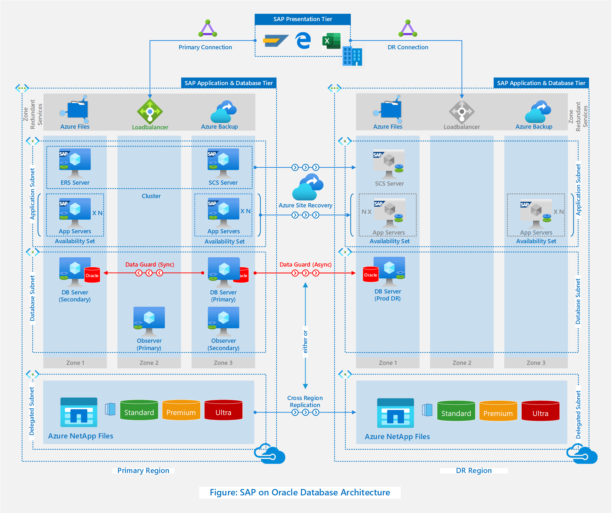
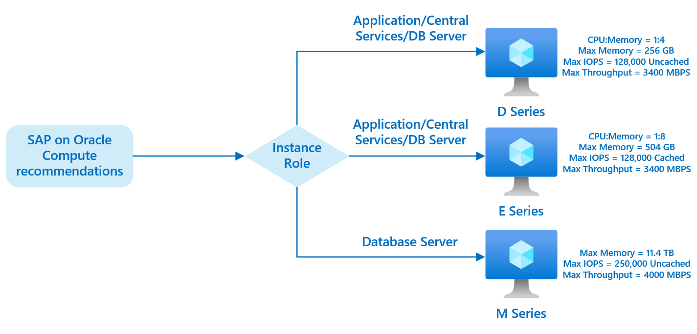
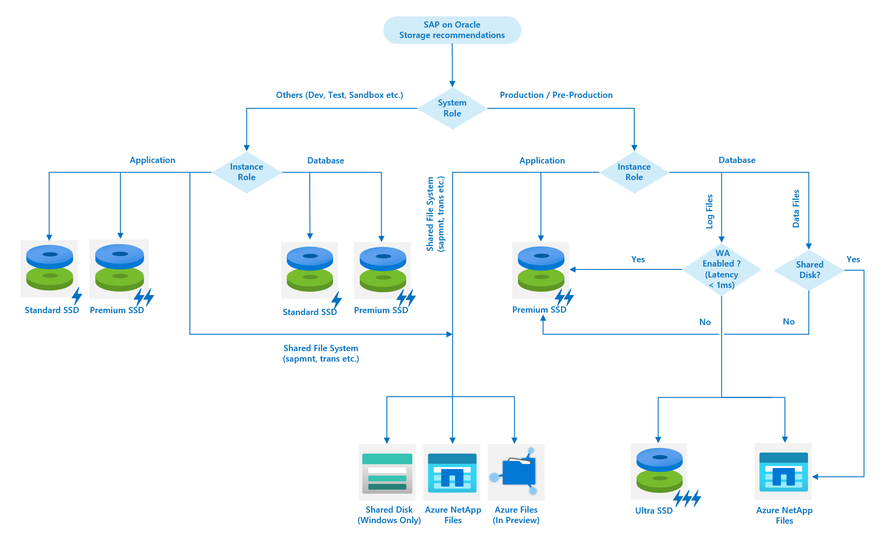
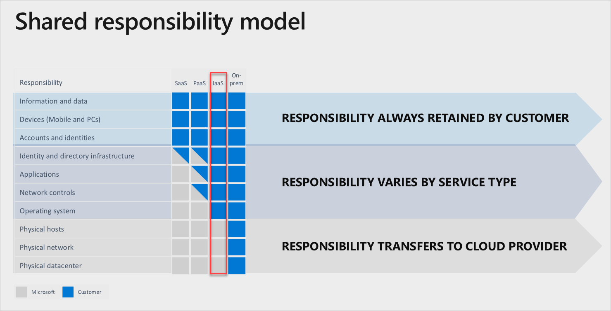

SAP system on Oracle Database is one of the popular deployment patterns in the SAP world. This article describes a typical architecture of SAP on Oracle on Azure, which aligns with the pillars of the [Azure Well Architected Framework](../../framework/index.md).

## Architecture

*Figure – Architecture Diagram of SAP on Oracle Database on Azure*

## Components

The reference architecture describes a typical SAP production system running on Oracle database on Azure. The key components of the architecture are mentioned below. The architecture and its components can be customized based on the requirements (for example, RPO/RTO, System Role, and so on). The considerations associated with each of the components highlight some of customizing options and the recommendations are based on the best practices for running SAP on Oracle database on Azure.

### SAP presentation layer

The presentation layer (SAPGUI, SAP NetWeaver Business Client, Browser, and so on) of the reference architecture reside in the user workstation (laptop, desktop, and so on), which connects to Azure via on-premises datacenter. Below are the considerations and recommendations around presentation layer of the architecture.

#### Considerations

- The presentation layer of the SAP Solution can reside in a user workstation (laptop, desktop, and so on), remote desktop in Azure, or in virtual desktop solutions, such as Citrix, [Azure Virtual Desktop](/azure/virtual-desktop/overview), and so on.

#### Recommendations

- While deploying an SAP presentation layer, ensure the latency requirement between SAP Application servers and the presentation layer are met. This [SCN Wiki](https://wiki.scn.sap.com/wiki/display/VIRTUALIZATION/Frequently+Asked+Questions%3A+Microsoft+Azure#FrequentlyAskedQuestions:MicrosoftAzure-HowcanItestthelatencybetweenmyhomelocationandthenextAzuredatacenter?) page contains good guiding principles. When defining your strategy, aim to adhere to these latency guidelines:

| Quality of Response time | Measured Response time |
|--|--|
| Best | <80 ms |
| Better | <150 ms |
| Good | <220 ms |
| Bad | >220 ms |

### Networking

The reference architecture uses Azure ExpressRoute to connect customer on-premises DC to both the primary and the DR regions of Azure.

The SAP application servers, central services, and enqueue replication server are deployed in the Application subnet and Oracle database together with [Oracle Data Guard FSFO (Fast-Start Fail Over)](https://www.oracle.com/technical-resources/articles/smiley-fsfo.html) observer is deployed in the database subnet within a virtual network in Azure subscription (also known as SAP Landing Zone). Both the subnets are protected through Network Security Group (NSG).

Below are the considerations and recommendations around networking component of the architecture.

#### Considerations

- Site-to-Site (S2S) VPN or Azure ExpressRoute can be used for connecting customer on-premises DC to Azure.
- Azure Standard Load Balancer must be used as a network load balancer.

#### Recommendations

- Refer [SAP Note – 2015553](https://launchpad.support.sap.com/#/notes/2015553) to understand the Network prerequisites for SAP on Azure deployment.
- Create dedicated subnets for SAP Application components (such as PAS, AAS, or Central Services) and Database components (such as Oracle Database and Oracle Observer) deployment.
- Restrict the database access using [Network Security Group (NSG)](/azure/virtual-network/network-security-groups-overview) and [Application Security Group (ASG)](/azure/virtual-network/application-security-groups) policies.
- Enable [Accelerated Networking](/azure/virtual-network/create-vm-accelerated-networking-cli) for supported Azure VM and Operating System.

### Virtual machine

In the reference architecture, SAP Application servers are deployed in the availability set together with Oracle Database and Central Services within an Azure zone. The identical deployment pattern is replicated in the other zone of the primary region for high availability.

The third zone is used for deploying the primary Oracle FSFO observer and first zone, which is the one where the primary Oracle database is running, which is used for the secondary Oracle FSFO deployment.

Below are the considerations and recommendations around virtual machine component of the architecture.

#### Considerations

- Based on sizing requirements, Azure VM can be selected from the list of SAP certified VMs mentioned in the [SAP note 1928533](https://launchpad.support.sap.com/#/notes/1928533).
- Only Windows Server and Oracle Linux are the certified and supported operating systems for Oracle databases and Oracle Client binaries. Therefore, SAP Application and Database server's operating system is restricted to Windows Server and Oracle Linux. However, the central cervices, which don't run any Oracle binaries can run on any of the operating systems mentioned in the [SAP note 1928533](https://launchpad.support.sap.com/#/notes/1928533).
- Pacemaker clustering solution is not supported on Oracle Linux on Azure. One of the alternatives for this scenario is [SIOS Protection Suite for Linux](https://us.sios.com/sap-clustering/).
- There are few restrictions around usage of Oracle products on Azure. Refer [SAP Note – 2039619](https://launchpad.support.sap.com/#/notes/2039619) for details.

#### Recommendations

- Use [constrained core VMs](/azure/virtual-machines/constrained-vcpu?bc=%2fazure%2fvirtual-machines%2flinux%2fbreadcrumb%2ftoc.json&toc=%2fazure%2fvirtual-machines%2flinux%2ftoc.json) for hosting Oracle databases on Azure VMs for cost efficiency.

*Figure – Azure compute recommendations for SAP on Oracle Database*

- Use availability zones together with availability set for Azure VMs deployment. Perform [latency check between availability zones](/azure/virtual-machines/workloads/sap/sap-ha-availability-zones#network-latency-between-and-within-zones) to ensure that it meets the latency requirement for cross-zone communication.
- Regions where Availability Zones are not available, use availability set for Azure VM deployment.

### Storage

The architecture uses Azure-managed disks for Azure VM disks and Azure Files for shared storage. Below are the considerations and recommendations around storage component of the architecture.

#### Considerations

- Azure Managed Disks and [Azure NetApp Files](/azure/virtual-machines/workloads/oracle/oracle-database-backup-strategies#azure-netapp-files) are the storage solutions for Oracle databases on Azure. Refer [SAP Note – 2039619](https://launchpad.support.sap.com/#/notes/2039619) to understand the possible supported combinations of Operating systems, Oracle products, and the storage solutions.
- Azure Files (In Preview), Azure Shared Disk, and Azure NetApp files can be used for shared file systems.
- Oracle database is supported on both ASM and Non-ASM File systems on Azure.
- Be aware of some of the [limitations](/azure/virtual-machines/disks-enable-ultra-ssd?tabs=azure-portal) of Azure Ultra SSD, when using Ultra SSD for database storage.
- Azure NetApp files do not currently support Availability Zones.

##### Recommendations

- The below mentioned decision tree can help in the selection of right storage solution based on requirement.

*Figure – Azure storage recommendations for SAP on Oracle Database*

- For VM running Oracle database:
  - Enable read-only caching for all the data disks.
  - Enable write accelerator (for write caching) for all the log disks when using premium SSD with M series.
  - For production/performance critical SAP-on-Oracle deployment with E series VMs, use ultra SSD for log disks and can use premium SSD for data disks.
  - For non-prod systems/non-performance critical SAP-on-Oracle deployment, you can replace the Premium-managed disk with Standard SSD.
- Can use [premium SSD performance tiering](/azure/virtual-machines/disks-performance-tiers-portal) to temporary increase the performance offerings from the premium SSD.

### Security

In Azure, security is a shared responsibility between Microsoft and Customer. SAP-on-Oracle deployment fits into the IaaS vertical of the [shared responsibility model](https://blogs.sap.com/2019/07/21/sap-security-operations-on-azure/). Microsoft Azure takes care of security ranging from the physical datacenter, network, hosts and up to hypervisor layer. The security responsibility of anything above the hypervisor belongs to customer.

*Figure – Azure Shared Responsibility Model*

In the reference architecture, the applications (SAP & Oracle software) are deployed on the Azure VMs running security hardened operating system images.

End users using SAPGUI and browser for accessing SAP Application are authenticated using Single-Sign-On (SSO) and SAP Administrator (Basis) uses Azure Bastion to access operating system. All the communications between end-users and SAP application are encrypted (such as with encryption-in-transit) using TLS and SNC (Secure Network Communication).

For Oracle database the encryption-at-rest is achieved through Oracle Transparent Data Encryption (TDE) and for other components (such as managed disks of the VMs that run SAP Application and non-data disks of Oracle database VMs), Azure Disk Encryption is used to achieve the same.

The solution uses Azure backup for protecting the VMs and the Oracle database, and all the backed-up data is automatically encrypted when stored in the cloud using Azure Storage encryption.

The overall solution is integrated into [Microsoft Defender for Cloud](/azure/security-center/security-center-introduction) and [Microsoft Sentinel](/azure/sentinel/overview).

#### Considerations

- Azure Disk Encryption can be achieved with both Microsoft-Managed Key and Customer-Managed Key options. Refer - [ADE support for VMs and Operating System based on Windows](/azure/virtual-machines/windows/disk-encryption-overview#supported-vms-and-operating-systems) and [ADE support for VMs and Operating System based on Linux](/azure/virtual-machines/linux/disk-encryption-overview#supported-vms-and-operating-systems) to understand ADE supported scenarios.

#### Recommendations

- SAP whitepaper [Security Recommendations: A Practical Guide for Securing SAP® Solutions](https://www.sap.com/documents/2017/03/14cf06b2-af7c-0010-82c7-eda71af511fa.html) describes a good framework for SAP Solution Security.
- Enable Single-Sign-On (SSO) for user authentication from SAPGUI and browser-based SAP access.
- Use security hardened operating system images for provisioning Azure VMs. See the latest [CIS benchmarks](https://www.cisecurity.org/benchmark/azure/) for the latest recommendations.
- Implement encryption-at-rest for:
  - Oracle Database - It's recommended to use Oracle Transparent Data Encryption (TDE) for Oracle Database Encryption.
  - Managed Disks – use Azure Disk Encryption with Microsoft or Customer-Managed Keys.
  - Backups – All the backed-up data to Azure is encrypted by default.
- Implement encryption-in-transit for:
  - Use TLS for encrypting HTTP communications and SNC for DIAG/RFC communications.
- Use Azure Bastion (PaaS) for secure and seamless RDP/SSH connectivity to your VMs directly in the Azure portal over SSL.
- Enable Microsoft Defender for Cloud Standard for SAP on Azure subscriptions.
- Enable resource locking to prevent accidental deletion of the deployed Azure resource.

### Scalability

The scalability in the reference architecture will be achieved through scale-out of application servers and scale-up of database server.

The considerations and recommendations around scalability are:

#### Considerations

- Oracle RAC as a scalability and high availability solution is not supported for running SAP on Azure.

#### Recommendations

- With the increase of capacity requirement, prefer scaling-out the application server and scaling-up the Database Server.

### High availability and disaster recovery

SAP application servers in availability set behind standard load balancer and SAP central services in cluster construct the high availability solution of SAP application layer.

The high availability in database layer is achieved through synchronous database replication between Oracle databases in two zones. The database failover between Azure zones is automated using Oracle Data Guard FSFO (Fast-Start Failover) Observer. The disaster-recovery of the application layer is achieved through Azure Site Recovery replication and database layer through asynchronous database replication between Azure regions.

For cost-effectiveness, SAP Central Services clustering is not deployed in the DR region. The Azure Site Recovery replication is enabled only from SAP Central Services but not from SAP ERS server.

Below are the considerations and recommendations related to HA/DR setup.

#### Considerations

- Oracle Data Guard is supported as High Availability and Disaster Recovery solution for database.
- Oracle RAC is not supported as a high availability solution for Oracle databases on Azure.

#### Recommendations

- Use database native solution for Oracle database replication.
- Below is the recommended HA/DR solution for the different components of the reference architecture.

| Architecture component | High availability | Disaster recovery |
|--|--|--|
| SAP Central Services | Linux Cluster Solution -or- Windows Server failover cluster, and so on. | Azure Site Recovery*, RSYNC, and so on. |
| SAP Application Server | VMs in availability Set distributed between Availability Zones behind Azure standard load balancer. | Azure Site Recovery* |
| Oracle Database Server | Synchronous Oracle Data Guard replication between Oracle databases in availability zones. | Asynchronous Oracle Data Guard replication between Oracle databases in two regions. |
| Oracle Observer | VMs distributed between Availability Zones – or – VMs in availability set. | - |

> **_*_**  See the supported scenarios with [Azure Site Recovery](/azure/site-recovery/azure-to-azure-support-matrix).

- Use Azure Automation Runbook to automate the pre- and post-steps of the region failover.

### Backup

The reference architecture uses Azure Backup for backing up Azure VMs and Oracle database. Oracle redo log backup is performed using RMAN backup to Azure Blob Storage.

#### Considerations

- There are multiple ways to perform SAP Oracle database backup on Azure. This includes traditional methods like SAP BRTools, Oracle RMAN, SAP Backint certified third-party backup solutions, Azure native PaaS solution, Azure Backup, and so on.
- Azure Backup offers a simple, enterprise-grade solution for workloads running on virtual machines. For more information, see [Oracle database backup using Azure Backup](/azure/virtual-machines/workloads/oracle/oracle-database-backup-azure-backup?tabs=azure-portal).

#### Recommendations

- It is recommended to store a copy of mission critical SAP systems (for example, SAP Production Systems) backup in the DR region, such as with cross-region backup storage. In Azure, this backup is easily achieved by using the Geo Redundant Storage (GRS) type of storage.

### Monitoring

Below are the considerations and recommendations related to monitoring aspects of the reference architecture.

#### Considerations

- Ensure that the SAP deployment on Azure must meet the monitoring requirements mentioned in the [SAP Note – 2015553](https://launchpad.support.sap.com/#/notes/2015553).
- SAP Application and Database Monitoring can be performed using SAP Tools like – SAP Solution Manager,  DB*/ SM*/ST* SAP transactions.
- Azure VMs running SAP application and databases can be monitored using Azure Monitor and Linux Pacemaker cluster can be monitored using [Azure Monitor for SAP (preview)](/azure/virtual-machines/workloads/sap/azure-monitor-providers#provider-type-high-availability-cluster).
- Azure Network Watcher can be used for Network Monitoring.
- Metrics and Logs from the Azure Monitor can be cascaded to Azure log Analytics workspace and corelated with other KPIs for different use cases.
- Microsoft Defender for Cloud and Microsoft Sentinel can be used for security monitoring and audit logging.

#### Recommendations

- Include [service](/azure/service-health/service-health-overview) and [resource](/azure/service-health/resource-health-overview) health events, as part of the platform monitoring solution.

### Cost optimization

Here are some of the cost optimization measures that can be adopted to achieve cost efficiencies in the solution.

#### Considerations

- Based on SAP sizing requirements, consider using SAP certified Intel or AMD-based VMs (different pricing).
- Consider [Azure Managed disk reservation](/azure/cost-management-billing/reservations/understand-disk-reservations) to lower your disk storage cost.

- Consider not deploying the central services cluster in the DR region if the database is not following the high-availability pattern.

#### Recommendations

- Based on the VM usage profile, aim for rightsizing the Application and DB VMs, and scale, as per the SAP load requirements.
- Based on the system usage profile of different SAP systems of the landscape, such as Development, Test, Pre-Production and Production. Adopt compute cost optimization strategy by choosing either [Azure VM reservations or VM snoozing](https://azure.microsoft.com/resources/reduce-business-costs-by-snoozing-or-reserving-azure-virtual-machines/).
- Consider using [Azure Hybrid Benefit](https://azure.microsoft.com/pricing/hybrid-benefit) to use pre-existing on-premises Windows Server, Red Hat, or SUSE licenses.

- For a temporary increase (such as for finite duration) in storage performance without increasing the storage capacity, consider using [Performance tiering of Premium SSD](/azure/virtual-machines/disks-performance-tiers-portal) and Azure NetApp Files.

## Next steps

For other information about running SAP workloads on Oracle on Azure, review the following reference documentation:

- [SAP Notes relevant for SAP on Azure deployments](/azure/virtual-machines/workloads/sap/dbms_guide_oracle#sap-notes-relevant-for-oracle-sap-and-azure)
- [Azure Virtual Machines Oracle DBMS deployment for SAP workload](/azure/virtual-machines/workloads/sap/dbms_guide_oracle)
- [Frequently Asked Questions: SAP on Microsoft Azure](https://wiki.scn.sap.com/wiki/display/VIRTUALIZATION/Frequently+Asked+Questions%3A+Microsoft+Azure#FrequentlyAskedQuestions:MicrosoftAzure-HowcanItestthelatencybetweenmyhomelocationandthenextAzuredatacenter?)
- [SAP on Azure: Simplifying Global Deployments](https://blogs.sap.com/2020/05/30/sap-on-azure-simplifying-global-deployments/)
- [SAP Security Operations in Azure](https://blogs.sap.com/2019/07/21/sap-security-operations-on-azure/)
- [CIS Benchmarks for Azure](https://www.cisecurity.org/benchmark/azure/)
- [Oracle Data Guard Implementation on Linux VM on Azure](/azure/virtual-machines/workloads/oracle/configure-oracle-dataguard)
- [Enterprise Scale Network Design Considerations and Recommendations](/azure/virtual-machines/workloads/oracle/configure-oracle-dataguard)
- [Migrating SAP on Oracle Workloads to Azure](https://techcommunity.microsoft.com/t5/running-sap-applications-on-the/migrating-sap-on-oracle-workloads-to-azure/ba-p/2109839)
- [Oracle 19c on Azure NetApp Files for SAP Workloads](https://techcommunity.microsoft.com/t5/running-sap-applications-on-the/deploy-sap-anydb-oracle-19c-with-azure-netapp-files/ba-p/2064043)
- [Oracle Applications and solutions on Azure](/azure/virtual-machines/workloads/oracle/oracle-overview)
- [Oracle RMAN Backup on Azure Blob](https://cloud.netapp.com/blog/azure-cvo-blg-oracle-rman-backup-on-azure-blob)

## Related resources

See the following related architecture:

- [SAP deployment on Azure using an Oracle database](/azure/architecture/example-scenario/apps/sap-production)
- [Run Oracle databases on Azure](/azure/architecture/solution-ideas/articles/reference-architecture-for-oracle-database-on-azure)
- [Overview of Oracle database migration](/azure/architecture/example-scenario/oracle-migrate/oracle-migration-overview)
- [Oracle database migration to Azure](/azure/architecture/solution-ideas/articles/reference-architecture-for-oracle-database-migration-to-azure)
- [Oracle Database with Azure NetApp Files](/azure/architecture/example-scenario/file-storage/oracle-azure-netapp-files)
