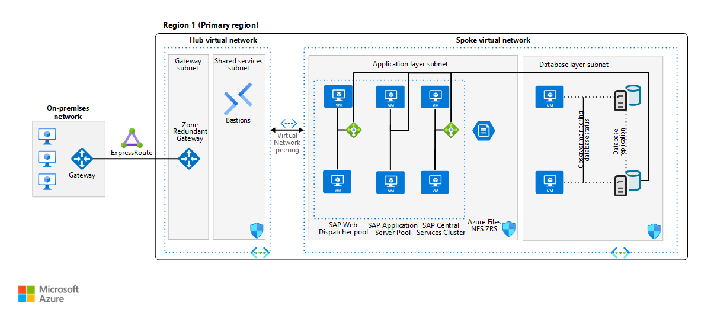
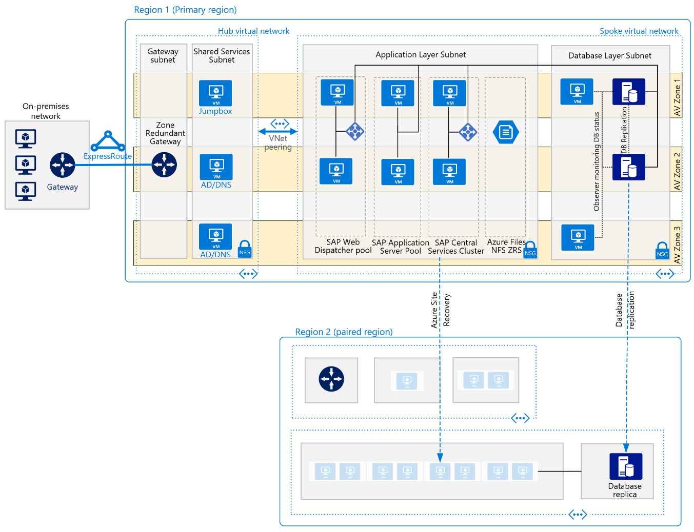

<!-- cSpell:ignore DharmeshBhagat HANA -->

This reference architecture shows a set of proven practices for running SAP NetWeaver with Oracle Database in Azure, with high availability. The architecture principles are operating system (OS) agnostic, however, unless otherwise specified, it is assumed to be based on Linux.

The first diagram shows a reference architecture for SAP on Oracle in Azure, which utilizes availability sets.

*Figure - The architecture of a production SAP system on Oracle running on Azure.*

_Download a [Visio file](https://arch-center.azureedge.net/sap-oracle-architecture-avzone.vsdx) for all architectures._

> [!NOTE]
> To deploy this reference architecture, you need the appropriate licensing of SAP products and other non-Microsoft technologies.

## Components

This reference architecture describes a typical SAP production system running on Oracle Database in Azure, in a highly available deployment to maximize system availability. The architecture and its components can be customized based on business requirements (RTO, RPO, uptime expectations, system role) and potentially reduced to a single VM. The network layout is simplified to demonstrate the architectural principals of such SAP environment and not intended to describe a full enterprise network.

### Networking

**Virtual networks** The [Azure Virtual Network](/azure/virtual-network/virtual-networks-overview) service connects Azure resources to each other with enhanced security. In this architecture, the virtual network connects to an on-premises environment via a virtual private network (VPN) gateway deployed in the hub of a [hub-spoke topology](../../reference-architectures/hybrid-networking/hub-spoke.yml). SAP applications and database are contained in their own spoke virtual network. The virtual networks are subdivided into separate subnets for each tier: application (SAP NetWeaver), the database, and shared services (like Azure Bastion).

This architecture subdivides the virtual network address space into subnets. Place application servers on a separate subnet and database servers on another. Doing so allows you to secure them more easily by managing the subnet security policies rather than the individual servers and cleanly separates security rules applicable to databases from application servers.

**Virtual network peering** This architecture uses a hub-and-spoke networking topology with multiple virtual networks that are [peered together](/azure/virtual-network/virtual-network-peering-overview). This topology provides network segmentation and isolation for services deployed on Azure. Peering enables transparent connectivity between peered virtual networks through the Microsoft backbone network. It doesn't incur a performance penalty if deployed within a single region.

**Zone-redundant gateway** A gateway connects distinct networks, extending your on-premises network to the Azure virtual network. We recommend that you use [ExpressRoute](../../reference-architectures/hybrid-networking/expressroute.yml) to create private connections that don't go over the public internet, but you can also use a [site-to-site](../../reference-architectures/hybrid-networking/expressroute.yml) connection. Azure ExpressRoute or VPN gateways can be deployed across zones to guard against zone failures. See [Zone-redundant virtual network gateways](/azure/vpn-gateway/about-zone-redundant-vnet-gateways) to understand the differences between a zonal deployment and a zone-redundant deployment.  It's worth mentioning here that the IP addresses used need to be of Standard SKU for a zone deployment of the gateways.

**Network security groups** To restrict incoming, outgoing, and intra-subnet traffic in the virtual network, create [network security groups](/azure/virtual-network/tutorial-filter-network-traffic-cli) which are in turn assigned to specific subnets. DB and application subnets are secured with workload specific NSGs.

**Application security groups** To define fine-grained network security policies inside your NSGs based on workloads that are centered on applications, use [application security groups](/azure/virtual-network/security-overview) instead of explicit IP addresses. They let you group VMs by name and help you secure applications by filtering traffic from trusted segments of your network.

**Network interface cards (NICs)** Network interface cards enable all communication among virtual machines on a virtual network. Traditional on-premises SAP deployments implement multiple NICs per machine to segregate administrative traffic from business traffic.

On Azure, the virtual network is a software-defined network that sends all traffic through the same network fabric. So it's not necessary to use multiple NICs for performance reasons. But if your organization needs to segregate traffic, you can deploy multiple NICs per VM and connect each NIC to a different subnet. You can then use network security groups to enforce different access control policies on each subnet.

Azure NICs support multiple IPs. This support conforms with the SAP recommended practice of using virtual host names for installations. For a complete outline, see [SAP note 962955](https://launchpad.support.sap.com/#/notes/962955). (To access SAP notes, you need an SAP Service Marketplace account.)

### Virtual Machines

This architecture uses virtual machines (VM). For SAP application tier, VMs are deployed for all instance roles - web dispatcher and application servers - both central services SAP (A)SCS and ERS as well as application servers (PAS, AAS). Adjust the number of virtual machines based on your requirements. The [Azure Virtual Machines planning and implementation guide](/azure/virtual-machines/workloads/sap/planning-guide) includes details about running SAP NetWeaver on virtual machines.

Similarly for all Oracle purposes virtual machines are used, both for the Oracle Database as well as Oracle observer VMs. Observer VMs in this architecture are smaller compared to actual database servers.

- **Constrained vCPU VMs** In order to potentially save cost on Oracle licensing, consider utilizing [vCPU constrained VMs](/azure/virtual-machines/constrained-vcpu)
- **Certified VM families for SAP** For details about SAP support for Azure virtual machine types and throughput metrics (SAPS), see [SAP note 1928533](https://launchpad.support.sap.com/#/notes/1928533). (To access SAP notes, you need an SAP Service Marketplace account.)

**Proximity Placement Groups (PPG)** To optimize network latency, you can use [proximity placement groups](/azure/virtual-machines/workloads/sap/sap-proximity-placement-scenarios), which favor collocation, meaning that virtual machines are in the same datacenter to minimize application latency. They can greatly improve the user experience for most SAP applications. Due to potential restrictions with PPGs, adding the database AvSet to the SAP system's PPG should be done sparsely and only when required for latency between SAP application and database traffic. For more details on the usage scenarios for PPGs see the linked documentation.

**Generation 2 (Gen2) virtual machines** Azure offers the choice when deploying VMs if they should be generation 1 or 2. [Generation 2 VMs](/azure/virtual-machines/generation-2) support key features which are not available for generation 1 VMs. Particularly for very large Oracle databases this is of importance since some VM families such as [Mv2](/azure/virtual-machines/mv2-series) or [Mdsv2](/azure/virtual-machines/msv2-mdsv2-series) are **only** supported as Gen2 VMs. Similarly, SAP on Azure certification for some newer VMs might require them to be only Gen2 for full support, even if Azure allows both on them. See details in [SAP Note 1928533 - SAP Applications on Microsoft Azure: Supported Products and Azure VM types](https://launchpad.support.sap.com/#/notes/1928533).

Since all other VMs supporting SAP allow the choice of either Gen2 only or Gen1+2 selectively, it is recommended to deploy all SAP VMs as Gen2, even if the memory requirements are very low. Even the smallest VMs once deployed as Gen2 can be scaled up to the largest available with a simple deallocate and resize. Gen1 VMs can only be resized to VM families allowed to run Gen1 VMs.

### Storage

This architecture uses [Azure managed disks](/azure/virtual-machines/windows/managed-disks-overview) for virtual machines and [Azure Files NFS](/azure/storage/files/files-nfs-protocol) or [Azure NetApp Files](/azure/azure-netapp-files/azure-netapp-files-introduction) for any NFS shared storage requirements such as sapmnt and SAP transport NFS volumes. Guidelines for storage deployment with SAP on Azure are in detail within the [Azure Storage types for SAP workload guide](/azure/virtual-machines/workloads/sap/planning-guide-storage)

- **Certified storage for SAP** Similar to certified VM types for SAP usage, observe the details in [SAP note 2015553](https://launchpad.support.sap.com/#/notes/2015553) and [SAP note 2039619](https://launchpad.support.sap.com/#/notes/2039619)
- **Storage design for SAP on Oracle** Recommended storage design for SAP on Oracle in Azure in [following documentation](/azure/virtual-machines/workloads/sap/dbms_guide_oracle) with specific guidances on file system layout, disk sizing recommendations and other storage options.
- **Storing Oracle Database files** On Linux ext4 or xfs filesystems need to be used for database, NTFS for Windows deployments. [Oracle ASM](/azure/virtual-machines/workloads/oracle/configure-oracle-asm) is also supported for Oracle deployments for Oracle Database 12c Release 2 and higher.
- **Options to managed disks** is to use [Azure NetApp Files](/azure/azure-netapp-files/azure-netapp-files-introduction) for the Oracle Database as well, the details of which are described in above mentioned [SAP note 2039619](https://launchpad.support.sap.com/#/notes/2039619) and [Oracle on Azure](/azure/virtual-machines/workloads/sap/dbms_guide_oracle) documentation. [**Azure Files NFS**](/azure/storage/files/files-nfs-protocol) volumes are not intended for storing Oracle Database files, unlike Azure NetApp Files.
- **Azure Premium SSD v2** [Azure Premium SSD v2](https://azure.microsoft.com/en-us/updates/general-availability-azure-premium-ssd-v2-disk-storage/) is generally available now.  Premium SSD v2 Disk Storage is the most advanced general purpose block storage solution available, designed for performance-critical workloads like SAP. Refer to the [Deploy a Premium SSD v2](/azure/virtual-machines/disks-deploy-premium-v2?tabs=azure-cli) article for the storage solution's benefits and its current limitation.

### High Availability

The above architecture depicts a highly available deployment, with each application layer contained on 2 or more virtual machines. Following components are used.

With Azure, SAP workload deployment can either be regional or zonal depending on the availability and resiliency requirements of the SAP applications. Azure provides [different deployment options](/azure/sap/workloads/sap-high-availability-architecture-scenarios#comparison-of-different-deployment-types-for-sap-workload) like flexible scale set with FD=1, availability zones, or availability sets to enhance the availability of the resources. To have a comprehensive understanding of the available deployment options and their applicability across different Azure regions (including across zones, within a single zone, or in a region without zones), it is important to refer to the [Azure VMs HA architecture and scenarios for SAP NetWeaver](/azure/sap/workloads/sap-high-availability-architecture-scenarios) documentation.

**Load Balancers**  [Azure Load Balancer](/azure/load-balancer/load-balancer-overview) are used to distribute traffic to virtual machines in the SAP subnets. When you incorporate Azure Load Balancer in a zonal deployment of SAP, make sure you select the Standard SKU load balancer because the Basic SKU balancer doesn't come with zonal redundancy. In a cluster

Consider the [decision factors](/azure/virtual-machines/workloads/sap/sap-ha-availability-zones#considerations-for-deploying-across-availability-zones) when deploying VMs between availability zones for SAP. Use of [proximity placement groups](/azure/virtual-machines/workloads/sap/sap-proximity-placement-scenarios) with an availability zone deployment needs to be evaluated and used only for application tier VMs.

> [!NOTE]
> Availability Zones support intra-region high availability, but they aren't effective for DR. The distances between zones are too short. Typical DR regions should be at least 100 miles away from the primary region.

**Oracle specific components** Oracle Database VMs are deployed in an availability set or in different availability zones. Each VM contains its own installation of the database software and VM-local database storage. Set up synchronous database replication through Oracle Data Guard between the databases to ensure consistency and allow low RTO & RPO service times in case if individual failures. Besides the database VMs, additional VMs with Oracle Data Guard Observer are needed for an Oracle Data Guard Fast-Start Failover setup. The Oracle observer VMs monitor the database and replication status and facilitate database failover in an automated way, without the need for any cluster manager. Database replication management can bet performed then using Oracle Data Guard Broker for ease of use.

For details on Oracle Data Guard deployment see
- [SAP whitepaper - Setting up Oracle 12c Data Guard for SAP Customers](https://www.sap.com/documents/2016/12/a67bac51-9a7c-0010-82c7-eda71af511fa.html)
- [Oracle Data Guard documentation on Azure](/azure/virtual-machines/workloads/oracle/oracle-reference-architecture#oracle-data-guard-with-fsfo)

This architecture utilizes native Oracle tooling without any actual cluster setup or the need for a load balancer in the database tier. With Oracle Data Guard Fast-Start Failover and SAP configuration, the failover process is automated and SAP applications re-connect to the new primary database should a failover occur.
Various 3rd party cluster solutions exist as an alternative, such as SIOS Protection Suite or Veritas InfoScale, details of which deployment can be found in respective 3rd party vendor's documentation respectively.

**Oracle RAC** Oracle Real Application Cluster (RAC) is currently [not certified or supported by Oracle in Azure](https://launchpad.support.sap.com/#/notes/2039619). However Oracle Data Guard technologies and architecture for high-availability can provide highly resilient SAP environments with protection against rack, data center, or regional interruptions of service.

**NFS tier** For all highly available SAP deployments, a resilient NFS tier is required to be used, providing NFS volumes for SAP transport directory, sapmnt volume for SAP binaries as well as further volumes for (A)SCS and ERS instances. 
Options to provide an NFS tier are
- [Azure Files NFS](/azure/storage/files/files-nfs-protocol) with zonal redundant storage (ZRS) - [SLES](/azure/virtual-machines/workloads/sap/high-availability-guide-suse-nfs-azure-files) and [RHEL](/azure/virtual-machines/workloads/sap/high-availability-guide-rhel-nfs-azure-files) guides
- [Azure NetApp Files](/azure/azure-netapp-files/azure-netapp-files-introduction) deployment of NFS volumes - [SLES](/azure/virtual-machines/workloads/sap/high-availability-guide-suse-netapp-files) and [RHEL](/azure/virtual-machines/workloads/sap/high-availability-guide-rhel-netapp-files) guides
- VM based NFS cluster - two additional VMs with local storage, replicated between VMs with DRBD (Distributed Replicated Block Device) - [SLES](/azure/virtual-machines/workloads/sap/high-availability-guide-suse-nfs) and [RHEL](/azure/virtual-machines/workloads/sap/high-availability-guide-rhel) guides

**SAP central services cluster** This reference architecture runs Central Services on discrete VMs. Central Services is a potential single point of failure (SPOF) when it's deployed to a single VM. To implement a highly available solution, cluster management software is needed which automates failover of (A)SCS and ERS instances to the respective VM.
As this is tied strongly with the chosen NFS solution

Chosen cluster solution requires a mechanism to decide in case of software or infrastructure unavailability which VM should serve the respective service(s). With SAP on Azure, two options are available for Linux based implementation of STONITH - how to deal with unresponsive VM or application

- _SUSE-Linux-only_ **SBD (STONITH Block Device)** - using one or three additional VMs which serve as iSCSI exports of a small block device, which is accessed regularly by the actual cluster member VMs, two (A)SCS/ERS VMs in this cluster pool. The VMs use these SBD mounts to cast votes and thus achieve quorum for cluster decisions. The architecture contained on this page does NOT contain the 1 or 3 additional SBD VMs. RedHat does not support any SBD implementations in Azure and thus this option is only available to SUSE SLES operating system.
- **Azure Fence Agent** - without utilizing additional VMs, Azure management API is used for regular checks for VM availability. 

Guides linked within the NFS tier section contain the necessary steps and design for respective cluster choice. Third party Azure certified cluster managers can be also utilized to provide high-availability of the SAP central services.

**SAP application servers pool** Two or more application servers where high availability is achieved by load-balancing requests through SAP message server or web dispatchers. Each application server is independent and there is no network load balancing required for this pool of VMs.

**SAP web dispatcher pool**
The Web Dispatcher component is used as a load balancer for SAP traffic among the SAP application servers. To achieve [high availability of the SAP Web Dispatcher](https://help.sap.com/viewer/683d6a1797a34730a6e005d1e8de6f22/201909.002/en-US/489a9a6b48c673e8e10000000a42189b.htm), Azure Load Balancer implements either the failover cluster or the parallel Web Dispatcher setup.

[Embedded Web Dispatcher](https://help.sap.com/viewer/00b4e4853ef3494da20ebcaceb181d5e/LATEST/2e708e2d42134b4baabdfeae953b24c5.html) on (A)SCS is a special option. You should take into account proper sizing because of additional workload on (A)SCS.

For internet-facing communications, we recommend a stand-alone solution in the perimeter network (also known as _DMZ_) to satisfy security concerns.

**Windows deployments** This document, as prefaced in beginning, is focused primarily with Linux based deployments. For usage with Windows, same architectural principles apply and there are no architectural differences with Oracle between Linux and Windows.

For  SAP application part, see the details in architecture guide [Run SAP NetWeaver in Windows on Azure](/azure/architecture/reference-architectures/sap/sap-netweaver).

## Considerations

### Disaster recovery

*Figure - Architecture of a production SAP system on Oracle in Azure with AvZone and DR*

_Download a [Visio file](https://arch-center.azureedge.net/sap-oracle-architecture-avzone.vsdx) for all architectures._

Every architectural layer in the SAP application stack uses a different approach to provide DR protection. For DR strategies and implementation details, refer to these 2 articles: [Disaster recovery overview and infrastructure guidelines for SAP workload](/azure/sap/workloads/disaster-recovery-overview-guide) and [Disaster recovery guidelines for SAP application](/azure/sap/workloads/disaster-recovery-sap-guide?tabs=linux).

### Backup

Backup for Oracle in Azure can be achieved through several means:
- **Azure Backup** [Azure provided and maintained scripts](/azure/backup/backup-azure-linux-database-consistent-enhanced-pre-post) for Oracle Databases, to facilitate Oracle actions pre- and post backup execution. 
- **Azure Storage** Leveraging file based database backups, for example scheduled with SAP's BR tools, to be stored and versioned as files/directories on Azure Blob NFS, Azure Blob or Azure Files storage services. See [documented details](/azure/virtual-machines/workloads/oracle/oracle-database-backup-strategies) how to achieve both Oracle data and log backups.
- **3rd party backup solutions** See architecture of your backup storage provider, supporting Oracle in Azure.

For non-database VMs, [Azure Backup for VM](/azure/backup/backup-azure-vms-introduction) is recommended to protect SAP application VMs and surround infrastructure like SAP Web Dispatcher.

## Contributors

*This article is maintained by Microsoft. It was originally written by the following contributors.*

Principal author:

* [Robert Biro](https://ch.linkedin.com/in/robert-biro-38991927) | Senior Architect

## Next steps

- [High availability for SAP NetWeaver on Azure VMs](/azure/virtual-machines/workloads/sap/high-availability-guide)
- [Azure Virtual Machines planning and implementation for SAP NetWeaver](/azure/virtual-machines/workloads/sap/planning-guide)
- [Use Azure to host and run SAP workload scenarios](/azure/virtual-machines/workloads/sap/get-started)

### Communities

Communities can answer questions and help you set up a successful deployment. Consider these resources:

- [Running SAP Applications on the Microsoft Platform blog](https://techcommunity.microsoft.com/t5/sap-on-microsoft/ct-p/SAPonMicrosoft)
- [Azure Community Support](https://azure.microsoft.com/support/forums)
- [SAP Community](https://www.sap.com/community.html)
- [Stack Overflow for SAP](http://stackoverflow.com/tags/sap/info)

## Related resources

See these articles for more information and for examples of SAP workloads that use some of the same technologies:

- [SAP NetWeaver on SQL Server](/azure/architecture/solution-ideas/articles/sap-netweaver-on-sql-server)
- [Run SAP NetWeaver in Windows on Azure](/azure/architecture/reference-architectures/sap/sap-netweaver)
- [Dev/test environments for SAP workloads on Azure](../../example-scenario/apps/sap-dev-test.yml)
