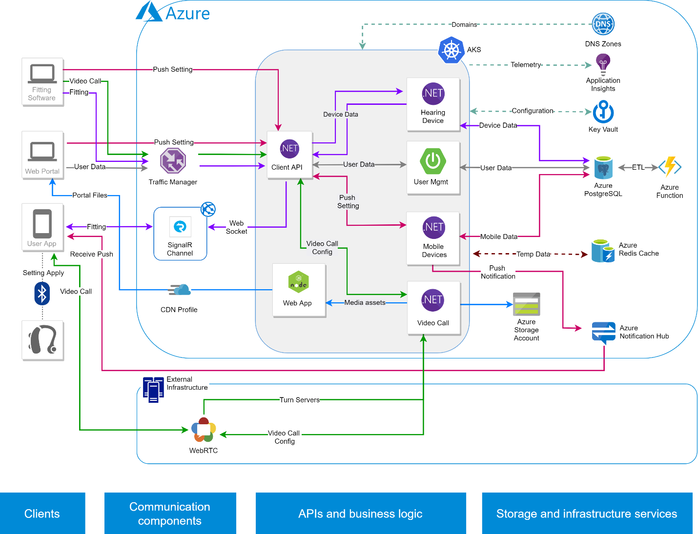

# Building a telehealth system on Azure

This article explains how to build a [telehealth system](https://en.wikipedia.org/wiki/Telehealth) using Azure cloud services. The details are based on a real customer implementation that connects a professional healthcare organization to its remote patients. While there are other ways to build such a system, the solution described has been successful in enabling communication between patients and their remote care provider, as well as remotely tuning the medical devices that patients carry.

There are about 700 million people who suffer from hearing disabilities. However, only 10% of them use hearing aid devices to improve their lives. In some geographies or situations, it is impossible for a patient to get direct assistance when needed. For example, consider patients who:

- Need help in a specific hearing situation (for example, while walking in the park, attending a party, or being at home), which cannot be reproduced in the hearing care professional's office.
- Have mobility issues or reside long distances from their hearing care professional.
- Live in an emerging country that has a limited number of hearing care professionals.

To overcome these difficulties, it is important to have the ability to provide hearing care services remotely. In this case, the healthcare professional uses chat or video communication to engage with their remote patients. The hearing-impaired person uses a smartphone to allow access to the hearing aid device during the remote session. The patient immediately experiences improved hearing as the hearing care professional deploys changes to the configuration of the hearing aid device in real time.

## Potential use cases

The following additional use cases have similar design patterns:

- Any Bluetooth-enabled device can be accessed and remotely tuned using such a solution.
- Communication (text, voice, video) or knowledge exchange (education, satisfaction surveys) in a remote setting/context.
- Globally distributed web content management.
- [Internet of Things (IoT)](https://en.wikipedia.org/wiki/Internet_of_things)

## Architecture

The solution is built on four pillars, including:

- Clients
- Communication components
- APIs and business logic
- Storage and infrastructure services

On the left side of the architectural diagram, there are clients in two groups, the healthcare professional and the patient. The healthcare professional uses the fitting software and web portal clients to communicate with their patients. The patients, on the other hand, use a mobile app that is linked to the medical device via a Bluetooth connection. This back and forth communication is achieved using backend services:

- Public facing APIs
- Internal microservices that are responsible for workflows such as video calls through Web RTC or client-to-client communication using Signal. signal is a software library for Microsoft ASP.NET that allows server code to send asynchronous notifications to client-side web applications.

The state of these services is persisted in several Azure services (on the right side of the diagram) such as Azure Database for PostgreSQL. Media files are saved in Azure storage accounts. All logs from all services are gathered in a centralized logging solution that uses Azure Application Insights. Finally, asynchronous communication can be achieved between the clients through push notifications using the help of the Azure Notification Hub.

The solution was set up in this way to:

- Benefit from the scalability of the cloud services running in the backend.
- Increase the autonomy of the teams building the solution. Each team oversees functional domains and drives the evolution of their components. Since the functional domains do not overlap, each team can innovate at its own pace. Also, since the codebases of the services are independent, the CI/CD pipeline for the entire solution is simplified.

- Build the inter-services communication and coordination mechanism required by the distribution of functionalities across microservices. The solution described in this document uses Azure Cache for Redis to accomplish this task.
- Achieve central monitoring and enhance the ability to troubleshoot the solution.

### Components

- [Azure Database for PostgreSQL](https://azure.microsoft.com/services/postgresql/) stores user (patient and health care professional) and device-related data. The service was chosen because it's stable, lightweight, and has no vendor lock-in.
- [Azure Kubernetes Service](https://azure.microsoft.com/services/kubernetes-service/) hosts the application business logic and provides ease of deployment and flexibility for customization. The service also abstracts the solution from the actual hardware used underneath.
- [Azure Cache for Redis](https://azure.microsoft.com/services/cache/) hosts temporary data used for intra service data (shared data). The service can be recreated from the database in case the data expires from the cache
- [Azure Notification Hub](https://azure.microsoft.com/services/notification-hubs/) notifies patient of incoming content: chat, video calls, device configuration settings.
- [Azure Functions](https://azure.microsoft.com/services/functions/) schedules tasks. For instance, broad communications to large set of users, coordination of analytics work in the backend (aggregations…).
- [Azure Application Insights](https://azure.microsoft.com/services/monitor/) centralizes signals/events from the system (logs, telemetry from logs from microservices, frontend, and devices) for troubleshooting purposes.
- [Azure Content Delivery Network (CDN)](https://azure.microsoft.com/services/cdn/) is used for maintenance and updates (delivery of java scripts file) to the web portal and to deliver media files (videos, images) through the portal. All this content is stored in the Azure storage accounts in the background.
- [Azure Traffic Manager](https://azure.microsoft.com/services/traffic-manager/) load balances between geo locations.
- [Azure SignalR](https://docs.microsoft.com/azure/azure-signalr/signalr-overview) allows server code to send asynchronous notifications to client-side web applications. End-user devices can be configured in either ## Standard##  or ## Advanced##  mode.

### Standard mode

In Standard mode, the fitting software prepares a notification, which contains some configuration JSON file or content for the device. The notification is then passed to Azure Notification Hub, which pushes the notification to the user's phone.

### Advanced mode

In Advanced mode, the hearing aid professional uses the fitting software to push detailed configuration to the device. This requires a stable and reliable connection between the backend and the device, which SignalR achieves by using WebSockets. The end user's phone is on the receiving end of this channel. From the phone, the Bluetooth connection establishes the final communication link with the device.

## Alternatives

On the database side, any other PaaS database services could be used. For hosting the application logic, rather that Azure Kubernetes Service, Azure Application Service or Azure Service Fabric could be used.

## Learnings

We recommend using a traffic manager in front of the different clusters to optimize for latency between regions and as a fallback mechanism should the clusters become unavailable. For the databases, we recommend using read-only replicas for queries that require loading and aggregating a large amount of data. We recommend delivering static web files (.html, .js, images, etc.) globally using a content delivery network (CDN) to improve speed through caching.

### Deployment

The most important aspect to consider when deploying this scenario is the coordination of deployments across the cloud-based backend and the frontend (phones/devices). Consider using the concept of a [feature flag](/azure/devops/migrate/phase-features-with-feature-flags?view=azure-devops) to achieve this.

### Management

To better align to the idea of having each functional domain dealt with using a specific microservice, long term, there is an opportunity to split the database into several smaller databases. Doing so will enable the principle isolation and autonomy of the flow related to each microservice as opposed to concentrating the data related to all services into a single database. Achieving this goal will require automating provisioning and managing those databases, which is one of the core capabilities of a PaaS database service in the cloud. That database management layer should be integrated in the solution as well as into the unified monitoring solution.

### Monitoring

It is important to monitor each of the tiers, and each monitoring facet should be federated into a single bucket in the cloud. It is important to enable the correlation of all these logs and telemetry data points to ensure holistic insights across components and layers.

Today, monitored layers include the:

- Windows application (fitting software on the hearing care professional's desktop)
- Hosted application logic
- Cloud services

### Sizing and scaling

Make sure to optimize the configuration of the Azure Kubernetes clusters to match the scale requirements that fluctuate with the time of the day or regional patterns. Consider offloading read workloads (such as aggregating queries) by using Read Replicas in Azure Database for PostgreSQL.

Using the TimescaleDB extension of PostgreSQL will enable more efficient handling of the time-related data coming from the medical devices. Consider using a scale out solution such as Azure Database for PostgreSQL – Hyperscale (Citus) to reach global scale by provisioning multiple database nodes.

## Security and compliance

This solution handles PHI and personal data. As such, it is important to use services that are certified for medical applications (HIPAA certifications, not only for the data that remains in the database but also the logs and telemetry data). For details please consult the [HIPAA section](https://www.microsoft.com/TrustCenter/Compliance/HIPAA) of the Microsoft Trust Center.

## Pricing

For a deployment in a single region, example pricing information is available in the [Pricing Calculator](https://www.azure.com/e/af6719a5700844aab6c8917b4908b8ab)

## Next steps

To get started with implementing a comparable architecture for your business, consider building skills around web services, databases (such as [Azure Database for PostgreSQL](/azure/postgresql/)), and mobile/phone application development techniques and technologies (such as [Xamarin](/xamarin/), [.Net Core](/dotnet/core/), etc.).

## Related resources

### Real-time communications

More information about how WebRTC provides real-time communication capabilities to mobile applications is available on the [WebRTC project site](https://webrtc.org/).

### Turn servers

Use a client library such as [Icelink](https://www.frozenmountain.com/products-services/icelink/) (loaded by the application on the phone and by the fitting software of the desktop of the hearing aid professional) to manage the turn servers\* and the types of connection (tcp, udp, p2p) between the two clients (fitting software and application on the phone). The client library:

- Creates the streaming channel
- Establishes the connections
- Manages the connection in case of errors, missing packets, automatically adjusts the streaming to the variations of the bandwidth
- Encode/decodes the calls (audio and/or video) during the calls

\*Turn servers are network entities in charge of relaying media in VoIP related protocols. In this solution they are hosted by [https://xirsys.com/](https://xirsys.com/) in several datacenters worldwide. Establishes direct connection between two clients under the same session.
