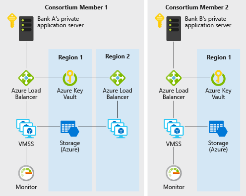
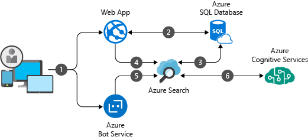
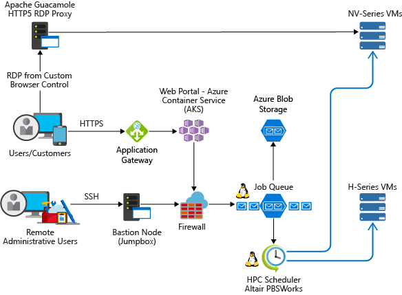
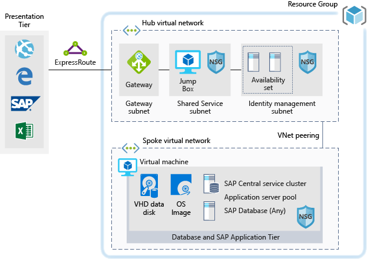
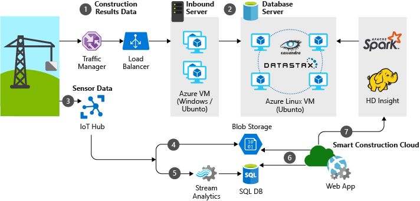
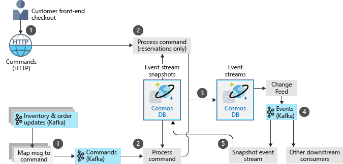
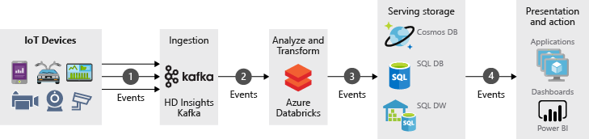
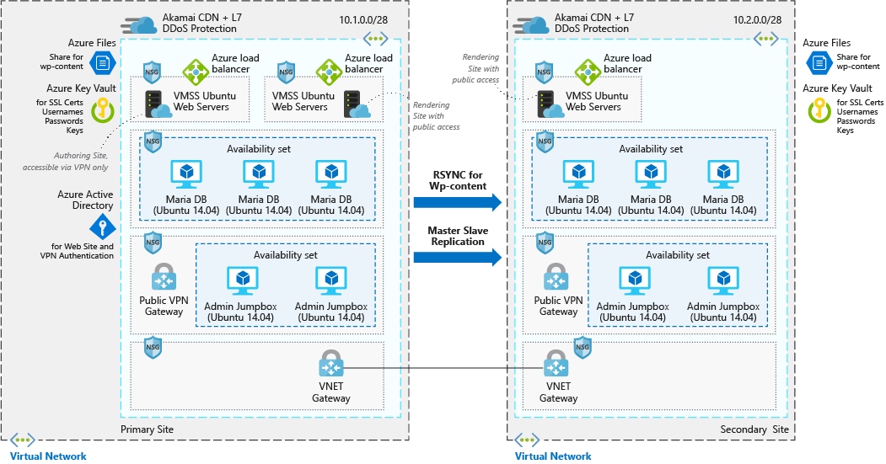

## AI Scenarios

<ul  class="panelContent cardsC">
<li style="display: flex; flex-direction: column;">
    <a href="./ai/intelligent-apps-image-processing.md" style="display: flex; flex-direction: column; flex: 1 0 auto;">
        

            

                

                    

                        

                            
                        

                    

                    

                        <h3>Image classification for insurance claims on Azure</h3>
                        
Proven scenario for building image processing into your Azure applications.

                    

                

            

        

    </a>
</li>
</ul>

## Application Scenarios

<ul  class="panelContent cardsC">
<li style="display: flex; flex-direction: column;">
    <a href="./apps/apim-api-scenario.md" style="display: flex; flex-direction: column; flex: 1 0 auto;">
        

            

                

                    

                        

                            
                        

                    

                    

                        <h3>Migrating a Legacy Web Application to an API-based Architecture on Azure</h3>
                        
An scenario based approach on to use Azure API Management to modernize a legacy web application.

                    

                

            

        

    </a>
</li>
<li style="display: flex; flex-direction: column;">
    <a href="./apps/app-monitoring.md" style="display: flex; flex-direction: column; flex: 1 0 auto;">
        

            

                

                    

                        

                            
                        

                    

                    

                        <h3>Web Application Monitoring on Azure</h3>
                        
This example scenario is relevant to organizations that want to monitor their application hosted in Azure App Service.

                    

                

            

        

    </a>
</li>
<li style="display: flex; flex-direction: column;">
    <a href="./apps/commerce-chatbot.md" style="display: flex; flex-direction: column; flex: 1 0 auto;">
        

            

                

                    

                        

                            
                        

                    

                    

                        <h3>Conversational chatbot for hotel reservations on Azure</h3>
                        
Proven scenario for building a conversational chatbot for commerce applications with Azure Bot Service, Cognitive Services and LUIS, Azure SQL Database, and Application Insights.

                    

                

            

        

    </a>
</li>
<li style="display: flex; flex-direction: column;">
    <a href="./apps/decentralized-trust.md" style="display: flex; flex-direction: column; flex: 1 0 auto;">
        

            

                

                    

                        

                            
                        

                    

                    

                        <h3>Decentralized trust between banks on Azure</h3>
                        
A scenario where a consortiurm of banks can establish a trusted environment for communication and information sharing without resorting to a centralized database

                    

                

            

        

    </a>
</li>
<li style="display: flex; flex-direction: column;">
    <a href="./apps/devops-dotnet-webapp.md" style="display: flex; flex-direction: column; flex: 1 0 auto;">
        

            

                

                    

                        

                            
                        

                    

                    

                        <h3>CI/CD pipeline with VSTS</h3>
                        
An example of building and releasing a .NET App to Azure Web Apps

                    

                

            

        

    </a>
</li>
<li style="display: flex; flex-direction: column;">
    <a href="./apps/devops-with-aks.md" style="display: flex; flex-direction: column; flex: 1 0 auto;">
        

            

                

                    

                        

                            
                        

                    

                    

                        <h3>CI/CD pipeline for container-based workloads</h3>
                        
Proven scenario for building a DevOps pipeline for a Node.js web app that uses Jenkins, Azure Container Registry, Azure Kubernetes Service, Cosmos DB, and Grafana.

                    

                

            

        

    </a>
</li>
<li style="display: flex; flex-direction: column;">
    <a href="./apps/ecommerce-scenario.md" style="display: flex; flex-direction: column; flex: 1 0 auto;">
        

            

                

                    

                        

                            
                        

                    

                    

                        <h3>E-Commerce front-end on Azure</h3>
                        
Proven scenario of hosting an e-commerce site on Azure

                    

                

            

        

    </a>
</li>
<li style="display: flex; flex-direction: column;">
    <a href="./apps/ecommerce-search.md" style="display: flex; flex-direction: column; flex: 1 0 auto;">
        

            

                

                    

                        

                            
                        

                    

                    

                        <h3>Intelligent product search engine for E-commerce</h3>
                        
Shows an example scenario where Azure Search is used to provide a world-class search experience in an e-commerce application

                    

                

            

        

    </a>
</li>
<li style="display: flex; flex-direction: column;">
    <a href="./apps/hpc-saas.md" style="display: flex; flex-direction: column; flex: 1 0 auto;">
        

            

                

                    

                        

                            
                        

                    

                    

                        <h3>Computer-Aided Engineering (CAE) SaaS Platform on Azure</h3>
                        
This scenario demonstrates best practices for run a Computer-aided engineering (CAE) software-as-a-service (SaaS) platform on Azure

                    

                

            

        

    </a>
</li>
<li style="display: flex; flex-direction: column;">
    <a href="./apps/sap-dev-test.md" style="display: flex; flex-direction: column; flex: 1 0 auto;">
        

            

                

                    

                        

                            
                        

                    

                    

                        <h3>Dev/test enviroments for SAP workloads on Azure</h3>
                        
An example scenario for building dev/test environments for SAP workloads.

                    

                

            

        

    </a>
</li>
<li style="display: flex; flex-direction: column;">
    <a href="./apps/sap-production.md" style="display: flex; flex-direction: column; flex: 1 0 auto;">
        

            

                

                    

                        

                            
                        

                    

                    

                        <h3>Running SAP in Production using an Oracle Database on Azure</h3>
                        
An example scenario showing an SAP production deployment in Azure using an Oracle database.

                    

                

            

        

    </a>
</li>
</ul>

## Data Scenarios

<ul  class="panelContent cardsC">
<li style="display: flex; flex-direction: column;">
    <a href="./data/big-data-with-iot.md" style="display: flex; flex-direction: column; flex: 1 0 auto;">
        

            

                

                    

                        

                            
                        

                    

                    

                        <h3>IoT and data analytics in the construction industry</h3>
                        
Use IoT devices and data analytics to provide comprehensive management and operation of construction projects.

                    

                

            

        

    </a>
</li>
<li style="display: flex; flex-direction: column;">
    <a href="./data/data-warehouse.md" style="display: flex; flex-direction: column; flex: 1 0 auto;">
        

            

                

                    

                        

                            
                        

                    

                    

                        <h3>Data warehousing and analytics for sales and marketing</h3>
                        
Use a data warehouse in Azure to consolidate data from multiple sources and optimize data analytics.

                    

                

            

        

    </a>
</li>
<li style="display: flex; flex-direction: column;">
    <a href="./data/ecommerce-order-processing.md" style="display: flex; flex-direction: column; flex: 1 0 auto;">
        

            

                

                    

                        

                            
                        

                    

                    

                        <h3>Scalable order processing on Azure</h3>
                        
Example scenario for building a highly scalable order processing pipeline using Azure Cosmos DB.

                    

                

            

        

    </a>
</li>
<li style="display: flex; flex-direction: column;">
    <a href="./data/fraud-detection.md" style="display: flex; flex-direction: column; flex: 1 0 auto;">
        

            

                

                    

                        

                            
                        

                    

                    

                        <h3>Real-time fraud detection on Azure</h3>
                        
Proven scenario for detecting fraudulent activity in real-time using Azure Event Hubs and Stream Analytics.

                    

                

            

        

    </a>
</li>
<li style="display: flex; flex-direction: column;">
    <a href="./data/realtime-analytics-vehicle-iot.md" style="display: flex; flex-direction: column; flex: 1 0 auto;">
        

            

                

                    

                        

                            
                        

                    

                    

                        <h3>Ingestion and Processing of real-time automotive IOT data</h3>
                        
Big Data processing pipeline to ingest and process real-time IoT Data from vehicles.

                    

                

            

        

    </a>
</li>
</ul>

## Infrastructure Scenarios

<ul  class="panelContent cardsC">
<li style="display: flex; flex-direction: column;">
    <a href="./infrastructure/ServiceFabricMicroservices.md" style="display: flex; flex-direction: column; flex: 1 0 auto;">
        

            

                

                    

                        

                            
                        

                    

                    

                        <h3>Using Service Fabric to break up monolithic applications</h3>
                        
A scenario for decomposing a large monolithic application into microservices

                    

                

            

        

    </a>
</li>
<li style="display: flex; flex-direction: column;">
    <a href="./infrastructure/hpc-cfd.md" style="display: flex; flex-direction: column; flex: 1 0 auto;">
        

            

                

                    

                        

                            
                        

                    

                    

                        <h3>Running Computational Fluid Dynamics (CFD) on Azure</h3>
                        
Sample solution describing how to run Computational Fluid Dynamics (CFD) on Azure

                    

                

            

        

    </a>
</li>
<li style="display: flex; flex-direction: column;">
    <a href="./infrastructure/linux-vdi-citrix.md" style="display: flex; flex-direction: column; flex: 1 0 auto;">
        

            

                

                    

                        

                            
                        

                    

                    

                        <h3>Linux Virtual Desktops with Citrix</h3>
                        
Proven scenario for building a VDI environment for Linux Desktops using Citrix on Azure.

                    

                

            

        

    </a>
</li>
<li style="display: flex; flex-direction: column;">
    <a href="./infrastructure/regulated-multitier-app.md" style="display: flex; flex-direction: column; flex: 1 0 auto;">
        

            

                

                    

                        

                            
                        

                    

                    

                        <h3>Secure Windows web application for regulated industries</h3>
                        
Proven scenario for building a secure, multi-tier web application with Windows Server on Azure that uses scale sets, Application Gateway, and load balancers.

                    

                

            

        

    </a>
</li>
<li style="display: flex; flex-direction: column;">
    <a href="./infrastructure/video-rendering.md" style="display: flex; flex-direction: column; flex: 1 0 auto;">
        

            

                

                    

                        

                            
                        

                    

                    

                        <h3>3D video rendering on Azure</h3>
                        
Running native HPC workloads in Azure using the Azure Batch service

                    

                

            

        

    </a>
</li>
<li style="display: flex; flex-direction: column;">
    <a href="./infrastructure/wordpress.md" style="display: flex; flex-direction: column; flex: 1 0 auto;">
        

            

                

                    

                        

                            
                        

                    

                    

                        <h3>Highly scalable and secure WordPress website</h3>
                        
Proven scenario for building a highly scalable and secure WordPress website for media events

                    

                

            

        

    </a>
</li>
</ul>

