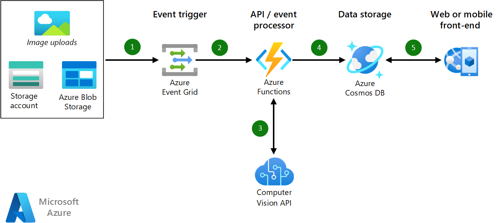

## AI Scenarios

<ul  class="panelContent cardsC">
<li style="display: flex; flex-direction: column;">
    <a href="./ai/commerce-chatbot.md" style="display: flex; flex-direction: column; flex: 1 0 auto;">
        

            

                

                    

                        

                            
                        

                    

                    

                        <h3>Conversational chatbot for hotel reservations on Azure</h3>
                        
Build a conversational chatbot for commerce applications with Azure Bot Service.

                    

                

            

        

    </a>
</li>
<li style="display: flex; flex-direction: column;">
    <a href="./ai/intelligent-apps-image-processing.md" style="display: flex; flex-direction: column; flex: 1 0 auto;">
        

            

                

                    

                        

                            
                        

                    

                    

                        <h3>Image classification for insurance claims on Azure</h3>
                        
Build image processing into your Azure applications.

                    

                

            

        

    </a>
</li>
</ul>

## Application Scenarios

<ul  class="panelContent cardsC">
<li style="display: flex; flex-direction: column;">
    <a href="./apps/apim-api-scenario.md" style="display: flex; flex-direction: column; flex: 1 0 auto;">
        

            

                

                    

                        

                            
                        

                    

                    

                        <h3>Migrating a legacy web application to an API-based architecture on Azure</h3>
                        
Use Azure API Management to modernize a legacy web application.

                    

                

            

        

    </a>
</li>
<li style="display: flex; flex-direction: column;">
    <a href="./apps/app-monitoring.md" style="display: flex; flex-direction: column; flex: 1 0 auto;">
        

            

                

                    

                        

                            
                        

                    

                    

                        <h3>Web application monitoring on Azure</h3>
                        
Monitor a web application hosted in Azure App Service.

                    

                

            

        

    </a>
</li>
<li style="display: flex; flex-direction: column;">
    <a href="./apps/decentralized-trust.md" style="display: flex; flex-direction: column; flex: 1 0 auto;">
        

            

                

                    

                        

                            
                        

                    

                    

                        <h3>Decentralized trust between banks on Azure</h3>
                        
Establish a trusted environment for communication and information sharing without resorting to a centralized database.

                    

                

            

        

    </a>
</li>
<li style="display: flex; flex-direction: column;">
    <a href="./apps/devops-dotnet-webapp.md" style="display: flex; flex-direction: column; flex: 1 0 auto;">
        

            

                

                    

                        

                            
                        

                    

                    

                        <h3>CI/CD pipeline with Azure DevOps</h3>
                        
Build and release a .NET app to Azure Web Apps using Azure DevOps.

                    

                

            

        

    </a>
</li>
<li style="display: flex; flex-direction: column;">
    <a href="./apps/devops-with-aks.md" style="display: flex; flex-direction: column; flex: 1 0 auto;">
        

            

                

                    

                        

                            
                        

                    

                    

                        <h3>CI/CD pipeline for container-based workloads</h3>
                        
Build a DevOps pipeline for a Node.js web app with Jenkins, Azure Container Registry, Azure Kubernetes Service, Cosmos DB, and Grafana.

                    

                

            

        

    </a>
</li>
<li style="display: flex; flex-direction: column;">
    <a href="./apps/ecommerce-scenario.md" style="display: flex; flex-direction: column; flex: 1 0 auto;">
        

            

                

                    

                        

                            
                        

                    

                    

                        <h3>E-commerce front end on Azure</h3>
                        
Host an e-commerce site on Azure.

                    

                

            

        

    </a>
</li>
<li style="display: flex; flex-direction: column;">
    <a href="./apps/ecommerce-search.md" style="display: flex; flex-direction: column; flex: 1 0 auto;">
        

            

                

                    

                        

                            
                        

                    

                    

                        <h3>Intelligent product search engine for e-commerce</h3>
                        
Provide a world-class search experience in an e-commerce application.

                    

                

            

        

    </a>
</li>
<li style="display: flex; flex-direction: column;">
    <a href="./apps/hpc-saas.md" style="display: flex; flex-direction: column; flex: 1 0 auto;">
        

            

                

                    

                        

                            
                        

                    

                    

                        <h3>A computer-aided engineering service on Azure</h3>
                        
Provide a software-as-a-service (SaaS) platform for computer-aided engineering (CAE) on Azure.

                    

                

            

        

    </a>
</li>
<li style="display: flex; flex-direction: column;">
    <a href="./apps/sap-dev-test.md" style="display: flex; flex-direction: column; flex: 1 0 auto;">
        

            

                

                    

                        

                            
                        

                    

                    

                        <h3>Dev/test enviroments for SAP workloads on Azure</h3>
                        
Build a dev/test environment for SAP workloads.

                    

                

            

        

    </a>
</li>
<li style="display: flex; flex-direction: column;">
    <a href="./apps/sap-production.md" style="display: flex; flex-direction: column; flex: 1 0 auto;">
        

            

                

                    

                        

                            
                        

                    

                    

                        <h3>Running SAP production workloads using an Oracle database on Azure</h3>
                        
Run an SAP production deployment in Azure using an Oracle database.

                    

                

            

        

    </a>
</li>
</ul>

## Data Scenarios

<ul  class="panelContent cardsC">
<li style="display: flex; flex-direction: column;">
    <a href="./data/big-data-with-iot.md" style="display: flex; flex-direction: column; flex: 1 0 auto;">
        

            

                

                    

                        

                            
                        

                    

                    

                        <h3>IoT and data analytics in the construction industry</h3>
                        
Use IoT devices and data analytics to provide comprehensive management and operation of construction projects.

                    

                

            

        

    </a>
</li>
<li style="display: flex; flex-direction: column;">
    <a href="./data/data-warehouse.md" style="display: flex; flex-direction: column; flex: 1 0 auto;">
        

            

                

                    

                        

                            
                        

                    

                    

                        <h3>Data warehousing and analytics for sales and marketing</h3>
                        
Consolidate data from multiple sources and optimize data analytics.

                    

                

            

        

    </a>
</li>
<li style="display: flex; flex-direction: column;">
    <a href="./data/ecommerce-order-processing.md" style="display: flex; flex-direction: column; flex: 1 0 auto;">
        

            

                

                    

                        

                            
                        

                    

                    

                        <h3>Scalable order processing on Azure</h3>
                        
Build a highly scalable order processing pipeline using Azure Cosmos DB.

                    

                

            

        

    </a>
</li>
<li style="display: flex; flex-direction: column;">
    <a href="./data/fraud-detection.md" style="display: flex; flex-direction: column; flex: 1 0 auto;">
        

            

                

                    

                        

                            
                        

                    

                    

                        <h3>Real-time fraud detection on Azure</h3>
                        
Detect fraudulent activity in real-time using Azure Event Hubs and Stream Analytics.

                    

                

            

        

    </a>
</li>
<li style="display: flex; flex-direction: column;">
    <a href="./data/realtime-analytics-vehicle-iot.md" style="display: flex; flex-direction: column; flex: 1 0 auto;">
        

            

                

                    

                        

                            
                        

                    

                    

                        <h3>Ingestion and processing of real-time automotive IoT data</h3>
                        
Ingest and process real-time vehicle data using IoT.

                    

                

            

        

    </a>
</li>
</ul>

## Infrastructure Scenarios

<ul  class="panelContent cardsC">
<li style="display: flex; flex-direction: column;">
    <a href="./infrastructure/hpc-cfd.md" style="display: flex; flex-direction: column; flex: 1 0 auto;">
        

            

                

                    

                        

                            
                        

                    

                    

                        <h3>Running computational fluid dynamics (CFD) simulations on Azure</h3>
                        
Execute computational fluid dynamics (CFD) simulations on Azure.

                    

                

            

        

    </a>
</li>
<li style="display: flex; flex-direction: column;">
    <a href="./infrastructure/linux-vdi-citrix.md" style="display: flex; flex-direction: column; flex: 1 0 auto;">
        

            

                

                    

                        

                            
                        

                    

                    

                        <h3>Linux virtual desktops with Citrix</h3>
                        
Build a VDI environment for Linux Desktops using Citrix on Azure.

                    

                

            

        

    </a>
</li>
<li style="display: flex; flex-direction: column;">
    <a href="./infrastructure/regulated-multitier-app.md" style="display: flex; flex-direction: column; flex: 1 0 auto;">
        

            

                

                    

                        

                            
                        

                    

                    

                        <h3>Secure Windows web application for regulated industries</h3>
                        
Build a secure, multi-tier web application with Windows Server on Azure using scale sets, Application Gateway, and load balancers.

                    

                

            

        

    </a>
</li>
<li style="display: flex; flex-direction: column;">
    <a href="./infrastructure/service-fabric-microservices.md" style="display: flex; flex-direction: column; flex: 1 0 auto;">
        

            

                

                    

                        

                            
                        

                    

                    

                        <h3>Using Service Fabric to decompose monolithic applications</h3>
                        
Decompose a large monolithic application into microservices.

                    

                

            

        

    </a>
</li>
<li style="display: flex; flex-direction: column;">
    <a href="./infrastructure/video-rendering.md" style="display: flex; flex-direction: column; flex: 1 0 auto;">
        

            

                

                    

                        

                            
                        

                    

                    

                        <h3>3D video rendering on Azure</h3>
                        
Run native HPC workloads in Azure using the Azure Batch service.

                    

                

            

        

    </a>
</li>
<li style="display: flex; flex-direction: column;">
    <a href="./infrastructure/wordpress.md" style="display: flex; flex-direction: column; flex: 1 0 auto;">
        

            

                

                    

                        

                            
                        

                    

                    

                        <h3>Highly scalable and secure WordPress websites on Azure</h3>
                        
Build a highly scalable and secure WordPress website for media events.

                    

                

            

        

    </a>
</li>
</ul>

