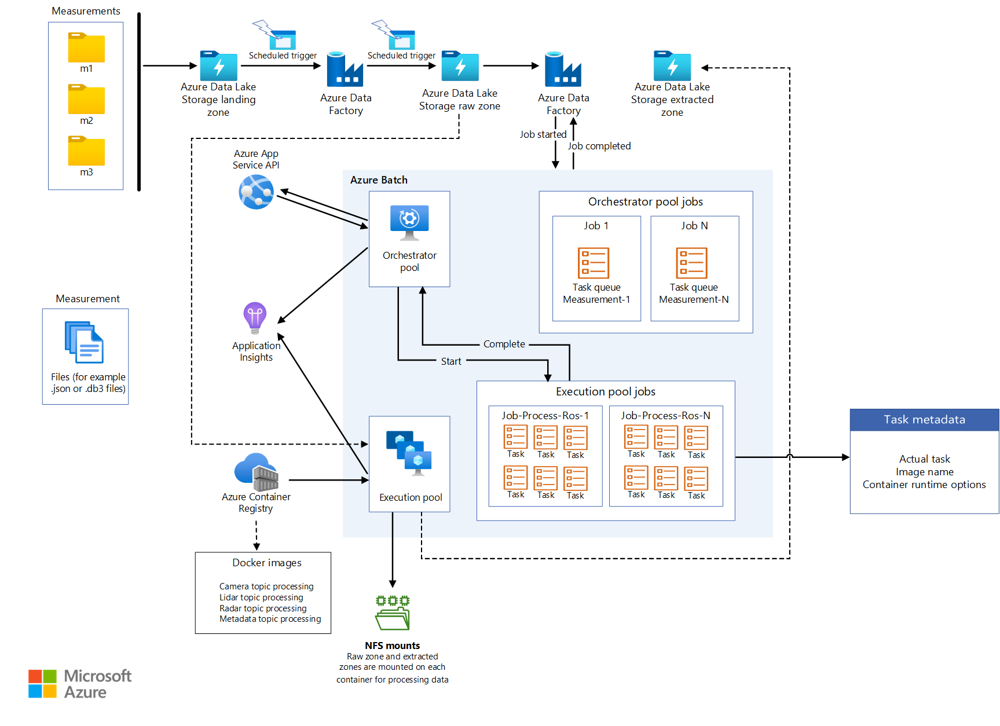
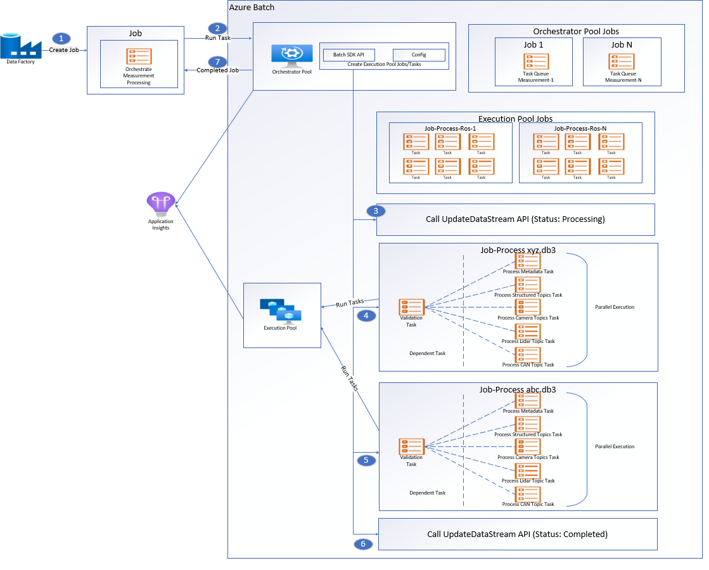

This architecture provides guidance and recommendations for developing offline data operations and data management (DataOps) for an automated driving solution. DataOps reference architecture is built upon the framework outlined in the [AVOps Design Guide](https://learn.microsoft.com/en-us/azure/architecture/guide/machine-learning/avops-design-guide). 
 DataOps is one of the building blocks of AVOps, in addition to MLOps, ValOps, DevOps and Centralized AVOps functions. 

## Scenario Details
Designing a robust DataOps framework for autonomous vehicles is crucial for efficient use, lineage, and the ability to serve data throughout the organization. Without a well-designed DataOps process, the massive amount of data generated by autonomous vehicles can quickly become overwhelming and difficult to manage.

Organizations implementing an effective DataOps strategy can ensure that their data is properly stored, easily accessible, and has a clear lineage. In turn, organizations can make it easier to manage and analyze the data, leading to more informed decision-making and improved vehicle performance.

Moreover, an efficient DataOps process allows for the easy distribution of data throughout the organization, enabling various teams to access the information they need to optimize their operations. DataOps makes it easier to collaborate and share insights, improving the overall effectiveness of the organization.

Overall, a well-designed DataOps framework is essential for the efficient and effective use of data generated by autonomous vehicles. It ensures that the data is properly managed, easily accessible, and can be shared throughout the organization, leading to better decision-making and improved performance. 

Typical challenges for data operations in context of autonomous vehicles:

- Daily terabyte/petabyte data volume from R&D vehicles (measurement data)
- Data sharing and collaboration across multiple teams and partners (labeling, annotations, quality checks)
- Traceability and lineage for safety-critical perception stack (capturing versioning and lineage of measurement data)
- Meta-data and data discovery to improve semantic segmentation, image classification, and object detection models.

The AVOps DataOps reference architecture provides guidance how to address and solve these challenges.
## Architecture


*Download a [Visio file](https://arch-center.azureedge.net/dataops-architecture.vsdx) that contains the architecture diagrams in this article.*

## Data Flow
1. Measurement data comes from data streams for sensors like cameras, radar, ultrasound, lidar, and vehicle telemetry. Data loggers in the vehicle store measurement data on logger storage devices. The logger storage data is then uploaded to the landing data lake. A service like [Azure Data Box](/azure/databox/) or [Azure Stack Edge](/azure/databox-online/), or a dedicated connection like [Azure ExpressRoute](/azure/expressroute/), ingests data into Azure.  Measurement data in formats such as MDF4, TDMS, Rosbag land in [Azure Data Lake](/azure/storage/blobs/data-lake-storage-introduction) via a dedicated storage account called "Landing". The Landing storage account into which all the measurements from the vehicles are uploaded and validated. Only valid measurements are copied over the "Raw" storage account and raw data streams are created for them. Validation and data quality checks, like checksum, are performed to remove low quality data. 
1. Once data is available at the Landing storage account, an [Azure Data Factory](/azure/data-factory/introduction) pipeline is triggered at the scheduled interval to process the data. The [Azure Data Factory](/azure/data-factory/introduction) pipeline does the following functions:
    - Perform a data quality check such as a checksum early in the data pipeline to ensure only quality data passes through to the next stage.   Code to perform data quality checks is executed by calling a service using [Azure App Services](https://learn.microsoft.com/azure/app-service/overview).  Data that is deemed incomplete are archived for future processing.  
    - Lineage Tracking: Pipeline calls the Metadata API using [Azure App Services](https://learn.microsoft.com/azure/app-service/overview) to update the metadata in [Azure Cosmos DB](/azure/cosmos-db) to create a new datastream. For each measurement, there's a datastream of type “Raw”
    - Once the Metadata API creates the datastream, the data is copied to the Raw Zone storage account in  [Azure Data Lake](/azure/storage/blobs/data-lake-storage-introduction). The data in the Raw folder has a hierarchical structure
    ```
        raw/YYYY/MM/DD/VIN/MeasurementID/DatastreamID  
    ```
    - Once all the data is copied to the Raw folder, another call to Metadata API is made to mark the datastream as “Complete” so the datastream can be consumed further.  
    - Once all measurement files are copied, the measurements are archived and removed from the Landing storage account.  
1. The data in the Raw zone is still in a raw format such as [Rosbag](http://wiki.ros.org/rosbag) format and need to be extracted so the downstream systems can consume them.  
    
    [Azure Data Factory](/azure/data-factory/introduction) and [Azure Batch](/azure/batch/) process the files from the Raw zone.  Code executed in [Azure Batch](/azure/batch/) reads the data from the topics in the Raw file and outputs the data into the selected topics into the respective folders.  

    The files in the Raw zone can each be more than 2 GB in size. For each file, we have to run parallel processing extraction functions to extract topics such as image processing, Lidar, Radar, GPS, and metadata processing. In addition to the topic extraction, there's a need down sample the data to reduce the amount of data to label/annotate. [Azure Data Factory](/azure/data-factory/introduction) and [Azure batch](/azure/batch/) provides a way to perform parallelism in a scalable manner.

    The structure in the Extracted Zone storage account should also utilize a hierarchical similar to the Raw Zone storage account. 
    ```
        extracted/YYYY/MM/DD/VIN/MeasurementID/DatastreamID 
    ```
    Utilizing the example hierarchical structure allows organizations to utilize the hierarchical namespace capability of [Azure Data Lake](/azure/storage/blobs/data-lake-storage-introduction).  The hierarchical structure allows organizations to create a scalable and cost effective object storage.  In turn, the structure also improves efficiency of the object search and retrieval. Partitioning by year and vehicle ID makes it easier to search for the relevant images from the corresponding vehicles.  A storage container for each sensor  like camera, gps, lidar, and radar are created.  
1. If data from the vehicle logger isn't synchronized across the different sensors, then another step is required in the architecture to synchronize the data to create a valid dataset.  [Azure Data Factory](/azure/data-factory/introduction) pipeline triggers synchronization of data across sensors where the synchronization algorithm shall be run on [Azure batch](/azure/batch/). If the synchronization was already executed on the vehicle logger, then this step can be skipped.
1. The next phase is to enrich the data with other data or telemetry that has been collected via telemetry or through the vehicle logger.  This step helps to enhance the richness of the data collected and provides more insights for the Data Scientist to utilize in their algorithm development as an example. 
 [Azure Data Factory](/azure/data-factory/introduction) pipeline is triggered for further enriching the data with Weather, maps or objects. Data generated can be kept in Parquet files to relate with the synchronized data. Metadata about the enriched data is also stored in Metadata store.  
1. [Azure Data Factory](/azure/data-factory/introduction) pipeline for scene detection. Scene Metadata is kept in the metadata store while scenes themselves as objects can be stored in Parquet or Delta files.
1. Third-party partners can be utilized in the next phase to perform labeling regardless of via manually or via auto labeling. The data is shared securely to Third-party partners via [Azure Data Share](/azure/data-share/) and integrated in Microsoft Purview.  [Azure Data Share](/azure/data-share/) allows organizations to securely share data without the need for extra data copying (snapshot).  Once labeling is performed, the data can again be shared back with the organization via [Azure Data Share](/azure/data-share/).  [Azure Data Share](/azure/data-share/) shares data back to the organization into a dedicated storage account named Labeled in [Azure Data Lake](/azure/storage/blobs/data-lake-storage-introduction).
    
     Labeled data sets are provided to further [MLOps](#mlops) processes.  [MLOps](#mlops) is used by organizations to create specialized algorithms such as perception and sensor fusion models. The algorithms can be used to detect scenes such as the ability to detect lane changes, blocked roads, pedestrian, traffic lights, and traffic signs. [COCO Datasets](https://cocodataset.org/#home) or [ASAM OpenLabel Datasets](https://www.asam.net/standards/detail/openlabel/) are recommended formats for label data exchange.

1. The Metadata store in [Azure Cosmos DB](/azure/cosmos-db) is used to store metadata about measurements (drive data), lineage of data as it goes through each process of extraction, down sampling, synchronization, enrichment and scene detection. Metadata about enrichment and scene's detected.
Metadata API is used to access measurements, Lineage, scenes and find out where data is stored.
The metadata API thus becomes the storage layer manager, which can spread data across storage accounts and helps the developer finding out data location using metadata based search. For that reason, the Metadata store is a centralized component to keep traceability and lineage across the entire AD data flow. 

1. [Azure Databricks](https://azure.microsoft.com/products/databricks/) / [Azure Synapse](/azure/synapase) to connect with Metadata API and access the Azure data lake storage and research on the data.

## Components
* [Data Box](https://azure.microsoft.com/products/databox) is used to transfer collected vehicle data to Azure via a regional carrier.
* [ExpressRoute](https://azure.microsoft.com/products/expressroute) extends the on-premises network into the Microsoft cloud over a private connection.
* [Azure Data Lake Storage](https://azure.microsoft.com/products/storage/data-lake-storage) stores data based on stages, for example, raw or extracted.
* [Azure Data Factory](https://azure.microsoft.com/products/data-factory) performs ETL via [batch compute](/azure/batch/) and creates data-driven workflows for orchestrating data movement and transforming data.
* [Azure Batch](https://azure.microsoft.com/products/batch) runs large-scale applications for tasks like data wrangling, filtering and preparing data, and extracting metadata.
* [Azure Cosmos DB](https://azure.microsoft.com/products/cosmos-db) stores metadata results, like stored measurements.
* [Data Share](https://azure.microsoft.com/products/data-share/) shares data with partner organizations, like labeling companies, with enhanced security.
* [Azure Databricks](https://azure.microsoft.com/products/databricks/) provides a set of tools for maintaining enterprise-grade data solutions at scale. It's required for long-running operations on large amounts of vehicle data. Data engineers use Azure Databricks as an analytics workbench.
* [Azure Synapse Analytics](https://azure.microsoft.com/products/synapse-analytics/) reduces time to insight across data warehouses and big data systems.
* [Azure Cognitive Search](https://azure.microsoft.com/products/search) provides data catalog search services.
* [Azure App Service](https://learn.microsoft.com/azure/app-service/overview) provides a serverless based web app service that hosts the Metadata API
* [Azure Purview](https://learn.microsoft.com/purview/purview) provides data governance across organizations

## Federate Data Operations
In an organization that implement AVOps, multiple teams contribute to DataOps due to complexity required for Autonomous Vehicles operations. For example, one team could be in charge of data collection / data ingestion.  Another team is responsible for data quality management of Lidar data.  For that reason principles of a Data Mesh architecture are considered for DataOps:

- Domain-Oriented decentralization of data ownership and architecture: One dedicated team is responsible for one data domain that provides data products for that domain (e. g. labeled datasets)
- Data as a product: Each data domain has different zones (on data lake implemented storage containers), zones for internal usage and one zone that contains published data products for other data domains / external usage to avoid data duplication
- Self-serve data as a platform to enable autonomous, domain-oriented data teams
- Federated governance to enable interoperability and access between AVOps data domains (for example, labeling data domain needs to get access for the data collection domain) that requires a centralized Meta-Data store and Data Catalog

Further details and guidance for Data Mesh implementation are described on 
[Cloud-scale analytics](https://learn.microsoft.com/en-us/azure/cloud-adoption-framework/scenarios/cloud-scale-analytics).

### AVOps Data Domains Example Structure

Table gives some ideas how data domains can be structured for AVOps:

| Data Domain  | Published Data Products | Reference Architecture Step |
|--|--|--|
|Data Collection | Uploaded and Validated measurement files| Landing and Raw |
|Extracted Images| Selected and extracted images / frames, Lidar and Radar  | Extracted |
|Extracted Radar/Lidar| Selected and extracted Lidar and Radar data  | Extracted |
|Extracted Telemetry | Selected and extracted car telemetry data  | Extracted |
|Labeled | Labeled Data sets | Labeled |
|Recompute | Generated KPIs based on resimulations runs | Recompute |

Each AVOps data domain is set up based on a blueprint structure (including [Azure Data Factory](/azure/data-factory/introduction), [Azure Data Lake Gen2](/azure/storage/blobs/data-lake-storage-introduction), databases, [Azure Batch](/azure/batch/), Spark runtimes via [Azure Databricks](https://azure.microsoft.com/products/databricks/)  or [Azure Synapse Analytics](https://azure.microsoft.com/products/synapse-analytics/)).

### Meta-Data and Data Discovery 

Each data domain manages it corresponding AVOps data products de-centrally. For central data discovery and to know where data products are located, two components are required:

-  Meta-data store that persists meta-data about processed measurement files and data streams (e. g. video sequences) to make the data discoverable and traceable with additional annotations (that need to be indexed like for searching meta-data of unlabeled files, e. g. return all frames collected by specific VINs or frames with pedestrians or other objects based on enrichments)
-  Data Catalog (as an example [Microsoft Purview](https://learn.microsoft.com/en-us/purview/purview)) that shows lineage and dependencies between AVOps data domains and which data stores are involved in the AVOps data loop

Depending on final scenario for data discovery, Meta-Data store (based on Cosmos DB can be extended by Azure Data Explorer or Azure Cognitive Search for semantic search capabilities).

The Metadata Model diagram shows a typical unified meta-data model (as guidance) used across the several AVOps data loop pillars:


### Data Sharing

Data Sharing in an AVOPs data loop is a common scenario (for data sharing between data domains and external sharing, e. g. to  integrate labeling partners). [Microsoft Purview](https://learn.microsoft.com/en-us/purview/purview) provides these capabilities to allow efficient data sharing in the data loop:


- [Self-service data discovery and access](https://learn.microsoft.com/en-us/azure/purview/concept-self-service-data-access-policy)

- [In-place data sharing](https://learn.microsoft.com/en-us/azure/purview/concept-data-share)

## Data Pipeline
### Landing Storage Account to Raw Storage Account
The data pipeline is triggered based on a schedule. Once triggered, the data is copied from "Landing" storage account to the "Raw" storage account.


Once the pipeline gets triggered, it fetches all the measurement folders and iterates through all of the folders. Here's the sequence of activities that happen against each measurement:

**Validate Measurement**: The Validate Measurement function grabs the file manifest file from the measurement manifest.  The function checks if all the measurement files (MDF4, TDMS, or Rosbag) for the current measurement exist in the measurement folder. On successful validation, the function will proceed to the next activity and on failure skip this measurement, and proceed to the next measurement folder.
 
**Call Create Measurement API**: Make a web API call to the create measurement API and pass the json payload from measurement manifest json file. On successful call, parse the response to retrieve the measurement ID and on failure move to the on error activity.

**Call Create Datastream API**: Make a web API call to the create datastream api by creating the required json payload. On successful call, parse the response to retrieve the datastream ID and the datastream location. On failure move to the on error activity.

**Call Update Datastream State API**: Make a web API call to update the state of the stream to Start Copy, on successful call start the copy activity to copy measurement files to the datastream location. On failure move to the on error activity.

**Copy Measurement Files**: [Azure Batch](/azure/batch/) is used to copy measurement files from Landing storage account to Raw storage account. [Azure Data Factory](/azure/data-factory/introduction) pipeline invokes [Azure Batch](/azure/batch/) for copying a measurement. Copy module of orchestrator app creates following Copy job with following tasks for each measurement:

- Copy measurement files to Raw storage account
- Copy measurement files to Archive storage account
- Remove measurement files from Landing storage account

**Note**: [Azure Batch](/azure/batch/) makes use of orchestrator pool for copying data and AzCopy tool is used for copying and removing data based on above tasks. AzCopy uses SAS tokens to perform copy or removal tasks. SAS tokens are stored in keyvault and are referenced via landingsaskey, archivesaskey and rawsaskey

**Call Update Datastream State API**: Make a web api call to update the state of the stream to Copy Complete, on successful call move to the next activity to delete measurement from the landing zone. On failure move to the on error activity.

**Move Measurement To Landing Archive**: This activity moves the measurement files from landing storage account to Landing Archive. This helps to rerun a particular measurement by moving it back to Landing storage account via hydrate copy pipeline. Life cycle management is enabled on this zone to automatically delete or archive measurements from this zone.

**On-Error**: In this activity, measurements are moved to Error Zone where from it can be rerun by moving it to landing storage account.  Alternatively, it can be auto deleted/archived by life cycle management.

**Notes**:
- These pipelines are triggered based on a schedule, as it helps in better traceability of pipeline runs and avoid unnecessary pipeline runs.
- Pipeline is configured with concurrency set to 1 to make sure previous run is completed before the next scheduled run.
- Pipeline is configured to copy measurements in parallel, e.g if scheduled run picked up 10 measurements to copy, then the previous sequence of steps can be run concurrently for all the measurements.
- Pipeline is configured to emit a metric in Azure monitor if the pipeline takes more than expected time to complete. 
- On-Error activity is implemented in later observability stories.
- Lifecycle Management automatically deletes partial measurements.  As an example, partial measurements that have missing Rosbag files.

### Components
* [Azure Data Lake Storage](https://azure.microsoft.com/products/storage/data-lake-storage) stores data based on stages, for example, raw or extracted.
* [Azure Data Factory](https://azure.microsoft.com/products/data-factory) performs ETL via [batch compute](/azure/batch/) and creates data-driven workflows for orchestrating data movement and transforming data.
* [Azure Batch](https://azure.microsoft.com/products/batch) runs large-scale applications for tasks like data wrangling, filtering and preparing data, and extracting metadata.
* [Azure Cosmos DB](https://azure.microsoft.com/products/cosmos-db) stores metadata results, like stored measurements.
* [Azure Cognitive Search](https://azure.microsoft.com/products/search) provides data catalog search services.
* [Azure App Service](https://learn.microsoft.com/azure/app-service/overview) provides a serverless based web app service that hosts the Metadata API
### Batch Design
All the extraction logic is packaged in different container images based on the extraction processes. [Azure Batch](/azure/batch/)  runs those container workloads in parallel for the extraction of measurement files.

In [Azure Batch](/azure/batch/) two batch pools, an orchestrator pool(non container) and an execution pool(container based) are used for processing workloads. [Azure Data Factory](/azure/data-factory/introduction) invokes the orchestrator pool, which orchestrates the container workloads for the topic extractions. Here's the design for batch processing:



#### Batch Pools

- **Orchestrator Pool**: This pool has linux nodes without container runtime support.  The pool runs a python code that utilizes [Azure Batch](/azure/batch/) API to create jobs and tasks for the execution pool.  The pool also monitors those tasks. [Azure Data Factory](https://azure.microsoft.com/products/data-factory) triggers this pool with the required configurations. 
- **Execution Pool** : This pool has linux nodes with container run time to support running container workloads. For this pool, jobs and tasks are scheduled via the orchestrator pool.

**NFS Mounts**
Storage accounts from which data are to be read and written are mounted via NFS 3.0 on to the batch nodes and the containers running on the nodes. Doing so helps batch nodes/containers to process data quickly without downloading the data files locally on to the batch nodes.

**Note**:- Batch and Storage account need to be in the same vnet for mounting. 
### Components
* [Azure Data Lake Storage](https://azure.microsoft.com/products/storage/data-lake-storage) stores data based on stages, for example, raw or extracted.
* [Azure Data Factory](https://azure.microsoft.com/products/data-factory) performs ETL via [batch compute](/azure/batch/) and creates data-driven workflows for orchestrating data movement and transforming data.
* [Azure Batch](https://azure.microsoft.com/products/batch) runs large-scale applications for tasks like data wrangling, filtering and preparing data, and extracting metadata.
* [Azure App Service](https://learn.microsoft.com/azure/app-service/overview) provides a serverless based web app service that hosts the Metadata API
* [Azure Container Registry](https://learn.microsoft.com/azure/container-registry/) stores topic processing containers. All the container images required for processing in the execution pool are pushed to container registry(JFrog). The execution pool is provided with configurations to connect to this registry and pull the required images.
* [Azure Application Insights](https://learn.microsoft.com/azure/azure-monitor/app/app-insights-overview?tabs=net) is an extension of [Azure Monitor](https://learn.microsoft.com/azure/azure-monitor/overview) that provides application performance monitoring. Application Insights can be integrated to log custom events, custom metrics and log information while processing a particular measurement for extraction. Application Insights helps in building the observability around measurement extraction. We can build queries on log analytics to get the all the details about a measurement.
### Invoking Azure Batch From ADF

In the extraction pipeline, the trigger passes the path of the metadata file and the raw data stream path to the pipeline parameters. [Azure Data Factory](/azure/data-factory/introduction) uses the Lookup activity to parse the json from manifest file and raw datastream ID can be parsed from the raw data stream path by parsing the pipeline variable.

[Azure Data Factory](/azure/data-factory/introduction) calls web activity to create a new datastream by calling the create datastream API. The create data stream api returns the path for the extracted datastream. The extracted path will be added to the current object and [Azure Data Factory](/azure/data-factory/introduction) will invoke the Azure batch via Custom Activity by passing the current object after appending the extracted datastream path:

```
{
"measurementId":"210b1ba7-9184-4840-a1c8-eb£397b7c686",
"rawDataStreamPath":"raw/2022/09/30/KA123456/210b1ba7-9184-4840-
alc8-ebf39767c68b/57472a44-0886-475-865a-ca32{c851207",
"extractedDatastreamPath":"extracted/2022/09/30/KA123456
/210bIba7-9184-4840-a1c8-ebf39767c68b/87404c9-0549-4a18-93ff-d1cc55£d8b78",
"extractedDataStreamId":"87404bc9-0549-4a18-93ff-d1cc55fd8b78"
}
```
### Components
* [Azure Data Lake Storage](https://azure.microsoft.com/products/storage/data-lake-storage) stores data based on stages, for example, raw or extracted.
* [Azure Data Factory](https://azure.microsoft.com/products/data-factory) performs ETL via [batch compute](/azure/batch/) and creates data-driven workflows for orchestrating data movement and transforming data.
* [Azure Batch](https://azure.microsoft.com/products/batch) runs large-scale applications for tasks like data wrangling, filtering and preparing data, and extracting metadata.
* [Azure App Service](https://learn.microsoft.com/azure/app-service/overview) provides a serverless based web app service that hosts the Metadata API


### Step wise extraction process




1. [Azure Data Factory](https://azure.microsoft.com/products/data-factory) schedules a job with one task for the orchestrator pool to process a measurement for extraction. It passes the following information to orchestrator pool:

    - Measurement ID
    - Location of the measurement files (MDF4, TDMS, or Rosbag) that need to be extracted.
    - Destination path where the extracted contents are stored. 
    - Extracted Datastream ID

2. Orchestrator pool invokes the Update Datastream API to set the status of the datastream to PROCESSING.

3. Orchestrator pool creates a job for each measurement file that is part of measurement and each job has the following tasks:

    - Validation Task: This task is a dependent task to all the following tasks of the job. Here we can validate if the measurement file is good for extraction.
    - Process Meta Data Task: This task is responsible for deriving the metadata from a measurement file and enriching the files meta-data collection via files update metadata api.
    - Process StructuredTopics Task: This task is responsible extracting structured data from the given measurement file. List of topics from which structured data need to be extracted passes as a configuration.
    - Process CameraTopics Task: This task is responsible extracting images data from the given measurement file. List of topics from which images need to be extracted passes as a configuration.
    - Process LidarTopics Task: This task is responsible extracting lidar data from the given measurement file. List of topics from which lidar data need to be extracted passes as a configuration.
    - Process CanTopics Task: This task is responsible extracting can data from the given measurement file. List of topics from where data need to be extracted passes as a configuration.

4. Orchestrator pool monitors the progress of each task.  Once all the jobs are completed for all the measurement files, it invokes Update datastream API to set the status of datastream to COMPLETED.

5. Orchestrator exits gracefully.

Note: Tasks are a separate container image that has the corresponding logic defined for a task.  Tasks accept certain configurations like where to write the output, which measurement file to process, an array of topic types [“sensor_msgs/Image“] as an example. When validation is implemented, then all the tasks depend on the validation task, and it shall create a dependent task to proceed. All of the other tasks can process independently and can run in parallel.

### Components
* [Azure Data Lake Storage](https://azure.microsoft.com/products/storage/data-lake-storage) stores data based on stages, for example, raw or extracted.
* [Azure Data Factory](https://azure.microsoft.com/products/data-factory) performs ETL via [batch compute](/azure/batch/) and creates data-driven workflows for orchestrating data movement and transforming data.
* [Azure Batch](https://azure.microsoft.com/products/batch) runs large-scale applications for tasks like data wrangling, filtering and preparing data, and extracting metadata.
* [Azure App Service](https://learn.microsoft.com/azure/app-service/overview) provides a serverless based web app service that hosts the Metadata API

## Considerations

These considerations implement the pillars of the Azure Well-Architected Framework, which is a set of guiding tenets that can be used to improve the quality of a workload. For more information, see [Microsoft Azure Well-Architected Framework](/azure/architecture/framework).

### Reliability

Reliability ensures your application can meet the commitments you make to your customers. For more information, see [Overview of the reliability pillar](/azure/architecture/framework/resiliency/overview).

* [Azure availability zones](https://azure.microsoft.com/global-infrastructure/availability-zones)  are unique physical locations within the same Azure region.
* Plan for disaster recovery and account [failover](https://learn.microsoft.com/azure/storage/common/storage-disaster-recovery-guidance?toc=%2Fazure%2Fstorage%2Fblobs%2Ftoc.json&bc=%2Fazure%2Fstorage%2Fblobs%2Fbreadcrumb%2Ftoc.json)

### Security

Security provides assurances against deliberate attacks and the abuse of your valuable data and systems. For more information, see [Overview of the security pillar](/azure/architecture/framework/security/overview).

It's important to understand the division of responsibility between the automotive OEM and Microsoft. In the vehicle, the OEM owns the whole stack, but as the data moves to the cloud, some responsibilities transfer to Microsoft. Azure platform-as-a-service (PaaS) provides built-in security on the physical stack, including the operating system. You can apply the following capabilities on top of the infrastructure security components.

* Identity and access management that uses Azure Active Directory (Azure AD) identities and [Azure AD Conditional Access](https://learn.microsoft.com/azure/active-directory/conditional-access) policies.
* Infrastructure governance that uses [Azure Policy](https://azure.microsoft.com/services/azure-policy).
* Data governance that uses [Microsoft Purview](https://azure.microsoft.com/services/purview).
* Data should always be encrypted at rest by using native Azure Storage and DB services.  See [Data Protection Considerations](https://learn.microsoft.com/azure/well-architected/security/design-storage)
* Use [Key Vault](https://azure.microsoft.com/services/key-vault) to safeguard cryptographic keys and secrets
### Cost optimization
Cost optimization looks at ways to reduce unnecessary expenses and improve operational efficiencies. For more information, see [Overview of the cost optimization pillar](https://learn.microsoft.com/azure/architecture/framework/cost/overview). 

A key concern for OEMs/Tier1s operating DataOps for Automated Vehicles is the cost to operate.  This solution uses the following practices to help optimize costs:

* Azure offers different ways of hosting your application code.  This reference architecture used Azure App Services and Azure Batch.  The following [guide](https://learn.microsoft.com/azure/architecture/guide/technology-choices/compute-decision-tree) provides guidance on how to choose the right service for your deployment.  
* Azure Storage in-place [data-sharing](https://learn.microsoft.com/azure/purview/concept-data-share)
* Optimize costs through [lifecycle management](https://learn.microsoft.com/azure/storage/blobs/lifecycle-management-overview)
* Save costs with Azure App services through [reserved instances](https://learn.microsoft.com/azure/cost-management-billing/reservations/prepay-app-service)
### Operational excellence

Operational excellence covers the operations processes that deploy an application and keep it running in production. For more information, see [Overview of the operational excellence pillar](/azure/architecture/framework/devops/overview).

### Performance efficiency

Performance efficiency is the ability of your workload to scale to meet the demands placed on it by users in an efficient manner. For more information, see [Performance efficiency pillar overview](/azure/architecture/framework/scalability/overview).

## Contributors 
*This article is maintained by Microsoft. It was originally written by the following contributors.*
 - [Ryan Matsumura](https://www.linkedin.com/in/ryan-matsumura-4167257b/) | Senior Program Manager
 - [Jochen Schroeer](https://www.linkedin.com/in/jochen-schroeer/) | Lead Architect (Service Line Mobility)
 - [Ginette Vellera](https://www.linkedin.com/in/ginette-vellera-35523314/) | Senior Software Engineering Lead
- [Brij Singh](https://www.linkedin.com/in/brijraajsingh/) | Principal Software Engineer

Other contributors: 

*To see non-public LinkedIn profiles, sign in to LinkedIn.*

## Next steps

- [What is Azure Machine Learning?](/azure/machine-learning/overview-what-is-azure-machine-learning)
- [What is Azure Batch?](/azure/batch/batch-technical-overview)
- [Azure Data Factory documentation](/azure/data-factory/)
- [What is Azure Data Share?](/azure/data-share/overview)
- [Large-scale Data Operations Platform for Autonomous Vehicles](https://devblogs.microsoft.com/cse/2023/03/02/large-scale-data-operations-platform-for-autonomous-vehicles/)

## Related resources

* [AVOps design guide](../../guide/machine-learning/avops-design-guide.md)
* [Data analytics for automotive test fleets](../../industries/automotive/automotive-telemetry-analytics.yml)
* [Building blocks for autonomous-driving simulation environments](../../industries/automotive/building-blocks-autonomous-driving-simulation-environments.yml)
- [Building blocks for autonomous-driving simulation environments](../../industries/automotive/building-blocks-autonomous-driving-simulation-environments.yml)
- [Process real-time vehicle data using IoT](../../example-scenario/data/realtime-analytics-vehicle-iot.yml)
