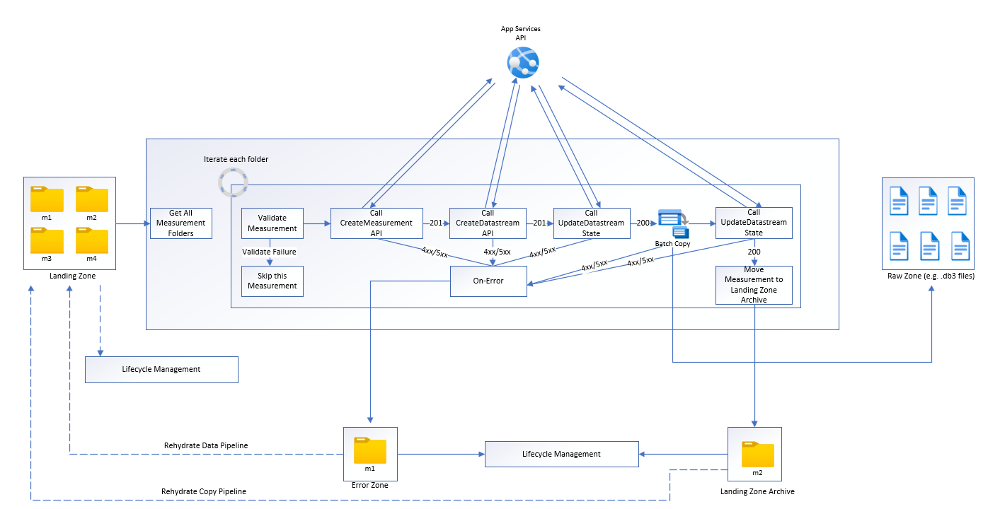

This architecture provides guidance and recommendations for developing data operations and data management (DataOps) for an automated driving solution. DataOps reference architecture is built upon the framework outlined in the [AVOps Design Guide](https://learn.microsoft.com/en-us/azure/architecture/guide/machine-learning/avops-design-guide). 
 DataOps is one of the building blocks of AVOps, in addition to MLOps, ValidationOps, DevOps and Centralized AVOps functions. 

DataOps refers to the processes and techniques that are used to collect, clean, store, manipulate, and analyze vast amounts of data.  Automated vehicles data generate massive amounts of data through various sensors and systems. The goal of these operations is to extract useful information that can inform decision-making, enabling the vehicle to safely navigate its environment and interact with other road users.

## Scenario Details
The goal of the DataOps flow for automated driving is to ensure that the data used to control the vehicle is of high quality, accurate, and reliable. By following a consistent DataOps flow, organizations improve the speed and accuracy of their data operations and make better decisions to control their autonomous vehicles.  

Typical challenges for data operations in context of autonomous vehicles:

- Daily Terabyte/Petabyte data volume from R&D vehicles (video and image sequences from test drives to capture scenarios, Lidar / Radar and telemetry data - overall term: measurement data)
- Data Sharing and collaboration: Multiple teams and partners are involved (e. g. for labeling, annotations, quality check) that requires data sharing and data governance capabilities at scale 
- Traceability and Lineage: As data is used as training data for the perception stack that is safety critical, it's necessary to capture lineage and versioning of ingested and processed measurement data
- Meta-data and Data Discovery: Perception stack developers need to identify and search for interesting scenes to improve semantic segmentation, image classification and object detection models


The AVOps DataOps reference architecture provides guidance how to address and solve these challenges incl. technology recommendations, partner, or open-source solutions for specific areas like simulation and data models. 


## Architecture


*Download a [Visio file](https://arch-center.azureedge.net/dataops-architecture.vsdx) that contains the architecture diagrams in this article.*

## Data Flow
1. Measurement data comes from data streams for sensors like cameras, radar, ultrasound, lidar, and vehicle telemetry. Data loggers in the vehicle store measurement data on logger storage devices. The logger storage data is then uploaded to the landing data lake. A service like [Azure Data Box](/azure/databox/) or [Azure Stack Edge](/azure/databox-online/), or a dedicated connection like [Azure ExpressRoute](/azure/expressroute/), ingests data into Azure.  Measurement data in formats such as MDF4, TDMS, Rosbag land in [Azure Data Lake](/azure/storage/blobs/data-lake-storage-introduction) via a dedicated storage account called the Landing Zone. Landing Zone is the storage account into which all the measurements from the vehicles are uploaded and validated. Only valid measurements are copied over the Raw Zone and raw data streams are created for them. Validation and data quality checks, like checksum, are performed to remove low quality data. 
1. Once data is available at the Landing Zone, an [Azure Data Factory](/azure/data-factory/introduction) pipeline is triggered at the scheduled interval to process the data. This [Azure Data Factory](/azure/data-factory/introduction) pipeline will do the following:
    - Perform a data quality check early in the data pipeline to ensure only quality data passes through to the next stage.   Code to perform data quality checks is executed on [Azure batch](/azure/batch/).  Data that is deemed incomplete are archived for future processing.  
    - Lineage Tracking: Pipeline will call the Metadata API using [Azure App Services](https://learn.microsoft.com/azure/app-service/overview) to to update the metadata in [Azure Cosmos DB](/azure/cosmos-db) to create a new datastream. For each measurement there is a datastream of type “Raw”
    - After creating the datastream, the data is copied to the Raw Zone storage account in  [Azure Data Lake](/azure/storage/blobs/data-lake-storage-introduction). The data in the Raw folder has a hierarchical structure
    ```
        raw/YYYY/MM/DD/VIN/MeasurementID/DatastreamID  
    ```
    - Once all the data is copied to the Raw folder, another call to Metadata API is made to mark the datastream as “Complete” so this can be consumed further.  
    - Once all measurement files are copied, the measurements are archived and removed from the Landing zone.  
1. The data in the Raw zone is still in a raw format such as [Rosbag](http://wiki.ros.org/rosbag) format and need to be extracted so the downstream systems can consume them.  
    
    The files from the Raw zone are processed by the [Azure Data Factory](/azure/data-factory/introduction) & [Azure batch](/azure/batch/).  Code executed in [Azure batch](/azure/batch/) will read the data from the topics in the Raw file and outputs the data into the selected topics into the respective folders.  

    The files in the Raw zone can each be more than 2GB in size. For each file, we have to run parallel processing extraction functions to extract topics such as image processing, Lidar, Radar, GPS, and metadata processing. In addition to the topic extraction, there is a need down sample the data to reduce the amount of data to label/annotate. [Azure Data Factory](/azure/data-factory/introduction) and [Azure batch](/azure/batch/) provides a way to perform parallelism in a scalable manner.

    The structure in the Extracted Zone storage account should also utilize a hierarchical similar to the Raw Zone storage account. 
    ```
        extracted/YYYY/MM/DD/VIN/MeasurementID/DatastreamID 
    ```
    Utilizing the example hierarchical structure allows organizations to utilizes the hierarchical namespace capability of [Azure Data Lake](/azure/storage/blobs/data-lake-storage-introduction).  The hierarchical structure allows organizations to create a scalable and cost effective object storage.  In turn, the structure also improves efficiency of the object search and retrieval. Partitioning by year and vehicle ID makes it easier to search for the relevant images from the corresponding vehicles.  A storage container for each sensor  like camera, gps, lidar, and radar are created.  
1. If data from the vehicle logger isn't synchronized across the different sensors, then another step is required in the architecture to synchronize the data to create a valid dataset.  [Azure Data Factory](/azure/data-factory/introduction) pipeline triggers synchronization of data across sensors where the synchronization algorithm shall be run on [Azure batch](/azure/batch/). If the synchronization was already executed on the vehicle logger, then this step can be skipped.
1. The next phase is to enrich the data with other data or telemetry that has been collected via telemetry or through the vehicle logger.  This step helps to enhance the richness of the data collected and provides more insights for the Data Scientist to utilize in their algorithm development as an example. 
 [Azure Data Factory](/azure/data-factory/introduction) pipeline is triggered for further enriching the data with Weather, maps or objects. Data generated can be kept in Parquet files to relate with the synchronized data. Metadata about the enriched data is also stored in Metadata store.  
1. [Azure Data Factory](/azure/data-factory/introduction) pipeline for scene detection. Scene Metadata is kept in the metadata store while scenes themselves as objects can be stored in Parquet or Delta files.
1. Third-party partners can be utilized in the next phase to perform labeling regardless of via manually or via auto labeling. The data is shared securely to Third-party partners via [Azure Data Share](/azure/data-share/) and integrated in Microsoft Purview without the need for extra data copying (snapshot).  Once labeling is performed, the data can again be shared back with the organization via [Azure Data Share](/azure/data-share/).  [Azure Data Share](/azure/data-share/) shares data back to the organization into a dedicated storage account named Labeled in [Azure Data Lake](/azure/storage/blobs/data-lake-storage-introduction).
    
     Labeled data sets are provided to further [MLOps](#mlops) processes.  [MLOps](#mlops) is used by organizations to create specialized algorithms such as perception and sensor fusion models. The algorithms can be used to detect scenes such as the ability to detect lane changes, blocked roads, pedestrian, traffic lights, and traffic signs. [COCO Datasets](https://cocodataset.org/#home) or [ASAM OpenLabel Datasets](https://www.asam.net/standards/detail/openlabel/) are recommended formats for label data exchange.

1. The Metadata store in [Azure Cosmos DB](/azure/cosmos-db) is used to store metadata about measurements (drive data), lineage of data as it goes through each process of extraction, down sampling, synchronization, enrichment and scene detection; Metadata about enrichment and scene's detected.
Metadata API is used to access measurements, Lineage, scenes and find out where data is stored.
The metadata API thus becomes the storage layer manager, which can spread data across storage accounts and helps the developer finding out data location using metadata based search. For that reason, the Metadata store is a centralized component to keep traceability and lineage across the entire AD data flow. 

1. [Azure Databricks](https://azure.microsoft.com/products/databricks/) / [Azure Synapse](/azure/synapase) to connect with Metadata API and access the Azure data lake storage and research on the data.

## Components
* [Data Box](https://azure.microsoft.com/products/databox) is used to transfer collected vehicle data to Azure via a regional carrier.
* [ExpressRoute](https://azure.microsoft.com/products/expressroute) extends the on-premises network into the Microsoft cloud over a private connection.
* [Azure Data Lake Storage](https://azure.microsoft.com/products/storage/data-lake-storage) stores data based on stages, for example, raw or extracted.
* [Azure Data Factory](https://azure.microsoft.com/products/data-factory) performs ETL via [batch compute](/azure/batch/) and creates data-driven workflows for orchestrating data movement and transforming data.
* [Azure Batch](https://azure.microsoft.com/products/batch) runs large-scale applications for tasks like data wrangling, filtering and preparing data, and extracting metadata.
* [Azure Cosmos DB](https://azure.microsoft.com/products/cosmos-db) stores metadata results, like stored measurements.
* [Data Share](https://azure.microsoft.com/products/data-share/) shares data with partner organizations, like labeling companies, with enhanced security.
* [Azure Databricks](https://azure.microsoft.com/products/databricks/) provides a set of tools for maintaining enterprise-grade data solutions at scale. It's required for long-running operations on large amounts of vehicle data. Data engineers use Azure Databricks as an analytics workbench.
* [Azure Synapse Analytics](https://azure.microsoft.com/products/synapse-analytics/) reduces time to insight across data warehouses and big data systems.
* [Azure Cognitive Search](https://azure.microsoft.com/products/search) provides data catalog search services.


## Federate Data Operations
Based on our experience, several teams are responsible for DataOps in organizations due to complexity of the entire data loop required for Autonomous Vehicles. For example, one team is in charge of data collection / data ingestion.  Another team could be in charge of data quality.  Yet another team could be responsible for data labeling and owning the labeled datasets. For that reason principles of a Data Mesh architecture are considered for DataOps:

- Domain-Oriented decentralization of data ownership and architecture: One dedicated team is responsible for one data domain that provides data products for that domain (e. g. labeled datasets)
- Data as a product: Each data domain has different zones (on data lake implemented storage containers), zones for internal usage and one zone that contains published data products for other data domains / external usage to avoid data duplication
- Self-serve data as a platform to enable autonomous, domain-oriented data teams
- Federated governance to enable interoperability and access between AVOps data domains (for example, labeling data domain needs to get access for the data collection domain) that requires a centralized Meta-Data store and Data Catalog

## AVOps Data Domains Example Structure

Table gives some ideas how data domains can be structured for AVOps:

| Data Domain  | Published Data Products | Reference Architecture Step |
|--|--|--|
|Data Collection | Uploaded and Validated measurement files| Landing and Raw |
|Extracted Images| Selected and extracted images / frames, Lidar and Radar  | Extracted |
|Extracted Radar/Lidar| Selected and extracted Lidar and Radar data  | Extracted |
|Extracted Telemetry | Selected and extracted car telemetry data  | Extracted |
|Labeled | Labeled Data sets | Labeled |
|Recompute | Generated KPIs based on resimulations runs | Recompute |

Each AVOps data domain is set up based on blueprint structure (incl. Azure Data Factory, Azure Data Lake Storage Gen2, databases, Azure Batch, Spark runtimes via Azure Databricks or Azure Synapse).

### Data Pipeline


## Meta-Data and Data Discovery 

Each data domain manages it corresponding AVOps data products decentrally. For central data discovery and to know where data products are located, two components are required:

- Centralized Meta-data store that persists meta-data about processed measurement files and data streams (e. g. video sequences) to make these discoverable and traceable 
- Centralized Data Catalog (e. g. Microsoft Purview) that shows lineage and dependencies between AVOps data domains.


## Considerations

These considerations implement the pillars of the Azure Well-Architected Framework, which is a set of guiding tenets that can be used to improve the quality of a workload. For more information, see [Microsoft Azure Well-Architected Framework](/azure/architecture/framework).

### Event-driven Orchestration


### Reliability

Reliability ensures your application can meet the commitments you make to your customers. For more information, see [Overview of the reliability pillar](/azure/architecture/framework/resiliency/overview).

* Auto scale and reserved instances
* Geo redundancy

### Security

Security provides assurances against deliberate attacks and the abuse of your valuable data and systems. For more information, see [Overview of the security pillar](/azure/architecture/framework/security/overview).

It's important to understand the division of responsibility between the automotive OEM and Microsoft. In the vehicle, the OEM owns the whole stack, but as the data moves to the cloud, some responsibilities transfer to Microsoft. Azure platform-as-a-service (PaaS) provides built-in security on the physical stack, including the operating system. You can apply the following capabilities on top of the infrastructure security components.

* Private endpoints for network security. For more information, see [Private endpoints for Azure Data Explorer](https://learn.microsoft.com/azure/data-explorer/security-network-private-endpoint) and [Allow access to Azure Event Hubs namespaces via private endpoints](https://learn.microsoft.com/azure/event-hubs/private-link-service).
* Encryption at rest and in transit.
* Identity and access management that uses Azure Active Directory (Azure AD) identities and [Azure AD Conditional Access](https://learn.microsoft.com/azure/active-directory/conditional-access) policies.
* [Row Level Security (RLS)](https://learn.microsoft.com/azure/active-directory/conditional-access) for Azure Data Explorer.
* Infrastructure governance that uses [Azure Policy](https://azure.microsoft.com/services/azure-policy).
* Data governance that uses [Microsoft Purview](https://azure.microsoft.com/services/purview).
* Securing the connection of the vehicles - certificate management
* Verify explicitly: Always authenticate and authorize based on all available data points
* Use least privilege access: Limit user access with Just-In-Time and Just-Enough-Access (JIT/JEA), risk-based adaptive policies, and data protection
* Assume breach: Minimize blast radius and segment access. Verify end-to-end encryption and use analytics to get visibility, drive threat detection and improve defenses
* Secure development lifecycle is used
* These points drive a Zero Trust Strategy
* It should be clarified if security relevant events must be stored in a central security log analytics workspace
* It should be clarified if “bring your own key” (BYOK) is required. Some customers in automotive sectors are using BYOK


### Cost optimization


### Operational excellence

Operational excellence covers the operations processes that deploy an application and keep it running in production. For more information, see [Overview of the operational excellence pillar](/azure/architecture/framework/devops/overview).

### Performance efficiency

Performance efficiency is the ability of your workload to scale to meet the demands placed on it by users in an efficient manner. For more information, see [Performance efficiency pillar overview](/azure/architecture/framework/scalability/overview).

## Contributors 
*This article is maintained by Microsoft. It was originally written by the following contributors.*
 - [Ryan Matsumura](https://www.linkedin.com/in/ryan-matsumura-4167257b/) | Senior Program Manager
 - [Jochen Schroeer](https://www.linkedin.com/in/jochen-schroeer/) | Lead Architect (Service Line Mobility)

Other contributors: 
- [Ginette Vellera](https://www.linkedin.com/in/ginette-vellera-35523314/) | Senior Software Engineering Lead
- [Brij Singh](https://www.linkedin.com/in/brijraajsingh/) | Principal Software Engineer
*To see non-public LinkedIn profiles, sign in to LinkedIn.*

## Next steps

- [What is Azure Machine Learning?](/azure/machine-learning/overview-what-is-azure-machine-learning)
- [What is Azure Batch?](/azure/batch/batch-technical-overview)
- [Azure Data Factory documentation](/azure/data-factory/)
- [What is Azure Data Share?](/azure/data-share/overview)
- [Large-scale Data Operations Platform for Autonomous Vehicles](https://devblogs.microsoft.com/cse/2023/03/02/large-scale-data-operations-platform-for-autonomous-vehicles/)

## Related resources

* [AVOps design guide](../../guide/machine-learning/avops-design-guide.md)
* [Data analytics for automotive test fleets](../../industries/automotive/automotive-telemetry-analytics.yml)
* [Building blocks for autonomous-driving simulation environments](../../industries/automotive/building-blocks-autonomous-driving-simulation-environments.yml)
- [Building blocks for autonomous-driving simulation environments](../../industries/automotive/building-blocks-autonomous-driving-simulation-environments.yml)
- [Process real-time vehicle data using IoT](../../example-scenario/data/realtime-analytics-vehicle-iot.yml)
