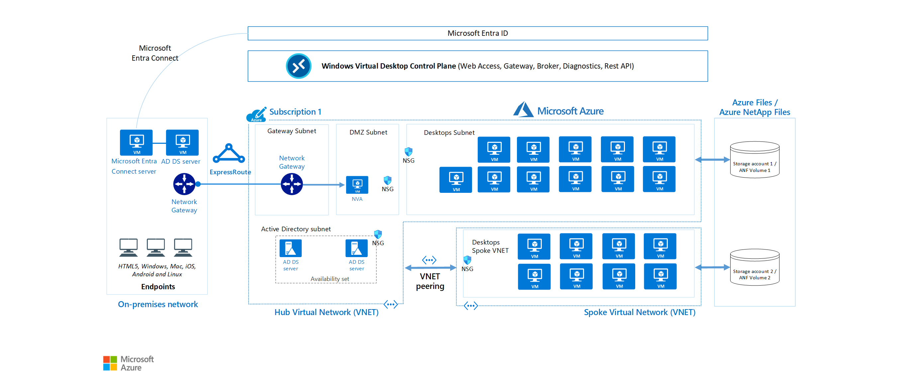
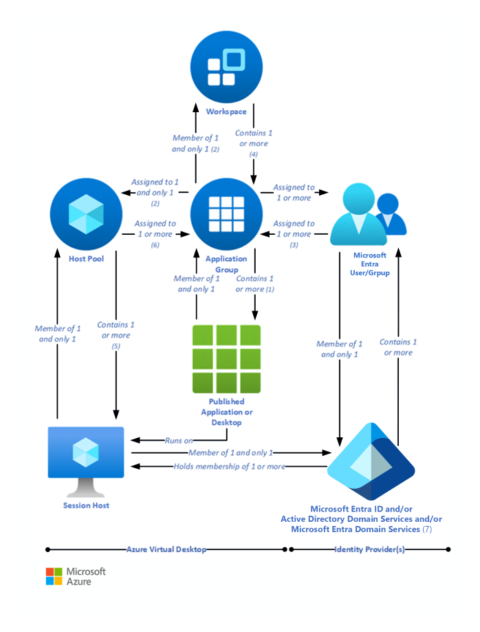

[Azure Virtual Desktop](https://azure.microsoft.com/services/virtual-desktop/) is a desktop and application virtualization service that runs in Azure. This article is intended to help desktop infrastructure architects, cloud architects, desktop administrators, and system administrators explore Azure Virtual Desktop and build virtualized desktop infrastructure (virtual desktop infrastructure (VDI)) solutions at enterprise scale. Enterprise-scale solutions generally cover 1,000 or more virtual desktops.

## Architecture

A typical architectural setup for Azure Virtual Desktop is illustrated in the following diagram:

*Download a [Visio file](https://arch-center.azureedge.net/wvdatscale.vsdx) of this architecture.*

### Dataflow

The diagram's dataflow elements are described here:

- The application endpoints are in a customer's on-premises network. Azure ExpressRoute extends the on-premises network into Azure, and Microsoft Entra Connect integrates the customer's Active Directory Domain Services (AD DS) with Microsoft Entra ID.

- The Azure Virtual Desktop control plane handles web access, gateway, broker, diagnostics, and extensibility components such as REST APIs.

- The customer manages AD DS and Microsoft Entra ID, Azure subscriptions, virtual networks, [Azure Files or Azure NetApp Files](/azure/virtual-desktop/store-fslogix-profile), and the Azure Virtual Desktop host pools and workspaces.

- To increase capacity, the customer uses two Azure subscriptions in a hub-spoke architecture and connects them via virtual network peering.

For more information about FSLogix Profile Container - Azure Files and Azure NetApp Files best practices, see [FSLogix configuration examples](/fslogix/concepts-configuration-examples).

### Components

[Azure Virtual Desktop](/azure/virtual-desktop/overview) service architecture is similar to [Windows Server Remote Desktop Services (RDS)](/windows-server/remote/remote-desktop-services/welcome-to-rds). Although Microsoft manages the infrastructure and brokering components, enterprise customers manage their own desktop host virtual machines (VMs), data, and clients.

#### Components that Microsoft manages

Microsoft manages the following Azure Virtual Desktop services, as part of Azure:

- **Web Access**: By using the [Web Access](/azure/virtual-desktop) service within Azure Virtual Desktop you can access virtual desktops and remote apps through an HTML5-compatible web browser just as you would with a local PC, from anywhere and on any device. You can secure web access by using multifactor authentication in Microsoft Entra ID.

- **Gateway**: The Remote Connection Gateway service connects remote users to Azure Virtual Desktop apps and desktops from any internet-connected device that can run an Azure Virtual Desktop client. The client connects to a gateway, which then orchestrates a connection from a VM back to the same gateway.

- **Connection Broker**: The Connection Broker service manages user connections to virtual desktops and remote apps. Connection Broker provides load balancing and reconnection to existing sessions.

- **Diagnostics**: Remote Desktop Diagnostics is an event-based aggregator that marks each user or administrator action on the Azure Virtual Desktop deployment as a success or failure. Administrators can query the event aggregation to identify failing components.

- **Extensibility components**: Azure Virtual Desktop includes several extensibility components. You can manage Azure Virtual Desktop by using Windows PowerShell or with the provided REST APIs, which also enable support from third-party tools.

#### Components that you manage

You manage the following components of Azure Virtual Desktop solutions:

- **Azure Virtual Network**: With [Azure Virtual Network](/azure/well-architected/service-guides/virtual-network), Azure resources such as VMs can communicate privately with each other and with the internet. By connecting Azure Virtual Desktop host pools to an Active Directory domain, you can define network topology to access virtual desktops and virtual apps from the intranet or internet, based on organizational policy. You can connect an Azure Virtual Desktop instance to an on-premises network by using a virtual private network (VPN), or you can use [Azure ExpressRoute](/azure/well-architected/service-guides/azure-expressroute) to extend the on-premises network into Azure over a private connection.

- **Microsoft Entra ID**: Azure Virtual Desktop uses [Microsoft Entra ID](/entra/fundamentals/whatis) for identity and access management. Microsoft Entra integration applies Microsoft Entra security features, such as Conditional Access, multifactor authentication, and [Intelligent Security Graph](/windows/security/application-security/application-control/app-control-for-business/design/use-appcontrol-with-intelligent-security-graph), and it helps maintain app compatibility in domain-joined VMs.

- **Active Directory Domain Services (Optional)**: Azure Virtual Desktop VMs can either be domain joined to an [AD DS](/windows-server/identity/ad-ds/get-started/virtual-dc/active-directory-domain-services-overview) service or use [Deploy Microsoft Entra joined virtual machines in Azure Virtual Desktop](/azure/virtual-desktop/azure-ad-joined-session-hosts?toc=/azure/architecture/toc.json&bc=/azure/architecture/_bread/toc.json)
    - When you use an AD DS domain, the domain must be in sync with Microsoft Entra ID to associate users between the two services. You can use [Microsoft Entra Connect](/entra/identity/hybrid/connect/whatis-azure-ad-connect) to associate AD DS with Microsoft Entra ID.
    - When you use Microsoft Entra join, review the [supported configurations](/azure/virtual-desktop/azure-ad-joined-session-hosts#supported-configurations) to ensure your scenario is supported.

- **Azure Virtual Desktop session hosts**: Session hosts are VMs that users connect to for their desktops and applications. Several versions of Windows are supported and you can create images with your applications and customizations. You can choose VM sizes, including GPU-enabled VMs. Each session host has an Azure Virtual Desktop host agent, which registers the VM as part of the Azure Virtual Desktop workspace or tenant. Each host pool can have one or more app groups, which are collections of remote applications or desktop sessions that you can access. To see which versions of Windows are supported, see [Operating systems and licenses](/azure/virtual-desktop/prerequisites#operating-systems-and-licenses).

- **Azure Virtual Desktop workspace**: The Azure Virtual Desktop workspace or tenant is a management construct for managing and publishing host pool resources.

## Scenario details

### Potential use cases

The greatest demand for enterprise virtual desktop solutions comes from:

- Security and regulation applications, such as financial services, healthcare, and government.

- Elastic workforce needs, such as remote work, mergers and acquisitions, short-term employees, contractors, and partner access.

- Specific employees, such as bring your own device (BYOD) and mobile users, call centers, and branch workers.

- Specialized workloads, such as design and engineering, legacy apps, and software development testing.

## Personal and pooled desktops

By using personal desktop solutions, sometimes called *persistent desktops*, users can always connect to the same specific session host. Users can ordinarily modify their desktop experience to meet personal preferences, and they can save files in the desktop environment. Personal desktop solutions:

- Let users customize their desktop environment, including user-installed applications, and users can save files within the desktop environment.
- Allow assigning dedicated resources to specific users, which can be helpful for some manufacturing or development use cases.

Pooled desktop solutions, also called *non-persistent desktops*, assign users to whichever session host is currently available, depending on the load-balancing algorithm. Because users don't always return to the same session host each time they connect, they have limited ability to customize the desktop environment and don't usually have administrator access.

> [!NOTE]
> Persistent and non-persistent terminology in this case is in reference to the persistence of the user profile. It doesn't imply that the operating system disk reverts to a golden image or discards changes on reboot.

## Windows servicing

There are several options for updating Azure Virtual Desktop instances. Deploying an updated image every month guarantees compliance and state.

- [Microsoft Endpoint Configuration Manager (MECM)](/mem/configmgr) updates server and desktop operating systems.
- [Windows Updates for Business](/windows/deployment/update/waas-manage-updates-wufb) updates desktop operating systems such as Windows 11 Enterprise multi-session.
- [Azure Update Management](/azure/automation/update-management/overview) updates server operating systems.
- [Azure Log Analytics](/azure/azure-monitor/platform/log-analytics-agent) checks compliance.
- Deploy a new (custom) image to session hosts every month for the latest Windows and applications updates. You can use an image from Azure Marketplace or a [custom Azure-managed image](/azure/virtual-machines/windows/capture-image-resource).

## Relationships between key logical components

The relationships between host pools, workspaces, and other key logical components vary. They're summarized in the following diagram:

*The numbers in the following descriptions correspond to those in the preceding diagram.*

- *(1)* An application group that contains a published desktop can only contain MSIX packages mounted to the host pool (the packages are available in the *Start* menu of the session host), it can't contain any other published resources and is called a desktop application group.
- *(2)* Application groups assigned to the same host pool must be members of the same workspace.
- *(3)* A user account can be assigned to an application group either directly or via a Microsoft Entra group. It's possible to assign no users to an application group, but then it can't service any.
- *(4)* It's possible to have an empty workspace, but it can't service users.
- *(5)* It's possible to have an empty host pool, but it can't service users.
- *(6)* It's possible for a host pool not to have any application groups assigned to it but it can't service users.
- *(7)* Microsoft Entra ID is required for Azure Virtual Desktop. This is because Microsoft Entra user accounts and groups must always be used to assign users to Azure Virtual Desktop application groups. Microsoft Entra ID is also used to authenticate users into the Azure Virtual Desktop service. Azure Virtual Desktop session hosts can also be members of a Microsoft Entra domain, and in this situation the Azure Virtual Desktop-published applications and desktop sessions are also launched and run (not just assigned) by using Microsoft Entra accounts.
    - *(7)* Alternatively, Azure Virtual Desktop session hosts can be members of an AD DS domain, and in this situation the Azure Virtual Desktop-published applications and desktop sessions are launched and run (but not assigned) by using AD DS accounts. To reduce user and administrative overhead, AD DS can be synchronized with Microsoft Entra ID through Microsoft Entra Connect.
    - *(7)* Finally, Azure Virtual Desktop session hosts can, instead, be members of a Microsoft Entra Domain Services domain, and in this situation the Azure Virtual Desktop-published applications and desktop sessions are launched and run (but not assigned) by using Microsoft Entra Domain Services accounts. Microsoft Entra ID is automatically synchronized with Microsoft Entra Domain Services, one way, from Microsoft Entra ID to Microsoft Entra Domain Services only.

| Resource | Purpose | Logical relationships |
|--- |--- |--- |
| Published desktop | A Windows desktop environment that runs on Azure Virtual Desktop session hosts and is delivered to users over the network | Member of one and only one application group *(1)* |
| Published application | A Windows application that runs on Azure Virtual Desktop session hosts and is delivered to users over the network | Member of one and only one application group |
| Application group | A logical grouping of published applications or a published desktop |  - Contains a published desktop *(1)* or one or more published applications  - Assigned to one and only one host pool *(2)*  - Member of one and only one workspace *(2)*  - One or more Microsoft Entra user accounts or groups are assigned to it *(3)* |
| Microsoft Entra user account/group | Identifies the users who are permitted to launch published desktops or applications | - Member of one and only one Microsoft Entra ID   - Assigned to one or more application groups *(3)* |
| Microsoft Entra ID *(7)* | Identity provider | - Contains one or more user accounts or groups, which must be used to assign users to application groups, and can also be used to sign in to the session hosts  - Can hold the memberships of the session hosts   - Can be synchronized with AD DS or Microsoft Entra Domain Services |
| AD DS *(7)* | Identity and directory services provider | - Contains one or more user accounts or groups, which can be used to sign in to the session hosts   - Can hold the memberships of the session hosts  - Can be synchronized with Microsoft Entra ID |
| Microsoft Entra Domain Services *(7)* | Platform as a service (PaaS)-based identity and directory services provider | - Contains one or more user accounts or groups, which can be used to sign in to the session hosts  - Can hold the memberships of the session hosts  - Synchronized with Microsoft Entra ID |
| Workspace | A logical grouping of application groups | Contains one or more application groups *(4)* |
| Host pool | A group of identical session hosts that serve a common purpose | - Contains one or more session hosts *(5)*  - One or more application groups are assigned to it *(6)* |
| Session host | A virtual machine that hosts published desktops or applications | Member of one and only one host pool |

## Considerations

These considerations implement the pillars of the Azure Well-Architected Framework, which is a set of guiding tenets that you can use to improve the quality of a workload. For more information, see [Well-Architected Framework](/azure/well-architected/).

Use the [assessment tool](/azure/well-architected/azure-virtual-desktop/assessment) to assess the readiness of your Azure Virtual Desktop workload. This tool checks your alignment to best practices described in the [Azure Virtual Desktop workload documentation](/azure/well-architected/azure-virtual-desktop/).

### Reliability

Reliability helps ensure that your application can meet the commitments that you make to your customers. For more information, see [Design review checklist for Reliability](/azure/well-architected/reliability/checklist).

- **Ensure capacity is reserved**: To ensure guaranteed allocation of compute resources, you can request an [On-demand capacity reservation](/azure/virtual-machines/capacity-reservation-overview) with no term commitment and can be combined with reserved instances.
- **Add Intra-region resiliency**: Use [Availability zones](/azure/reliability/availability-zones-overview) for Azure services that support them such as:
  - Virtual Machines (Session Hosts)
  - Azure Storage (FSLogix or App Attach). For more information, see [Azure Storage redundancy](/azure/storage/common/storage-redundancy).
- **Build a business continuity plan**: If [availability zones](/azure/reliability/availability-zones-overview) do not meet your RTO or RPO targets, review the guidance on [Multiregion Business Continuity and Disaster Recovery (BCDR)](/azure/architecture/example-scenario/azure-virtual-desktop/azure-virtual-desktop-multi-region-bcdr) for Azure Virtual Desktop.

### Security

Security provides assurances against deliberate attacks and the misuse of your valuable data and systems. For more information, see [Design review checklist for Security](/azure/well-architected/security/checklist).

Consider the following security-related factors when you deploy Azure Virtual Desktop.

- **Use Microsoft Entra ID**: Users can sign into Azure Virtual Desktop from anywhere using different devices and clients. To minimize the risk of unauthorized access and provide your organization with the ability to manage sign-in risks, [Enforce Microsoft Entra multifactor authentication using Conditional Access](/azure/virtual-desktop/set-up-mfa).
- **Use encryption**: By default, most Azure managed disks are encrypted at rest when persisting to the cloud. If your session hosts require more extensive encryption, like end-to-end encryption, review the guidance on [managed disk encryption options](/azure/virtual-machines/disk-encryption-overview) to protect stored data from unauthorized access.
- **Use private networking**: If you require private connectivity to Azure Virtual Desktop resources, use [Azure Private Link with Azure Virtual Desktop](/azure/virtual-desktop/private-link-overview) to constrain traffic between your virtual network and the service on the Microsoft Network.

> [!NOTE]
> For more security recommendations, see the guidance on [Security recommendations for Azure Virtual Desktop](/azure/virtual-desktop/security-recommendations).

### Cost Optimization

Cost Optimization focuses on ways to reduce unnecessary expenses and improve operational efficiencies. For more information, see [Design review checklist for Cost Optimization](/azure/well-architected/cost-optimization/checklist).

Consider the following cost-related factors when you deploy Azure Virtual Desktop.

- **Plan multi-session support**: For workloads with identical compute requirements, generally pooled host pools, [Windows Enterprise multi-session](/azure/virtual-desktop/windows-multisession-faq) offers the ability to accept more users to sign in to a single VM at once; reducing costs and administrative overhead.
- **Optimize licensing**: If you have Software Assurance, you can use [Azure Hybrid Benefit](/azure/virtual-machines/windows/hybrid-use-benefit-licensing) to reduce the cost of your Azure compute infrastructure.
- **Pre-purchase compute**: You can commit to one-year or three-year plans, [Azure Reservations](/azure/cost-management-billing/reservations/save-compute-costs-reservations), based on your VM usage to receive a discount to significantly reduce your resource cost. This can be combined with Azure Hybrid Benefit for additional savings.
- **Scale in and out as needed**: If committing to Azure Reservations isn't appropriate for your current needs, consider [Autoscale scaling plans](/azure/virtual-desktop/autoscale-scenarios) for dynamic provisioning/deprovisioning of session hosts as the demand changes through the day/week.
- **Evaluate load-balancing options**: Configure your host pool load balancing algorithm to depth-first. Be aware however, this can configuration degrades the users experience; the default breadth-first optimized user experience. For more information, see [Configure host pool load balancing in Azure Virtual Desktop](/azure/virtual-desktop/configure-host-pool-load-balancing).

### Operational Excellence

Operational Excellence covers the operations processes that deploy an application and keep it running in production. For more information, see [Design review checklist for Operational Excellence](/azure/well-architected/operational-excellence/checklist).

- **Configure alerts**:  Configure [Service Health](/azure/service-health/service-health-portal-update) and [Resource Health](/azure/service-health/resource-health-overview) alerts to stay informed about the health of the Azure services and regions that you use.
  - Monitor the Azure Storage solution that you use for hosting FSLogix Profiles or App Attach shares to ensure that thresholds aren't exceeded, which might have a negative impact on your user experience.
- **Collect performance data**: Install the [Azure Monitoring Agent](/azure/azure-monitor/agents/azure-monitor-agent-overview) on your Azure Virtual Desktop session hosts to extract and monitor performance counters and event logs. For more information, see the [list of configurable performance metrics/counters and event logs](/azure/well-architected/azure-virtual-desktop/monitoring#session-host-performance).
- **Collect usage insights**: Use [Azure Virtual Desktop Insights](/azure/virtual-desktop/insights-use-cases) to help with checks such as which client versions are connecting, opportunities for cost saving, or knowing if you have resource limitations or connectivity issues.
- **Tune diagnostic settings**:  Enable diagnostic settings for all services, Azure Virtual Desktop workspaces, application groups, host pools, storage accounts. Determine which settings are meaningful to your operations. Turn off settings that aren't meaningful to avoid undue costs; storage accounts (specifically the file service) that see a high amount of IOPS can incur high monitoring costs.

### Performance Efficiency 

Performance Efficiency refers to your workload's ability to scale to meet user demands efficiently. For more information, see [Design review checklist for Performance Efficiency](/azure/well-architected/performance-efficiency/checklist).

- **Use antivirus exclusions**: For profile solutions like FSLogix that mount virtual hard disk files, it's recommended to exclude those file extensions. For more information, see [Configure Antivirus file and folder exclusions](/fslogix/overview-prerequisites#configure-antivirus-file-and-folder-exclusions).
- **Tune for latency**: For clients using a Point-to-Site (P2S) VPN connection use a split tunnel that's based on User Datagram Protocol (UDP) to reduce latency and optimize your tunnel bandwidth usage. For on-site clients who use a VPN or Azure ExpressRoute, use [RDP Shortpath](/azure/virtual-desktop/rdp-shortpath?tabs=public-networks) to reduce the round-trip time, which improves the user experience in latency-sensitive applications and input methods.
- **Use right-size compute**: [Virtual machine sizing guidelines](/windows-server/remote/remote-desktop-services/virtual-machine-recs) lists the maximum suggested number of users per virtual central processing unit (vCPU) and minimum VM configurations for different workloads. This data helps estimate the VMs you need in your host pool.
  - Utilize simulation tools to test deployments with both stress tests and real-life usage simulations. Make sure that the system is responsive and resilient enough to meet user needs and remember to vary the load sizes when testing.
- **Use ephemeral OS disks**: If you treat your session hosts like cattle as opposed to pets, [Ephemeral OS disks](/azure/virtual-machines/ephemeral-os-disks) are great way to improve performance, latency similar to temporary disks, and simultaneously save costs as they are free.

### Limitations

Azure Virtual Desktop, much like Azure, has certain service limitations that you need to be aware of. To avoid having to make changes in the scaling phase, it's a good idea to address some of these limitations during the design phase.

For more information about the Azure Virtual Desktop Service limitations, see [Azure Virtual Desktop Service limits](/azure/azure-resource-manager/management/azure-subscription-service-limits#azure-virtual-desktop-service-limits).

Also consider the following restrictions:

- You can't create more than 500 application groups per single Microsoft Entra tenant\*.
  - If you require more than 500 application groups, submit a support ticket via the Azure portal.
- We recommend that you do *not* publish more than 50 applications per application group.
- We recommend that you deploy no more than 5,000 VMs per Azure subscription per region. This recommendation applies to both personal and pooled host pools, based on Windows Enterprise single and multi-session. Most customers use Windows Enterprise multi-session, which allows multiple users to sign in to each VM. You can increase the resources of individual session-host VMs to accommodate more user sessions.
- For automated session-host scaling tools, the limits are around 2,500 VMs per Azure subscription per region, because VM status interaction consumes more resources.
- To manage enterprise environments with more than 5,000 VMs per Azure subscription in the same region, you can create multiple Azure subscriptions in a hub-spoke architecture and connect them via virtual network peering (using one subscription per spoke). You could also deploy VMs in a different region in the same subscription to increase the number of VMs.
- Azure Resource Manager subscription API throttling limits don't allow more than 600 Azure VM reboots per hour via the Azure portal. You can reboot all your machines at once via the operating system, which doesn't consume any Azure Resource Manager subscription API calls. For more information about counting and troubleshooting throttling limits based on your Azure subscription, see [Troubleshoot API throttling errors](/azure/virtual-machines/troubleshooting/troubleshooting-throttling-errors).
- You can currently deploy up to 132 VMs in a single ARM template deployment in the Azure Virtual Desktop portal. To create more than 132 VMs, run the ARM template deployment in the Azure Virtual Desktop portal multiple times.
- Azure VM session-host name prefixes can't exceed 11 characters, due to auto-assigning of instance names and the NetBIOS limit of 15 characters per computer account.
- By default, you can deploy up to 800 instances of most resource types in a resource group. Azure Compute doesn't have this limit.

For more information about Azure subscription limitations, see [Azure subscription and service limits, quotas, and constraints](/azure/azure-resource-manager/management/azure-subscription-service-limits).

## Deploy this scenario

A collection of [ARM templates](https://github.com/Azure/RDS-Templates/tree/master/ARM-wvd-templates) can be employed automate the deployment of your Azure Virtual Desktop environment. These ARM templates support only the Azure Resource Manager Azure Virtual Desktop objects. These ARM templates don't support Azure Virtual Desktop (classic).

More scenarios are available from Microsoft Developer Tools which supports several deployment options:

- [Azure Virtual Desktop with Microsoft Entra ID Join](/samples/azure/azure-quickstart-templates/azure-virtual-desktop/)
- [Azure Virtual Desktop with FSLogix and AD DS Join](/samples/azure/azure-quickstart-templates/azure-virtual-desktop-with-fslogix/)

## Contributors

*This article is maintained by Microsoft. It was originally written by the following contributors.*

Principal author:

- [Tom Hickling](https://www.linkedin.com/in/tomhickling/) | Senior Product Manager, Azure Virtual Desktop Engineering

 Other contributor:

- [Nelson Del Villar](https://www.linkedin.com/in/nelsondelvillar/) | Cloud Solution Architect, Azure Core Infrastructure

## Next steps

- [Azure Virtual Desktop partner integrations](/azure/virtual-desktop/app-attach-partner-solutions) lists approved Azure Virtual Desktop partner providers and independent software vendors.
- Use the [Virtual Desktop Optimization Tool](https://github.com/The-Virtual-Desktop-Team/Virtual-Desktop-Optimization-Tool) to help optimize performance in a Windows 11 Enterprise VDI (virtual desktop infrastructure) environment.
- For more information, see [Deploy Microsoft Entra joined virtual machines in Azure Virtual Desktop](/azure/virtual-desktop/deploy-azure-ad-joined-vm).
- Learn more about [Active Directory Domain Services](/windows-server/identity/ad-ds/active-directory-domain-services).
- [What is Microsoft Entra Connect?](/entra/identity/hybrid/connect/whatis-azure-ad-connect)
- Learn more about the [Azure Virtual Desktop Well-Architected Framework](/azure/well-architected/azure-virtual-desktop/overview)
