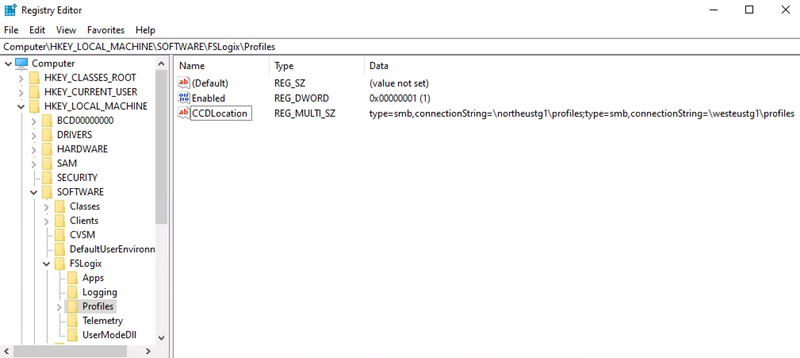

This article provides implementation-level architecture and configuration guidance for deploying Azure Virtual Desktop (AVD) with multiregion business continuity and disaster recovery (BCDR). [FSLogix](/fslogix/overview) is a profile management solution that stores user profiles in virtual hard disk containers, and its Cloud Cache component enables cross-region profile replication. You learn about BCDR model options (active-active, active-passive, and personal host pools with Site Recovery), FSLogix Cloud Cache configuration, failover and failback procedures, and storage considerations.

This article complements two related resources:

- [Azure Virtual Desktop landing zone design guide](/azure/architecture/landing-zones/azure-virtual-desktop/design-guide) establishes the foundational infrastructure (subscriptions, networking, identity, governance) that this article's BCDR design builds on.
- [Business continuity considerations for Azure Virtual Desktop workloads](/azure/well-architected/azure-virtual-desktop/business-continuity) provides design principles and component-level recommendations grounded in the Azure Well-Architected Framework.

This article focuses on the *how*: architecture diagrams, registry-level configuration, step-by-step failover procedures, and DR testing approaches.

## Goals and scope

The goals of this guide are to:

- Ensure maximum resiliency and geo-disaster recovery capability while minimizing data loss for important selected user data.
- Minimize recovery time.

These objectives are also known as the recovery point objective (RPO) and the recovery time objective (RTO).

:::image type="content" source="images/rpo-rto-diagram.png " alt-text="Diagram that shows an example of R T O and R P O.":::

The achievable RPO and RTO depend on the BCDR model and host pool type you select. The following table provides order-of-magnitude estimates for each model:

| BCDR model | RPO | RTO | Key factors |
|---|---|---|---|
| Active-active with Cloud Cache (pooled) | Seconds to low minutes (Cloud Cache async replication lag) | Near zero (no failover needed, both host pools serve users) | Dual-region compute and storage cost. Users must not access both host pools concurrently. |
| Active-passive with Cloud Cache (pooled) | Seconds to low minutes (Cloud Cache async replication lag) | 15–60 minutes (depends on compute warm-up, autoscale ramp time, and application group reassignment) | Secondary compute can be deallocated to reduce cost; capacity isn't guaranteed unless VMs are running or [On-Demand Capacity Reservations](/azure/virtual-machines/capacity-reservation-overview) are used. |
| Personal host pool with Site Recovery | 5–15 minutes (Site Recovery replication frequency) | Site Recovery VM failover time (typically minutes per VM) + domain rejoining time + VM extension reapplication | No FSLogix Cloud Cache. Site Recovery must be enabled per VM. |

> [!NOTE]
> These values are examples and are not guaranteed by Microsoft. Validate them through DR testing in your environment. Actual RPO depends on profile size, storage throughput, and network bandwidth between regions. Actual RTO depends on the number of session hosts, autoscale configuration, and the time needed to complete application group reassignments.

The proposed solution provides local high-availability, protection from a single [availability zone](/azure/reliability/availability-zones-overview) failure, and protection from an entire Azure region failure. It relies on a redundant deployment in a different, or secondary, Azure region to recover the service. While it's still a good practice, Virtual Desktop and the technology used to build BCDR don't require Azure regions to be [paired](/azure/reliability/cross-region-replication-azure). Primary and secondary locations can be any Azure region combination, if the network latency permits it. [Operating Azure Virtual Desktop host pools in multiple geographic regions](/azure/cloud-adoption-framework/ready/azure-setup-guide/regions#operate-in-multiple-geographic-regions) can offer more benefits not limited to BCDR.

To reduce the impact of a single availability zone failure, apply the following resiliency practices to improve high availability:

- At the [compute](/azure/virtual-desktop/faq#can-i-set-availability-options-when-creating-host-pools-) layer, spread the Virtual Desktop session hosts across different availability zones.
- At the [storage](/azure/storage/common/storage-redundancy) layer, use zone resiliency whenever possible.
- At the [networking](/azure/vpn-gateway/create-zone-redundant-vnet-gateway) layer, deploy zone-resilient Azure ExpressRoute and virtual private network (VPN) gateways.
- For each dependency, review the impact of a single zone outage and plan mitigations. For example, deploy Active Directory Domain Controllers and other external resources accessed by Virtual Desktop users across multiple availability zones.

Depending on the number of availability zones you use, evaluate over-provisioning the number of session hosts to compensate for the loss of one zone. For example, even with (n-1) zones available, you can ensure user experience and performance.

> [!NOTE]
> Azure availability zones are a high-availability feature that can improve resiliency. However, do not consider them a disaster recovery solution able to protect from region-wide disasters.

:::image type="content" source="images/azure-az-picture.png" alt-text="Diagram that shows Azure zones, datacenters, and geographies." lightbox="images/azure-az-picture.png":::

Because of the possible combinations of types, replication options, service capabilities, and availability restrictions in some regions, use the [FSLogix](/fslogix/overview) [Cloud Cache](/fslogix/cloud-cache-resiliency-availability-cncpt) component instead of storage-specific replication mechanisms.

### Scope limitations

OneDrive isn't covered in this article. For more information on redundancy and high availability, see [SharePoint and OneDrive data resiliency in Microsoft 365](/compliance/assurance/assurance-sharepoint-onedrive-data-resiliency).

Cost implications are discussed, but the primary goal is to provide an effective geo-disaster recovery deployment with minimal data loss.
For more BCDR details, see the following resources:

- [Business continuity considerations for Azure Virtual Desktop workloads](/azure/well-architected/azure-virtual-desktop/business-continuity)
- [BCDR considerations for Virtual Desktop](/azure/cloud-adoption-framework/scenarios/azure-virtual-desktop/eslz-business-continuity-and-disaster-recovery)
- [Virtual Desktop disaster recovery](/azure/virtual-desktop/disaster-recovery)

## Prerequisites

Before you implement multiregion BCDR, deploy the foundational landing zone infrastructure in both the primary and secondary Azure regions. For network topology, identity, and subscription structure guidance, see the [Azure Virtual Desktop landing zone design guide](/azure/architecture/landing-zones/azure-virtual-desktop/design-guide) and the Cloud Adoption Framework [Network topology and connectivity for Azure Virtual Desktop](/azure/cloud-adoption-framework/scenarios/azure-virtual-desktop/eslz-network-topology-and-connectivity).

For BCDR, the following networking prerequisites apply:

- Deploy the primary host pool and the secondary disaster recovery environment inside separate spoke virtual networks, each connected to a hub in its own region. Establish connectivity between the two hubs.
- Each hub provides hybrid connectivity to on-premises resources, firewall services, identity resources (such as Active Directory Domain Controllers), and management resources (such as Log Analytics).
- Verify that line-of-business applications and dependent resources are available in the secondary location during failover.

## Azure Virtual Desktop control plane business continuity and disaster recovery

The Azure Virtual Desktop control plane (Web, Broker, Gateway, Resource directory, diagnostics) is Microsoft-managed and designed for regional failover. If a region experiences an outage, the control plane components fail over automatically and continue functioning. You don't need to configure control plane redundancy. For a detailed breakdown of shared responsibilities and the control plane architecture, see [Azure Virtual Desktop service architecture and resilience](/azure/virtual-desktop/service-architecture-resilience) and [Business continuity considerations for Azure Virtual Desktop workloads](/azure/well-architected/azure-virtual-desktop/business-continuity).

:::image type="content" source="images/azure-virtual-desktop-logical-architecture.png" alt-text="Diagram that shows the logical architecture of Virtual Desktop." lightbox="images/azure-virtual-desktop-logical-architecture.png":::

[Data locations for Virtual Desktop](/azure/virtual-desktop/data-locations) are independent of session host VM locations. You can place Azure Virtual Desktop metadata in one supported region and deploy VMs in another.

The two different Azure Virtual Desktop host pool types support different recovery solutions.

- **Personal:** In this type of host pool, a user has a permanently assigned session host, which should never change. Because each user has a dedicated VM, the VM can store user data. Use replication and backup techniques to preserve and protect the state.
- **Pooled:** Users are temporarily assigned one of the available session host VMs from the pool, either directly through a desktop application group or by using remote apps. VMs are stateless and user data and profiles are stored in external storage or OneDrive.

## Active-Active vs. Active-Passive

If distinct sets of users have different BCDR requirements, Microsoft recommends that you use multiple host pools with different configurations. For example, users with a mission critical application might assign a fully redundant host pool with geo disaster recovery capabilities. However, development and test users can use a separate host pool with no disaster recovery at all.

For each single Virtual Desktop host pool, you can base your BCDR strategy on an active-active or active-passive model. This scenario assumes that the same set of users in one geographic location is served by a specific host pool.

- **Active-Active**
  - For each host pool in the primary region, you deploy a second host pool in the secondary region.
  - This configuration provides near-zero RTO. Achieving near-zero RPO requires extra cost.
  - You don't require an administrator to intervene or fail over. During normal operations, the secondary host pool provides the user with Virtual Desktop resources.
  - Each host pool has its own storage accounts (at least one) for persistent user profiles.
  - You should evaluate latency based on the user's physical location and connectivity available. For some Azure regions, such as Western Europe and Northern Europe, the difference can be negligible when accessing either the primary or secondary regions. You can validate this scenario using the [Azure Virtual Desktop Experience Estimator](https://azure.microsoft.com/services/virtual-desktop/assessment) tool.
  - Users are assigned to different application groups, like a *Desktop Application Group* (DAG) and a *RemoteApp Application Group* (RAG), in both the primary and secondary host pools. In this case, they see duplicate entries in their Virtual Desktop client feed. To avoid confusion, use separate Virtual Desktop workspaces with clear names and labels that reflect the purpose of each resource. Train your users on the usage of these resources.

    :::image type="content" source="images/azure-virtual-desktop-multiple-workspaces.png " alt-text="Picture that explains the usage of multiple workspaces.":::

  - If you need storage to manage [FSLogix Profile and Office Data File Container (ODFC) containers](/fslogix/concepts-container-types) separately, use Cloud Cache to ensure near-zero RPO.
    - To avoid profile conflicts, don't permit users to access both host pools at the same time.
    - Due to the active-active nature of this scenario, you should educate your users on how to use these resources in the proper way.

> [!NOTE]
> Using separate [ODFC containers](/fslogix/concepts-container-types#odfc-container) is an advanced scenario with higher complexity. Deploying this way is recommended only in some [specific scenarios](/fslogix/concepts-container-types#when-to-use-profile-and-odfc-containers).

- **Active-Passive**
  - Like active-active, for each host pool in the primary region, you deploy a second host pool in the secondary region.
  - You deploy fewer active compute resources in the secondary region than in the primary region, depending on your budget. You can use automatic scaling to provide more compute capacity, but it requires more time, and Azure capacity isn't guaranteed.
  - This configuration provides higher RTO when compared to the active-active approach, but it's less expensive.
  - You need administrator intervention to execute a failover procedure if there's an Azure outage. The secondary host pool doesn't normally provide the user access to Virtual Desktop resources.
  - Each host pool has its own storage accounts for persistent user profiles.
  - Users that consume Virtual Desktop services with optimal latency and performance are affected only if there's an Azure outage. You should validate this scenario by using the [Azure Virtual Desktop Experience Estimator](https://azure.microsoft.com/services/virtual-desktop/assessment) tool. Performance should be acceptable, even if degraded, for the secondary disaster recovery environment.
  - Users are assigned to only one set of application groups, like Desktop and Remote apps. During normal operations, these apps are in the primary host pool. During an outage, and after a failover, users are assigned to Application Groups in the secondary host pool. No duplicate entries are shown in the user's Virtual Desktop client feed, they can use the same workspace, and everything is transparent for them.
  - If you need storage to manage FSLogix Profile and Office containers, use Cloud Cache to ensure almost zero RPO.
    - To avoid profile conflicts, don't permit users to access both host pools at the same time. Since this scenario is active-passive, administrators can enforce this behavior at the application group level. Only after a failover procedure is the user able to access each application group in the secondary host pool. Access is revoked in the primary host pool application group and reassigned to an application group in the secondary host pool.
    - Execute a failover for all application groups. Otherwise, users who access different application groups in different host pools might cause profile conflicts.
  - It's possible to allow a specific subset of users to selectively fail over to the secondary host pool and provide limited active-active behavior and test failover capability. It's also possible to fail over specific application groups, but you should educate your users to not use resources from different host pools at the same time.

For specific circumstances, you can create a single host pool with a mix of session hosts located in different regions. The advantage of this solution is that if you have a single host pool, then there's no need to duplicate definitions and assignments for desktop and remote apps. Unfortunately, [disaster recovery for shared host pools](/azure/virtual-desktop/disaster-recovery-concepts#disaster-recovery-for-shared-host-pools) has several disadvantages:

- For pooled host pools, it isn't possible to force a user to a session host in the same region.
- A user might experience higher latency and suboptimal performance when connecting to a session host in a remote region.
- If you require storage for user profiles, you need a complex configuration to manage assignments for session hosts in the primary and secondary regions.
- You can use drain mode to temporarily disable access to session hosts located in the secondary region. But this method introduces more complexity, management overhead, and inefficient use of resources.
- You can maintain session hosts in an offline state in the secondary regions, but it introduces more complexity and management overhead.

### BCDR model comparison

The following table summarizes the key trade-offs between the BCDR models to help you select the approach that fits your requirements.

| Criterion | Active-Active (Pooled) | Active-Passive (Pooled) | Personal (Site Recovery) |
|---|---|---|---|
| RTO | Near zero | 15–60 min (depends on compute readiness) | Site Recovery SLA (typically minutes) + reprotect |
| RPO | Cloud Cache async lag (seconds to low minutes) | Cloud Cache async lag (seconds to low minutes) | Site Recovery replication (typically 5–15 min) |
| Steady-state cost | High (dual compute, dual storage) | Medium (minimal secondary compute) | Medium (Site Recovery replication cost) |
| Admin intervention | None | Required (group reassignment, capacity scaling) | Required (trigger failover per VM) |
| User experience | Duplicate feed entries (two workspaces) | Transparent (single workspace) | Transparent after failover |
| DR test complexity | High (profile lock risks) | Medium (GRP-TEST approach) | Limited (no AVD-integrated test failover) |
| Capacity guarantee | Yes (always-on) | No (unless using [On-Demand Capacity Reservation](/azure/virtual-machines/capacity-reservation-overview)) | No (unless using [On-Demand Capacity Reservation](/azure/virtual-machines/capacity-reservation-overview)) |

## Architecture diagrams

Review the following architecture diagrams before reading the component-level design guidance in the subsequent sections.

### Personal host pool

:::image type="content" source="images/azure-virtual-desktop-bcdr-personal-host-pool.png" alt-text="Diagram that shows a BCDR architecture for a personal host pool." lightbox="images/azure-virtual-desktop-bcdr-personal-host-pool.png":::

*Download a [Visio file](https://arch-center.azureedge.net/azure-virtual-desktop-bcdr-personal-host-pool.vsdx) of this architecture.*

| Design area | Description |
|----------|----------|
| A    | One of the most important dependencies for Azure Virtual Desktop is the availability of user identity. To access full remote virtual desktops and remote apps from your session hosts, your users need to be able to authenticate. Review the Identity option.    |
| B    | If Azure Virtual Desktop users need access to on-premises resources, it's critical that you consider high availability in the network infrastructure that's required to connect to the resources. Assess and evaluate the resiliency of your authentication infrastructure, and consider BCDR aspects for dependent applications and other resources. These considerations will help ensure availability in the secondary disaster recovery location.  |
| C    | Depending on the size of your deployment and organization structure ensure all subscriptions have enough quota to run Azure Virtual Desktop workloads in different regions and that you have the correct Azure role-based access control (Azure RBAC) roles assigned.    |
| D    | For the deployment of both host pools in the primary and secondary disaster recovery regions, you should spread your session host VM fleet across multiple availability zones. If availability zones aren't available in the local region, you can use an availability set to make your solution more resilient than with a default deployment.  |
| E    | The golden image that you use for host pool deployment in the secondary disaster recovery region should be the same you use for the primary. You should store images in the Azure Compute Gallery and configure multiple image replicas in both the primary and the secondary locations.  |
| F    | You can use [Azure Site Recovery](/azure/site-recovery/site-recovery-overview) or a secondary host pool (hot standby) to maintain a backup environment.   |
| G    | You can create a new host pool in the failover region and keep all the resources turned off. For this method, set up new application groups in the failover region and assign users to the groups. Then, you can use a recovery plan in Site Recovery to turn on host pools and create an orchestrated process.   |

### Pooled host pool

:::image type="content" source="images/azure-virtual-desktop-bcdr-pooled-host-pool.png" alt-text="Diagram that shows a BCDR architecture for a pooled host pool." lightbox="images/azure-virtual-desktop-bcdr-pooled-host-pool.png":::

*Download a [Visio file](https://arch-center.azureedge.net/azure-virtual-desktop-bcdr-pooled-host-pool.vsdx) of this architecture.*

| Design area | Description |
|----------|----------|
| A    | One of the most important dependencies for Azure Virtual Desktop is the availability of user identity. To access full Azure Virtual Desktops and remote apps from your session hosts, your users need to be able to authenticate. Review the Identity option.  |
| B    | If Azure Virtual Desktop users need access to on-premises resources, it's critical that you consider high availability in the network infrastructure that's required to connect to the resources. Assess and evaluate the resiliency of your authentication infrastructure, and consider BCDR aspects for dependent applications and other resources. These considerations will help ensure availability in the secondary disaster recovery location.  |
| C    | Depending on the size of your deployment and organization structure ensure all subscriptions have enough quota to run Azure Virtual Desktop workloads in different regions and that you have the correct Azure RBAC roles assigned.  |
| D    | Through [availability zones](/azure/reliability/availability-zones-overview), VMs in the host pool are distributed across different datacenters. VMs are still in the same region, and they have higher resiliency and a higher formal 99.99 percent high-availability [SLA](https://www.microsoft.com/licensing/docs/view/Service-Level-Agreements-SLA-for-Online-Services). Your capacity planning should include sufficient extra compute capacity to ensure that Azure Virtual Desktop continues to operate, even if a single availability zone is lost.   |
| E    | Use FSLogix Cloud Cache to build profile resiliency for your users. FSLogix Cloud Cache does affect the sign-on and sign out experience when you use low-performance storage. It's common for environments using Cloud Cache to have slightly slower sign-on and sign out times, relative to using traditional VHDLocations, using the same storage. Review the [FSLogix Cloud Cache documentation for recommendations](/fslogix/cloud-cache-resiliency-availability-cncpt) regarding local cache storage.  |
| F    | Azure NetApp Files provides higher throughput and lower latency per GiB at the Premium and Ultra tiers compared to Azure Files Premium. Evaluate whether the performance difference justifies the management overhead and replication limitations.  |
| G   | Storage options for [FSLogix profile containers in Azure Virtual Desktop](/azure/virtual-desktop/store-fslogix-profile) compares the different managed storage solutions that are available.   |
| H   | Separate user profile and Office container disks. FSLogix offers the option to place disks in separate storage locations.   |
| I    | For AppAttach disks and when needed, use Azure Storage built-in replication mechanisms for BCDR for environments that are less critical. Use zone-redundant storage (ZRS) or GRS for Azure Files.   |
| J    | To prevent user data from data loss or logical corruption use the Azure Backup to protect critical workloads. |
| K    | The golden image that you use for host pool deployment in the secondary disaster recovery region should be the same you use for the primary. You should store images in the Azure Compute Gallery and configure multiple image replicas in both the primary and the secondary locations.   |

## Considerations and recommendations

### General

To deploy either an active-active or active-passive configuration using multiple host pools and an FSLogix Cloud Cache mechanism, you can create the host pool inside the same workspace or a different one, depending on the model. This approach requires you to maintain the alignment and updates, keeping both host pools in sync and at the same configuration level. In addition to a new host pool for the secondary disaster recovery region, you need:

- To create new distinct application groups and related applications for the new host pool.
- To revoke user assignments to the primary host pool, and then manually reassign them to the new host pool during the failover.

Review the [Business continuity and disaster recovery options for FSLogix](/fslogix/concepts-container-recovery-business-continuity).

- [No profile recovery](/fslogix/concepts-container-recovery-business-continuity#option-1-no-profile-recovery) isn't covered in this document.
- [Cloud cache (active/passive)](/fslogix/concepts-container-recovery-business-continuity#option-2-cloud-cache-primary--failover) is included in this document but is implemented using the same host pool.
- [Cloud cache (active/active)](/fslogix/concepts-container-recovery-business-continuity#option-3-cloud-cache-active--active) is covered in the remaining part of this document.

There are limits for Virtual Desktop resources that must be considered in the design of a Virtual Desktop architecture. Validate your design based on the [Virtual Desktop service limits](/azure/azure-resource-manager/management/azure-subscription-service-limits#azure-virtual-desktop-service-limits).

For diagnostics and monitoring, it's good practice to use the same Log Analytics workspace for both the primary and secondary host pool. Using this configuration, [Azure Virtual Desktop Insights](/azure/virtual-desktop/insights) offers a unified view of deployment in both regions.

However, using a single log destination can cause problems if the entire primary region is unavailable. The secondary region won't be able to use the Log Analytics workspace in the unavailable region. If this situation is unacceptable, consider the following solutions:

- Use a separate Log Analytics workspace for each region, and then point the Virtual Desktop components to log toward its local workspace.
- Test and review Logs Analytics [workspace replication and failover capabilities](/azure/azure-monitor/logs/workspace-replication).

### Compute

- For the deployment of both host pools in the primary and secondary disaster recovery regions, you should spread your session host VM fleet across multiple availability zones. If availability zones aren't available in the local region, you can use an availability set to make your solution more resilient than with a default deployment.
- The golden image that you use for host pool deployment in the secondary disaster recovery region should be the same you use for the primary. You should store images in the Azure Compute Gallery and configure multiple image replicas in both the primary and the secondary locations. Each image replica can sustain a parallel deployment of a maximum number of VMs, and you might require more than one based on your desired deployment batch size. For more information, see [Store and share images in an Azure Compute Gallery](/azure/virtual-machines/shared-image-galleries#scaling).

    :::image type="content" source="images/azure-compute-gallery-hires.png" alt-text="Diagram that shows Azure Compute Gallery and Image replicas." lightbox="images/azure-compute-gallery-hires.png":::

- The Azure Compute Gallery isn't a global resource. Create at least one secondary gallery in the secondary region. In your primary region, create a gallery, a VM image definition, and a VM image version. Then create the same objects in the secondary region. When you create the VM image version in the secondary region, you can copy the image version from the primary region by specifying the source gallery, VM image definition, and VM image version. Azure copies the image and creates a local VM image version. You can run this operation by using the Azure portal or the Azure CLI command as outlined in the following articles:

  [Create an image definition and an image version](/azure/virtual-machines/image-version)

  [az sig image-version create](/cli/azure/sig/image-version?view=azure-cli-latest#az-sig-image-version-create)

  For golden image design principles, including zone-redundant storage and replica planning, see [Golden images in Business continuity considerations](/azure/well-architected/azure-virtual-desktop/business-continuity#golden-images).

- Not all the session host VMs in the secondary disaster recovery locations must be active and running all the time. You must initially create a sufficient number of VMs, and after that, use an autoscale mechanism like [Scaling plans](/azure/virtual-desktop/autoscale-scaling-plan). With these mechanisms, you can keep most compute resources in an offline or deallocated state to reduce costs.
- You can also use automation to create session hosts in the secondary region only when needed. This method optimizes costs, but depending on the mechanism you use, might require a longer RTO. This approach doesn't permit failover tests without a new deployment and doesn't permit selective failover for specific groups of users.

> [!NOTE]
> You must power on each session host VM for a few hours at least one time every 90 days to refresh the authentication token needed to connect to the Virtual Desktop control plane. You should also routinely apply security patches and application updates.

- Having session hosts in an offline, or *deallocated*, state in the secondary region doesn't guarantee that capacity is available in case of a primary region-wide disaster. It also applies if new session hosts are deployed on-demand when needed, and with [Site Recovery](/azure/site-recovery/azure-to-azure-common-questions?#how-do-we-ensure-capacity-in-the-target-region) usage. Compute capacity can be guaranteed only if the related resources are already allocated and active.

> [!IMPORTANT]
> [Azure Reservations](/azure/cost-management-billing/reservations/save-compute-costs-reservations) doesn't provide guaranteed capacity in the region.

For Cloud Cache usage scenarios, we recommend using the Premium tier for managed disks. Cloud Cache uses a local cache disk on each session host to stage profile data before replicating it to the remote storage providers. Size this local cache disk to be at least as large as the largest expected user profile VHD/X file. An undersized cache disk causes sign-in failures. As a starting point, allocate at least 30 GB per concurrent user, and monitor actual profile sizes to adjust. For more information on local cache storage recommendations, see [Cloud Cache documentation](/fslogix/cloud-cache-resiliency-availability-cncpt).

### Storage

In this guide, you use at least two separate storage accounts for each Virtual Desktop host pool. One is for the FSLogix Profile container, and one is for the Office container data. You also need one more storage account for [MSIX](/azure/virtual-desktop/what-is-app-attach) packages. The following considerations apply:

- You can use [Azure Files](/azure/storage/files/storage-files-introduction) share and [Azure NetApp Files](/azure/azure-netapp-files/azure-netapp-files-introduction) as storage alternatives. To compare the options, see the [FSLogix container storage options](/fslogix/concepts-container-storage-options).
- Azure Files share can provide zone resiliency by using the zone-redundant storage (ZRS) resiliency option, if it's available in the region.
- You can't use the geo-redundant storage feature in the following situations:
  - You require a [region that doesn't have a pair](/azure/reliability/cross-region-replication-azure#regions-with-availability-zones-and-no-region-pair). The region pairs for geo-redundant storage are fixed and can't be changed.
  - You're using the Premium tier.

> [!WARNING]
> Azure Files Premium tier does not support geo-redundant storage (GRS). If you require Premium performance for FSLogix profile storage, you can't rely on Azure Storage built-in geo-replication. Use FSLogix Cloud Cache for cross-region replication instead.

- RPO and RTO are higher compared to FSLogix Cloud Cache mechanism.
- It isn't easy to test failover and failback in a production environment.
- Azure NetApp Files requires more considerations:
  - Azure NetApp Files supports [elastic zone-redundant volumes](/azure/azure-netapp-files/elastic-zone-redundant-concept), which distribute data across availability zones for zone-level resilience. Evaluate whether elastic zone-redundant volumes meet your resiliency requirements.
  - Azure NetApp Files can be [zonal](/azure/azure-netapp-files/manage-availability-zone-volume-placement), that is, customers can decide in which (single) Azure Availability Zone to allocate.
  - [Cross-zone replication](/azure/azure-netapp-files/replication#cross-zone-replication) is a recoverability capability, not automatic zone-level resilience. Use it to restore service after a zone outage rather than to continue serving traffic during one. Before using this feature, review the [requirements and considerations for cross-zone replication](/azure/azure-netapp-files/create-cross-zone-replication).
  - You can use Azure NetApp Files with zone-redundant VPN and ExpressRoute gateways, if [standard networking](/azure/azure-netapp-files/configure-network-features) feature is used, which you might use for networking resiliency. For more information, see [Supported network topologies](/azure/azure-netapp-files/azure-netapp-files-network-topologies#supported-network-topologies).
  - Azure Virtual WAN is supported when used together with Azure NetApp Files [standard networking](/azure/azure-netapp-files/configure-network-features). For more information, see [Supported network topologies](/azure/azure-netapp-files/azure-netapp-files-network-topologies#supported-network-topologies).
- Azure NetApp Files has a [cross-region replication mechanism](/azure/azure-netapp-files/cross-region-replication-introduction). The following considerations apply:
  - It's not available in all regions.
  - [Cross-region replication of Azure NetApp Files volumes](/azure/azure-netapp-files/cross-region-replication-introduction) region pairs can be different than Azure Storage region pairs.
  - It can't be used at the same time with [cross-zone replication](/azure/azure-netapp-files/cross-zone-replication-introduction).

> [!WARNING]
> Azure NetApp Files cross-region replication and cross-zone replication are mutually exclusive. You must choose between zone-level recoverability and region-level recoverability for each volume. Evaluate which failure scope is more critical for your deployment and plan accordingly.

  - Failover isn't transparent, and failback requires [storage reconfiguration](/azure/azure-netapp-files/cross-region-replication-manage-disaster-recovery).
- Limits
  - There are limits in the size, input/output operations per second (IOPS), bandwidth MBps for both [Azure Files share](/azure/storage/files/storage-files-scale-targets) and [Azure NetApp Files](/azure/azure-netapp-files/azure-netapp-files-service-levels) storage accounts and volumes. If necessary, it's possible to use more than one for the same host pool in Virtual Desktop by using [per-group settings](/fslogix/configure-per-user-per-group-ht) in FSLogix. However, this configuration requires more planning and configuration.

The storage account you use for MSIX application packages should be distinct from the other accounts for Profile and Office containers. The following Geo-disaster recovery options are available:

- **One storage account with geo-redundant storage enabled, in the primary region**
  - The secondary region is fixed. This option isn't suitable for local access if there's storage account failover.
- **Two separate storage accounts, one in the primary region and one in the secondary region (recommended)**
  - Use zone-redundant storage for at least the primary region.
  - Each host pool in each region has local storage access to MSIX packages with low latency.
  - Copy MSIX packages twice in both locations and register the packages twice in both host pools. Assign users to the application groups twice.

### FSLogix

Microsoft recommends that you use the following FSLogix configuration and features:

- If the Profile container content needs separate BCDR management with different requirements than the Office container, split Profile and Office containers into separate storage accounts.
  - Office Container only has cached content that can be rebuilt or repopulated from the source if there's a disaster. With Office Container, you might not need to keep backups, which can reduce costs.
  - When you use different storage accounts, you can only enable backups on the profile container. Or, you must have different settings like retention period, storage used, frequency, and RTO/RPO.
- [Cloud Cache](/fslogix/cloud-cache-resiliency-availability-cncpt) is an FSLogix component in which you can specify multiple profile storage locations and asynchronously replicate profile data, all without relying on any underlying storage replication mechanisms. If the first storage location fails or isn't reachable, Cloud Cache automatically fails over to use the secondary, and effectively adds a resiliency layer. Use Cloud Cache to replicate both Profile and Office containers between different storage accounts in the primary and secondary regions.

    :::image type="content" source="images/cloud-cache-general.png" lightbox="images/cloud-cache-general.png" alt-text="Diagram that shows a high-level view of Cloud Cache.":::

- You must enable Cloud Cache twice in the session host VM registry, once for [Profile Container](/fslogix/configure-cloud-cache-tutorial#configuring-cloud-cache-for-profile-container) and once for [Office Container](/fslogix/configure-cloud-cache-tutorial#configuring-cloud-cache-for-office-container). It's possible to not enable Cloud Cache for Office Container, but not enabling it might cause a data misalignment between the primary and the secondary disaster recovery region if there's failover and failback. Test this scenario carefully before using it in production.
- Cloud Cache is compatible with both [profile split](/fslogix/profile-container-office-container-cncpt) and [per-group](/fslogix/configure-per-user-per-group-ht) settings. Per-group requires careful design and planning of Active Directory groups and membership. You must ensure that every user is part of exactly one group, and that group is used to grant access to host pools.
- In the secondary disaster recovery region, reverse the *CCDLocations* provider order so the local (secondary) storage account is listed first. Cloud Cache writes to the first reachable provider as the active write target and asynchronously replicates to subsequent entries. By listing the local storage account first in each region, you ensure that writes go to local storage during normal operations and that replication flows cross-region. For more information, see [Tutorial: Configure Cloud Cache to redirect profile containers or office container to multiple Providers](/fslogix/configure-cloud-cache-tutorial).

  > [!TIP]
  > This article focuses on a specific scenario. Additional scenarios are described in [High availability options for FSLogix](/fslogix/concepts-container-high-availability) and [Business continuity and disaster recovery options for FSLogix](/fslogix/concepts-container-recovery-business-continuity).

The following example shows a Cloud Cache configuration and related registry keys:

**Primary Region = North Europe**
- Profile container storage account URI = **\\northeustg1\profiles**
  - Registry Key path = **HKEY_LOCAL_MACHINE > SOFTWARE > FSLogix > Profiles**
  - *CCDLocations* value = **type=smb,connectionString=\\northeustg1\profiles;type=smb,connectionString=\\westeustg1\profiles**

  > [!NOTE]
  > If you previously downloaded the **FSLogix Templates**, you can accomplish the same configurations through the Active Directory Group Policy Management Console. For more information about how to set up the Group Policy Object for FSLogix, see [Use FSLogix Group Policy Template Files](/fslogix/use-group-policy-templates-ht).

  

- Office container storage account URI = **\\northeustg2\odcf**
  - Registry Key path = **HKEY_LOCAL_MACHINE > SOFTWARE >Policy > FSLogix > ODFC**
  - *CCDLocations* value = **type=smb,connectionString=\\northeustg2\odfc;type=smb,connectionString=\\westeustg2\odfc**

    :::image type="content" source="images/fslogix-cloud-cache-registry-keys-office-hires.png" alt-text="Screenshot that shows the Cloud Cache registry keys for Office Container." lightbox="images/fslogix-cloud-cache-registry-keys-office-hires.png":::

> [!NOTE]
> In the previous screenshots, not all the recommended registry keys for FSLogix and Cloud Cache are reported, for brevity and simplicity. For more information, see [FSLogix configuration examples](/fslogix/concepts-configuration-examples).

**Secondary Region = West Europe**

- Profile container storage account URI = **\\westeustg1\profiles**
  - Registry Key path = **HKEY_LOCAL_MACHINE > SOFTWARE > FSLogix > Profiles**
  - CCDLocations value = **type=smb,connectionString=\\westeustg1\profiles;type=smb,connectionString=\\northeustg1\profiles**
- Office container storage account URI = **\\westeustg2\odcf**
  - Registry Key path = **HKEY_LOCAL_MACHINE > SOFTWARE >Policy > FSLogix > ODFC**
  - CCDLocations value = **type=smb,connectionString=\\westeustg2\odfc;type=smb,connectionString=\\northeustg2\odfc**

### Cloud Cache replication

The Cloud Cache configuration and replication mechanisms enable profile data replication between different regions with minimal data loss. Since the same user profile file can be opened in ReadWrite mode by only one process, concurrent access should be avoided, thus users shouldn't open a connection to both host pools at the same time.

:::image type="content" source="images/cloud-cache-replication-diagram.png" alt-text="Diagram that shows a high-level overview of the Cloud Cache replication flow." lightbox="images/cloud-cache-replication-diagram.png":::

*Download a [Visio file](https://arch-center.azureedge.net/cloud-cache-replication-diagram.vsdx) of this architecture.*

#### Dataflow

1. An Azure Virtual Desktop user launches Virtual Desktop client, and then opens a published Desktop or Remote App application assigned to the primary region host pool.
1. FSLogix retrieves the user Profile and Office containers, and then mounts the underlying storage VHD/X from the storage account located in the primary region.
1. At the same time, the Cloud Cache component initializes replication between the files in the primary region and the files in the secondary region. For this process, Cloud Cache in the primary region acquires an exclusive read-write lock on these files.
1. The same Virtual Desktop user now wants to launch another published application assigned on the secondary region host pool.
1. The FSLogix component running on the Virtual Desktop session host in the secondary region tries to mount the user profile VHD/X files from the local storage account. But the mounting fails since these files are locked by the Cloud Cache component running on the Virtual Desktop session host in the primary region.
1. In the default FSLogix and Cloud Cache configuration, the user can't sign in and an error is tracked in the FSLogix diagnostic logs, *ERROR_LOCK_VIOLATION 33 (0x21)*.

    :::image type="content" source="images/fslogix-log.png" alt-text="Screenshot that shows the FSLogix diagnostic log." lightbox="images/fslogix-log.png":::

### Identity

One of the most important dependencies for Azure Virtual Desktop is the availability of user identity. To access full remote virtual desktops and remote apps from your session hosts, your users need to be able to authenticate. [Microsoft Entra ID](/entra/fundamentals/whatis) is Microsoft's centralized cloud identity service that enables this capability. Microsoft Entra ID is always used to authenticate users for Virtual Desktop. Session hosts can be joined to the same Microsoft Entra tenant, or to an Active Directory domain using [Active Directory Domain Services (AD DS)](/windows-server/identity/ad-ds/get-started/virtual-dc/active-directory-domain-services-overview) or Microsoft Entra Domain Services, providing you with a choice of flexible configuration options.

- **Microsoft Entra ID**
  - It's a global multi-region and resilient service with a high-availability [SLA](https://www.microsoft.com/licensing/docs/view/Service-Level-Agreements-SLA-for-Online-Services). No other action is required in this context as part of a Virtual Desktop BCDR plan.
- **Active Directory Domain Services**
  - For Active Directory Domain Services to be resilient and highly available, even if there's a region-wide disaster, you should deploy at least two domain controllers (DCs) in the primary Azure region. These domain controllers should be in different availability zones if possible, and you should ensure proper replication with the infrastructure in the secondary region and eventually on-premises. You should create at least one more domain controller in the secondary region with global catalog and DNS roles. For more information, see [Deploy Active Directory Domain Services (AD DS) in an Azure virtual network](/azure/architecture/reference-architectures/identity/adds-extend-domain).
- **Microsoft Entra Connect**
  - If you're using Microsoft Entra ID with Active Directory Domain Services, and then [Microsoft Entra Connect](/entra/identity/hybrid/connect/whatis-azure-ad-connect) to synchronize user identity data between Active Directory Domain Services and Microsoft Entra ID, you should consider the resiliency and recovery of this service for protection from a permanent disaster.
  - You can provide high availability and disaster recovery by installing a second instance of the service in the secondary region and enable [staging mode](/entra/identity/hybrid/connect/plan-connect-topologies#staging-server).
  - If there's a recovery, the administrator is required to promote the secondary instance by taking it out of staging mode. They must follow the procedure to [switch the active server](/entra/identity/hybrid/connect/how-to-connect-sync-staging-server#switch-active-server) as at least a [
Hybrid Identity Administrator](/entra/identity/role-based-access-control/permissions-reference#hybrid-identity-administrator).

    :::image type="content" source="images/active-directory-connect-configuration-wizard.png" alt-text="Screenshot that shows the A D Connect configuration wizard.":::

- **Microsoft Entra Domain Services**
  - You can use Microsoft Entra Domain Services in some scenarios as an alternative to Active Directory Domain Services.
  - It offers a high-availability [SLA](https://www.microsoft.com/licensing/docs/view/Service-Level-Agreements-SLA-for-Online-Services).
  - If geo-disaster recovery is in scope for your scenario, you should deploy another replica in the secondary Azure region by using a [replica set](/entra/identity/domain-services/tutorial-create-replica-set). You can also use this feature to increase high availability in the primary region.

## Failover and failback

### Personal host pool scenario

> [!NOTE]
> Only the active-passive model is covered in this section—an active-active doesn't require any failover or administrator intervention.

Failover and failback for a personal host pool is different, as there's no Cloud Cache and external storage used for Profile and Office containers. You can still use FSLogix technology to save the data in a container from the session host. There's no secondary host pool in the disaster recovery region, so there's no need to create more workspaces and Virtual Desktop resources to replicate and align. You can use Site Recovery to replicate session host VMs.

You can use Site Recovery in several different scenarios. For Virtual Desktop, use the [Azure to Azure disaster recovery architecture in Azure Site Recovery](/azure/site-recovery/azure-to-azure-architecture).

:::image type="content" source="images/azure-site-recovery-dr-scenario.png" alt-text="Diagram that shows the Site Recovery Azure-to-Azure disaster recovery.":::

The following considerations and recommendations apply:

- Site Recovery failover isn't automatic—an administrator must trigger it by using the Azure portal or [PowerShell/API](/azure/site-recovery/azure-to-azure-powershell).
- You can script and automate the entire Site Recovery configuration and operations by using [PowerShell](/azure/site-recovery/azure-to-azure-powershell).
- Site Recovery has a declared RTO inside its [service-level agreement (SLA)](https://www.microsoft.com/licensing/docs/view/Service-Level-Agreements-SLA-for-Online-Services). Most of the time, Site Recovery can fail over VMs within minutes.
- You can use Site Recovery with Azure Backup. For more information, see [Support for using Site Recovery with Azure Backup](/azure/site-recovery/site-recovery-backup-interoperability).
- You must enable Site Recovery at the VM level, as there's no direct integration in the Virtual Desktop portal experience. You must also trigger failover and failback at the single VM level.
> [!WARNING]
> Don't use the Site Recovery test failover feature for Virtual Desktop session host VMs. A test failover creates a duplicate VM that registers with the Virtual Desktop control plane, causing conflicts with the original session host. Instead, validate your DR readiness by periodically powering on secondary session hosts, confirming they register with the control plane, and executing the documented failover and failback procedures with a test user group.
- Site Recovery doesn't maintain Virtual Machine extensions during replication. If you enable any custom extensions for Virtual Desktop session host VMs, you must reenable the extensions after failover or failback. The Virtual Desktop built-in extensions **joindomain** and **Microsoft.PowerShell.DSC** are only used when a session host VM is created. It's safe to lose them after a first failover.
- Be sure to review [Support matrix for Azure VM disaster recovery between Azure regions](/azure/site-recovery/azure-to-azure-support-matrix) and check requirements, limitations, and the compatibility matrix for the Site Recovery Azure-to-Azure disaster recovery scenario, especially the supported OS versions.
- When you fail over a VM from one region to another, the VM starts up in the target disaster recovery region in an unprotected state. Failback is possible, but the user must [reprotect](/azure/site-recovery/azure-to-azure-how-to-reprotect) VMs in the secondary region, and then enable replication back to the primary region.
- Execute periodic testing of failover and failback procedures. Then document an exact list of steps and recovery actions based on your specific Virtual Desktop environment.

### Pooled host pool scenario

One of the desired characteristics of an active-active disaster recovery model is that administrator intervention isn't required to recover the service if there's an outage. Failover procedures should only be necessary in an active-passive architecture.

In an active-passive model, the secondary disaster recovery region should be idle, with minimal resources configured, and active. Configuration should be kept aligned with the primary region. If there's a failover, reassignments for all users to all desktop and application groups for remote apps in the secondary disaster recovery host pool happen at the same time.

It's possible to have an active-active model and partial failover. If the host pool is only used to provide desktop and application groups, then you can partition the users in multiple nonoverlapping Active Directory groups and reassign the group to desktop and application groups in the primary or secondary disaster recovery host pools. A user shouldn't have access to both host pools at the same time. If there are multiple application groups and applications, the user groups you use to assign users might overlap. In this case, it's difficult to implement an active-active strategy. Whenever a user starts a remote app in the primary host pool, the user profile is loaded by FSLogix on a session host VM. Trying to do the same on the secondary host pool might cause a conflict on the underlying profile disk.

> [!WARNING]
> By default, FSLogix [registry settings](/fslogix/profile-container-configuration-reference#profiletype) prohibit concurrent access to the same user profile from multiple sessions. In this BCDR scenario, you shouldn't change this behavior and leave a value of **0** for registry key **ProfileType**.

Here's the initial situation and configuration assumptions:

- The host pools in the primary region and secondary disaster recovery regions are aligned during configuration, including Cloud Cache.
- In the host pools, both DAG1 (Desktop Application Group) and APPG2 and APPG3 (RemoteApp Application Groups) are offered to users.
- In the host pool in the primary region, Active Directory user groups (GRP) GRP1, GRP2, and GRP3 are used to assign users to DAG1, APPG2, and APPG3. These groups might have overlapping user memberships, but since the model here uses active-passive with full failover, it's not a problem.

The following steps describe when a failover happens, after either a planned or unplanned disaster recovery.

1. In the primary host pool, remove user assignments by the groups GRP1, GRP2, and GRP3 for application groups DAG1, APPG2, and APPG3.
1. There's a forced disconnection for all connected users from the primary host pool.
1. In the secondary host pool, where the same application groups are configured, you must grant user access to DAG1, APPG2, and APPG3 using groups GRP1, GRP2, and GRP3.
1. Review and adjust the capacity of the host pool in the secondary region. Here, you might want to rely on an autoscale plan to automatically power on session hosts. You can also manually start the necessary resources.

The **Failback** steps and flow are similar, and you can execute the entire process multiple times. Cloud Cache and configuring the storage accounts ensures that Profile and Office container data is replicated. Before failback, ensure that the host pool configuration and compute resources are recovered. For the storage part, if there's data loss in the primary region, Cloud Cache replicates Profile and Office container data from the secondary region storage.

It's also possible to implement a test failover plan with a few configuration changes, without affecting the production environment.

- Create a few new user accounts in Active Directory for production.
- Create a new Active Directory group named **GRP-TEST** and assign users.
- Assign access to DAG1, APPG2, and APPG3 by using the GRP-TEST group.
- Give instructions to users in the GRP-TEST group to test applications.
- Test the failover procedure by using the GRP-TEST group to remove access from the primary host pool and grant access to the secondary disaster recovery pool.

**Important recommendations:**

- Automate the failover process by using PowerShell, the Azure CLI, or another available API or tool.
- Periodically test the entire failover and failback procedure.
- Conduct a regular configuration alignment check to ensure host pools in the primary and secondary disaster region are in sync.

## Backup

This guide assumes that you separate Profile containers and Office containers.
FSLogix permits this configuration and the usage of separate storage accounts. Once in separate storage accounts, you can use different backup policies.

- For ODFC containers, if the content represents only cached data that can be rebuilt from an online data store like Microsoft 365, it isn't necessary to back up data.
- If it's necessary to back up Office container data, you can use a less expensive storage or a different backup frequency and retention period.
- For a personal host pool type, you should execute the backup at the session host VM level. This method only applies if the data is stored locally.
- If you use OneDrive and known folder redirection, the requirement to save data inside the container might disappear.

    > [!NOTE]
    > OneDrive backup isn't considered in this article and scenario.

- Unless there's another requirement, backup for the storage in the primary region should be enough. Backup of the disaster recovery environment isn't normally used.
- For Azure Files share, use [Azure Backup](/azure/backup/azure-file-share-backup-overview).
  - For the vault [resiliency type](/azure/storage/common/storage-redundancy), use zone-redundant storage if off-site or region backup storage isn't required. If those backups are required, use geo-redundant storage.
- Azure NetApp Files provides its own built-in [backup solution](/azure/azure-netapp-files/backup-introduction).
  - Make sure you check the region [feature availability](/azure/azure-netapp-files/backup-requirements-considerations), along with requirements and limitations.
- The separate storage accounts used for MSIX should also be covered by a backup if the application packages repositories can't be easily rebuilt.

## Contributors

*This article is maintained by Microsoft. It was originally written by the following contributors.*

Principal authors:

- [Ben Martin Baur](https://www.linkedin.com/in/ben-martin-baur/) | Technical Architect - Microsoft Innovation Hub

Other contributors:

- [Nelson Del Villar](https://www.linkedin.com/in/nelsondelvillar) | Cloud Solution Architect, Azure Core Infrastructure
- [Jason Martinez](https://www.linkedin.com/in/jason-martinez-502766123) | Technical Writer
- [Igor Pagliai](https://www.linkedin.com/in/igorpag/) | FastTrack for Azure (FTA) Principal Engineer

## Next steps

- [Virtual Desktop disaster recovery plan](/azure/virtual-desktop/disaster-recovery)
- [BCDR for Virtual Desktop - Cloud Adoption Framework](/azure/cloud-adoption-framework/scenarios/azure-virtual-desktop/eslz-business-continuity-and-disaster-recovery)
- [Cloud Cache to create resiliency and availability](/fslogix/cloud-cache-resiliency-availability-cncpt)

## Related resources

- [Design reliable Azure applications](/azure/well-architected/resiliency/app-design)
- [Azure files accessed on-premises and secured by AD DS](../hybrid/azure-files-on-premises-authentication.yml)
- [Enterprise file shares with disaster recovery](../file-storage/enterprise-file-shares-disaster-recovery.yml)
- [FSLogix configuration examples](/fslogix/concepts-configuration-examples)
