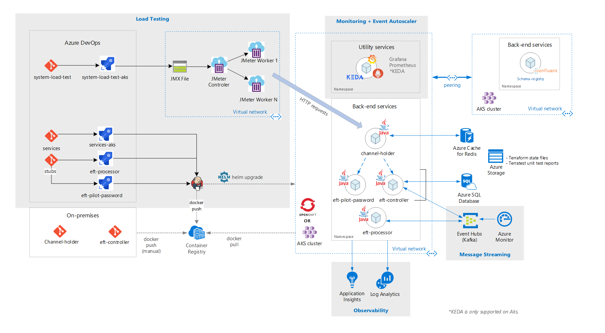

# Banking System Cloud Transformation on Microsoft Azure

## Introduction

This paper summarizes the patterns and implementations used by CSE to build a solution for a customer that would use synthetic and actual applications and use existing workloads to monitor the reaction of the infrastructure for scalability and performance compatible with the requirements of the payment system.

We will call the customer Contoso Bank, a major international Financial Services Industry (FSI) organization that is working on modernization of one of their financial transaction systems.

## Customer Scenario

Contoso Bank wanted to determine the impact of infrastructure scalability and reaction to failures in the existing architectural design of specific mainframe software through a set of simulations. This proposed solution would use a synthetic application to input functional scenarios and monitor the performance and scalability of the infrastructure in terms of the deliverables to be created. The aim was to determine the impact of failures in the mainframe Electronic Funds Transfer (EFT) system workloads through this set of simulations.  

There was also a requirement to propose a smooth DevOps transition in process and methodology from on-premises to the cloud by using the Contoso's existing tools, thereby reducing the upskill impact for the developers. The results of this transition would assist the customer in reviewing current and future design decisions and provide the confidence that Microsoft Azure would be a robust environment to host the new distributed systems.

### Key Solution Capabilities Required

The solution involves three deliverables, summarized below.

#### Horizontal Pod Autoscaling for Channel Holder

This deliverable runs a service called Channel Holder on Azure Red Hat OpenShift (ARO) and performs pod autoscaling tests on this service. This deliverable must achieve the following:

* Provide a DevOps pipeline from on-premises to Azure for the Channel Holder service
* Provide OpenShift cluster monitoring through a Grafana dashboard
* Execute horizontal pod autoscaling tests for the Channel Holder service
* Provide observability on the Channel Holder by activating metrics capture (for example, CPU utilization) with Prometheus and Grafana
* Provide a detailed report about the tests executed, the applications' behavior and the infrastructure tuning, if any

#### Node Autoscaling for Channel Holder

This deliverable focuses on running the Channel Holder service on Azure Kubernetes Service (AKS) to allow node autoscaling tests. This deliverable must achieve the following:

* Provide AKS cluster monitoring through a Grafana dashboard
* Execute node autoscaling tests for the Channel Holder service
* Provide observability on the Channel Holder by activating metrics capture with Prometheus and Grafana
* Provide a detailed report about the tests executed, the applications' behavior and the infrastructure tuning, if any

#### Scalability and Performance for Transaction Simulation

This deliverable focuses on running Channel Holder, EFT Controller, and EFT Processor services on ARO and AKS, and performs pod and node autoscaling and performance tests on all services. This deliverable must achieve the following:

* Execute performance tests over the microservices until 2000 transactions per second is reached/surpassed
* Execute horizontal pod/node autoscaling tests over the microservices
* Provide observability on the Channel Holder by activating metrics capture with Prometheus and Grafana
* Provide a detailed report about the tests executed, the applications' behavior and the Kafka partitioning strategies adopted

### Success Criteria

The following success criteria were defined during this engagement:

#### Global Criteria

The customer considered the following as successful criteria on all deliverables:

* To empower the Contoso technical team with the ability to apply digital transformation and cloud adoption by providing the necessary tools and processes in Azure, and demonstrating how they could continue using their existing tools
* Accompanying each deliverable would be a document on Azure DevOps covering:
  * Scalability and performance tests results
  * Parameters and metrics considered on each test
  * Any code or infrastructure change if needed during each test
  * Lessons learned on performance tweaks, performance tuning, and parameters considered for each test
  * Lessons learned and guidance on Kafka partitioning strategies
  * General architecture recommendations/guidance based on the learnings over the deliverables

#### Deliverables Criteria

| Metric | Value (range) |
| ------ | ------------- |
| Ability to run pod autoscaling tests on Channel Holder | Target: A new Channel Holder pod replica is created automatically after achieving 50% CPU utility |
| Ability to run node autoscaling based on Channel Holder | Target: New Kubernetes nodes created because of resource constraints on pods (for example, CPU utility), where the node increasing is limited to up to 3 nodes. |
| Ability to run pod/node autoscaling and performance tests on EFT Simulation | Target: New pod replicas for all services are created automatically after achieving 50% CPU utility and a new Kubernetes node is created because of CPU resource constraints. Application supporting 2000 transactions per second. |

## Technical Solution

The solution provided by the team included cross-cutting concerns in addition to specific implementations to achieve the target deliverables. It also had to adhere to some design constraints based on customer policies.

It is worth noting that because of a feature constraint on Azure Red Hat OpenShift 3.11,  Contoso requested the use of Azure Kubernetes Service for testing node autoscaling scenarios.

### Design Constraints

* Because of internal requirements, the customer stipulated the use of the following:
  * OpenShift 3.11 as the container orchestration platform.
  * Java and Spring Boot for Microservice development.
  * Kafka as the event streaming platform with Confluent Schema Registry feature.
* The solution must be cloud agnostic.
* DevOps and monitoring tools must be the same ones that Contoso already uses in their on-premises development environment.
* The source code that will be hosted in the on-premises environment cannot be shared to external environments. Contoso policy only allows moving container images from on-premises to Azure.
* Contoso policy restricts the ability for a CI pipeline to work between both on-premises environments and any cloud. All source code hosted in the on-premises environment was deployed as container images to Azure Container Registry manually. The deployment on the on-premises side was Contoso's responsibility.
* The simulated scenario for tests should use a subset of mainframe EFT workloads as a flow reference.
* Horizontal pod autoscaling and performance tests must be done on Azure Red Hat OpenShift.

### Global Cross-Cutting Concerns of the Solution

#### Message Streaming

Apache Kafka was used as the distributed message streaming platform for microservices. For better scalability, the team considered one consumer group per microservice, where each microservice instance is a scale unit to split and parallelize events processing.

The estimated ideal number of partitions per topic to support the estimated throughput can be calculated using a formula. For more information about the formula, see [How to choose the number of topics or partitions in a Kafka cluster?](https://www.confluent.io/blog/how-choose-number-topics-partitions-kafka-cluster/)

#### CI/CD velocity

For DevOps, Contoso already used an on-premises GitLab for their code repository and created CI/CD pipelines for development environments using a custom Jenkins-based solution that they developed internally, but this was not providing an optimal DevOps experience.

To deliver an improved DevOps experience for Contoso, the CSE team used Azure DevOps to manage the application lifecycle. The CI pipeline runs on every Pull Request, while the CD pipeline runs on every successful merge to master branch. Each member of the development team was responsible for managing the repositories and pipelines for each service, and enforcing code reviews, unit testing and linting (static source code analysis).

The team deployed services concurrently with no interdependency and used Jenkins agents as requested by the customer.

Prometheus was incorporated as part of the solution to monitor the services and the cluster, besides generating meaningful data the customer can use in the future to enhance the products based on daily usage. These metrics are displayed in a Grafana dashboard.

#### Rollout Strategy

The team rolled out the solution to the development environment through Azure DevOps. Each service had its own build and deployment pipeline. A deployment pipeline that can be manually triggered is used and should force a full deployment of the environment and the containers in a specific branch version.

Release branches were created, generating stable versions for deployment. Merging branches into the master branch only occurs when assured that it is ready to be deployed. A rollback strategy, beyond deploying the previous stable version, was out of scope for this engagement. Approval gates exist for each stage, which request deployment approval.

#### Disaster Recovery

The solution uses Terraform and Azure DevOps scripts for all the services. In case of a disaster, the customer can re-create the entire environment by using the provided Terraform scripts or by running the release pipeline again (Terraform understands that the environment has changed and recreates it). The solution dynamically provisions and destroys the infrastructure on Azure as needed. Storage accounts are ZRS (Zone redundant). A backup strategy was out of scope for this engagement.

#### Security and Privacy

* All container images are stored in a private registry (Azure Container Registry).
* ARO and AKS Secrets are used to inject sensitive data into pods, such as connection strings and keys.
* Access to Kubernetes API server require authentication through Azure Active Directory for ARO and AKS.
* Access to Jenkins require authentication through Azure Active Directory.

### Solution Description

#### Tech Stack

The list below summarizes the technologies that were used in the creation of this solution. Following this list is the full architectural diagram, which describes how these technologies interact.

:::row:::
    :::column:::
        __Microsoft__

      * Azure DevOps
      * Azure Kubernetes Services
      * Azure Redshift Service
      * Azure SQL Server
      * Azure Event Hubs (Kafka)
      * Azure Monitor
    :::column-end:::
    :::column:::
        __Third-party__

      * Customer back-end services
      * Docker
      * Grafana
      * Prometheus
      
    :::column-end:::
    :::column:::
        __Open Source__

      * KEDA
      * Helm
      * Chef
      * Apache JMeter
      * Redis
    :::column-end:::
:::row-end:::

#### Overall Solution Architecture

The following diagram shows the full solution architecture from end to end.

Figure 1 - Full Solution Architecture

The solution is made up of 3 main blocks: Backend Services, Load Testing and Monitoring, and Event Autoscaler.

The actual Contoso microservices containers were manually pushed through Docker to the Kubernetes cluster. This cluster was the Azure Red Hat OpenShift in the Horizontal Pod Autoscale for Channel Holder, and Scalability and Performance for Transaction Simulation  deliverables and AKS for the Node Autoscale for Channel Holder. The other microservices were created as stubs to specifically isolate the actual Contoso microservices from other external mainframe services that were pushed through ADO pipelines.

At the core, Backend Services provide the necessary logic for an EFT to happen:

1. A new EFT starts with an HTTP request received by the Channel Holder service, which provides synchronous responses to requesters using a Publish-Subscribe pattern through Redis cache while waiting for a backend response.
1. This initial request is validated using EFT-Pilot-Password service, which, besides performing validations, also enriches the data so the backend can distinguish whether the EFT should be processed by a legacy or a new microservice system.
1. The Channel Holder service then starts the asynchronous flow, calling EFT Controller, which is a reactive orchestrator that coordinates a transaction flow by producing commands and consuming events from other microservices through Event Hubs/Kafka.
1. One of these services is the EFT Processor, where the actual transaction is effectuated, performing credit and debit operations. KEDA, a framework that automatically scales applications based on the message numbers load, was used to scale the EFT Processor as new EFTs were being processed.

Next is Load Testing, which contains a custom solution based on JMeter, ACI, and Terraform. Load Testing was used to provision the necessary integration with Azure DevOps to perform load testing. This solution generated enough load on the backend services to validate that the autoscaling mechanisms were in place, creating thousands of EFT transactions per second.

Finally, Monitoring was responsible for integrating load testing results, infrastructure, and application metrics. The team was able to correlate a load testing run with the side effects on the storage and container orchestration layer, allowing a quick feedback cycle for application tuning. Prometheus, Grafana, Application Insights, and Azure Monitor were the core components that allowed this monitoring and observability capability. The Event Autoscaler supported the validation of a scenario where applications scale based on the message loading received. To implement this behavior the CSE team adapted KEDA to support the Java applications scaling.

### Solution Components

#### Horizontal pod autoscaling for Channel Holder Component

In this solution, the team used a Kubernetes/OpenShift Horizontal Pod Autoscaling (HPA) mechanism. HPA automatically scales the number of pods based on a selected metric, providing an efficient scale in and out mechanism for containers. Given the CPU bound nature of Channel Holder REST API, the team opted for using HPA with CPU so that the service replicas can grow as new EFTs occur.

#### Node Autoscaling for Channel Holder Component

Once HPA scales the replicas up to a point where it saturates the cluster infrastructure, a scale in and out mechanism for the nodes keeps the applications receiving and processing new requests. For that mechanism, the team used Kubernetes Node Autoscaling, which allowed the cluster to grow even when all nodes were close to their full capacity.

#### Scalability and Performance for Transaction Simulation Component

Using the load testing framework, the team generated enough load to trigger both HPA and Node Autoscaling mechanisms, which generated infrastructure and application metrics for them to validate Channel Holder scaling responses times and the application behavior under high load.

### Patterns & Implementations

#### Saga Pattern

##### Saga Overview

Saga is a pattern suitable for distributed transaction management commonly applied to financial services. In a scenario of operations distributed across applications and databases, customers will need a new architecture and implementation design to ensure data consistency on financial transactions.

The traditional ACID (atomicity, consistency, isolation, durability properties) approach is no longer suitable, as the data of operations are now spanned into isolated databases. Besides ACID transactions, a Saga (long lived sequence of transactions) addresses this challenge by coordinating a workflow through a message-driven sequence of local transactions to ensure data consistency.

##### How Saga was Implemented in Solution

Contoso Bank has an on-premises implementation of an orchestration-based Saga – where the orchestrator is a finite state machine (FSM) – and the following top challenges were found in the architecture design:

* Implementation overhead and complexity on the stateful orchestrator to handle with states management, timeouts, and restarts in failure scenarios
* Observability mechanisms for tracking the Saga workflow states per transaction request

The proposed solution below is a Saga pattern implementation through an orchestration approach using a serverless architecture on Azure. It addresses the challenges by using Azure Functions for the implementation of Saga participants, Azure Durable Functions for orchestration – where the workflow programming model and state management are provided by design – Azure Event Hubs as the data streaming platform, and Azure Cosmos DB as the database service to store data models.

For more information, see [Saga Pattern](https://microservices.io/patterns/data/saga.html) on Microservices.io.

##### Architecture

Figure 2 - Orchestration-based Saga on Serverless Architecture

#### KEDA with Java support for Event Hubs and Kafka

##### KEDA Overview

KEDA is a Kubernetes-based Event Driven Autoscaler. KEDA determines how any container within Kubernetes should be scaled based on the number of events that need to be processed. KEDA, which has a variety of out-of-the-box scalers, supports multiple types of workloads, supports Azure Functions, and is vendor-agnostic.

A sample for Kafka trigger scaler with KEDA using Event Hubs with Java application can be found [here](https://github.com/Azure-Samples/keda-eventhub-kafka-scaler-terraform.git).

##### How KEDA was Implemented in Solution

1. The application that needs to be scaled out automatically based on incoming message count is deployed on the AKS cluster. A Kafka scaler is used in this sample to detect if deployment should be activated or deactivated and to feed custom metrics for a specific event source. The event source in this example is an Azure Event Hub.
1. When the number of messages in the Azure Event Hub exceeds a threshold, KEDA triggers the pods to scale out, increasing the number of messages processed by the application. Automatic scale down of the pods occurs when the number of messages in the event source falls below the threshold value.
1. The Apache Kafka Topic Trigger was used to provide the ability to scale the EFT Processor service if the maximum number of messages consumed under an interval was exceeded.

Figure 3 - EFT Autoscaling with KEDA Kafka Topic Trigger

The following contributions on KEDA scalers were provided during the engagement:

* [Azure Event Hubs Trigger](https://keda.sh/docs/scalers/azure-event-hub/): Compatibility for reading Azure blob storage URI for Java applications using the [Event Processor Host](https://docs.microsoft.com/azure/event-hubs/event-hubs-event-processor-host) SDK, allowing the ability to scale Java consumers that read AMQP protocol messages from Event Hubs. Earlier the Event Hubs scaler worked only with Azure Functions.
* [Apache Kafka Topic Trigger](https://keda.sh/docs/scalers/apache-kafka-topic/): Support for SASL_SSL Plain authentication, allowing the ability to scale Java consumers that read Kafka protocol messages from Event Hubs.

#### Load Testing Framework - Pipeline with JMeter, ACI, and Terraform

##### Load Testing Pipeline Overview

The load testing framework used during the engagement is now open-sourced on GitHub. It is a flexible and scalable cloud load and stress testing pipeline solution that leverages Apache JMeter as the open-source load/performance tool and Terraform to dynamically provision and destroy the infrastructure on Azure.

The solution brings a great experience for developers and testers by integrating and consolidating JMeter testing results on Azure DevOps through Test Results and artifacts. The project can be found [here](https://github.com/Azure-Samples/jmeter-aci-terraform).

##### How Load Testing was Implemented in Solution

The load testing framework is structured into two Azure Pipelines:

1. A pipeline that builds a custom JMeter Docker container and pushes the image to Azure Container Registry (ACR). This structure brings flexibility for adding any JMeter plugin.
1. A pipeline that validates the JMeter test definition (.jmx file), dynamically provisions the load testing infrastructure, runs the load test, publishes the test results and artifacts to Azure DevOps and destroys the infrastructure.

Figure 4 - Load Testing Pipeline with JMeter, ACI, and Terraform

JMeter agents are provisioned as ACI instances using the Remote Testing approach, where a JMeter controller configures all workers using its own protocol and consolidates all load testing results and generates the resulting artifacts (for example, dashboard and logs).

A Python script was created to convert the JMeter test results format (.jtl file) to JUnit format (.xml file), allowing the integration of JMeter results with the Azure DevOps test results.

:::image type="content" source="./images/Azure-DevOps-Test-Results-Dashboard.png" alt-text="diagram of Azure DevOps test results dashboard":::

Figure 5 - Azure DevOps Test Results Dashboard

For more information about the load testing pipeline solution, see [Implementation Reference for JMeter Load Testing Pipeline Solution](jmeter-load-testing-pipeline-implementation-reference.md).

#### Applicable Scenarios

* High availability scenarios
* Event-driven scenarios
* Settlement transactions and order services scenarios (for example, e-commerce, food delivery, flight/hotel/taxi booking)
* Hybrid Architecture where AKS and ARO Clusters Coexist: Deployment definitions for backend services that were created in YAML.

## Conclusions

### Solution / Engagement Outcome

* A high level of compatibility was observed between AKS and ARO for services deployment.
* Application Insights Codeless makes it easier to create observability, collaborating to the cloud adoption on lift-and-shift migrations.
* Load testing is an important part of large scale intended solutions and requires previous analysis and planning to consider the microservice specificities.
* The load testing potential to find microservices side effects is frequently underestimated by customers.
* Creating a test environment may require an infrastructure disposal strategy to avoid unnecessary infrastructure cost.

### Key Learnings

The following key learnings were identified:

* There is a smooth application migration from ARO to AKS.
  * The Node Autoscaling feature was not available on Red Hat OpenShift version 3.11, which was the version being used during the engagement. As such, node autoscaling testing scenarios were done through Azure Kubernetes Service (AKS).
* A product's end-of-life may require creative customizations and a preparation phase plays an important role in the process of delivering a successful solution.
  * The use of the Azure DevOps Cloud Load Testing (CLT) functionality with Apache JMeter tests was recommended, but during the investigation phase the team identified that this functionality was deprecated in Azure DevOps and would no longer be available as of March 31, 2020 to load test functionality in Visual Studio and cloud load testing in Azure DevOps. So, a new solution was created integrating ACI, JMeter in the pipeline.
* Use of the Azure Event Hubs for Kafka is recommended, but for this customer, Schema Registry was an important feature. The Schema Registry feature was expected to be available as a private preview to Event Hubs in the middle of January 2020. To attend to the customer in the requested time frame, the team had to consider the use of Schema Registry in another instance of AKS.
* The Kafka protocol with Schema Registry was not supported by Event Hub Scaler in KEDA.

## Resources

1. [Load Testing Pipeline with JMeter, ACI, and Terraform](https://github.com/Azure-Samples/jmeter-aci-terraform): GitHub project site
1. [Implementation Reference for JMeter Load Testing Pipeline Solution](./jmeter-load-testing-pipeline-implementation-reference.md): Implementation reference documentation
1. [Sample Java Kafka Event Hub scaler](https://github.com/Azure-Samples/keda-eventhub-kafka-scaler-terraform): KEDA for Java sample
1. [Saga Pattern](https://microservices.io/patterns/data/saga.html): Information about the Saga pattern on Microservices.io