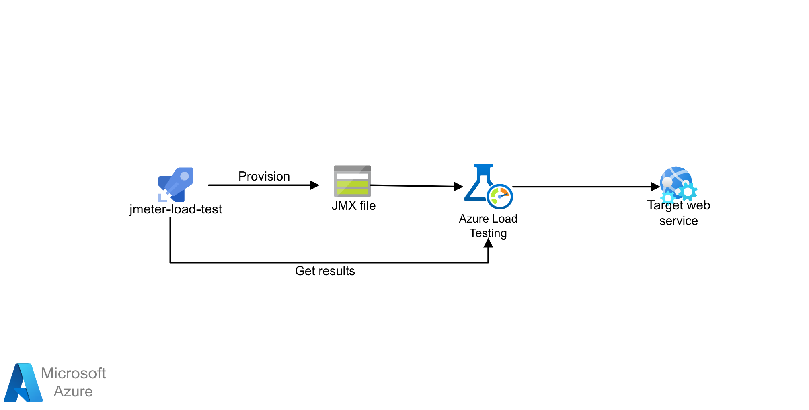

This article covers the patterns and implementations the commercial software engineer (CSE) team used when they created the [Banking system cloud transformation on Azure](banking-system-cloud-transformation.md).

## Saga pattern

### Saga overview

[Saga](/azure/architecture/reference-architectures/saga/saga) is a pattern suitable for distributed transaction management commonly applied to financial services. A new scenario has emerged where operations are distributed across applications and databases. In the new scenario, customers will need a new architecture and implementation design to ensure data consistency on financial transactions.

The traditional atomicity, consistency, isolation, and durability (ACID) properties approach is no longer suitable. It's because the data of operations are now spanned into isolated databases. Using a Saga pattern addresses this challenge by coordinating a workflow through a message-driven sequence of local transactions to ensure data consistency.

### Saga implementation

Contoso Bank has an on-premises implementation of an orchestration-based Saga. In their implementation, the orchestrator is a finite state machine (FSM). The CSE team identified the following challenges in the architecture design:

* Implementation overhead and complexity on the stateful orchestrator to handle with states management, timeouts, and restarts in failure scenarios.

* Observability mechanisms for tracking the Saga workflow states per transaction request.

The proposed solution below is a Saga pattern implementation through an orchestration approach using a serverless architecture on Azure. It addresses the challenges by using:

* Azure Functions for the implementation of Saga participants.

* Azure Durable Functions for orchestration – designed to provide the workflow programming model and state management.

* Azure Event Hubs as the data streaming platform.

* Azure Cosmos DB as the database service to store data models.

For more information, see [Saga Pattern](https://microservices.io/patterns/data/saga.html) on Microservices.io.

### Saga architecture

## KEDA with Java support for Event Hubs and Kafka

### KEDA overview

KEDA is a Kubernetes-based Event Driven Autoscaler. KEDA determines how the solution should scale any container within Kubernetes. The decision is based on the number of events that it needs to process. KEDA, which has different kinds of scalers, supports multiple types of workloads, supports Azure Functions, and is vendor-agnostic. Go to [Autoscaling Java applications with KEDA using Azure Event Hubs](https://github.com/Azure-Samples/keda-eventhub-kafka-scaler-terraform.git) to explore a working sample.

### KEDA implementation

1. The CSE team deployed the application on the AKS cluster. The solution needed to scale out the application automatically based on the incoming message count. The CSE team used a Kafka scaler to detect if the solution should activate or deactivate application deployment. The Kafka scaler also feeds custom metrics for a specific event source. The event source in this example is an Azure Event Hub.

1. When the number of messages in the Azure Event Hub exceeds a threshold, KEDA triggers the pods to scale out, increasing the number of messages processed by the application. Automatic scale down of the pods occurs when the number of messages in the event source falls below the threshold value.

1. The CSE team used the Apache Kafka Topic Trigger. It gives the solution the ability to scale the EFT Processor service if the process exceeded the maximum number of messages consumed under an interval.

For more information on KEDA scalers, see the following KEDA docs:

* [Azure Event Hubs Trigger](https://keda.sh/docs/1.5/scalers/azure-event-hub/): Compatibility for reading Azure blob storage URI for Java applications. It uses the [Event Processor Host](https://docs.microsoft.com/azure/event-hubs/event-hubs-event-processor-host) SDK, allowing the ability to scale Java consumers that read AMQP protocol messages from Event Hubs. Earlier the Event Hubs scaler worked only with Azure Functions.

* [Apache Kafka Topic Trigger](https://keda.sh/docs/1.5/scalers/apache-kafka/): Support for SASL_SSL Plain authentication, allowing the ability to scale Java consumers that read Kafka protocol messages from Event Hubs.

## Load Testing framework - pipeline with JMeter, ACI, and Terraform

### Load Testing pipeline overview

The load testing framework used during the engagement is now open-sourced on GitHub. The framework is a flexible and scalable cloud load and stress testing pipeline solution. It uses Apache JMeter as the open-source load/performance tool and Terraform to dynamically provision and destroy the infrastructure on Azure.

The solution creates a great experience for developers and testers. The experience is improved by integrating and combining JMeter testing results on Azure Pipelines through Test Results and artifacts. See [Load Testing Pipeline with JMeter, ACI, and Terraform](https://github.com/Azure-Samples/jmeter-aci-terraform).

### Load Testing Implementation

The CSE team structured the load testing framework into two Azure Pipelines:

1. A pipeline that builds a custom JMeter Docker container and pushes the image to Azure Container Registry (ACR). This structure brings flexibility for adding any JMeter plugin.

1. A pipeline that validates the JMeter test definition (.jmx file), dynamically provisions the load testing infrastructure, runs the load test, publishes the test results and artifacts to Azure Pipelines and destroys the infrastructure.

The solution provisions JMeter agents as ACI instances. It uses the Remote Testing approach. In the approach, a JMeter controller configures all workers using its own protocol and combines all load testing results. Finally, it generates the resulting artifacts like dashboard and logs.

The CSE team created a Python script to convert the JMeter test results format (.jtl file) to JUnit format (.xml file), allowing the integration of JMeter results with the Azure Pipelines test results.

:::image type="content" source="./images/azure-test-results-dashboard.png" alt-text="Diagram of Azure Pipelines test results dashboard.":::

For more information about the load testing pipeline solution, see [Implementation Reference for JMeter Load Testing Pipeline Solution](jmeter-load-testing-pipeline-implementation-reference.md).