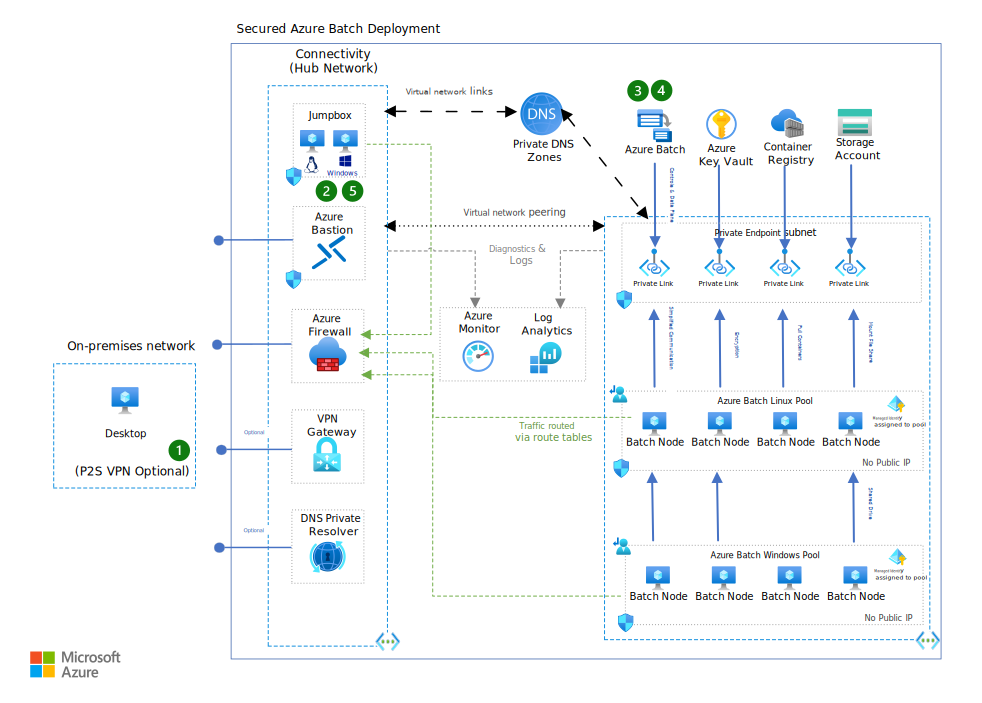

This article describes a baseline architecture for running Financial Service Industry (FSI) workloads on Azure using Azure Batch.

## Architecture

*Download a [Visio file](https://arch-center.azureedge.net/secured-azure-batch-with-numbers.vsdx) that contains this architecture diagram.*

### Workflow

This example scenario demonstrates how to run FSI workloads on Azure using Azure Batch. Here is a typical workflow you might follow:

1. Connect to the private network using VPN Gateway. Alternatively, RDP or SSH to the jumpbox VMs using Azure Bastion. Either approach can be used to connect to the private network.
1. Upload any datasets for processing to the storage account using the Azure CLI, Azure Storage Explorer, or `azcopy`.
1. Submit jobs to process the data to the Batch service using the Azure CLI, Batch Explorer, or other tools. For this example deployment, we developed a [custom command line tool](https://azure.github.io/bacc/cli.html) that you can also use to submit jobs.
1. Resize the pool to add compute nodes to the pool. By default, the deployment creates a pool with no compute nodes.
1. Download results from the storage account. After the job is complete, the results are stored in the storage account. These results can then be downloaded using the Azure CLI, Azure Storage Explorer, or `azcopy`.

### Components

This architecture consists of several Azure services and is divided into two categories of resources: hub resources and spoke resources. More detail about the [hub and spoke network topology](#network-topology) is provided later in this article. The services for each and their roles are described in the following sections.

#### Hub resources

Let's start by looking at the resources deployed on the hub network. These shared resources enable, filter, and monitor
communication between the spoke network and the outside world.

The following resources are deployed on the hub network:

- [Azure Firewall](https://azure.microsoft.com/services/azure-firewall) provides network-level protection for the network. The firewall is configured to allow only specific traffic in and out of the network. This configuration helps protect the network from malicious attacks and monitor traffic in and out of the network. The rules should be updated based on your business-specific rules and regulations.

- [Azure VPN Gateway](https://azure.microsoft.com/services/vpn-gateway) enables one of two ways to connect to the hub network from the public internet. The other way is to use Azure Bastion service. The VPN gateway is assigned a public IP address so that VPN clients can connect to it from the public internet.

- [Azure Bastion](https://azure.microsoft.com/services/azure-bastion) enables one of two ways to connect to jumpboxes from the public internet. The other way is to use VPN gateway. Azure Bastion is deployed on the hub network and is assigned a public IP address so that users can connect to it from the public internet.

- [Linux Jumpbox](https://azure.microsoft.com/services/virtual-machines) is a Linux VM with preinstalled tools to access the resources deployed, submit jobs, and monitor their progress. The jumpbox is deployed on the hub network and can be accessed from the on-premises network using the VPN gateway or Azure Bastion.

- [Windows Jumpbox](https://azure.microsoft.com/services/virtual-machines) is a Windows VM with preinstalled tools to access the resources deployed, submit jobs, and monitor their progress. The jumpbox is deployed on the hub network and can be accessed from the on-premises network using the VPN gateway or Azure Bastion.

- [Log Analytics Workspace](https://azure.microsoft.com/services/log-analytics) enables collection of logs. Whenever possible, resources deployed are configured to save logs to the workspace. The logs are used to monitor the resources and troubleshoot issues. When combined with [Azure Application Insights](/azure/azure-monitor/app/app-insights-overview?tabs=net), it provides performance monitoring and troubleshooting capabilities for the resources deployed.

- [Azure DNS Private Resolver](/azure/dns/dns-private-resolver-overview) provides an inbound endpoint to resolve IPs of private endpoints if queried outside of the provisioned virtual network, for example, from on-premises resources. DNS Private Resolver is deployed when the Azure VPN Gateway is deployed.

#### Spoke resources

Let's now look at the resources deployed on the spoke network. These resources help run the computation workloads and all supporting resources.

The resources deployed on the spoke network are as follows:

- [Azure Batch](https://azure.microsoft.com/services/batch) is the core service that our architecture relies on for cloud-native job scheduling and execution. Azure Batch manages the compute resources required, schedules the tasks on the compute resources, and monitors the tasks for completion. The Batch service is deployed with two pools: a pool named `linux` with Linux compute nodes and a pool named `windows` with Windows compute nodes. The pools are configured to do the following:

  - They use user subscription pool allocation mode. All resources that are used internally by the Batch service are allocated under the same subscription as the Batch account and use the subscription specific quotas and policies.
  - They use the corresponding subnets on the spoke network, thus they get assigned address space from the subnet's address range. It also means that all network security group (NSG) rules and traffic forwarding rules set up on those subnets are applied to the compute nodes as well.
  - They don't assign public IP addresses to the compute nodes to ensure that the compute nodes aren't accessible from the public internet directly.
  - They make it easier for workloads executing on compute notes to access shared storage resources, by mounting the supported storage resources on the compute nodes during initialization.
  - They use a user-assigned managed identity to authenticate the compute nodes with storage account, container registry, and any other resources as they join the Batch pool. Doing so ensures that the compute nodes are authenticated using certificates instead of passwords or keys.

- [Azure Key Vault](https://azure.microsoft.com/services/key-vault) stores deployment secrets such as Batch account certificates. These certificates are used to authenticate compute node resources as they join the Batch pool. The Key Vault is deployed on the spoke network and is configured to allow access only from the Batch service. This configuration ensures that the certificates aren't accessible from the public internet.

- [Azure Storage](https://azure.microsoft.com/services/storage) stores input and output data. The deployment creates two storage accounts: one for blob storage and one for file storage. The blob storage account is mounted on Linux pool using NFS. The file storage account is mounted on both Linux and Windows pool using SMB.

- [Azure Container Registry](https://azure.microsoft.com/services/container-registry) stores container images used by the Batch compute nodes. Using a private deployment of the container registry helps control access to container images and also provides a more secure way to store container images. The container registry is deployed on the spoke network and is configured to allow access only from the Batch service. This configuration ensures that the container images aren't accessible from the public internet.

- [Azure Managed Identity](/azure/batch/managed-identity-pools) is used to authenticate the compute nodes added to pools automatically with container registry, storage accounts, and other resources.

### Alternatives

- [Azure Kubernetes Service (AKS)](https://azure.microsoft.com/products/kubernetes-service) can be used instead of Azure Batch service for a similar configuration for containerized applications.

- [Azure CycleCloud](/azure/cyclecloud) can be used to manage high-performance computing (HPC) clusters on Azure. Such HPC clusters can be set up to run workloads similar to the ones targeted by this article.

## Scenario details

A common computing pattern in FSI is to run a large number of compute-intensive simulations on an input dataset that characterizes a financial instrument or a portfolio of financial instruments. The simulations are typically run in parallel and the results are aggregated to produce a summary of the portfolio's risk profile.

This architecture isn't focused on a particular workload, rather it focuses on applications that want to use Azure Batch to run compute-intensive simulations. Any production deployment architecture must be customized to meet the specific requirements of the workload and business environment. This architecture is intended to be used as a starting point for such customizations for preproduction and production deployments.

### Potential use-cases

This architecture can be used to run a wide variety of FSI workloads. Some examples include:

- Risk analysis of a portfolio of financial instruments
- Monte Carlo simulations to estimate the value of a financial instrument
- Back testing of trading strategies
- Stress testing of a portfolio of financial instruments

### Network topology

This architecture uses a hub-and-spoke network topology. The hub and spoke resources are deployed in separate virtual networks that are connected through virtual network peering. The hub network contains shared resources such as firewalls, VPN gateways, and jump boxes. The spoke network contains the Batch service and Batch compute nodes. It also includes other service endpoints needed by the workload, such as storage accounts, container registry, and so on. The spoke network is isolated from the public internet and can only be accessed from the hub network.

Here are some highlights of the network topology:

- Resources on spoke are isolated from the public internet and can only be accessed from the hub network, which minimizes direct exposure of the resources to the public internet.
- All outgoing traffic, including that from the pool compute nodes, is routed through a firewall, which ensures that all outgoing traffic is filtered, logged, and tracked.
- The firewall is configured to allow only allowlisted traffic, which ensures that only the allowlisted traffic can go out of the virtual network.
- Access to resources on the spoke network is enabled through optionally deployed VPN gateway or Azure Bastion. Both provide secure ways to connect to the hub network from the public internet.
- Windows and Linux jumpboxes are provided with preinstalled tools to access the resources deployed, submit jobs, and monitor their progress. These jumpboxes are deployed on the hub network and can be accessed from the on-premises network using the VPN gateway or Azure Bastion.
- All Azure services use private endpoints to ensure that they're accessed over private network instead of accessing them through public endpoints. This configuration also helps ensure that the services aren't accessible from the public internet.
- NSG rules are set up to allow only the required traffic in and out of the virtual network. This configuration helps protect the network from malicious attacks and monitor traffic in and out of the network. These rules even restrict the traffic between the resources in the virtual network.

#### Hub virtual network

The hub virtual network contains resources that allow or monitor traffic in and out of the spoke network. The virtual network defines the following subnets in the deployment template:

1. `GatewaySubnet`: subnet for the VPN gateway, if deployed
1. `AzureBastionSubnet`: subnet for the Azure Bastion service, if deployed
1. `AzureFirewallSubnet`: subnet for the Azure Firewall service
1. `sn-jumpbox`: subnet for the jumpboxes
1. `sn-dnspr`: subnet delegated to Azure DNS resolver

#### Spoke virtual network

The spoke virtual network contains the Batch service, Batch compute nodes, and other service endpoints needed by the workload. The virtual network defines the following subnets in the deployment template:

1. `pool-linux`: subnet for the Linux pool
1. `pool-windows`: subnet for the Windows pool
1. `private-endpoints`: subnet used for private endpoints for Azure services deployed on the spoke network

The spoke network is peered with the hub network, which allows the resources on the spoke network to access the resources on the hub network. Route tables are set up to ensure that the traffic between the spoke is routed through the firewall.

### Accessing the resources

To submit computation jobs to the Batch service, connect with the Batch service endpoint to submit jobs and monitor their progress. Since the Batch service is set up to use private endpoints, it can only be accessed from within the network.

The architecture provides two options to connect to the network so you can submit jobs to the Batch service:

- **Use VPN Gateway**. Connect to the hub network using a VPN Gateway. After being connected to the VPN, you can submit jobs to the Batch service from the local machine directly, which also makes it easier to monitor jobs using Batch Explorer installed on the local machine. This configuration requires that the Azure CLI, Batch Explorer, and other tools are installed on the local machine. Alternatively, after connected to the VPN, you can use the Linux or Windows Jumpboxes to submit jobs to the Batch service. Doing so requires that you have an SSH client or RDP client installed on the local machine.

- **Use Azure Bastion**. Instead of using VPN, you can use Azure Bastion to sign in to the Linux or Windows Jumpboxes. Sign in to the Azure portal and then use Azure Bastion to sign in to the jumpbox VM directly from the web browser. After signed in to the jumpbox, you can submit jobs to the Batch service using the Azure CLI, Batch Explorer, and other tools installed on the jumpbox.

## Considerations

These considerations implement the pillars of the Azure Well-Architected Framework, which is a set of guiding tenets that can be used to improve the quality of a workload. For more information, see [Microsoft Azure Well-Architected Framework](/azure/architecture/framework).

In this example workflow, we rely on manual data transfer and submission of jobs as a good starting point for workloads that aren't yet ready for automation. However, for production workloads, we recommend automating the data transfer and job submission, which can be done using [Azure Data Factory](/azure/data-factory) or other workflow orchestration tools.

Batch pools can be set up to automatically scale up and down based on the number of jobs submitted to the pool. This configuration helps reduce the cost of running the pool when there are no jobs to run. For more information, see [Scale compute nodes in an Azure Batch pool automatically](/azure/batch/batch-automatic-scaling).

### Security

Security provides assurances against deliberate attacks and the abuse of your valuable data and systems. For more information, see [Overview of the security pillar](/azure/architecture/framework/security/overview).

To minimize sharing of secrets such as passwords and keys, the architecture uses managed identities to authenticate the compute nodes with storage account, container registry, and other resources as they join the Batch pool. This authentication is done by assigning managed identities to the Batch pools and then granting the managed identities access to the resources. The managed identities can be granted the least privilege required to access the resources by using role-based access control.

The architecture also uses private endpoints to help ensure that the services aren't accessible from the public internet. This configuration helps minimize the attack surface and also helps ensure that the services are accessed over private network instead of accessing them through public endpoints.

The architecture also uses Azure Firewall to filter and monitor traffic in and out of the network. The firewall is configured to allow only allowlisted traffic, which ensures that only the allowlisted traffic can go out of the virtual network. This configuration helps protect the network from malicious attacks and monitors traffic in and out of the network.

The compute nodes themselves aren't accessible from the public internet because public IP addresses aren't assigned to the compute nodes.

### Cost optimization

Cost optimization is about looking at ways to reduce unnecessary expenses and improve operational efficiencies. For more information, see [Overview of the cost optimization pillar](/azure/architecture/framework/cost/overview).

Azure Batch itself is a free service, and customers pay only for the underlying virtual machine, storage, and networking costs. In this workload, besides the compute nodes, the storage account, jumpboxes, VPN gateway, and Azure Bastion are the other resources that incur cost. Since the workload is designed to support alternatives for accessing the resources, the cost of running can be optimized by choosing one of those paths. For example, if VPN gateway is preferred for accessing resources, then Azure Bastion and jumpbox VMs can be disabled during deployment to reduce the cost.

To help reduce costs associated with the compute resources, use VM SKUs that are more cost effective for the workload. Further, using spot instances or pool autoscaling can help reduce the costs associated with compute nodes.

To determine the cost of running this workload, see [Azure pricing calculator](https://azure.microsoft.com/pricing/calculator/).

### Performance efficiency

Performance efficiency is the ability of your workload to scale to meet the demands placed on it by users in an efficient manner. For more information, see [Performance efficiency pillar overview](/azure/architecture/framework/scalability/overview).

With Batch, performance efficiency is achieved by using the right VM SKUs for the workload. Refer to [Azure compute unit](/azure/virtual-machines/acu) for details on how to choose the right VM SKUs for the workload. [Choosing the VM size for compute nodes](/azure/batch/batch-pool-vm-sizes) provides more guidance on choosing the right VM SKUs based on the deployment region.

## Deploy this scenario

The infrastructure-as-code (IaC) source-code for this reference architecture is available in the [Azure Batch accelerator repository](https://github.com/Azure/bacc). The included tutorials demonstrate how to deploy this reference architecture and how to use it to run a sample FSI workload, named `azfinsim`. You can also use the following button to deploy the resources under your subscription using Azure portal:

## Contributors

*This article is maintained by Microsoft. It was originally written by the following contributors.*

Principal authors:

- [Utkarsh Ayachit](https://www.linkedin.com/in/utkarsh-ayachit/) | Principal Program Manager
- [Darko Mocelj](https://www.linkedin.com/in/darko-mocelj/) | EMEA HPC & AI Sr. Technology Specialist

## Next steps

- [What is Azure Batch?](/azure/batch/batch-technical-overview)
- [What is Azure Virtual Network?](/azure/virtual-network/virtual-networks-overview)
- [Azure Storage accounts](/azure/storage/common/storage-account-overview)
- [Data processing with Batch and Data Factory](/azure/data-factory/transform-data-using-custom-activity)

Learn modules

- [Design an Azure compute solution](/training/modules/design-compute-solution)

## Related resources

- [HPC system and big-compute solutions](../../solution-ideas/articles/big-compute-with-azure-batch.yml)
