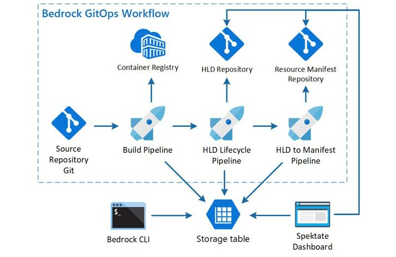
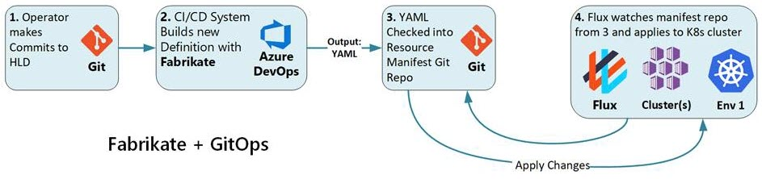
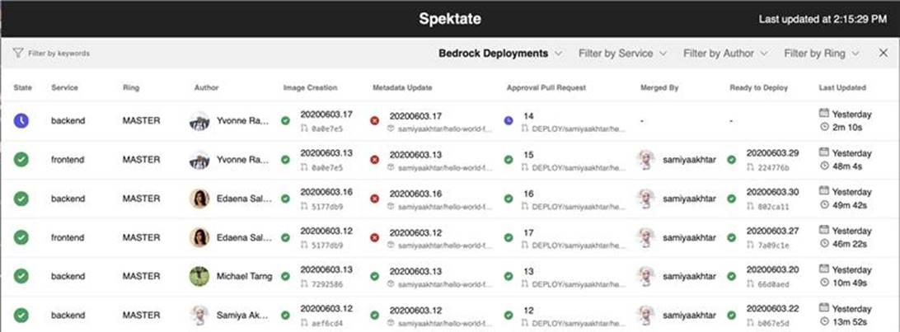
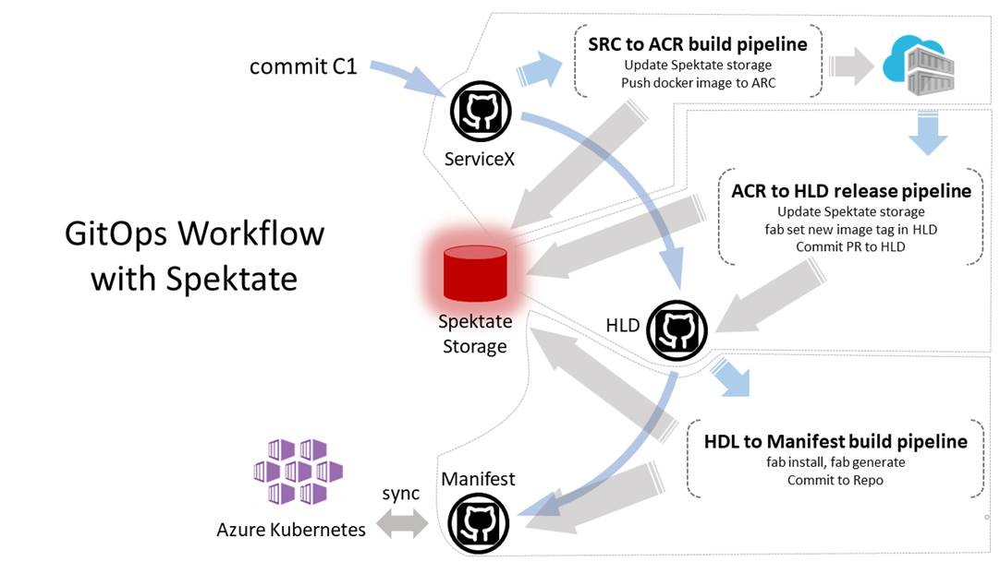
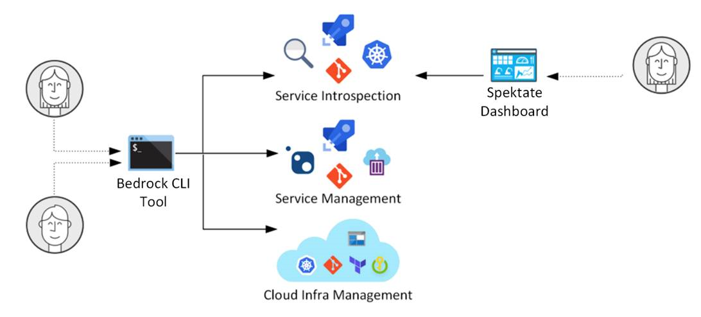
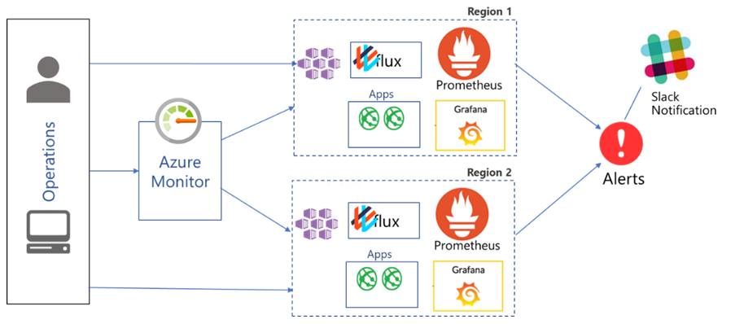
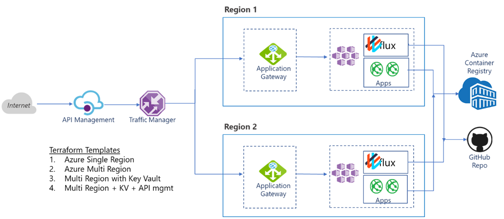

# Automated Kubernetes deployments with Bedrock

Configuring [Kubernetes](#kubernetes) deployments and managing clusters can be a complex and time-consuming process complicated by missteps and lurking errors. [Bedrock](https://github.com/microsoft/bedrock) was born from the collective experience of helping many customers adopt the new architectural patterns for Kubernetes. At the same time, applying DevOps principles and tooling make the development, deployment, and maintenance of these Kubernetes based apps sustainable at a production level.

[GitOps](#gitops) is the name applied to this pattern and Bedrock is the pattern of best practices for implementing apps with GitOps in Azure.

Using Bedrock, organizations can fast track their end-to-end Kubernetes deployments including infrastructure provisioning, GitOps setup, [Azure Pipelines](https://azure.microsoft.com/services/devops/pipelines/) for automated workflow, and observability into the deployment status.

Bedrock has the following objectives for addressing the challenges of configuring Kubernetes deployments and managing clusters:

* Provide a way to deploy infrastructure reliably and efficiently.
* Allow service deployments to be secure and auditable.
* Provide a workflow that is readily adaptable to any organization’s needs.
* Remove the need for developers to hand edit complex YAML files that define infrastructure.
* Provide a comprehensive view of cluster deployment status for developers and Site Reliability Engineers (SREs).
* Provide all of these things in an efficient and repeatable process that works in the real world.

To achieve these objectives, the Microsoft Commercial Software Engineering (CSE) team identified the following principal requirements for Bedrock:

* Leverage full cloud native capabilities.
* Enable the implementing of complex microservices architectures on Kubernetes.
* Provide an end-to-end workflow for deploying a complete Kubernetes solution using proven practices.
* Embody practical real-world experiences at scale.
* Validate and improve the solution by implementation with actual customers.

## Potential use cases

Bedrock helps you with these use cases:

* Define and maintain infrastructure deployments across multiple clusters.
* Deploy and automate a secure end-to-end GitOps workflow.
* Deploy and manage service workloads from source code to their deployment in-cluster.
* Observe ongoing deployments across multiple services, their revisions, and multiple clusters using those services.

## Architecture

1. High-Level Definition (HLD) files maintained in a Git repository drive the Bedrock GitOps workflow.
2. A Git pull request (PR) initiates the process, and based on a specific HLD script from the repo, the [Azure Pipeline](https://azure.microsoft.com/services/devops/pipelines/) automation processes the HLD script through [Fabrikate](#fabrikate) to generate the required YAML manifest files and stores them in the manifest repo.
3. The [Spektate](#spektate) dashboard monitors the deployment and provides status.

This workflow includes provisions for:

* Fabrikate HLD definitions that allow you to make use of common elements across multiple deployments. With Fabrikate, you can share structure between different clusters by making a configuration change in an HLD script and a pull request.
* Bedrock tools that include [guidance and automation](https://github.com/microsoft/bedrock/blob/master/gitops/README.md) for building GitOps pipelines with [Azure Pipelines](https://azure.microsoft.com/services/devops/pipelines/) or other popular Continuous Integration and Continuous Delivery (CI/CD) orchestrators.
* Bedrock deployment automation that includes setting up the GitOps operator [Flux](#flux) in your cluster, automatically ensuring that the state of a cluster matches the configuration stored in Git.

## Components

Bedrock makes use of the following components.

### Kubernetes

[Kubernetes](https://kubernetes.io/) is an open-source container-orchestration system (maintained by the Cloud Native Computing Foundation) for automating application deployment, scaling, and management. Kubernetes provides a platform for automating deployment, scaling, and operations of containerized applications across clusters of hosts. Kubernetes is central to Bedrock because it has proven to be an effective foundation for building efficient and scalable applications in the cloud.

You can deploy and manage containerized applications more easily with a fully managed Kubernetes service. [Azure Kubernetes Service (AKS)](https://azure.microsoft.com/services/kubernetes-service) offers serverless Kubernetes, a CI/CD experience, and enterprise-grade security and governance.

Kubernetes works with containerized applications. Containers are readily versioned and managed through development and deployment. By including the infrastructure configuration manifests in this management structure, it becomes easier to deploy to the correct infrastructure and have alternate infrastructure definitions available for different purposes. This process is the essence of how Bedrock implements *Infrastructure as Code (IaC)* using [Terraform](#terraform) templates. IaC is the process of managing and provisioning the technology stack for an application through version-controlled software, rather than using a manual process to configure discrete hardware devices and operating systems.

### GitOps

[GitOps](https://www.weave.works/technologies/gitops/) is DevOps applied to Kubernetes based systems. The automation and coordination of development, orchestration, monitoring, and maintenance becomes the focus of the Bedrock pattern and process using GitOps. Kubernetes is a declarative system configured by a set of facts instead of by a set of instructions.

Git source control keeps the desired state of your system, providing a simple model for auditing deployments and rolling back to a previous state. The Git repository provides auditability for moving between the states of a deployment, and the Git commit history provides a full accounting for the application deployment state transitions made by the cluster.

Bedrock takes advantage of the following aspects of GitOps:

* GitOps and Kubernetes both use a declarative model.
* The deployment process centers on a repository of HLD files that holds the current expected state of the system.
* Making commits to the HLD repository makes operational changes to the running system.
* The in-cluster daemon Flux watches the HLD repository, detects divergence, and reconciles the current state of the cluster.
* The prescriptive style of GitOps accommodates IaC for a cloud native environment.
* The easy mental model for deployments. When you change the HLD definition of what should be running, the system conforms to it.
* GitOps is more secure because the cluster pulls what it should be running from a verified endpoint via Transport Layer Security (TLS) and does not expose external endpoints for configuration changes.

The following image shows how these aspects all interact.

### Terraform

[Terraform](https://www.terraform.io/) is an open-source tool for building, changing, and versioning infrastructure safely and efficiently. Terraform enables you to define and provision the infrastructure of a cloud-based application using a high-level configuration language known as [Hashicorp Configuration Language (HCL)](https://github.com/hashicorp/hcl). These configuration files describe the components needed to run simple or complex applications.

Based on the selected configuration files, Terraform generates an execution plan describing what it will do to reach the desired deployment state and then executes the plan to build the described infrastructure. As the configuration changes, Terraform determines what changed and creates an incremental execution plan for applying changes. This ability makes Terraform highly suitable for supporting Kubernetes in a CI/CD process environment.

Like other Bedrock components, Terraform has certain features that fit well into the Bedrock process:

* Declarative infrastructure deployment
* Multi-operator support
* Pre-configured Azure environments that are available in template form for common enterprise scenarios.

Bedrock provides the following sample templates that developers can use as starting points for their own deployments with AKS and GitOps. These templates also support multiple clusters:

* [azure-simple](https://github.com/microsoft/bedrock/tree/master/cluster/environments/azure-simple)
* [azure-single-keyvault](https://github.com/microsoft/bedrock/tree/master/cluster/environments/azure-single-keyvault)

### Fabrikate

[Fabrikate](https://github.com/Microsoft/fabrikate) is a central part of GitOps in Bedrock. Fabrikate converts the HLD script files to the YAML configuration files required for Kubernetes deployment.

Most cloud infrastructure tools and environments support reading a manifest document that automates the process of creating and setting up environments that support multiple features. A Kubernetes based system deployment typically uses a manifest created in YAML. Creating these manifests manually can be time-consuming and tedious. So, using a tool to simplify manifest creation will increase productivity and reduce errors.

Fabrikate simplifies the front end of the GitOps workflow by using templating tools like [Helm](#helm) to render a high-level Kubernetes deployment description into YAML resource manifests. Fabrikate runs as part of the CI/CD pipeline such that every commit to your Fabrikate deployment definition triggers the generation of Kubernetes deployment manifests. The in-cluster GitOps pod Flux watches for new commits and reconciles them with the current set of applied resource manifests in the Kubernetes cluster.

The following diagram shows the integration of Fabrikate into the GitOps workflow.

For example, Fabrikate allows you to write DRY resource definitions (used for dry-run deployments) and configurations for multiple environments while taking advantage of the broad Helm chart ecosystem. These special purpose HLD scripts become shareable components that both simplify and support making deployments more auditable.

The following example shows how to specify some common resources in a sample HLD script.

### Spektate

[Spektate](https://github.com/Microsoft/Spektate) service introspection is an enabler for instrumentation. An introspection service can reveal information about the cloud internals to interested applications. The Spektate service introspection tool provides insight into the deployment status at all times, allowing it to facilitate the reliability, security, and auditability of deployments.

Kubernetes deployments can be complex. Multiple microservices become even more complicated when considering factors like latency, scalability, and reliability to deployments across multiple clusters in multiple regions and zones. This complexity creates a practical problem to determine the current state of any individual cluster or a collection of clusters that collectively carry the workload demands. Bedrock addresses this problem with Spektate by integrating it with the GitOps pipeline and service management that is a key element of the Bedrock process.

Spektate provides views into the current status of any change in the system. These changes can include everything from tracking continuous integration builds to tracking the deployment of the container holding the build commit in each of the downstream clusters consuming that container.

The following screenshot shows a view of Bedrock deployments in the Spektate dashboard.

Spektate includes:

* A Bedrock GitOps pipeline that reports back with data for each of the steps of the system; currently supported in [Azure DevOps Services](https://azure.microsoft.com/services/devops/).
* An [Azure Storage](https://azure.microsoft.com/services/storage/) table that stores the data for reporting.
* Integration with the [Bedrock Command Line Interface (CLI)](https://github.com/microsoft/bedrock-cli) and a web dashboard.

Developers and SREs need to be able to monitor and observe the entire deployment and workflow. Bedrock includes the Spektate dashboard as part of the [Bedrock CLI](#bedrock-cli) to simplify deployment management by providing an easy to use view of the deployment process and operational clusters.

For example, developers and SREs need a comprehensive view of deployment status changes as they make their way from application level changes to the cluster, including the GitOps sync status. The Spektate dashboard provides this valuable overview capability.

The following diagram shows how Spektate and the Bedrock CLI integrate with the GitOps workflow.

Bedrock accommodates the deployment of additional tools to handle special monitoring needs that the Spektate dashboard cannot fulfill. For more information, see [Extend Bedrock](#extend-bedrock).

### Flux

[Flux](https://github.com/fluxcd/flux) is a tool that automatically ensures that the state of a cluster matches the configuration defined in Git. Flux uses an operator in the cluster to trigger deployments inside Kubernetes, fulfilling the role of a CD tool. Flux monitors all relevant image repositories, detects new images, triggers deployments, and updates the running configuration based on those changes and a configurable policy.

Flux provides these benefits to Bedrock:

* You do not need to grant your CI automation access to the cluster.
* Every change is atomic and transactional.
* Git provides your audit log.
* Each transaction either fails or succeeds cleanly.
* You are entirely code-centric, fully supporting IaC.

Flux is most useful when used as a deployment tool at the end of a CD pipeline. Flux makes sure that your new container images and config changes propagate to the cluster, as shown in the following diagram.

### Helm

[Helm](https://helm.sh/) is a Kubernetes package manager that streamlines the installing and managing of Kubernetes deployments. 

Helm uses charts to package pre-configured Kubernetes resources. These pre-configured resources allow for application deployments defined as Helm charts, which support reproducible builds of your Kubernetes applications. Helm also allows you to intelligently manage your Kubernetes manifest files and releases of Helm packages. Helm packages (or charts) contain at least two items: a description of the package (`Chart.YAML`) and one or more templates containing Kubernetes manifest files. Helm stores these charts in Git repositories and fetches them as needed, communicating with the Kubernetes API to render the correct templates for a deployment.

### Bedrock CLI

The system cloud infrastructure and deployed services require management, and management lends itself to, and benefits from, automation.

[Bedrock CLI](https://github.com/microsoft/bedrock-cli) is a command-line tool unique to Bedrock that facilitates automation in three key areas: infrastructure management, service management, and introspection using the Spektate dashboard.

## Considerations

The following considerations apply when using Bedrock:

### Extend Bedrock

While the core of Bedrock is a significant productivity improvement for dealing with Kubernetes deployments in a production environment, there will be specific use case requirements that go beyond the core Bedrock capabilities. Bedrock accommodates these added requirements by supporting the integration of additional tools to the process. By integrating additional tools into the Bedrock automation, Bedrock provides a firm foundation for Kubernetes deployments to meet any specialized use case.

For example, in the use case shown in the following diagram, [Prometheus](https://prometheus.io/docs/introduction/overview/) and [Grafana](https://grafana.com/docs/grafana-cloud/grafana/) are added to the deployment for additional monitoring and metrics collection.  

In this case, Prometheus is considered a dial-tone for Kubernetes clusters. Also, Prometheus/Grafana can work in-cluster, aggregated by [Azure Monitor](https://azure.microsoft.com/services/monitor/) for multiple clusters.

### Cobalt vs Bedrock

[Cobalt](https://github.com/Microsoft/cobalt) hosts reusable Terraform modules to scaffold managed container services like [Azure Container Instances](/azure/container-instances/) and [Azure App Service](/azure/app-service/) following a DevOps workflow. 

While Bedrock targets Kubernetes based container orchestration workloads and follows a [GitOps](https://medium.com/@timfpark/highly-effective-kubernetes-deployments-with-gitops-c7a0354f1446) workflow, Cobalt templates (manifests) reference Terraform modules like virtual networks, traffic manager, and so on, to define infrastructure deployments. Bedrock uses Terraform to pre-configure environment deployment, but also uses Fabrikate templates to define manifests for deployment automation.

### Deployment of pre-configured environments

Creating, configuring, and deploying environments is typically time consuming and presents many opportunities for error and, in some scenarios, requires specialized knowledge. The ability to have pre-configured environments with automated creation and deployment enables development teams to be more productive and reduces the probability of starting with misconfigured environments that impact project time and cost.

To address these issues, Bedrock uses Terraform to pre-configure environment deployment and Fabrikate templates to define manifests for deployment automation. Also, by maintaining multiple profiles in repos accessible to the deployment workflow, it becomes a simple task to initiate a specific deployment.

### Low-level YAML problems

Creating Kubernetes manifests in YAML is a great enabler for automation. However, real world deployments are complex and challenging. For example, a deployment declaration contains a large amount of content that is duplicated in boilerplate fashion across all deployments. This duplication is prone to errors and unintended results given the uniqueness of individual entries. So, while there are templating solutions to the problem such as Helm, a typical deployment ends up stitching together dozens of Helm chart outputs that devolve into a complex web of shell scripts.

### Secure the Bedrock GitOps workflow

In a production scenario, it can be tempting to modify a Kubernetes resource directly using the [kubectl](https://kubernetes.io/docs/reference/kubectl/overview/) command-line tool or the web-based UI [Kubernetes dashboard](https://kubernetes.io/docs/tasks/access-application-cluster/web-ui-dashboard/).

Modifying resources directly is not advised.

GitOps centers around a single interface and tooling infrastructure where the repos will always contain the **single source of truth** for a given deployment. Git's version control system is the basis for managing all configuration. Any configuration scenario that circumvents Git in GitOps loses out on the ability to roll back changes, audit logs, and raises the potential for buggy or unsanctioned functionality in the clusters. It also compromises your ability to detect changes and automate actions (such as alerts and updates).

> [!NOTE]
> While kubectl can duplicate some of the GitOps automation steps here, doing so will break the automation. Avoid any use of kubectl to directly make changes to the cluster.

### Disaster recovery

Things can and will go wrong at some point. When that happens, it is important that the system does not go down. Bedrock supports many strategies for keeping your application up and running.

In a worst-case scenario where the deployed clusters can no longer function, you can recover by redeploying the clusters. Simply point to the correct manifest repo after you deploy the new cluster with Flux, and Bedrock takes care of the rest.

If the outage causes a hardware failure, you just redirect the deployment by specifying a new destination in the HLD script, commit the script, and create a new PR. In some cases, this alternate HLD script might be a standard contingency created as part of an organization’s standard operating procedure and held in the repo until needed. 

For more recovery scenarios, see the [Rollback](#rollback) and [Failover](#failover) sections.

### Bedrock suggested practices

The following are some suggested practices for working with Bedrock:

* Use the HLD repo as application configuration as code.
* Use Bedrock Terraform templates as your declarative infrastructure as code.
* Use existing HLD templates as starting points for your HLD scripts.
* Make all operational changes via Git PR.
* Do not publish changes to the cluster by hand or via command-line tools (such as kubectl) for any reason, as it will break GitOps and the IaC functionality.
* Practice container image promotion.
* Build once and promote to environments via testing gates.
* Only configure promotion in HLD scripts.
* Take advantage of Bedrocks support for an organization with multiple operational roles (Devs, SWEng, and so on) where the different roles can use Bedrock for specific operational tasks. Repo access permissions can also allow access for specific roles through Bedrock.

## Deploy the solution

A typical Bedrock deployment follows three high-level steps:

1. Create and deploy a GitOps enabled Kubernetes cluster.
2. Create a Fabrikate high-level deployment definition.
3. Set up a GitOps pipeline to automate deployments of the Fabrikate definition to the Kubernetes cluster based on typical application and cluster lifecycle events.

A major benefit of Bedrock is that, when compared to a manual deployment process that is inherently slow, Bedrock’s automated deployment process is fast and easily repeatable. This benefit equates to higher productivity and efficiencies when using Bedrock.

Because Kubernetes is a *declarative system*, GitOps make use of that fact in the following ways:

Kubernetes uses manifests (typically written in YAML) to specify a set of resources that should exist and run in the system. Based on these manifests, Kubernetes works to create the specified resources and keep them running. The textual manifest *declares* the desired state without requiring installations or manual configuration changes. The resource manifests completely capture the current state of the cluster as text where it can be programmatically audited against this declarative definition. The textual nature of the declarations allows for easy source control management.

The following image shows a sample Kubernetes manifest written in YAML.

Because Bedrock provides a simple method for defining and automating a deployment, you can plan for abnormal situations and execute fixes quickly just by selecting the correct preconfigured deployment. This level of preplanning makes Bedrock useful in supporting:

* Test deployments (also known as Canary deployments)
* Rollbacks 
* Blue/Green deployments
* Failovers
* Regional rotations, load sharing, and other unusual scenarios.

The following diagram shows a normal Bedrock deployment:

### Test deployments

To do a Test Deployment of a revised application, you first deploy the revised application to a single pod or cluster to allow testing the application in its deployed state and verify it before allowing further deployments. If the deployment does not pass testing, you can halt the cluster, removing the application from deployment. Or, by choosing a test cluster that is not publicly exposed, the testing can fail without affecting the operational public application.

### Rollback

If a problem fails discovery in testing and that application version is fully deployed, Bedrock makes it a simple matter to redeploy the previous known working version of the application to replace the buggy version.

Other rollback scenarios that Bedrock makes easier include:

* Rolling back a promoted container
* Multi-cluster rollbacks
* Ensuring the removal of created cluster resources

Sometimes, changes to your application configuration can yield undesired results. Being able to easily roll back your application code configuration to a previous state is a must have.

We recommend a few options to accomplish rollbacks:

* Create a new commit to your high-level deployment repo to reverse rollback application changes. This approach is probably the easiest and most straightforward method.
* Use the `git reset --hard (COMMIT_ID)` command to revert the undesired COMMIT_ID. This command alters the history of your Git repo. So, it might not be the most transparent approach as to what actually may have happened on your cluster.
* Use `git revert HEAD` to create a new commit with the inverse of the last commit. This command allows you to see the reversion in the Git history.

### Blue/green deployments

Blue/green deployment is a DevOps CD pattern that relies on keeping an existing (blue) version live, while a new (green) one is deployed. Because Bedrock gives you control over deploying clusters to different IP addresses, you can deploy two versions of your application and examine their individual performance based on on-site metrics and customer feedback to determine which version is better for full deployment. This deployment pattern allows for optimizing application designs as a function of actionable data.

### Failover

By using the ability of Bedrock with Kubernetes to manage complex deployment schemes, you can spread your deployment over multiple regions and apply load balancing to user traffic. Then, if one or more clusters go down for any reason, the remaining clusters can pick up the load. Microservice architectures are also inherently resilient by running a service only when needed. For example, in a scenario where a Region 1 deployment fails, the Region 2 deployment picks up the workload until the problem in Region 1 is resolved.

## Next steps

* [A First Workload With Bedrock](https://github.com/microsoft/bedrock/tree/master/docs/firstWorkload)

## Related resources

* [Bedrock CLI](https://github.com/Microsoft/Bedrock-cli)
* [Spektate](https://github.com/Microsoft/Spektate)
* [Fabrikate](https://github.com/Microsoft/Fabrikate)
* [Fabrikate Cloud Native](https://github.com/timfpark/fabrikate-cloud-native)
* [Fabrikate HLD Definitions](https://github.com/microsoft/fabrikate-definitions)
* [Building GitOps Pipelines](https://github.com/microsoft/bedrock/blob/master/gitops/README.md)
* [Guide to GitOps](https://www.weave.works/technologies/gitops/)
* [GitOps - Frequently Asked Questions](https://www.weave.works/technologies/gitops-frequently-asked-questions/)
* [Flux on GitHub](https://github.com/fluxcd/flux)
* [Terraform on GitHub](https://github.com/hashicorp/terraform)