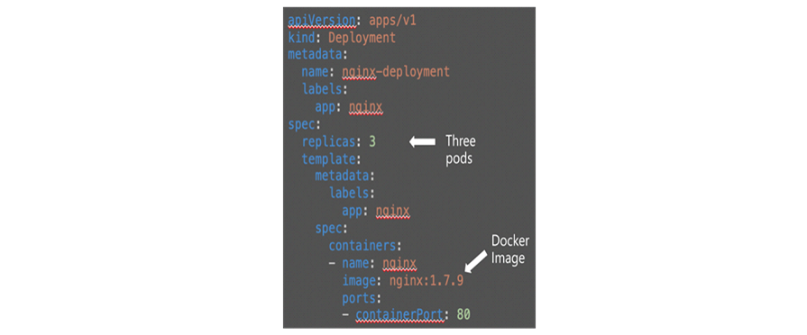
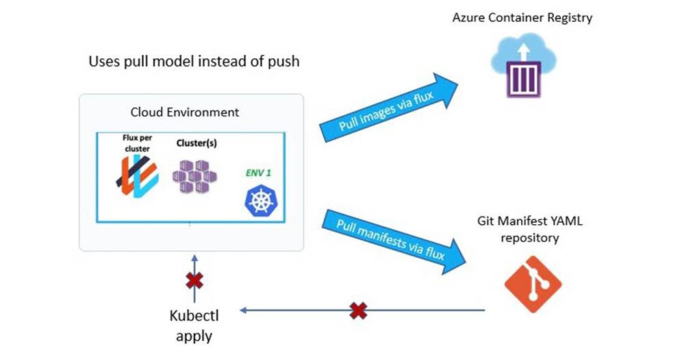
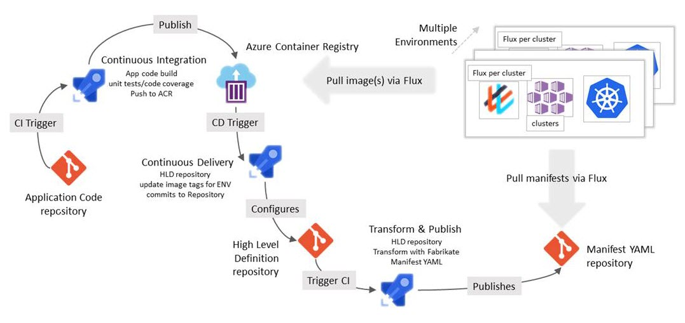
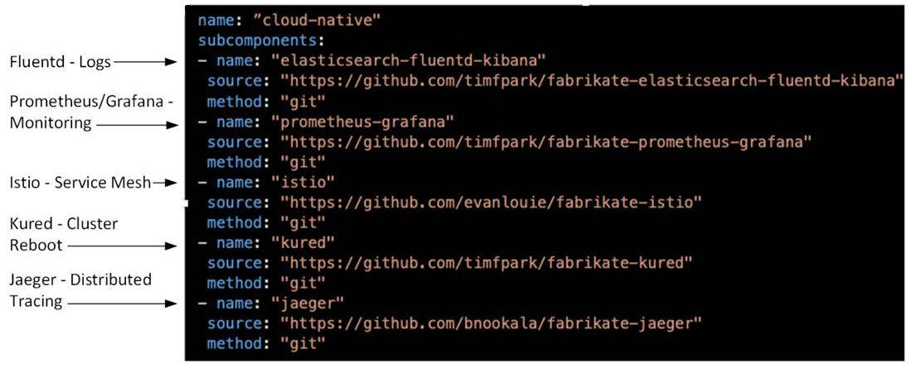

# Bedrock - Automated deployments of Kubernetes clusters with GitOps workflow

Bedrock is a set of patterns and automation tools for deploying and operating production Kubernetes (Kubernetes) clusters based on a GitOps workflow. Bedrock builds on the best practices discovered from working with customers in operationalizing Kubernetes clusters. Using Bedrock, organizations can fast track their end-to-end Kubernetes deployments including infrastructure provisioning, GitOps setup, and Azure Pipelines with observability into the deployment status.

Bedrock helps you:

* Define and maintain infrastructure deployments across multiple clusters.
* Deploy and automate a secure end-to-end GitOps workflow.
* Deploy and manage service workloads from source code to their deployment in-cluster.
* Observe ongoing deployments across multiple services, their revisions, and multiple clusters using those services.

## Problem Statement

Configuring Kubernetes deployments and managing clusters can be a complex and time-consuming process complicated by missteps and lurking errors. Bedrock was born from the collective experience of helping many customers adopt the new architectural patterns for Kubernetes. At the same time, applying DevOps principles and tooling makes the development, deployment, and maintenance of these Kubernetes based apps sustainable at a production level. *GitOps* is the name applied to this pattern and Bedrock is the pattern of best practices for implementing apps with GitOps in Azure.

Bedrock addresses these problems through the following objectives:

1. Provide a way to deploy infrastructure reliably and efficiently.
2. Allow service deployments to be secure and auditable.
3. Provide a workflow that is readily adaptable to any organization’s needs.
4. Allow developers to avoid hand editing complex YAML files to define infrastructure.
5. Provide a comprehensive view of cluster deployment status for developers and Site Reliability Engineers (SREs). 
6. Provide all of these things in an efficient and repeatable process that works in the real world.

### Primary requirements

To resolve those objectives, the team identified the following principal requirements for Bedrock:

* Leverages full cloud native capabilities.
* Enable implementing complex micro services architectures on Kubernetes.
* Providing end to end workflow for deploying a complete Kubernetes solution using best practices
* Embody Practical Real-World Experiences at Scale
* Validation and Improvement by implementation with actual customers.

A major benefit of Bedrock is that, when compared to a manual deployment process that is inherently slow, Bedrock’s automated deployment process is fast and easily repeatable. This benefit equates to higher productivity and efficiencies when using Bedrock.

## Solution design objectives

### Pre-configured environment deployment

Creating, configuring, and deploying environments is typically time consuming and presents many opportunities for error and, in some scenarios, requires specialized knowledge. The ability to have pre-configured environments where creation and deployment is automated enables development teams to be more productive and reduces the probability of starting with mal-configured environments. This positively impacts both project time and cost. Bedrock uses Terraform and infrastructure deployment automation to address these objectives. Also, by maintaining multiple profiles in repos accessible to the deployment workflow, it becomes a simple task to initiate a specific deployment.

### Secure and auditable production workflow

Developing a system and taking it across the different stages from development, all the way to production, and including post production updates, is a complex process. Typically, this process would be clearly defined and agreed upon, and can become an automated workflow. Such workflow should be designed to enable best practices relating to security and audibility as they are important for compliance and other purposes. Bedrock uses GitOps and processing pipelines to address this objective.

### Ease of manifest creation

Most cloud infrastructure tools and environments support reading a manifest document that automates the process of creating and setting up environments that support multiple features. A Kubernetes based system deployment typically uses a manifest created in YAML. Creating these manifests manually can be time-consuming and tedious. So, using a tool to simplify manifest creation will increase productivity and reduce errors. Bedrock uses a High Level Definition (HLD) language paradigm with a tool called *Fabrikate* (developed by the Bedrock team) to eliminate the need to hand edit complex YAML files.

### Enable deployment observability

Developers and Site Reliability Engineers need to be able to monitor and observe the end-to-end deployment and workflow. Bedrock includes the *Spektate Dashboard* as part of the Bedrock CLI to allow an easy to use view of the deployment process and operational clusters. This level of monitoring simplifies deployment management. For example, developers and Software Reliability Engineers need a comprehensive view of deployment status changes as they make their way from application level changes to the cluster, including the GitOps sync status. Spektate dashboard is designed to provide this valuable overview capability.

Sometimes additional monitoring needs are identified and the Spektate Dashboard cannot fulfill those new needs. Bedrock is designed to accommodate additional tools that can be deployed to fulfill those special monitoring needs. See [Extending Bedrock](#extending-bedrock) for more information.

### Automation

Both the system cloud infrastructure and deployed services require management, and this management aspect both lends itself to, and benefits from, automation. Bedrock CLI (Command Line Interface) is a tool created to automate three key areas: Infrastructure Management, Service Management, and Introspection using Spektate.

## Solution description

### Underlying concepts and technology development

#### Infrastructure as Code (IaC)

The "Digitization of the Physical World" has had great impact on many areas of technology. And it continues to evolve. For example, virtualization is a main enabler of the cloud as physical resources are virtualized/digitized and provide more granular control, segmentation, and elasticity of resources in response to varying demands. It also enables automation since virtual resources are amenable to programmability and to automation. This gave rise to the concept of "Infrastructure as Code" (IaC). IaC is the process of managing and provisioning the technology stack for an application through version-controlled software, rather than using a manual process to configure discrete hardware devices and operating systems.

Kubernetes is designed to work with containerized applications. Containers are readily versioned and managed through development and deployment. By including the infrastructure configuration manifests to this management structure, it becomes easier to deploy to the correct infrastructure and have alternate infrastructure definitions available for different purposes. This process is the essence of how Bedrock implements IaC using Terraform templates. Bedrock provides sample templates (`Azure Simple` and `Azure Single Key Vault`) that developers can use as starting points for their own deployments with AKS and GitOps.

#### What is GitOps?

As mentioned earlier, [GitOps](https://www.weave.works/technologies/gitops/) is DevOps applied to Kubernetes based systems. Thus, the automation and coordination of development, orchestration, monitoring, and maintenance becomes the focus of the Bedrock pattern and process using GitOps.

Because Kubernetes is declarative, the entire system can be described declaratively. This means that configuration is guaranteed by a set of facts instead of by a set of instructions and those factual declarations are versioned in Git from which they can be deployed as needed. This also means that, as described in [GitOps - Frequently Asked Questions](https://www.weave.works/technologies/gitops-frequently-asked-questions/): "one of the main differences between IaC and GitOps is the use of immutable containers as deployable artifacts that can be converged on by a suitable orchestration tool, for example Kubernetes. Your desired state is kept in source control".

Therefore, Bedrock uses GitOps, in part, because its prescriptive style accommodates infrastructure as code for a cloud native environment.

### Overview of the Bedrock process

Bedrock is automation and tooling for operationalizing production Kubernetes clusters with a GitOps workflow. GitOps enables you to build a workflow around your deployments and infrastructure similar to that of a typical development workflow:

* pull request based operational changes.
* point in time auditability into what was deployed on the Kubernetes cluster.
* providing nonrepudiation about who made those changes.

At a high level, the GitOps workflow is driven by High-Level Definition (HLD) files. These definition files are maintained in a Git repository. A pull request (PR) is used to initiate the process. Then, based on a specific HLD script from the repo, the pipeline automation processes that HLD script through Fabrikate to generate the required YAML manifest files and stores them in the manifest repo. The deployment is monitored, and deployment status is available through the Spektate dashboard.

This workflow includes provisions for:

* Fabrikate HLD definitions allow you to leverage common elements across multiple deployments. Fabrikate also lets you share structure between different clusters differentiated only by a simple configuration change in an HLD script and a pull request.
* Bedrock tools include [guidance and automation](https://github.com/microsoft/bedrock/blob/master/gitops/README.md) for building GitOps pipelines with Azure DevOps or other popular CI/CD orchestrators.
* Bedrock deployment automation includes setting up the GitOps Operator [Flux](https://github.com/fluxcd/flux) in your cluster, automatically ensuring that the state of a cluster matches the configuration stored in Git. (Details are discussed further in this document’s Appendix.)

### Bedrock solution components

Bedrock uses these components to address its design objectives.

### Typical Bedrock deployment

As described earlier, a Bedrock deployment follows three high-level steps:

1. Create and deploy a GitOps enabled Kubernetes cluster.
2. Create a Fabrikate high-level deployment definition.
3. Set up a GitOps pipeline to automate deployments of the Fabrikate definition to the Kubernetes cluster based on typical application and cluster lifecycle events.

#### Bedrock is designed for Kubernetes

Kubernetes is an open-source container-orchestration system (maintained by the Cloud Native Computing Foundation) for automating application deployment, scaling, and management. It is designed to provide a platform for automating deployment, scaling, and operations of containerized applications across clusters of hosts. Kubernetes has proven to be a very effective foundation for building efficient and scalable applications in the cloud. Thus, Kubernetes is central to Bedrock.

#### The way it works

Kubernetes is a declarative system:

1. The user creates Kubernetes manifests (typically in YAML) to specify a set of resources that should exist/run in the system.
2. Kubernetes works to create resources and keep them running.

The following image shows a sample Kubernetes manifest written in YAML.

#### Implications of a declarative system

Because Kubernetes is a declarative system, GitOps leverages that fact in the following ways:

* The textual manifest declares the desired state.
* No installations or manual configuration changes are required.
* The current state of the cluster is captured completely in the resource manifests as text.
* The current state of the cluster can be programmatically audited against this declarative definition.
* The textual nature of declarations allows easy source control management.

#### Terraform

Terraform is an open-source tool for building, changing, and versioning infrastructure safely and efficiently. It enables users to define and provision the infrastructure of a cloud-based application using a high-level configuration language known as Hashicorp Configuration Language (HCL). These configuration files are used to describe the components needed to run simple or complex applications.

Based on the selected configuration files, Terraform generates an execution plan describing what it will do to reach the desired deployment state. It then executes the plan to build the described infrastructure. As the configuration changes, Terraform can determine what changed and then create incremental execution plans that can be applied. Thus, it is highly suitable for supporting Kubernetes in a CI/CD process environment.

Like other Bedrock components, Terraform has certain features that fit well into the Bedrock process.

* Declarative infrastructure deployment
* Multi-operator support
* Pre-configured Azure environments that are available in template form for common enterprise scenarios:
  * `Azure Simple`
  * `Azure Single Key Vault`

> [!NOTE]
> These templates can be extended to support multiple clusters.

#### GitOps: Operations by Pull Request

Bedrock leverages the following aspects of GitOps:

* GitOps, like Kubernetes, uses a declarative model.
* The deployment process is built around a repository (HLD repo) that holds the current expected state of the system.
* Operational changes are made to the running system by making commits on this repository.
* The in-cluster daemon [Flux](#flux) watches this repository, detects divergence, and reconciles the current state of the cluster. 
* An easy mental model for deployments: Change the HLD definition of what should be running in Git and then the system snaps to that.
* More secure because the cluster pulls what it should be running from a verified endpoint (via TLS) and does not expose external endpoints for configuration changes.

The following image shows how these aspects all interact.

> [!NOTE]
> While Kubectl can duplicate some of the GitOps automation steps here, doing so will break the automation. Avoid any use of Kubectl to directly make changes to the cluster.

The Bedrock CLI is used to create the scaffolding for how Flux works.

#### Relevant GitOps benefits and advantages

Git also provides a simple model for auditing deployments and rolling back to a previous state. The Git repository provides auditability for moving between the states of a deployment. The Git commit history provides a full accounting for the application deployment state transitions that are made by the cluster. In summary:

* Auditability - Git repository provides auditability for moving between the states of a deployment.
* Commit History - Git commit history provides a full accounting for the application deployment state transitions that are made by the cluster.
* Simplicity - Easier mental model for deployments. Change the definition of what should be running in Git and then the system snaps to that.
* Model Fits with Kubernetes - Both Kubernetes and GitOps are declarative.
* More Secure.
  * Cluster pulls what it should be running from a verified endpoint (via TLS).
  * Does not expose external endpoints for configuration changes.

For more information, see Weaveworks’ [Guide to GitOps](https://www.weave.works/technologies/gitops/).

#### Fabrikate

As mentioned earlier, [Fabrikate](https://github.com/Microsoft/fabrikate) is a central part of GitOps in Bedrock. Fabrikate converts the HLD script files to the YAML configuration files required for Kubernetes deployment. The following diagram shows how Fabrikate is integrated into the GitOps workflow.

##### The problem with low-level YAML

Creating Kubernetes manifests in YAML is a great enabler for automation. However, there are a number of challenges such as the fact that the vast majority of a deployment declaration is repeated in boilerplate fashion across all deployments. This duplication is prone to errors and unintended results given the low contextuality of individual entries. These challenges are compounded because real world deployments are complex. So, while there are templating solutions to the problem such as Helm, a typical deployment ends up stitching together dozens of Helm chart outputs that devolve into a complex web of shell scripts.

##### Introducing a High-Level Definition Language

As is the typical case for addressing complexities of this kind, the solution was to introduce a higher level of abstraction to the task. As described earlier, the Bedrock team adopted the cloud native stack high-level definition language HCL for creating HLD files. The following example shows how some common resources are specified in a sample HLD script.

##### Introducing Fabrikate

The Bedrock team is responsible for developing Fabrikate to provide a frontend that uses HLD to make the creation of deployment manifests easier. Thus, Fabrikate helps to make operating Kubernetes clusters within a GitOps workflow more productive.

Fabrikate simplifies the front end of the GitOps workflow by taking a high-level description of a deployment, a targeted environment configuration (such as **QA** or **Prod**), and renders the YAML resource manifests for that Kubernetes deployment utilizing templating tools (like Helm). It runs as part of the CI/CD pipeline such that every commit to your Fabrikate deployment definition triggers the generation of Kubernetes deployment manifests. The in-cluster GitOps pod Flux watches for new commits and reconciles them with the current set of applied resource manifests in the Kubernetes cluster. (See Figure 4, above.)

For example, Fabrikate allows you to write DRY resource definitions (used for dry-run deployments) and configurations for multiple environments while leveraging the broad Helm chart ecosystem. These special purpose HLD scripts become shareable components that both simplify and support making deployments more auditable.

### Bedrock CLI: Bedrock Automation Tool

As mentioned earlier, *Bedrock CLI* is a command-line tool unique to Bedrock. It is used to facilitate automation of the Cluster Infrastructure, Service Management, and Introspection/Monitoring (using the *Spektate Dashboard*).

:::image type="content" source="./media/fig008.jpg" alt-text="diagram of relationship between Bedrock CLI and Spektate":::

Figure 8 - Bedrock CLI and Spektate Dashboard

The Spektate Dashboard is designed to integrate with the GitOps workflow as shown in Figure 9.

<!-- insert fig 9 here -->
:::image type="content" source="./media/fig009.jpg" alt-text="diagram of GitOps workflow with Bedrock CLI and Spektate":::

Figure 9 - GitOps workflow with Bedrock CLI and Spektate

### Spektate: Introspection in Service Deployments

Service introspection is an enabler for instrumentation. An introspection service can reveal information about the cloud internals to interested applications. This is the role of the Spektate service introspection tool. It provides insight into the deployment status at all times, in that way facilitating reliability, security, and auditability of deployments. And, in those use cases were additional visibility is required, Bedrock can be easily customized with additional observability or metric tools.

Kubernetes deployments can be complex. Multiple microservices become even more complicated when considering factors like latency, scalability, and reliability to deployments across multiple clusters in multiple regions and zones. This complexity creates a practical problem to determine the current state of any individual cluster or a collection of clusters that collectively carry the workload demands. Bedrock addresses this problem with Spektate. It is integrated with the GitOps pipeline and Service Management that is a key element of the Bedrock process.

Spektate provides views into the current status of any change in the system. Including continuous integration builds to tracking the deployment of the container containing that commit in each of the downstream clusters consuming that container. It includes:

* A Bedrock GitOps pipeline that reports back with telemetry data for each of the steps of the system; currently supported in Azure DevOps
* An Azure Storage Table that stores all of the telemetry reported back
* Integration with the Bedrock CLI and a web dashboard

Figure 10 shows how Spektate integrates with the Azure Pipelines in a Bedrock GitOps Workflow.

<!-- insert fig 10 here -->
:::image type="content" source="./media/fig010.jpg" alt-text="diagram showing how Spektate integrates with pipelines in GitOps workflow":::

Figure 10 - How the Spektate tool integrates with the Azure Pipelines in a Bedrock GitOps Workflow

Bedrock CLI implements the Spektate Dashboard to provide deployment observability integrated with DevOps and cluster information. This web dashboard is designed provides the baseline observability for Bedrock, but additional tools can be added to address other specific use case requirements. (Bedrock customization is discussed further in the Appendix to this document.) A sample dashboard is shown in Figure 11.

<!-- insert fig 11 here -->
:::image type="content" source="./media/fig011.jpg" alt-text="sample of Spektate web dashboard":::

Figure 11 - Spektate Web Dashboard

## Cobalt vs Bedrock

[Cobalt](https://github.com/Microsoft/cobalt) hosts reusable Terraform modules to scaffold managed container services like [ACI](https://docs.microsoft.com/azure/container-instances/) and [Application Services](https://docs.microsoft.com/azure/app-service/) following a DevOps workflow. While Bedrock targets Kubernetes based container orchestration workloads while following a [GitOps](https://medium.com/@timfpark/highly-effective-kubernetes-deployments-with-gitops-c7a0354f1446) workflow. Cobalt templates (manifests) reference Terraform modules like virtual networks, traffic manager, and so on, to define infrastructure deployments. Bedrock uses Terraform to pre-configure environment deployment, but also uses Fabrikate templates to define manifests for deployment automation.

## Applicable Scenarios

* Cloud Native Solutions
* Complex Microservices running Kubernetes Environments

## Customer Benefits

### Bedrock Learnings/Best Practices

* Use the high-level definition repo as application configuration as code.
* Use Bedrock Terraform Templates as your declarative infrastructure as code.
* Use existing HLD templates as starting points for your HLD scripts.
* All operational changes are made by pull request.
* Do not publish changes to the cluster by hand or via command-line tools (such as helm or tiller) for any reason as it will break GitOps and the IaC functionality.
* Practice container image promotion.
* Build once and promote to environments via testing gates.
* Promotion is configured in HLD scripts only.
* Bedrock supports an organization with multiple operational roles (Devs, SWEng, and so on) where the different roles can use Bedrock for specific operational tasks. Repo access permissions can also be used to allow specific roles access through Bedrock.

### Securing the Bedrock GitOps Workflow

In a production scenario, it can be tempting to modify Kubernetes resource directly on the cluster via kubectl, kubernetes dashboard, or helm via tiller. Some thoughts running through an operator's head may include:

* _“Time is of the essence; I must make changes directly on the cluster.”_
* _“The GitOps workflow is too cumbersome, I will make changes directly to the manifest YAML repository.”_

Doing this is not advisable! The reason to avoid this practice is that GitOps are centered around a single interface and tooling infrastructure where the repos will always contain the ***single source of truth*** for a given deployment. Git's version control system is the basis for managing all configuration. Any configuration scenario that circumvents Git in GitOps loses out on the ability to roll back changes, audit logs, and raises the potential for buggy or unsanctioned functionality in the clusters. Moreover, the ability to detect changes and automate actions (such as alerts and updates) is compromised.

### Disaster Recovery

In a worst-case scenario where the deployed cluster(s) can no longer function, recovery is accomplished by merely redeploying the clusters. To do this, you simply point to the correct manifest repo after you deploy the new cluster with Flux. Bedrock takes care of the rest.

If the outage is caused by a hardware failure, you just redirect the deployment by specifying a new destination in the HLD script, commit the script, and create a new PR. In some cases, this alternate HLD script might be a standard contingency created as part of an organization’s SOP and held in the repo until needed.

See also [Resiliency and Disaster Recovery](#resiliency-and-disaster-recovery).

### Rollbacks

Sometimes changes to your application configuration can yield undesired results. Being able to easily roll back to a previous state application code configuration is a must have. We recommend a few options to accomplish rollbacks:

* Create a new commit to your high-level deployment repo to reverse rollback application changes
  * This approach is probably the easiest and most straightforward method.
* Use the `Git reset --hard (COMMIT_ID)` command to revert the undesired COMMIT_ID
  * This command alters the history of your Git repo. So, it might not be the most transparent approach as to what actually may have happened on your cluster.
* Use `Git revert HEAD` to create a new commit with the inverse of the last commit
  * This command allows you to see that a something was reverted in the Git history

#### Rollback Scenarios

* Rolling back a promoted container
* Multi-cluster rollbacks
* Ensuring created cluster resources are removed

### GitOps Checklist

> [!div class="checklist"]
> * Are you using branch policies on your high-level definition and manifest repos?
> * Are you practicing container promotion?
> * Are you locking high-level definition subcomponents to a version?
> * Is your manifest repo locked down from developers and operators?
> * Are you alerting on deployment synchronizer (flux) metrics?

## Next Steps

If you want to learn more about using Bedrock, your next steps should be:

1. A [Bedrock Walkthrough Demo](https://github.com/microsoft/bedrock/blob/master/docs/azure-simple/README.md) is available on GitHub so that you can see how Bedrock actually works to deploy a simple application.
2. [Getting Started with Bedrock](https://github.com/microsoft/bedrock/tree/master/docs/firstWorkload)
3. Detailed design information for using Bedrock is available on [GitHub](https://github.com/microsoft/bedrock/tree/master/docs/firstWorkload).

## Resources

* [Bedrock project on GitHub](https://github.com/microsoft/bedrock/tree/master/docs/firstWorkload)
* [Bedrock Walkthrough Demo](https://github.com/microsoft/bedrock/tree/master/docs/firstWorkload)
* [Bedrock CLI](https://github.com/Microsoft/Bedrock-cli)
* [Spektate](https://github.com/Microsoft/Spektate)
* [Fabrikate](https://github.com/Microsoft/Fabrikate)
* [Fabrikate Cloud Native](https://github.com/timfpark/fabrikate-cloud-native)
* [Fabrikate HLD Definitions](https://github.com/microsoft/fabrikate-definitions)
* [Building GitOps Pipelines](https://github.com/microsoft/bedrock/blob/master/gitops/README.md)
* [Guide to GitOps](https://www.weave.works/technologies/gitops/)
* [GitOps - Frequently Asked Questions](https://www.weave.works/technologies/gitops-frequently-asked-questions/)
* [Flux on GitHub](https://github.com/fluxcd/flux)
* [Terraform on GitHub](https://github.com/hashicorp/terraform)

## Appendix

### Components

The tech stack used by Bedrock includes many best of breed tools, but some are critical to how Bedrock approaches system solutions. These include Flux and Helm.

#### Flux

Flux is a tool that automatically ensures that the state of a cluster matches the configuration defined in Git. Flux uses an operator in the cluster to trigger deployments inside Kubernetes, fulfilling the role of a CD tool. It monitors all relevant image repositories, detects new images, triggers deployments, and updates the running configuration based on those changes and a configurable policy. Thus, Flux provides these benefits to Bedrock:

* You do not need to grant your CI automation access to the cluster
* Every change is atomic and transactional
* Git provides your audit log
* Each transaction either fails or succeeds cleanly
* You are entirely code-centric, fully supporting IaC

Flux is most useful when used as a deployment tool at the end of a Continuous Delivery pipeline. Flux makes sure that your new container images and config changes are propagated to the cluster.

#### Helm

Helm is a Kubernetes package manager that streamlines installing and managing Kubernetes deployments. It is sometimes characterized as apt/yum/homebrew for Kubernetes.

Helm uses charts to package pre-configured Kubernetes resources. This allows application deployments to be defined as Helm Charts, which supports reproducible builds of your Kubernetes applications. Helm also allows you to intelligently manage your Kubernetes manifest files and releases of Helm packages. Helm packages (or charts) contain at least two items: a description of the package (`Chart.YAML`) and one or more templates containing Kubernetes manifest files. All charts are stored in Git repositories, as required by GitOps. Charts are fetched as needed to render the correct templates for a deployment by communicating with the Kubernetes API.

### Extending Bedrock

While the core of Bedrock is a significant productivity improvement for dealing with Kubernetes deployments in a production environment, there will be specific use case requirements that go beyond the core Bedrock capabilities. Bedrock is designed to accommodate these added requirements by supporting the integration of additional tools to the process.

For example, if a particular use case required additional monitoring or metrics collection, then Prometheus and Grafana can be added to the deployment as shown in Figure 12. In this case, Prometheus could be considered a ‘dial-tone’ for Kubernetes clusters. Also, Prometheus/Grafana can work in-cluster, aggregated by Azure Monitor for multiple clusters.
By integrating such additional tools into the Bedrock automation, Bedrock provides a firm foundation for Kubernetes deployments to meet any specialized use case.

<!-- insert fig 12 here -->
:::image type="content" source="./media/fig012.png" alt-text="diagram illustrating extending Bedrock to include additional metrics monitoring":::

Figure 12 - Metrics Monitoring

### Resiliency and Disaster Recovery

Things can and will go wrong at some point. When that happens, it is important that the system does not go down. Bedrock supports many strategies for keeping your application up and running.

#### Controlled Deployment

Because Bedrock provides a simple method for defining and automating a deployment, there are many abnormal situations that can be planned for and executed quickly just by selecting the correct preconfigured deployment. This level of preplanning makes Bedrock useful in supporting such things as test deployments (also known as Canary deployments), rollbacks, fail-overs, regional rotations, load sharing, and other unusual scenarios.

For example, to do a Canary Deployment of a revised application. You first deploy the revised application to a single pod or cluster to allow testing the application in its deployed state and verified before allowing further deployments. If the deployment does not pass testing, the cluster can be halted, removing the application from deployment. Or, if a test cluster is chosen that is not publicly exposed, the testing can fail without affecting the operational public application.

#### Rollback

If a problem fails discovery in testing and that application version is fully deployed, Bedrock makes it a simple matter to redeploy the previous known working version of the application to replace the buggy version.

#### Blue/Green Deployments

Because Bedrock gives you control over deploying clusters to different IP addresses, you can deploy two versions of your application and examine their individual performance-based on-site metrics and customer feedback to determine which version is better for full deployment. This kind of Blue/Green deployment allows for optimizing application designs as a function of actionable data.

#### Failover

By using Bedrock with Kubernetes’ ability to manage complex deployment schemes, you can spread your deployment over multiple regions and apply load balancing to user traffic. Then, if one or more clusters go down for any reason, the remaining clusters can pick up the load. Microservice architectures are also inherently resilient by running a service only when needed and otherwise being shut down. This scenario is illustrated in Figures 13 and 14 where the Region 1 deployment fails, and the Region 2 deployment picks up the workload until the problem in Region 1 is resolved.

<!-- insert fig 13 here -->
:::image type="content" source="./media/fig013.png" alt-text="diagram of normal deployment":::

Figure 13 - Normal Deployment

<!-- insert fig 14 here -->
:::image type="content" source="./media/fig014.png" alt-text="diagram of failover scenario":::

Figure 14 - Failover Scenario

