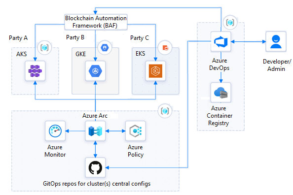

This architecture combines the open-source Blockchain Automation Framework (BAF) and Azure Arc-enabled Kubernetes to work with multiparty DLTs and to build a cross-cloud blockchain solution.

## Architecture

This solution provides a heterogeneous, multiparty, cloud-agnostic DLT network. Parties can host their nodes anywhere and still be part of the network.

### Workflow

- [Kubernetes](https://kubernetes.io) is the standard infrastructure that hosts both the ledger and the application. This example assumes three managed Kubernetes clusters.
  - Party A uses [Azure Kubernetes Service (AKS)](/azure/aks/intro-kubernetes).
  - Party B uses [GCP Google Kubernetes Engine (GKE)](https://cloud.google.com/kubernetes-engine).
  - Party C uses [Amazon Elastic Kubernetes Service (EKS)](https://aws.amazon.com/eks/).

   Each party hosts their nodes in a different location.

- BAF deploys the distributed network across the three cloud services.

- Azure Arc-enabled Kubernetes centrally manages and monitors all the Kubernetes clusters, with:

  - [GitOps-based cluster configuration deployment and management](/azure/azure-arc/kubernetes/conceptual-configurations).
  - [Azure Monitor Container insights](/azure/azure-monitor/containers/container-insights-analyze) monitoring.
  - [Azure Policy for Kubernetes](/azure/governance/policy/concepts/policy-for-kubernetes) policy management.

- [Azure DevOps](https://dev.azure.com/) provides application and infrastructure lifecycle management. An [Ansible Controller on an Azure Linux virtual machine (VM)](https://azuredevopslabs.com/labs/vstsextend/ansible) is the custom Azure DevOps continuous integration and continuous delivery (CI/CD) agent.

- [Azure Container Registry](https://azure.microsoft.com/services/container-registry) stores and shares private, application-related container images. [Docker Registry](https://docs.docker.com/registry) pulls ledger-specific images.

### Components

- [Kubernetes](https://kubernetes.io) is the container-based infrastructure that hosts both the ledger and applications. This example assumes three managed Kubernetes clusters, one each in AKS, Amazon EKS, and GCP GKE. You can host your Kubernetes clusters in almost any public or private locations.

- The open-source [Blockchain Automation Framework (BAF)](https://blockchain-automation-framework.readthedocs.io) is a way to deliver consistent, production-ready DLT networks on public and private cloud-based infrastructures. BAF supports [Quorum](https://consensys.net/quorum/), [Corda](https://www.corda.net), and [Hyperledger](https://www.hyperledger.org) DLTs.

- [Azure Arc](https://azure.microsoft.com/services/azure-arc) standardizes visibility, operations, and compliance across resources and locations by extending the Azure control plane.

- [Azure Arc-enabled Kubernetes](/azure/azure-arc/kubernetes/overview) centrally manages Kubernetes clusters in any location. Azure Arc-enabled Kubernetes works with any Cloud Native Computing Foundation (CNCF)-certified Kubernetes cluster, including:

  - AKS engine on Azure
  - AKS engine on Azure Stack Hub
  - Amazon EKS
  - GCP GKE
  - VMware vSphere

- [Azure Monitor](https://azure.microsoft.com/services/monitor) is a comprehensive solution for collecting, analyzing, and acting on telemetry. [Azure Monitor Container insights](/azure/azure-monitor/containers/container-insights-overview) monitors the performance of container workloads deployed to Azure Arc-enabled Kubernetes clusters.

- [Azure Policy](https://azure.microsoft.com/services/azure-policy) helps enforce organizational standards and assess compliance at scale. [Azure Policy for Kubernetes](/azure/governance/policy/concepts/policy-for-kubernetes) can manage and report on the compliance state of all Azure Arc-enabled Kubernetes clusters.

- [Azure Container Registry](https://azure.microsoft.com/services/container-registry) can build, store, and manage container images and artifacts for all types of container deployments.

- [Azure DevOps](https://azure.microsoft.com/services/devops) is a set of developer services providing comprehensive application and infrastructure lifecycle management. Azure DevOps includes work tracking, source control, build and CI/CD, package management, and testing solutions.

### Alternatives

- [Ambassador API Gateway](https://www.getambassador.io/products/api-gateway) manages cross-node communications, but you can use a cloud native API Gateway like Azure API Management over the internet. For more information, see [Deploy to Azure Kubernetes Service](/azure/api-management/how-to-deploy-self-hosted-gateway-azure-kubernetes-service).

- You can also use [External-DNS](https://github.com/kubernetes-sigs/external-dns) with [Azure DNS service](https://azure.microsoft.com/services/dns).

- You can get Internet Protocol Security (IPSec) private connections with tools like [Submariner](https://submariner.io).

## Scenario details

Blockchain and distributed ledger technology (DLT) networks are multiparty systems. Each party can have its own tools, methodology, and cloud provider. Some providers' public or private blockchain networks might have limited region availability, scalability, or network segregation.

The open-source [Blockchain Automation Framework (BAF)](https://blockchain-automation-framework.readthedocs.io/) is a consistent way to deploy production-ready DLTs across different public and private clouds. But while BAF can manage deployments, it doesn't provide central infrastructure management and monitoring. Although some cloud providers' blockchain services provide infrastructure management, they might require all parties to be in the same cloud or infrastructure.

To join forces and build a blockchain network, parties that use different cloud providers and infrastructures need a common management platform. This platform should offer standard visibility, operations, and compliance across a wide range of resources and locations, regardless of hosting infrastructure.

This article explores how the BAF and [Azure Arc-enabled Kubernetes](/azure/azure-arc/kubernetes/overview) can build a cross-cloud blockchain solution that focuses on portability and control.

### Potential use cases

This approach supports:

- Heterogeneous DLT deployments where separate organizations own and manage each node.

- Centralized DevOps, monitoring, and compliance management across multiparty networks.

## Considerations

These considerations implement the pillars of the Azure Well-Architected Framework, which is a set of guiding tenets that can be used to improve the quality of a workload. For more information, see [Microsoft Azure Well-Architected Framework](/azure/architecture/framework).

For AKS best practices, see [Baseline architecture for an Azure Kubernetes Service (AKS) cluster](/azure/architecture/reference-architectures/containers/aks/baseline-aks). You can find similar guidance for other cloud providers.

### Availability and scalability

Although Azure Arc can manage and monitor Kubernetes clusters, each cluster must independently implement scalability, high availability, and disaster recovery capabilities.

### Security

Security provides assurances against deliberate attacks and the abuse of your valuable data and systems. For more information, see [Overview of the security pillar](/azure/architecture/framework/security/overview).

BAF uses [HashiCorp Vault](https://www.hashicorp.com/products/vault) for certificate and key storage. To use BAF, you need at least one Vault server. BAF recommends one Vault per organization for production-ready projects.

### Cost optimization

Cost optimization is about looking at ways to reduce unnecessary expenses and improve operational efficiencies. For more information, see [Overview of the cost optimization pillar](/azure/architecture/framework/cost/overview).

To estimate Azure resource costs, use the [Azure pricing calculator](https://azure.microsoft.com/pricing/calculator).

## Deploy this scenario

1. For this example, create managed Kubernetes clusters in AKS, GKE, and EKS, and onboard the clusters to Azure Arc.
   - [Connect an existing Kubernetes cluster to Azure Arc](https://azurearcjumpstart.io/azure_arc_jumpstart/azure_arc_k8s/general/onboard_k8s).
   - [Deploy EKS cluster and connect it to Azure Arc](https://azurearcjumpstart.io/azure_arc_jumpstart/azure_arc_k8s/eks/eks_terraform).
   - [Deploy GKE cluster and connect it to Azure Arc](https://azurearcjumpstart.io/azure_arc_jumpstart/azure_arc_k8s/gke/gke_terraform).
1. Follow steps for installing and configuring [BAF prerequisites](https://blockchain-automation-framework.readthedocs.io/en/latest/prerequisites.html).
1. (Optional) [Create an Azure DevOps organization and project](/azure/devops/organizations/accounts/create-organization), and clone the BAF repo into the new Azure DevOps project.
1. (Optional) Create an [Ansible Controller VM](https://azuredevopslabs.com/labs/vstsextend/ansible) in Azure as the custom build agent to deploy BAF components.

## Contributors

*This article is maintained by Microsoft. It was originally written by the following contributors.*

Principal author:

* [Safi Ali](https://uk.linkedin.com/in/saffieldin) | Senior Cloud Solution Architect

*To see non-public LinkedIn profiles, sign in to LinkedIn.*

## Next steps

- [Azure Arc Jumpstart](https://azurearcjumpstart.io)
- [Deploy Hyperledger Fabric consortium on Azure Kubernetes Service](/azure/blockchain/templates/hyperledger-fabric-consortium-azure-kubernetes-service)
- [CI/CD workflow using GitOps - Azure Arc-enabled Kubernetes](/azure/azure-arc/kubernetes/conceptual-gitops-ci-cd)

## Related resources

- [Baseline architecture for an Azure Kubernetes Service (AKS) cluster](/azure/architecture/reference-architectures/containers/aks/baseline-aks)
- [Blockchain workflow application](https://azure.microsoft.com/updates/action-required-migrate-your-azure-blockchain-service-data-by-10-september-2021/)
- [Azure Arc hybrid management and deployment for Kubernetes clusters](../../hybrid/arc-hybrid-kubernetes.yml)
- [Containers and container orchestrators for AWS professionals](../../aws-professional/compute.md#containers-and-container-orchestrators)
- [Containers and container orchestrators for GCP professionals](../../gcp-professional/services.md#containers-and-container-orchestrators)