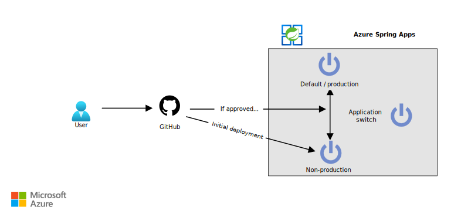

This article describes a high-availability blue/green deployment solution for applications on Azure Spring Apps.

## Architecture

*Download a [Visio file](https://arch-center.azureedge.net/blue-green-deployment.vsdx) of this architecture.*

### Workflow

1. A developer makes a change to an application. The GitHub repository holds the application code, which needs to be deployed to Azure Spring Apps. Every change to the application code happens under source control. GitHub:

    - Ensures that changes are reviewed.
    - Prevents unintended or unauthorized changes.
    - Ensures that quality checks are completed.

1. The GitHub repository also holds a GitHub Actions workflow to build the code changes and perform the necessary quality checks. After the code is compiled, the GitHub Actions workflow deploys the latest version to Azure Spring Apps. For this deployment, the GitHub Actions workflow:

    - Determines the current active production environment.
    - Deploys the code to a non-production environment. If this environment doesn't exist, GitHub creates it. At this point, the old version in the production deployment still gets all production traffic.
    - Waits for the deployment to be reviewed and approved. This step gives the newly deployed application time to start and warm up. Before approval, you can use the non-production URL of the application to verify the new version and ensure that it's ready.
    - Switches the production deployment and the non-production deployment, if you approve the new deployment. All production traffic is now routed to the new version of the application.

       If you reject the new deployment, GitHub doesn't switch the environments. The previous version continues to receive production traffic.
    - Deletes the old production deployment, after the approval and switch-over of the traffic. This cleanup step leads to a more cost-effective setup.

### Components

This solution uses the following components:

- [Azure Spring Apps](https://azure.microsoft.com/services/spring-cloud) is a modern microservices platform for running Java Spring Boot and Steeltoe .NET Core apps. It eliminates boilerplate code for running microservices and helps you quickly develop robust apps in the cloud. You can also use Azure Spring Apps to deploy code on a per-application basis.

- [GitHub](https://github.com) is a code-hosting platform that provides version control and collaboration. GitHub provides Git distributed version control, source code management, and other features.

- [GitHub Actions](https://docs.github.com/actions) helps you automate software development and deployment workflows from within a repository. You can use it to create a fully automated continuous integration and continuous delivery (CI/CD) setup. You can also use GitHub Actions to create environments for which you can configure rules, like requiring reviewers.

### Alternatives

This solution uses GitHub Actions to automate deployment. You can use [Azure Pipelines](https://dev.azure.com) or any other CI/CD automation system as an alternative. The sample described in the deployment section of this document uses Azure CLI statements as much as possible, so you can easily translate this setup to another automation tool. Use a CI/CD tool to set up an environment and create an approval flow on it.

This architecture uses Azure Spring Apps with Deployments as a target service. You can use Azure App Service staging slots as an alternative. A slot contains the new version of the application, which can be reloaded, warmed up, and tested before a slot swap is done. The slot swap puts the new version in production. This process is built into the service, so the setup is easy.

As another alternative, you can place any Azure service that hosts web endpoints behind a load-balancing solution. If you use this alternative, you can spin up a second instance of the Azure service, where you can deploy a new version of your application. As a next step, you can create a zero-downtime deployment. To do that, you can switch the traffic at the load-balancing solution to the Azure service that holds the new version of the app. This solution to blue/green deployment does require much more management overhead.

## Scenario details

For some cloud applications, keeping uptime as high as possible is critical. One solution is to use a high availability configuration, which can double costs. Another solution is a disaster recovery plan, which brings up the application again in another region after an outage. The cost for the latter might be lower, but bringing the entire application online again takes time.

This article describes a process for ensuring high availability during the deployment of a new version of an application. In a traditional configuration, the new bits of the application are deployed to the service that's hosting the application. This configuration often leads to a reload and restart of the application. During that process, the application is unavailable.

This article describes the blue/green deployment pattern. In this pattern, the new version of the application is deployed next to the existing version. This deployment allows you to restart, warm up, and test the new version independently. After the new version is running, you can switch to it, redirecting any new incoming traffic to it. For the user of the application, the deployment of the new version happens without any visible downtime.

There's another advantage to blue/green deployment: if a new deployment doesn't work as expected, you can easily abandon it without affecting the live version.

This solution uses Azure Spring Apps to implement blue/green deployment and addresses automating the deployment of applications.

### Potential use cases

This solution can benefit any organization that requires high availability. The solution is especially suitable for industries such as e-commerce and gaming, where downtime can lead to a loss of business and revenue.

You can further improve your availability by implementing zero-downtime deployments. For more information, see the [Alternatives](#alternatives) section of this article.

## Considerations

These considerations implement the pillars of the Azure Well-Architected Framework, which is a set of guiding tenets that can be used to improve the quality of a workload. For more information, see [Microsoft Azure Well-Architected Framework](/azure/architecture/framework).

### Availability

This solution helps you maintain availability for your application during the deployment of a new version. It doesn't increase the overall SLA that Azure Spring Apps provides. Service failures on the platform can still affect your app.

If you want a solution to increase the overall SLA of your configuration, look into setting up a high-availability Azure Spring Apps service over multiple regions and fronting it with a global load-balancing solution.

### Scalability

This solution works on a per-application basis, so it's well suited for microservices applications. It also allows application teams to work independently of other application teams without influencing the uptime of the overall solution.

This solution also works best on a per-application basis, where each application has its own blue/green deployment workflow. If you combine applications in the same workflow, this configuration becomes complex quickly, so we don't recommend that approach.

### Security

Security provides assurances against deliberate attacks and the abuse of your valuable data and systems. For more information, see [Overview of the security pillar](/azure/architecture/framework/security/overview).

Apart from setting up repository permissions, consider implementing the following security measures in Git repositories that hold code that you want to deploy to Azure Spring Apps:

- **Branch protection.** Protect the branches that represent the production state of your application from having changes pushed to them directly. Require that every change is proposed by a pull request (PR). Use PRs to do automatic checks. For example, those checks might build all code and run unit tests on the code that a PR creates or modifies.

- **PR review.** To enforce the four-eyes principle, require that PRs have at least one reviewer. You can also use the GitHub [code owners](https://docs.github.com/github/creating-cloning-and-archiving-repositories/creating-a-repository-on-github/about-code-owners) feature to define individuals or teams that are responsible for reviewing specific files in a repository.

- **Immutable history.** Only allow new commits on top of existing changes. Immutable history is especially important for auditing purposes.

- **Further security measures.** Require your GitHub users to activate [multifactor authentication](https://wikipedia.org/wiki/Multi-factor_authentication). Also, allow only signed commits, which can't be altered at a later time.

We also recommend that you deploy to only one Azure Spring Apps service. In a production setup, you should first test your code on other environments before you deploy it to production. Your production environment should preferably be in a different environment from your development and test environment.

For information about getting extra security on your Azure Spring Apps service, see [Deploy Azure Spring Apps in a virtual network](/azure/spring-cloud/how-to-deploy-in-azure-virtual-network?tabs=azure-CLI). If you implement the deployment suggested there, you can't use GitHub-hosted runners. You need to use your own runner for the deployment workflow.

### DevOps

Automation of this setup via GitHub Actions workflows increases DevOps productivity. One of the most useful features is the ability to quickly roll back changes that behave unexpectedly. Just reject the new deployment.

Teams often manage multiple environments for the same application. It's typical to have several versions of an application deployed to different Azure Spring Apps services. The Git repository, which is the single source of truth, shows which versions of applications are currently deployed to a cluster.

### Cost optimization

Cost optimization is about looking at ways to reduce unnecessary expenses and improve operational efficiencies. For more information, see [Overview of the cost optimization pillar](/azure/architecture/framework/cost/overview).

Use the [Azure pricing calculator](https://azure.microsoft.com/pricing/calculator) to estimate costs.

Azure Spring Apps has a Basic tier and a Standard tier. For details, see [Azure Spring Apps pricing](https://azure.microsoft.com/pricing/details/spring-cloud/). When you use the blue/green deployment strategy, you pay for extra virtual SPU for only a short time, while your deployment runs.

GitHub offers a free service. But to use advanced security-related features like code owners or required reviewers, you need the Team plan. For more information, see the [GitHub pricing page](https://github.com/pricing).

## Deploy this scenario

For a sample of this configuration, see the [Automated blue/green deployment for Azure Spring Apps applications](https://github.com/Azure-Samples/azure-spring-cloud-blue-green) GitHub repo. The repo also includes the steps for setting up your Azure Spring Apps service by using a Bicep template.

## Contributors

*This article is maintained by Microsoft. It was originally written by the following contributors.*

Principal author:

- [Gitte Vermeiren](https://www.linkedin.com/in/gitte-vermeiren-b1b2221) | Senior Service Engineer

*To see non-public LinkedIn profiles, sign in to LinkedIn.*

## Next steps

- [Get this architecture running with a step-by-step guide](https://github.com/Azure-Samples/azure-spring-cloud-blue-green)
- [Blue/green deployment strategies in Azure Spring Apps](/azure/spring-cloud/concepts-blue-green-deployment-strategies)
- [Quickstart: Build and deploy apps to Azure Spring Apps](/azure/spring-cloud/quickstart-deploy-apps)
- [Set up a staging environment in Azure Spring Apps](/azure/spring-cloud/how-to-staging-environment)
- [GitHub: Understanding GitHub Actions](https://docs.github.com/actions/learn-github-actions/understanding-github-actions)
- [GitHub: Using environments for deployment](https://docs.github.com/actions/deployment/targeting-different-environments/using-environments-for-deployment)
- [GitHub: Reusing workflows](https://docs.github.com/actions/learn-github-actions/reusing-workflows)

## Related resources

- [Azure Spring Apps reference architecture](/azure/spring-cloud/reference-architecture)
- [Expose Azure Spring Apps through a reverse proxy](../../reference-architectures/microservices/spring-cloud-reverse-proxy.yml)
- [DevTest and DevOps for microservice solutions](../../solution-ideas/articles/dev-test-microservice.yml)
- [Deploy Azure Spring Apps to multiple regions](../../reference-architectures/microservices/spring-apps-multi-region.yml)
