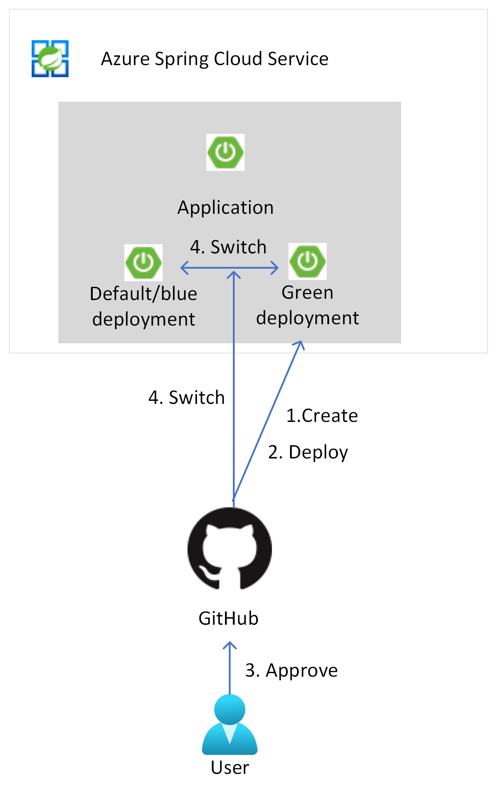

When running applications in cloud, availability of the application is an important factor. Depending on the type of application some downtime in the application can be acceptable, however, for certain applications keeping the uptime for the application as high as possible can be primordial. When the application becomes unavailable this would mean loss of business, loss of money or loss of face. This is something many companies would like to avoid. 

There are many events that can result in a cloud application not to be available. This might be from a glitch in the network, over a failure of an underlying system, or as simple as the deployment of a new version of the application. 

There are also many ways to design for higher availability. Typically this results in a design that makes use of either a high available setup, which will double run cost. Or it will result in a disaster recovery plan, which will bring up the application again in another region. The run cost for the latter might be lower, however, bringing up the entire application again will take time, which is a factor not all applications can take. 

This article describes ensuring high availability during the deployment of a new version of an application. In a normal setup, the new bits of the application will be deployed to the service that is hosting the application. This will often also lead to a reload and a restart of the application, during which time the application itself will be unavailable. This is often not preferable.

In this article we will focus on the blue-green deployment pattern for an application. This entails that the new version of the application will be deployed next to the existing version. This allows for restarting, warming up and testing this new version independent of the existing version. Once the new version is properly up and running, a simple switch can be made to this new version, redirecting any new incoming traffic to it. For the end user of the application the deployment of the new version will be done without any visible downtime of the application, making for much higher overall availability.

An additional advantage of using blue-green deployments will be that if a deployment is not as expected, you can easily abandon the new version without affecting the live version of the application. This is then a rollback of the changes. 

In the article we will focus on Azure Spring Cloud as a service for making blue-green deployments possible. We will also focus on automating the deployment of applications so they can be done in a repeatable way over and over again. 

## Potential use cases

This solution benefits any organizations that wants to enable zero downtime deployments. 

## Architecture

1. The **GitHub repository** holds the application code of which a new version needs to be deployed to Azure Spring Cloud. Every change to the application code happens under source control. GitHub functionality: 

    - Ensures review for changes
    - Prevents unintended or unauthorized changes
    - Enforces desired quality checks

1. The GitHub Repository also holds an **Action Workflow** for building the code changes and performing the necessary quality checks. After compiling the code, the action workflow deploys the latest version of the code to Azure Spring Cloud. For this deployment the GitHub Action Workflow: 

    - Checks what is currently the active production deployment.
    - Deploys the code to the non-production deployment. In case this non-production deployment does not exist, it gets created. At this point in time the old application version in the production deployment is still receiving all of the production traffic.
    - Waits for the deployment to be reviewed and approved. This step is included so the newly deployed application gets time to start and warm up. Before approval the non-production url of the application can be used to double check the new version of the application and to see if the new version of the application is ready.
    - In case the deployment is approved, the production deployment and non-production deployment are switched. So all production traffic now gets routed to the new version of the application.
    - With the previous approval and switch-over of the traffic, the old production deployment will get deleted. Cleaning up the old production deployment will lead to a more cost effective setup. 
    - In case the deployment is rejected, no switch to the newly deployed version will be done, leaving the previous version receiving all the production traffic. 

### Components

This solution uses the following components: 

- [Azure Spring Cloud Service](https://azure.microsoft.com/services/spring-cloud) is a modern microservices platform for running Java Spring Boot and Steeltoe .NET Core apps. It eliminates boilerplate code for running microservices and helps to quickly develop robust apps in cloud. Azure Spring Cloud service also contains the concept of deployments on a per application, where you can deploy your code to.

- [GitHub](https://github.com) is a code hosting platform for version control and collaboration. GitHub offers Git distributed version control, source code management, and other features.

- [GitHub Actions](https://docs.github.com/actions) help you automate software development workflows as well as deployment workflows right in the repository. They allow for a fully automated CI/CD setup. GitHub Actions also knows the concept of environments for which you can configure protection rules such as required reviewers. 

### Alternatives

In this architecture we use GitHub Actions for automating the deployment. An alternative to GitHub Actions is [Azure DevOps Pipelines](https://dev.azure.com) or any other CI/CD automation system. The sample we build makes use of Azure CLI statements as much as possible, so this setup can be easily translated to another automation tool. Setting up an environment and having an approval flow on the environment will need to be set up in the CI/CD tool of your choice. 

In this architecture we use Azure Spring Cloud with deployments as a target service. An alternative to this would be Azure App Service staging slots. A slot will contain the new version of the application, which can be reloaded, warmed up and tested before making a slot swap. The slot swap will put the newly deployed version in production. This is build into the service as an easy extra setup.

Another alternative would be using any Azure service behind a load balancing solution. Any Azure service hosting web endpoints, can be placed behind a load balancing solution. This also implies that you can spin up a second instance of that Azure service to deploy the new version of your application to. As a next step to allow for a zero downtime deployment, you can switch the traffic at the load balancing solution to the Azure service holding the new version of the app. This solution to blue-green deployments would however ask much more management overhead.

## Considerations

The following considerations apply to this solution.

### Availability

This solution helps in maintaining availability for your application during deployment of a new version. It does however not increase the overall availability of your application on Azure Spring Cloud. Meaning that it will not increase the overall SLA the Azure Spring Service gives you, you can still be affected by service failures on the platform.

In case you are looking for a solution to increase the overall SLA of your setup, you should look at setting up a high available Azure Spring Cloud service over multiple regions and front it with a global load balancing solution.

### Scalability

This solution works at the scale of a per application basis. It is therefore very well suited for microservice type applications. It also allows for each application team to work independently from other application teams, without influencing overall uptime of the overall solution. 

This solution also works best at a per application basis. where each application has its own blue green deployment workflow. Once you start combining applications in the same workflow, this setup will become complex quite quickly and hence it is not advised upon. 

### Security

Apart from the task of setting up repository permissions, consider implementing the following security measures in Git repositories that hold code you want to deploy to Azure Spring Cloud Service: 

- **Branch protection:** Protect the branches that represent the production state of your application from having changes pushed to them directly. Require every change to be proposed by a PR that is reviewed by at least one other person. Also use PRs to do automatic checks. For example, build all code and run unit tests on the code that a PR creates or modifies.

- **PR review:** Require PRs to have at least one reviewer, to enforce the four-eyes principle. You can also use the GitHub [code owners](https://docs.github.com/en/github/creating-cloning-and-archiving-repositories/creating-a-repository-on-github/about-code-owners) feature to define individuals or teams that are responsible for reviewing specific files in a repository.

- **Immutable history:** Only allow new commits on top of existing changes. Immutable history is especially important for auditing purposes.

- **Further security measures:** Require your GitHub users to activate [two-factor authentication](https://wikipedia.org/wiki/Multi-factor_authentication). Also, allow only signed commits, which can't be altered after the fact.

We also currently only deploy to one Azure Spring Cloud Service. However, in a production setup, your code will be tested first on other environments before being deployed to production. Your production environment should be preferably a totally different environment from your development and test environment. 

For extra security for your Azure Spring Cloud service, you should look at [creating the service within a VNet](/azure/spring-cloud/how-to-deploy-in-azure-virtual-network?tabs=azure-CLI). Once you do, you will not be able to utilize the GitHub hosted runners, but you will need to utilize your own runner for running the deployment workflow. 

### DevOps

Automation of this setup through GitHub Action worflows will increase DevOps productivity. One of the most useful features is the ability to quickly roll back changes that are behaving unexpectedly, just by rejecting the new deployment. 

Teams often manage multiple environments for the same application. It's typical to have several versions of an application deployed to different Azure Spring Cloud services. The Git repository, which is the single source of truth, shows which versions of applications are currently deployed to a cluster.

## Deploy this scenario

A sample for this setup can be found in [this](https://github.com/Azure-Samples/azure-spring-cloud-blue-green) GitHub repo. It also includes the steps needed for setting up your Azure Spring Cloud service through a Bicep template. 

## Pricing

> How much will this cost to run?
> Are there ways I could save cost?
> If it scales linearly, than we should break it down by cost/unit. If it does not, why?
> What are the components that make up the cost?
> How does scale affect the cost?
>
> Link to the pricing calculator with all of the components in the architecture included, even if they're a $0 or $1 usage.
> If it makes sense, include small/medium/large configurations. Describe what needs to be changed as you move to larger sizes.

- Use the [Azure pricing calculator](https://azure.microsoft.com/pricing/calculator) to estimate costs.

- Azure Spring Cloud has a Basic and Standard tier. Refer to the [pricing info](https://azure.microsoft.com/pricing/details/spring-cloud/) page for details. When using the blue-green deployment strategy you will only pay for additional vSPU for a small amount of time, while your deployment is running.

- GitHub offers a free service, but to use advanced security-related features like code owners or required reviewers, you need the **Team** plan. For more information, see the [GitHub pricing page](https://github.com/pricing).

## Next steps

- [Get this architecture running with our step-by-step guide](https://github.com/Azure-Samples/azure-spring-cloud-blue-green)
- [Blue-green deployment strategies in Azure Spring Cloud](/azure/spring-cloud/concepts-blue-green-deployment-strategies)
- [Quickstart: Build and deploy apps to Azure Spring Cloud](/azure/spring-cloud/quickstart-deploy-apps?tabs=Azure-CLI&pivots=programming-language-java)
- [Set up a staging environment in Azure Spring Cloud](/azure/spring-cloud/how-to-staging-environment)
- [GitHub: Understanding GitHub Actions](https://docs.github.com/en/actions/learn-github-actions/understanding-github-actions)
- [GitHub: Using environments for deployment](https://docs.github.com/actions/deployment/targeting-different-environments/using-environments-for-deployment)
- [GitHub: Reusing workflows](https://docs.github.com/actions/learn-github-actions/reusing-workflows)

## Related resources

- [Azure Spring Cloud reference architecture](/azure/spring-cloud/reference-architecture)
