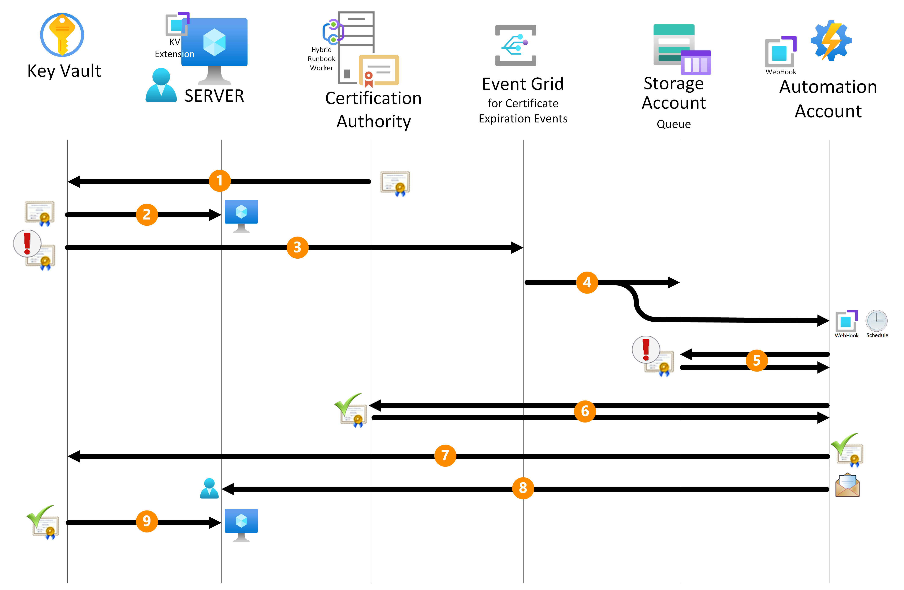

In the realm of cybersecurity, the automatic renewal of certificates stands as a pivotal aspect in maintaining a secure and reliable environment. Failure to update or renew certificates in a timely manner exposes systems to vulnerabilities such as expired SSL/TLS certificates, leaving networks susceptible to potential breaches, unauthorized access, the interception of sensitive data, service down for business-to-business processes, and loss of brand reputation thereby compromising the integrity and confidentiality of digital transactions. 

Azure Key Vault provides mechanisms supporting the [automatic renewal of certificates](https://learn.microsoft.com/en-us/azure/key-vault/certificates/overview-renew-certificate?tabs=azure-portal) issued by an integrated Certification Authority (*DigiCert* or *GlobalSign*). For non-integrated CAs however, the process require a [manual](https://learn.microsoft.com/en-us/azure/key-vault/certificates/overview-renew-certificate?tabs=azure-portal#renew-a-nonintegrated-ca-certificate) approach. 

This article aims to bridge this gap by providing an **automated renewal process tailored for certificates from non-integrated CAs**. 
This process seamlessly stores the new certificates in the Key Vault, ensuring efficiency, enhanced security, and integration with various Azure resources, thereby simplifying deployment.

The pursuit of an automated renewal process is fueled by a desire to minimize human errors and reduce service interruptions. Automating the certificate renewal not only accelerates the process but also decreases the likelihood of errors that might occur during manual handling. By leveraging the capabilities of Key Vault and its extensions, you can build an efficient automated process that helps you optimize operations and reliability.

While the initial focus is on automating certificate renewal, the broader objective is to enhance security across all dimensions of the process. This includes guiding users on implementing the Principle of Least Privilege (PoLP) or similar access controls over Key Vault and emphasizing the importance of robust logging and monitoring practices for Key Vault. The article aims to demonstrate that the security benefits extend beyond merely storing certificates, highlighting the significance of proper Key Vault usage in fortifying the entire certificate management lifecycle.

By utilizing Key Vault and an automated renewal procedure, continual updates to certificates are ensured. This guarantees that all Azure services integrated with Key Vault can benefit from up-to-date certificates, forming an integral part of the deployment process. The article will provide insights into how this continuous renewal and accessibility contribute to the overall deployment efficiency and reliability of Azure services.

## Architecture

Before delving into details of the automated renewal process, let's provide a brief overview of the underlying architecture that powers this solution.


*Download a [Visio file](./media/certlc.vsdx) of this architecture.*

The Azure environment in question comprises the following Platform as a Service (PaaS) resources: a **Key Vault**, an **Event Grid System topic**, and an **Automation Account** that exposes a webhook targeted by the Event Grid. It is assumed that an existing Public Key Infrastructure (PKI), consisting of a Microsoft Enterprise Certification Authority joined to an Active Directory (AD) domain, is already in place for this scenario. Both the PKI and the AD can reside on Azure or on-premises, as well as the servers that need to be configured for certificate renewal. Subsequent sections will provide an in-depth explanation of the automated renewal process.

### Workflow

The following drawing shows the automated workflow for certificate renewal within the Azure ecosystem. 



1. **Key Vault Configuration:**
The initial phase of the renewal process entails storing the certificate object in the designated "Certificates" section of the Azure Key Vault blade. While not mandatory, for those interested in implementing email notifications, it's advisable to tag this certificate with the recipient's email address. This tagging ensures timely notifications upon the completion of the renewal procedure. If multiple recipients are necessary, their email addresses should be separated by a comma or semicolon. The suggested tag name for this purpose is '*Recipient*,' and its value should be the email address(es) of the designated administrator(s).

1. **Key Vault Extension Configuration:**
The servers that need to utilize these certificates must be equipped with the Key Vault extension, a versatile tool compatible with *[Windows](https://learn.microsoft.com/azure/virtual-machines/extensions/key-vault-windows)* and *[Linux](https://learn.microsoft.com/azure/virtual-machines/extensions/key-vault-linux)*-based systems.  Azure-based (IaaS) servers and on-premises/other-clouds servers integrated through *[Azure ARC](https://learn.microsoft.com/azure/azure-arc/overview)* are supported. The Key Vault extension must be configured to periodically poll the Key Vault for any updated certificates. This polling interval is customizable, allowing flexibility to align with specific operational requirements.

1. **Event Grid and Automation Account Integration:**
As the certificate approaches its expiration, the Event Grid actively intercepts this critical lifetime action. Once detected, the Event Grid promptly initiates the execution of a RunBook via the webhook configured in the Automation Account. This seamless process ensures timely and automated renewal procedures triggered by the impending expiration of the certificate.

1. **Hybrid RunBook Worker Execution:**
    - The RunBook, executed within the Certification Authority server configured as a Hybrid RunBook Worker, takes as input the webhook body containing the name of the expiring certificate and the Key Vault hosting it. 
    - Leveraging Azure connectivity, the script within the RunBook connects to Azure to retrieve the certificate's template name used during its generation.
    - Subsequently, the script interfaces with the Key Vault, initiating a certificate renewal request. This request results in the generation of a Certificate Signing Request (CSR). The CSR is generated by Azure Keyvault itself, leveraging the same template used to generate the original certificate. This ensures that the renewed certificate aligns with the predefined security policies. For details about the security involved in the authentication and authorization process, refer to the [Security](#security) section.

1. **RunBook starts the certification authority renewal process:**
The script downloads the CSR and submits it to the Certification Authority.

1. **Certificate renewal:**
 The Certification Authority generate a new certificate based on the correct template and send it back to the script. This ensures that the renewed certificate aligns with the predefined security policies.

1. **Certificate Merging and Key Vault Update:**
The script merges the renewed certificate back into the Key Vault, finalizing the update process. 

1. **Monitoring and e-mail notification:**
All operations performed by the different Azure components (Automation account, Key Vault, and Event Grid) are logged within the Log Analytics workspace to enable monitoring. Following the certificate import phase into the Key Vault, the script sends an email message to administrators to notify them of the renewal procedure's outcome.

1. **Certificate retrieval:**
The Key Vault extension running on the server plays a pivotal role in this phase by automatically downloading the latest version of the certificate from the Key Vault into the local store of the server utilizing it. Multiple servers can be configured with the Key Vault extension to retrieve the same certificate (wildcard or with multiple Subject Alternative Names) from the Key Vault.


### Components

The solution leverages various components to facilitate automatic certificate renewal on Azure. The following sections elaborate on each component and its specific purpose.

#### Key Vault Extension
The Key Vault Extension plays a pivotal role in automating certificate renewal and must be installed on servers requiring this automation. Installation procedures for Windows servers can be found at [Key Vault Extension for Windows](https://learn.microsoft.com/en-us/azure/virtual-machines/extensions/key-vault-windows), for Linux servers at [Key Vault Extension for Linux](https://learn.microsoft.com/en-us/azure/virtual-machines/extensions/key-vault-linux), and for Azure ARC-enabled servers at [Azure Key Vault Extension for ARC-enabled Servers](https://techcommunity.microsoft.com/t5/azure-arc-blog/in-preview-azure-key-vault-extension-for-arc-enabled-servers/ba-p/1888739).

> [!NOTE]
> You can find sample scripts, that can be executed from Azure Cloud Shell, for configuring the *Key Vault extension* at the links below:
> - [KV extension for Windows servers](https://github.com/Azure/certlc/blob/main/.scripts/kvextensionWin.ps1)
> - [KV extension for Linux servers](https://github.com/Azure/certlc/blob/main/.scripts/kvextensionLinux.ps1)
> - [KV extension for Azure ARC-enabled Windows servers](https://github.com/Azure/certlc/blob/main/.scripts/kvextensionARCWin.ps1)
> - [KV extension for Azure ARC-enabled Linux servers](https://github.com/Azure/certlc/blob/main/.scripts/kvextensionARCLinux.ps1)

The Key Vault extension configuration parameters include:

- **Key Vault Name:** The Key Vault containing the certificate for renewal.
- **Certificate Name:** The name of the certificate to be renewed.
- **Certificate Store (Name and Location):** The certificate store where the certificate is to be stored. On Windows servers, the default value for Name  is 'My' and for Location is 'LocalMachine', which is the personal certificate store of the computer. On Linux servers, a file system path can be specified, considering that the default value is 'AzureKeyVault', which is the certificate store for Azure Key Vault.
- **linkOnRenewal:** A flag indicating whether the certificate should be linked to the server on renewal. If 'true' on Windows machines it copies the new certificate in the store and link it to the old one doing an effective rebinding of the certificate. The default value is 'false' meaning that an explicit binding is required.
- **pollingIntervalInS:** The polling interval for the Key Vault extension to check for certificate updates. The default value is 3600 seconds (1 hour).
- **authenticationSetting:** The authentication setting for the Key Vault extension. For Azure-based servers this setting can be omitted, meaning that the System Assigned Managed Identity (MI) of the VM is used against the Key Vault. For on-premises servers, specifying the setting `msiEndpoint = "http://localhost:40342/metadata/identity"` means the usage of the service principal associated with the computer object created during the ARC onboarding.


#### Automation Account
The Automation Account orchestrates the certificate renewal process. It needs to be configured with a RunBook, and the PowerShell script for the RunBook can be found [here](https://github.com/Azure/certlc/blob/main/.runbook/runbook_v2a.ps1). 
Additionally, an Hybrid Worker Group must be created, associating it with an Azure Windows Server member of the same AD domain of the Certification Authority (ideally the Certification Authority itself) for executing RunBooks. 
The RunBook should have a [webhook](https://learn.microsoft.com/azure/automation/automation-webhooks) associated with it, initiated from the Hybrid RunBook Worker. 
The webhook URL should be configured in the Event Subscription of the Event Grid System Topic. e code is provided as-is and is not supported by Microsoft. It is intended to be used as a sample and can be customized to meet specific requirements. Microsoft does not guarantee the operation of this code nor does it provide support for issues arising from its operation.

>> [!CAUTION]
> DISCLAIMER: The code is provided as-is and is not supported by Microsoft. It is intended to be used as a sample and can be customized to meet specific requirements. Microsoft does not guarantee the operation of this code nor does it provide support for issues arising from its operation.


#### Hybrid RunBook worker
The Hybrid RunBook Worker plays a pivotal role in executing RunBooks. It needs to be installed with the [Azure Hybrid Worker Extension](https://learn.microsoft.com/azure/automation/extension-based-hybrid-runbook-worker-install) method, which is the supported mode for the new installation. It must be created and associated with an Azure Windows Server member of the same AD domain of the Certification Authority (ideally the Certification Authority itself). 


#### Azure Key Vault
Azure Key Vault is the secure repository for certificates.  
In the 'Event' section of the Key Vault, the Event Grid System Topic should be associated with the webhook of the Automation Account with a subscription. 


#### Azure Event Grid
Event Grid facilitates event-driven communication within Azure. Configuration includes setting up the Event Grid System Topic and Event Subscription to monitor relevant events, such as certificate expiration alerts, triggering actions within the automation workflow. The Event Grid System Topic should be configured with the following parameters:

- **Source:** The name of the Key Vault containing the certificates.
- **Source Type:** The type of the source. In this case, the source type is 'Azure Key Vault'.
- **Event Types:** The event type to be monitored. In this case, the event type is 'Microsoft.KeyVault.CertificateNearExpiry'. This event is triggered when a certificate is near to expire.
- **Endpoint Type:** The type of endpoint to be used. In this case, the endpoint type is 'Webhook'.
- **Endpoint:** The URL of the webhook associated with the Automation Account RunBook as explained in the 'Automation Account' section.
- **Subscription Name:** The name of the event subscription.


### Alternatives

This solution uses Azure Automation Account to orchestrate the certificate renewal process and, using Hybrid RunBook Worker, it gives the flexibility to integrate with Certification Authorities on-premises or in other clouds. 

An alternative approach could be to use **Azure Logic Apps**. The main difference between the two approaches is that Azure Automation Account is a PaaS service, while Azure Logic Apps is a SaaS service. 

The main advantage of Azure Logic Apps is that it is a fully managed service, meaning that the customer does not need to worry about the underlying infrastructure. Additionally, Azure Logic Apps can easily integrate with external connectors, expanding the range of notification possibilities, such as engaging with Teams or M365.

The main disadvantage is the lack of a feature similar to Hybrid RunBook Worker, which results in less flexible integration with the Certification Authorities.
For this reason, Azure Automation Account was chosen as the preferred approach. 


## Scenario details

Every organization requires secure and efficient management of their certificate lifecycle. Failing to update a certificate before expiration can lead to service interruptions, incurring significant costs for the business.

Enterprises typically operate complex IT infrastructures involving multiple teams responsible for the certificate lifecycle. The manual nature of the certificate renewal process often introduces errors and consumes valuable time. 

This solution addresses these challenges by automating the renewal of certificates issued by Microsoft Certificate Service (the CA that most customers use for various server applications such as web servers, SQL servers, and for encryption, non-repudiation, and signing purpose), ensuring timely updates and secure storage of certificates within Azure Key Vault. Its compatibility with Azure-based and on-premises servers enables flexible deployment.

### Potential use cases

This solution caters to organizations across various industries that:

- Utilize Microsoft Certificate Service for server certificate generation.
- Require automation in the certificate renewal process to accelerate operations and minimize errors, thereby avoiding business loss and SLA violations.
- Demand secure certificate storage in repositories like Azure Key Vault.

This architecture serves as a foundational deployment approach across landing zone subscriptions.

## Considerations

These considerations implement the pillars of the Azure Well-Architected Framework, which is a set of guiding tenets that can be used to improve the quality of a workload. For more information, see [Microsoft Azure Well-Architected Framework](/azure/architecture/framework).


### Security

Security provides assurances against deliberate attacks and the abuse of your valuable data and systems. For more information, see [Overview of the security pillar](/azure/architecture/framework/security/overview).

Within the Key Vault system, certificates are securely stored as encrypted secrets, protected by Azure Role-Based Access Control (RBAC).

The identities utilized throughout the certificate renewal process encompass:

- The 'System' account of the Hybrid RunBook Worker, which operates under the VM's account where it is installed.
- The Key Vault extension, utilizing the Managed Identity (MI) associated with the VM where it is installed.
- The Automation Account leveraging its designated 'managed identity'.

The principle of least privilege is rigorously enforced across all identities engaged in the certificate renewal procedure.

The 'System' account of the Hybrid RunBook Worker Server must have the right to enroll certificate on the Certificate template(s) used to generate new certificates.

On the Key Vault containing the certificates, the Automation Account must have the 'Key Vault Certificate Officer' role. Additionally, servers requiring certificate access must be granted 'Get' and 'List' permissions  within the key vault's certificate store.

In scenarios where the Key Vault extension is deployed on an Azure VM, the authentication occurs via the Managed Identity (MI) of the VM. However, when deployed on an Azure ARC-enabled server, authentication is facilitated using a service principal. Both the Managed Identity (MI) and Service Principal must be assigned the 'Key Vault Secret User' role within the Key Vault that stores the certificate. The usage of 'Secret' is due to the fact that the certificate is stored in the Key Vault as a secret behind the scene. 

### Cost optimization

Cost optimization is about looking at ways to reduce unnecessary expenses and improve operational efficiencies. For more information, see [Overview of the cost optimization pillar](/azure/architecture/framework/cost/overview).

The solution's cost-effectiveness stems from its utilization of Azure PaaS services, operating under a pay-as-you-go framework. Primarily, expenses are contingent upon the quantity of certificates requiring renewal and the quantity of servers equipped with the Key Vault extension, resulting in generally low overhead.

Expenses associated with the Key Vault extension and the Hybrid RunBook Worker are dictated by their installation on servers and polling intervals. The cost of the Event Grid corresponds to the volume of events generated by the Key Vault. Concurrently, the cost of the Automation Account correlates with the quantity of executed RunBooks.

Additionally, the cost of the Key Vault is influenced by various factors, including the chosen SKU (Standard versus Premium), the quantity of stored certificates, and the frequency of operations conducted on the certificates.

To estimate the cost of implementing this solution, use the [Azure pricing calculator](https://azure.microsoft.com/pricing/calculator), inputting the services described in this article.

### Operational excellence

Operational excellence covers the operations processes that deploy an application and keep it running in production. For more information, see [Overview of the operational excellence pillar](/azure/architecture/framework/devops/overview).

The automated certificate renewal procedure securely stores certificates utilizing standardized processes applicable across all certificates within the Key Vault. 

Integration with Event Grid enables triggering supplementary actions, such as notifying Teams or M365, streamlining the renewal process. This integration significantly diminishes certificate renewal time, mitigating the potential for errors that could lead to business disruptions and violations of Service Level Agreements (SLAs).

Furthermore, seamless integration with Azure Monitor, Azure Sentinel, Microsoft Security Copilot, and Azure Security Center facilitates continual monitoring of the certificate renewal process, allowing for anomaly detection and ensuring robust security measures are maintained.


## Deploy this scenario

The button below automatically deploys the environment described in this article. The deployment will take about 2 minutes to complete and creates a **Key Vault**, an **Event Grid System Topic** and an **Automation Account** containing the *RunBook* and the *webhook* linked to the Event Grid.

[](https://portal.azure.com/#create/Microsoft.Template/uri/https%3A%2F%2Fraw.githubusercontent.com%2FAzure%2Fcertlc%2Fmain%2F.armtemplate%2Fmindeploy.json)

To integrate the solution with your existing environment, you need to perform the following steps:

- Configure an Hybrid Worker VM installing the [Azure Hybrid Worker Extension](https://learn.microsoft.com/azure/automation/extension-based-hybrid-runbook-worker-install) on the Certification Authority server (or on a server joined to the same AD domain) and adding it to the Hybrid Worker Group defined in the Automation Account.
- Install the following Powershell modules on the Hybrid Worker VM:

    ```powershell
    # Required powershell modules for the Hybrid Worker
        Install-PackageProvider -Name NuGet -MinimumVersion 2.8.5.201 -Force
        Register-PSRepository -Default -InstallationPolicy Trusted
        Install-Module Az.Resources -requiredVersion 6.6.0 -Repository PSGallery -Scope AllUsers -Force
        Install-Module Az.Compute -requiredVersion 5.7.0 -Repository PSGallery -Scope AllUsers -Force
        Install-Module Az.KeyVault -requiredVersion 4.9.2 -Repository PSGallery -Scope AllUsers -Force
        Install-Module Az.Accounts -requiredVersion 2.12.1
        Install-Module PSPKI -Repository PSGallery -Scope AllUsers -Force
    ```


- Add the 'System' account of the Hybrid RunBook Worker VM the "Read" and "Enroll" permissions to the Certificate Template(s) used to generate the certificates.
- Install the [Key Vault extension](#key-vault-extension) on the servers that need to retrieve the renewed certificates from the Key Vault.
- Add the 'Key Vault Secret User' role to the the servers with the Key Vault extension on the Key Vault containing the certificates.
- If you've specified the SMTPServer parameter during deployment, ensure the following: 
    - the Hybrid RunBook Worker VM can reach the SMTP server, 
    - the SMTP port is open in the firewall, 
    - the SMTP server accepts mail submissions from the Hybrid RunBook Worker VM.
- Import the certificates into the Key Vault and **TAG** them with the administrator e-mail address for notification purposes. If multiple recipients are required, the e-mail addresses should be separated by comma or semicolon. The expected tag name is 'Recipient' and the value is the e-mail address(es) of the administrator(s).

> [!IMPORTANT]
> > If you want to deploy a **full LAB environment** ready to demonstrate the whole automatic certificate renewal workflow, you can refer to the provided [**code sample**](https://learn.microsoft.com/en-us/samples/azure/certlc/certlc/) that includes the deployment of the following additional resources:
> > - **Active Directory Domain Services** (ADDS) within a domain controller virtual machine;
> > - **Active Directory Certificate Services** (ADCS) within a Certification Authority virtual machine, joined to the domain, configured with a template, *WebServerShort*, for the enrollment of the certificates to be renewed.
> > - **Windows SMTP Server** installed on the same virtual machine of the Certification Authority for sending e-mail notifications. A MailViewer tool is also installed to facilitate the verification of the e-mail notifications sent.
> > - **KeyVault Extension** installed on the virtual machine of the Domain Controller for retrieving the renewed certificates from the Key Vault.
> >
> > [](https://portal.azure.com/#create/Microsoft.Template/uri/https%3A%2F%2Fraw.githubusercontent.com%2FAzure%2Fcertlc%2Fmain%2F.armtemplate%2Ffulllabdeploy.json)

## Contributors

*This article is maintained by Microsoft. It was originally written by the following contributors.*

Principal author:

- [Fabio Masciotra](https://www.linkedin.com/in/fabiomasciotra/) | Principal Consultant
- [Angelo Mazzucchi](https://www.linkedin.com/in/angelo-mazzucchi-a5a94270) | Delivery Architect

*To see non-public LinkedIn profiles, sign in to LinkedIn.*


## Related resources

Explore further resources related to Azure Key Vault, Automation Account, Hybrid RunBook Worker, Event Grid, and other relevant services:

[Azure Key Vault](https://learn.microsoft.com/azure/key-vault/general/overview)</BR>
[Azure Key Vault Extension for Windows](https://learn.microsoft.com/en-us/azure/virtual-machines/extensions/key-vault-windows?tabs=version3)</BR>
[Azure Key Vault Extension for Linux](https://learn.microsoft.com/azure/virtual-machines/extensions/key-vault-linux)</BR>
[Automation account](https://learn.microsoft.com/azure/automation/overview)</BR>
[Automation Hybrid Runbook Worker](https://learn.microsoft.com/azure/automation/automation-hybrid-runbook-worker)</BR>
[Event Grid](https://learn.microsoft.com/azure/event-grid/overview)

