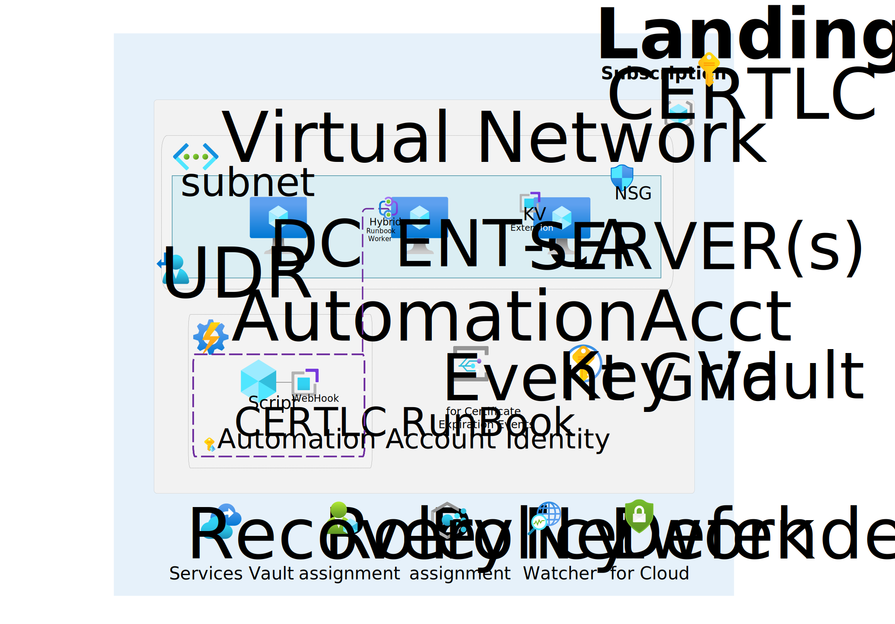
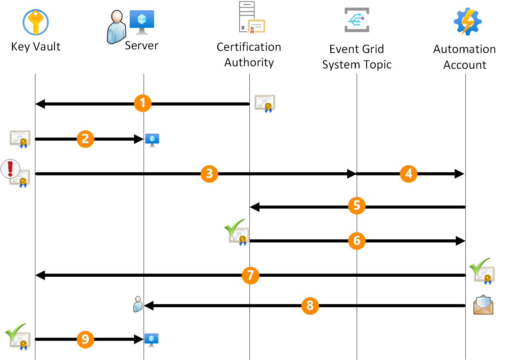

In the realm of cybersecurity, the automatic renewal of certificates is a critical aspect of maintaining a secure and reliable environment. While Azure Key Vault already offers mechanisms for the [automatic renewal of certificates](https://learn.microsoft.com/en-us/azure/key-vault/certificates/overview-renew-certificate?tabs=azure-portal) issued by an integrated Certification Authority (issued by trusted Microsoft certificate authorities *DigiCert* and *GlobalSign*), when dealing with nonintegrated CAs, a [manual](https://learn.microsoft.com/en-us/azure/key-vault/certificates/overview-renew-certificate?tabs=azure-portal#renew-a-nonintegrated-ca-certificate) approach is required. 
This article aims to bridge this gap by elucidating an **automated renewal process for certificates from non-integrated CAs** that will automatically store the new certificates in the Key Vault, offering efficiency, enhanced security and  lets you integrate with several Azure resources making deployment easy.

## Architecture

Before delving into details of the automated renewal process, let's take a brief look at the architecture that forms the backbone of this solution. 




*Download a [Visio file](./.media/certlc.vsdx) of this architecture.*

The Azure environment in question comprises the following Platform as a Service (PaaS) resources: a **Key Vault**, an **Event Grid System topic**, and an **Automation Account** exposing a webhook targeted by the Event Grid. It is assumed that an existing Public Key Infrastructure (PKI) infrastructure, consisting of a Microsoft Enterprise Certification Authority joined to an Active Directory (AD) domain, is already in place for this scenario. Both the PKI and the AD can be placed on Azure or on-premises as well as the servers that need to be configured for certificate renewal. The following sections will provide a detailed explanation of the automated renewal process.

## Workflow

The following drawing shows the automated workflow for certificate renewal within the Azure ecosystem. 



1. **Key Vault Configuration:**
The process begins with the certificates residing within the Key Vault. The certificate should be tagged with the administrator e-mail address for notification purposes. If multiple recipients are required, the e-mail addresses should be separated by comma or semicolon. The expected tag name is 'Recipient' and the value is the e-mail address(es) of the administrator(s).

1. **Key Vault Extension Configuration:**
The servers that need to utilize these certificates are equipped with the Key Vault extension, a versatile tool compatible with *[Windows](https://learn.microsoft.com/azure/virtual-machines/extensions/key-vault-windows)* and *[Linux](https://learn.microsoft.com/azure/virtual-machines/extensions/key-vault-linux)* both Azure-based (IaaS) servers and on-premises/other-clouds servers integrated through *[Azure ARC](https://learn.microsoft.com/azure/azure-arc/overview)*. The Key Vault extension is configured to periodically poll the Key Vault for any updated certificates. This polling interval is customizable, allowing flexibility to align with specific operational requirements.

1. **Event Grid and Automation Account Integration:**
When the certificate is near to expire, the Event Grid intercepts this event. Upon detection, the Event Grid triggers the execution of a RunBook through the webhook configured in the Automation Account.

1. **Hybrid RunBook Worker Execution:**
    - The RunBook, executed within the Certification Authority server configured as a Hybrid RunBook Worker, takes as input the webhook body containing the name of the expiring certificate and the Key Vault hosting it. 
    - Leveraging Azure connectivity, the script within the RunBook connects to Azure to retrieve the certificate's template name used during its generation.
    - Subsequently, the script interfaces with the Key Vault, initiating a certificate renewal request. This request results in the generation of a Certificate Signing Request (CSR).

1. **RunBook start certification authority renewal process:**
The script downloads the CSR and submits it to the Certification Authority.

1. **Certificate renewal:**
 The Certification Authority generate a new certificate based on the correct template and send it back to the script. This ensures that the renewed certificate aligns with the predefined security policies.

1. **Certificate Import and Key Vault Update:**
The script imports the renewed certificate back into the Key Vault, finalizing the update process. 

1. **E-mail notification:**
A the same time, the script sends an e-mail notification to the administrator, informing them of the successful renewal of the certificate available on the Key Vault.

1. **Certificate retrieval:**
The Key Vault extension running on the server plays a pivotal role in this phase by automatically downloading the latest version of the certificate from the Key Vault into the local store of the server utilizing it. Multiple servers can be configured with the Key Vault extension to retrieve the same certificate (wildcard or with multiple Subject Alternative Names) from the Key Vault.


## Components
The solution uses several components to allow automatic certificate renewal: in the following chapters, each component and its purpose are explained in details.

> [!NOTE]
> + Inserire i macro passi come se dovessi implemenare la soluzione manualmente
> + inserire qui anche gli aspetti di sicurezza e gli eventuali improvement con la Logic App oppure riferimento ad articolo per le chiamate autenticate con beerer verso il webhook 

### Key Vault Extension
The Key Vault Extension is a crucial component for automating certificate renewal. It must be installed on servers where certificate renewal automation is desired. The installation procedures for Windows servers can be found at [Key Vault Extension for Windows](https://learn.microsoft.com/en-us/azure/virtual-machines/extensions/key-vault-windows), for Linux servers at [Key Vault Extension for Linux](https://learn.microsoft.com/en-us/azure/virtual-machines/extensions/key-vault-linux), and for Azure ARC-enabled servers at [Azure Key Vault Extension for ARC-enabled Servers](https://techcommunity.microsoft.com/t5/azure-arc-blog/in-preview-azure-key-vault-extension-for-arc-enabled-servers/ba-p/1888739).

> [!NOTE]
> You can find sample scripts, that can be executed from Azure Cloud Shell, for configuring the *Key Vault extension* at the links below:
> - [KV extension for Windows servers](./.scripts/kvextensionWin.ps1)
> - [KV extension for Linux servers](./blob/main/.scripts/kvextensionLinux.ps1)
> - [KV extension for Azure ARC-enabled Windows servers](./.scripts/kvextensionARCWin.ps1)
> - [KV extension for Azure ARC-enabled Linux servers](./.scripts/kvextensionARCLinux.ps1)

Key vault extension is configured with the following parameters:

- **Key Vault Name:** The name of the Key Vault containing the certificate to be renewed.
- **Certificate Name:** The name of the certificate to be renewed.
- **Certificate Store (Name and Location):** The certificate store where the certificate is to be stored. On Windows servers, the default value for Name  is 'My' and for Location is 'LocalMachine', which is the personal certificate store of the computer. On Linux servers, a file system path can be specified, considering that the default value is 'AzureKeyVault', which is the certificate store for Azure Key Vault.
- **linkOnRenewal:** A flag indicating whether the certificate should be linked to the server on renewal. If 'true' on Windows machines it copies the new certificate in the store and link it to the old one doing an effective rebinding of the certificate. The default value is 'false' meaning that an explicit binding is required.
- **pollingIntervalInS:** The polling interval for the Key Vault extension to check for certificate updates. The default value is 3600 seconds (1 hour).
- **authenticationSetting:** The authentication setting for the Key Vault extension. For Azure-based servers this setting can be omitted, meaning that the System Assigned Managed Identity (MI) of the VM is used against the Key Vault. For on-premises servers, specifying the setting 'msiEndpoint = "http://localhost:40342/metadata/identity"' means the usage of the service principal associated with the computer object created during the ARC onboarding.

If the Key Vault extension is deployed on an Azure VM then the Managed Identity (MI) of the VM is used to authenticate against the Key Vault. If the KV extension is deployed on an Azure ARC-enabled server, then the authentication is performed using a service principal.
Both MI and Service Principal must have the 'Key Vault Secret User' role assigned on the Key Vault containing the certificate to be renewed. The usage of 'Secret' is due to the fact that the certificate is stored in the Key Vault as a secret behind the scene.


### Automation Account
The Automation Account acts as the orchestrator for the certificate renewal process. It needs to be configured with a RunBook, and the PowerShell script for the RunBook can be found [here](./.RunBook/RunBook_v2a.ps1). 
Additionally, an Hybrid Worker Group must be created, associating it with an Azure Windows VM member of the same AD domain of the Certification Authority (ideally the Certification Authority itself) for executing RunBooks. 
The RunBook should have a [webhook](https://learn.microsoft.com/azure/automation/automation-webhooks) associated with it, initiated from the Hybrid RunBook Worker. 
The webhook URL should be configured in the Event Subscription of the Event Grid System Topic. 
About security, the automation account must have the 'Key Vault Certificate Officer' role on the Key Vault containing certificates.

### Hybrid RunBook worker
The Hybrid RunBook Worker plays a pivotal role in executing RunBooks. It needs to be installed with the [Azure Hybrid Worker Extension](https://learn.microsoft.com/azure/automation/extension-based-hybrid-runbook-worker-install), which is the supported mode for the new installation. It must be created and associated with an Azure Windows VM member of the same AD domain of the Certification Authority (ideally the Certification Authority itself). 
The security part of the hybrid worker is crucial for the correct execution of the RunBook. The 'System' account of the Hybrid RunBook Worker VM must have the right to enroll certificate on the Certificate template(s) used to generate new certificates.

### Azure Key Vault
Azure Key Vault is the secure repository for certificates. The Automation Account and the servers requiring certificate access, must be granted specific permissions within the Key Vault. The RBAC model should include 'Get' and 'List' permissions for the automation account and the servers. 
Additionally, in the 'Event' section of the Key Vault, the Event Grid System Topic should be associated with the webhook of the Automation Account with a subscription. The correct Key Vault roles to be assigned to the [automation account](#automation-account) and the [servers](#key-vault-extension) (the ones with the Key Vault extension) have already been mentioned in the previous sections.


### Azure Event Grid
Event Grid facilitates event-driven communication within the Azure environment. It needs to be configured with the Event Grid System Topic and the Event Subscription. This ensures that relevant events, such as certificate expiration alerts, trigger the necessary actions within the automation workflow. The Event Grid System Topic should be configured with the following parameters:

- **Source:** The name of the Key Vault containing the certificates.
- **Source Type:** The type of the source. In this case, the source type is 'Azure Key Vault'.
- **Event Types:** The event type to be monitored. In this case, the event type is 'Microsoft.KeyVault.CertificateNearExpiry'. This event is triggered when a certificate is near to expire.
- **Endpoint Type:** The type of endpoint to be used. In this case, the endpoint type is 'Webhook'.
- **Endpoint:** The URL of the webhook associated with the Automation Account RunBook as explained in the 'Automation Account' section.
- **Subscription Name:** The name of the event subscription.

## Deploy this scenario
The button below automatically deploys the environment described in this article. The deployment will take about 2 minutes to complete and creates a **Key Vault**, an **Event Grid System Topic** and an **Automation Account** containing the *RunBook* and the *webhook* linked to the Event Grid.

[](https://portal.azure.com/#create/Microsoft.Template/uri/https%3A%2F%2Fraw.githubusercontent.com%2Fazure%2Fcertlc%2Fmain%2F.armtemplate%2Fmindeploy.json)

To integrate the solution with your existing environment, you need to perform the following steps:

- Configure an Hybrid Worker VM installing the [Azure Hybrid Worker Extension](https://learn.microsoft.com/azure/automation/extension-based-hybrid-runbook-worker-install) on the Certification Authority server (or on a server joined to the same AD domain) and adding it to the Hybrid Worker Group defined in the Automation Account.
- Install the following Powershell modules on the Hybrid Worker VM:

    ```powershell
    # Required powershell modules for the Hybrid Worker
        Install-PackageProvider -Name NuGet -MinimumVersion 2.8.5.201 -Force
        Register-PSRepository -Default -InstallationPolicy Trusted
        Install-Module Az.Resources -requiredVersion 6.6.0 -Repository PSGallery -Scope AllUsers -Force
        Install-Module Az.Compute -requiredVersion 5.7.0 -Repository PSGallery -Scope AllUsers -Force
        Install-Module Az.KeyVault -requiredVersion 4.9.2 -Repository PSGallery -Scope AllUsers -Force
        Install-Module Az.Accounts -requiredVersion 2.12.1
        Install-Module PSPKI -Repository PSGallery -Scope AllUsers -Force
    ```


- Add the 'System' account of the Hybrid RunBook Worker VM to the Certificate Template(s) used to generate the certificates.
- Install the [Key Vault extension](#key-vault-extension) on the servers that need to retrieve the renewed certificates from the Key Vault.
- Add the 'Key Vault Secret User' role to the the servers with the Key Vault extension on the Key Vault containing the certificates.
- If you've specified the SMTPServer parameter during deployment, ensure the following: 
    - the Hybrid RunBook Worker VM can reach the SMTP server, 
    - the SMTP port is open in the firewall, 
    - the SMTP server accepts mail submissions from the Hybrid RunBook Worker VM.
- Import the certificates into the Key Vault and **TAG** them with the administrator e-mail address for notification purposes. If multiple recipients are required, the e-mail addresses should be separated by comma or semicolon. The expected tag name is 'Recipient' and the value is the e-mail address(es) of the administrator(s).

> [!IMPORTANT]
> > If you want to deploy a **full LAB environment** ready to demonstrate the whole automatic certificate renewal workflow, you can refer to the following [code sample](https://github.com/Azure/certlc/blob/main/README.md) that includes the deployment of the following additional resources:
> > - **Active Directory Domain Services** (ADDS) within a domain controller virtual machine;
> > - **Active Directory Certificate Services** (ADCS) within a Certification Authority virtual machine, joined to the domain, configured with a template, *WebServerShort*, for the enrollment of the certificates to be renewed.
> > - **Windows SMTP Server** installed on the same virtual machine of the Certification Authority for sending e-mail notifications. A MailViewer tool is also installed to facilitate the verification of the e-mail notifications sent.
> > - **KeyVault Extension** installed on the virtual machine of the Domain Controller for retrieving the renewed certificates from the Key Vault.


## Contributors

*This article is maintained by Microsoft. It was originally written by the following contributors.*

Principal author:

- [Fabio Masciotra](https://www.linkedin.com/in/fabiomasciotra/) | Principal Consultant
- [Angelo Mazzucchi](https://www.linkedin.com/in/angelo-mazzucchi-a5a94270) | Delivery Architect

*To see non-public LinkedIn profiles, sign in to LinkedIn.*

## Related resources
[Azure Key Vault](https://learn.microsoft.com/azure/key-vault/general/overview)
[Azure Key Vault Extension for Windows](https://learn.microsoft.com/en-us/azure/virtual-machines/extensions/key-vault-windows?tabs=version3)
[Azure Key Vault Extension for Linux](https://learn.microsoft.com/azure/virtual-machines/extensions/key-vault-linux)
[Automation account](https://learn.microsoft.com/azure/automation/overview)
[Automation Hybrid Runbook Worker](https://learn.microsoft.com/azure/automation/automation-hybrid-runbook-worker)
[Event Grid](https://learn.microsoft.com/azure/event-grid/overview)

