# Building a CI/CD Pipeline for Chatbots

DevOps is a concept that we commonly hear from a development team when building a custom application. As a bot is still a type of software, those concepts could translate.

In this article, we will discuss an approach to setting up a Continuous Integration (CI) and Continuous Deployment (CD) pipeline for your C# bot deployment to an App Service Plan. 

There are a range of benefits when adopting a modern CI/CD process for builds, deployments, testing and monitoring of your software. Tools such as Azure DevOps can help you to accelerate your software delivery, and focus on your software rather than the supporting infrastructure and operations.

This document will show you how to:
- Do the Initial setup of the Azure DevOps environment
- Source control your solution
- Create the necessary ARM templates for the deployment of the solution
- Register, create and debug a chatbot
- Build and Deploy the cahtbot

In this example, we will be creating a Build and Release pipeline to deploy our underlying bot infrastructure and release the bot logic. Assuming that we are developing the code locally, then the deployment flow would look similar to this:


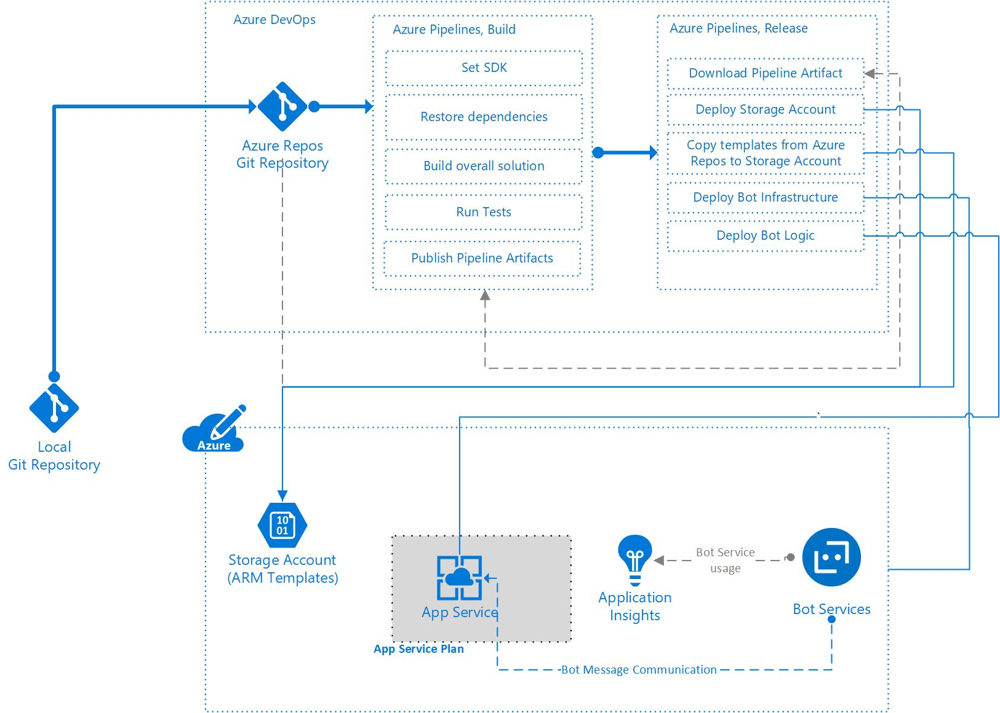


## Initial Setup

To walk through this sample, you will first need an Azure DevOps organization, and a team project.

* [Create an Azure DevOps Organization](https://docs.microsoft.com/en-us/azure/devops/organizations/accounts/create-organization?view=vsts)
* [Create a project in Azure DevOps](https://docs.microsoft.com/en-us/azure/devops/organizations/projects/create-project?view=vsts&tabs=new-nav)

## Source Controlling your solution

Source control is commonly used when developing software. This helps development teams track changes made by users, allowing them to track changes made, and inspect older versions of the code.

Typically, source control is thought of hand-in-hand with software code. How about the underlying infrastructure? This brings us onto the topic of Infrastructure as Code, where we can use a technology such as Azure Resource Manager (ARM) Templates or other open source alternatives to declaratively define our underlying infrastructure.

In this section, we will assume that you have familiarized yourself with version control and designing ARM templates.

* [What is source control?](https://docs.microsoft.com/en-us/azure/devops/user-guide/source-control?view=vsts)
* [Understand the structure and syntax of Azure Resource Manager Templates](https://docs.microsoft.com/en-us/azure/azure-resource-manager/resource-group-authoring-templates)

### ARM Templates

In this example, we will leverage multiple ARM Templates to deploy our solution. In this approach, we use a number of **capability templates** (similar to units or modules) that implement a specific piece of functionality, and an **end-to-end solution template** which is responsible for bringing those underlying capabilities together. There are a couple of benefits to this approach:

* The underlying capability templates can be individually unit tested.
* The underlying capability templates could be defined as a standard inside of an organisation, and be re-used in multiple solutions.

For this example, there is an end-to-end solution template (deployment.json) that deploys three templates. The underlying templates are capability templates, responsible for deploying a specific aspect of the solution.

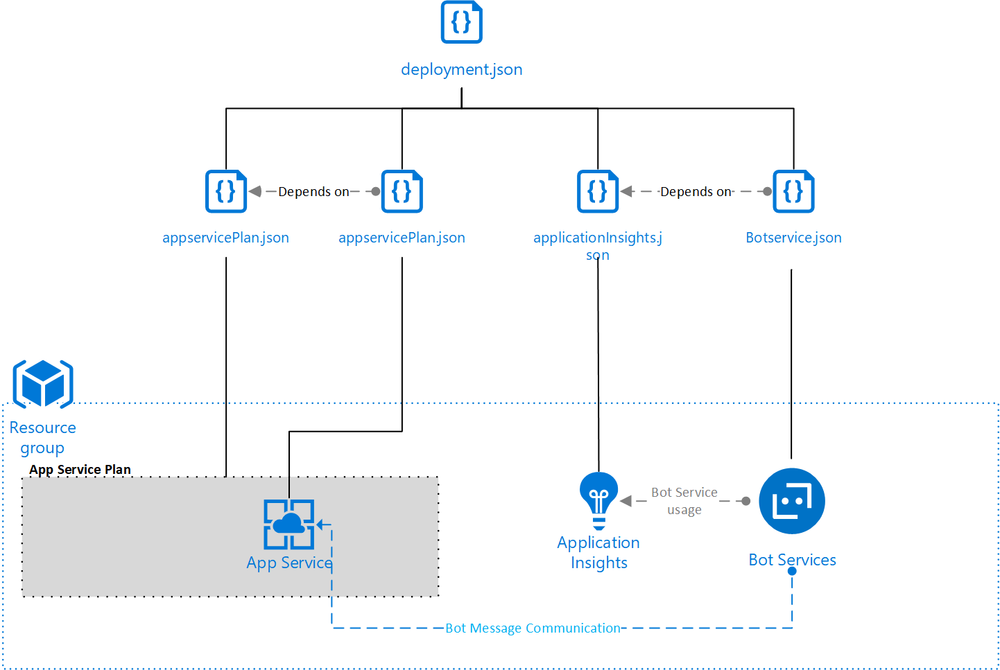

The first template that we will look at is for a Storage Account. Our solution requires a storage account to deploy the application to our Batch Account. It is worth being aware of the [ARM Template reference guide for Microsoft.Storage resource types](https://docs.microsoft.com/en-us/azure/templates/microsoft.storage/allversions) when building ARM templates for Storage Accounts .

```json
{
    "$schema": "https://schema.management.azure.com/schemas/2015-01-01/deploymentTemplate.json#",
    "contentVersion": "1.0.0.0",
    "parameters": {        
        "accountName": {
            "type": "string",
            "metadata": {
                 "description": "Name of the Storage Account"
             }
         }
    },
    "variables": {},
    "resources": [
        {
            "type": "Microsoft.Storage/storageAccounts",
            "name": "[parameters('accountName')]",
            "sku": {
                "name": "Standard_LRS"
            },
            "apiVersion": "2018-02-01",
            "location": "[resourceGroup().location]",
            "properties": {}
        }
    ],
    "outputs": {
        "blobEndpoint": {
          "type": "string",
          "value": "[reference(resourceId('Microsoft.Storage/storageAccounts', parameters('accountName'))).primaryEndpoints.blob]"
        },
        "resourceId": {
          "type": "string",
          "value": "[resourceId('Microsoft.Storage/storageAccounts', parameters('accountName'))]"
        }
    }
}
```

Next, we will build the template for an App Service Plan. An App Service Plan is the underlying server farm used to deploy an instance of an Azure App Service deployment.

```json
{
    "$schema": "https://schema.management.azure.com/schemas/2015-01-01/deploymentTemplate.json#",
    "contentVersion": "1.0.0.0",
    "parameters": {
        "appservicePlanName": {
           "type": "string",
           "metadata": {
                "description": "Name of the App Service Plan"
            }
        }
    },
    "variables": {},
    "resources": [
        {
            "type": "Microsoft.Web/serverfarms",
            "apiVersion": "2016-09-01",
            "name": "[parameters('appservicePlanName')]",
            "location": "[resourceGroup().location]",
            "sku": {
                "name": "S1",
                "capacity": 1
            },
            "properties": {
                "name": "[parameters('appservicePlanName')]"
            }
        }
    ],
    "outputs": {}
}
```

Now that the underlying server farm exists, the next component is to create a template to deploy the app service instance.

```json
{
    "$schema": "https://schema.management.azure.com/schemas/2015-01-01/deploymentTemplate.json#",
    "contentVersion": "1.0.0.0",
    "parameters": {
        "appservicePlanName": {
           "type": "string",
           "metadata": {
                "description": "Name of the App Service Plan"
            }
        },
        "appserviceName": {
           "type": "string",
           "metadata": {
                "description": "Name of the App Service"
            }
        },              
        "botserviceName": {
            "type": "string",
            "metadata": {
                 "description": "Name of the Bot Service"
             }
         },         
         "botMicrosoftAppId": {
            "type": "string",
            "metadata": {
                 "description": "Microsoft Application ID for the bot"
             }
         },         
         "botMicrosoftAppPassword": {
            "type": "securestring",
            "metadata": {
                 "description": "Microsoft Application Password for the bot"
             }
         }
    },
    "variables": {},
    "resources": [
        {
            "type": "Microsoft.Web/sites",
            "apiVersion": "2015-08-01",
            "name": "[parameters('appserviceName')]",
            "location": "[resourceGroup().location]",
            "properties": {
                "serverFarmId": "[resourceId('Microsoft.Web/serverfarms/', parameters('appservicePlanName'))]",
                "siteConfig": {
                    "appSettings": [
                        {
                            "name": "BotId",
                            "value": "[parameters('botserviceName')]"
                        },
                        {
                            "name": "MicrosoftAppId",
                            "value": "[parameters('botMicrosoftAppId')]"
                        },
                        {
                            "name": "MicrosoftAppPassword",
                            "value": "[parameters('botMicrosoftAppPassword')]"
                        }
                    ]
                }
            }
        }
    ],
    "outputs": {
        "siteUri": {
            "type": "string",
            "value": "[reference(concat('Microsoft.Web/sites/', parameters('appserviceName'))).hostnames[0]]"
        }
    }
}
```

The next template deploys an Application Insights resource. This resource can collect telemetry from the Web App on what the application (or bot logic) is doing, and how it is performing. It can also be connected directly to the Bot Service resource.

The template outputs the Instrumentation Key of the Application Insights resource, as well as the resource ID. These are needed when configuring the Bot Service endpoint, so that telemetry can be collected directly from Azure Bot Service. An API Key will also be required from the Application Insights resource, but this cannot be created using an ARM template. You will create this manually shortly.

```json
{
    "$schema": "https://schema.management.azure.com/schemas/2015-01-01/deploymentTemplate.json#",
    "contentVersion": "1.0.0.0",
    "parameters": {
        "appInsightsName": {
           "type": "string",
           "metadata": {
                "description": "Name of the Application Insights resource"
            }
        }
    },
    "variables": {},
    "resources": [
        {
            "name": "[parameters('appInsightsName')]",
            "type": "microsoft.insights/components",
            "apiVersion": "2018-05-01-preview",
            "location": "[resourceGroup().location]",
            "kind": "web",
            "properties": {
              "Application_Type": "web"
            }
          }
    ],
    "outputs": {        
        "resourceId": {
            "type": "string",
            "value": "[resourceId('microsoft.insights/components', parameters('appInsightsName'))]"
        },                
        "instrumentationKey": {
            "type": "string",
            "value": "[reference(resourceId('microsoft.insights/components', parameters('appInsightsName'))).InstrumentationKey]"
          }
    }
}
```

The final component is the Azure Bot Service. The Azure Bot Service resource provides an endpoint for the bot to communicate through the channels which are chosen. It also provides a mechanism to associate the bot to a Pricing tier, based upon the expected requests/throughput.

```json
{
    "$schema": "https://schema.management.azure.com/schemas/2015-01-01/deploymentTemplate.json#",
    "contentVersion": "1.0.0.0",
    "parameters": {
        "botserviceName": {
           "type": "string",
           "metadata": {
                "description": "Name of the Bot Service"
            }
        },
        "botserviceDisplayName": {
           "type": "string",
           "metadata": {
                "description": "Display Name of the Bot"
            }
        },
        "botlogicEndpoint": {
           "type": "string",
           "metadata": {
                "description": "Endpoint to call the bot logic"
            }
        },
        "botMicrosoftAppId": {
           "type": "string",
           "metadata": {
                "description": "Microsoft Application ID for the bot"
            }
        },
        "botAppInsightKey": {
           "type": "string",
           "metadata": {
                "description": "Instrumentation Key of the Application Insights resource"
            }
        },
        "botAppInsightsApiKey": {
           "type": "string",
           "metadata": {
                "description": "API Key associated with the Application Insights Resource"
            }
        },
        "developerAppInsightsApplicationId": {
           "type": "string",
           "metadata": {
                "description": "Resource ID of the Application Insights Resource"
            }
        }
    },
    "variables": {},
    "resources": [
        {
            "name": "[parameters('botserviceName')]",
            "type": "Microsoft.BotService/botServices",
            "apiVersion": "2018-07-12",
            "location": "global",
            "sku": {
                "name": "F0"
            },
            "kind": "bot",
            "properties": {
                "displayName": "[parameters('botserviceDisplayName')]",
                "endpoint": "[parameters('botlogicEndpoint')]",
                "msaAppId": "[parameters('botMicrosoftAppId')]",
                "developerAppInsightKey": "[parameters('botAppInsightKey')]",
                "developerAppInsightsApiKey": "[parameters('botAppInsightsApiKey')]",
                "developerAppInsightsApplicationId": "[parameters('developerAppInsightsApplicationId')]"
            }
        }
    ],
    "outputs": {}
}
```

Now that the individual components have been defined, the end-to-end solution template can now be produced.

Usually chatbots can use Cognitive Services such as LUIS and QnA Maker, so in case you are planning to add them, you need to make sure they are present in the template as well.

```json
{
    "$schema": "https://schema.management.azure.com/schemas/2015-01-01/deploymentTemplate.json#",
    "contentVersion": "1.0.0.0",
    "parameters": {
        "templateContainerUri": {
           "type": "string",
           "metadata": {
                "description": "URI of the Blob Storage Container containing the ARM Templates"
            }
        },
        "templateContainerSasToken": {
           "type": "string",
           "metadata": {
                "description": "The SAS token of the container containing the ARM Templates"
            }
        },
        "appservicePlanName": {
            "type": "string",
            "metadata": {
                 "description": "Name of the App Service Plan"
             }
         },
         "appserviceName": {
            "type": "string",
            "metadata": {
                 "description": "Name of the App Service"
             }
         },         
        "botserviceName": {
            "type": "string",
            "metadata": {
                 "description": "Name of the Bot Service"
             }
         },
         "botserviceDisplayName": {
            "type": "string",
            "metadata": {
                 "description": "Display Name of the Bot"
             }
         },
         "botMicrosoftAppId": {
            "type": "string",
            "metadata": {
                 "description": "Microsoft Application ID for the bot"
             }
         },
         "botMicrosoftAppPassword": {
            "type": "securestring",
            "metadata": {
                 "description": "Microsoft Application Password for the bot"
             }
         },       
         "appInsightsName": {
            "type": "string",
            "metadata": {
                "description": "Name of the Core Application Insights Resource"
            }
        },
         "botAppInsightsApiKey": {
            "type": "string",
            "metadata": {
                "description": "API Key for the Application Insights Resource"
            }
        },
         "developerAppInsightsApplicationId": {
            "type": "string",
            "metadata": {
                "description": "Appication ID for the Developer Application Insights Resource"
            }
        } 
    },
    "variables": {},
    "resources": [ 
        {
            "apiVersion": "2017-05-10",
            "name": "appservicePlanDeployment",
            "type": "Microsoft.Resources/deployments",
            "properties": {
                "mode": "Incremental",
                "templateLink": {
                  "uri": "[concat(parameters('templateContainerUri'), '/appservicePlan.json', parameters('templateContainerSasToken'))]",
                  "contentVersion": "1.0.0.0"
                },
                "parameters": {
                    "appservicePlanName": {"value": "[parameters('appservicePlanName')]"}
                }
            }
        },     
        {
            "apiVersion": "2017-05-10",
            "name": "appserviceDeployment",
            "type": "Microsoft.Resources/deployments",
            "dependsOn": [
                "appservicePlanDeployment"
            ],
            "properties": {
                "mode": "Incremental",
                "templateLink": {
                  "uri": "[concat(parameters('templateContainerUri'), '/appservice.json', parameters('templateContainerSasToken'))]",
                  "contentVersion": "1.0.0.0"
                },
                "parameters": {
                    "appservicePlanName": {"value": "[parameters('appservicePlanName')]"},
                    "appserviceName": {"value": "[parameters('appserviceName')]"},                    
                    "botserviceName": {"value": "[parameters('botserviceName')]"},
                    "botMicrosoftAppId": {"value": "[parameters('botMicrosoftAppId')]"},
                    "botMicrosoftAppPassword": {"value": "[parameters('botMicrosoftAppPassword')]"}
                }
            }
        },  
        {
            "apiVersion": "2017-05-10",
            "name": "applicationInsightsDeployment",
            "type": "Microsoft.Resources/deployments",
            "properties": {
                "mode": "Incremental",
                "templateLink": {
                    "uri": "[concat(parameters('templateContainerUri'), '/applicationInsights.json', parameters('templateContainerSasToken'))]",
                    "contentVersion": "1.0.0.0"
                },
                "parameters": {
                    "appInsightsName": {"value": "[parameters('appInsightsName')]"}
                }
            }
        },   
        {
            "apiVersion": "2017-05-10",
            "name": "botserviceDeployment",
            "type": "Microsoft.Resources/deployments",
            "dependsOn": [
                "appserviceDeployment",
                "applicationInsightsDeployment"
            ],
            "properties": {
                "mode": "Incremental",
                "templateLink": {
                  "uri": "[concat(parameters('templateContainerUri'), '/botservice.json', parameters('templateContainerSasToken'))]",
                  "contentVersion": "1.0.0.0"
                },
                "parameters": {
                    "botserviceName": {"value": "[parameters('botserviceName')]"},
                    "botserviceDisplayName": {"value": "[parameters('botserviceDisplayName')]"},
                    "botLogicEndpoint": {"value": "[concat('https://', reference('appserviceDeployment').outputs.siteUri.value, '/api/messages')]"},
                    "botMsaAppId": {"value": "[parameters('botMicrosoftAppId')]"},
                    "botAppInsightKey": {"value": "[reference('applicationInsightsDeployment').outputs.instrumentationKey.value]"},
                    "botAppInsightsApiKey": {"value": "[parameters('botAppInsightsApiKey')]"},
                    "developerAppInsightsApplicationId": {"value": "[parameters('developerAppInsightsApplicationId')]"}
                }
            }
        }
    ],
    "outputs": {}
}
```
Note that bots deployed into production environment may not reference the variables used in Azure DevOps, but may use Azure KeyVault within the deployment pipeline to store secrets.

#### Setup Application Insights Resource

It is possible for us to set up [Bot Analytics](https://docs.microsoft.com/en-us/azure/bot-service/bot-service-manage-analytics?view=azure-bot-service-4.0) and gain additional insight into the performance of our bot. To achieve this, we need to take one step outside of the ARM Template deployment, which is creating an API Key inside of the Application Insights resource. For ease of readability for this article and keeping the DevOps pipeline concise, we will create the Application Insights resource initially and the API Key manually.

First, create an Application Insights resource in your Azure Subscription. Once this has been completed, navigate to the Application Insights resource that you just created. On the left hand side of the Application Insights resource blade, you should see an option for API Access underneath the "Configure" section.


Click "Create API Key", provide a description and select the read telemetry option. Take note of secret that is created, as this is only displayed once. You will need this in a later step when the release definition is created. Also take note of the Application ID as well.

### Creating the bot project locally

In Visual Studio, create a new Bot Framework project. You can use the Echo Bot template, or start an empty project. 

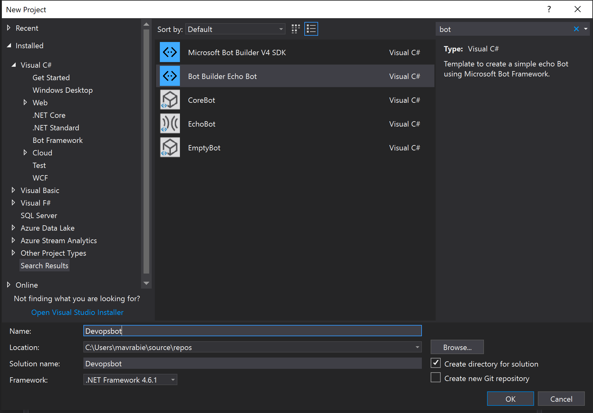

You can find a comprehensive tutorial on creating a Bot Framework project with SDK v3 [here](https://docs.microsoft.com/en-us/azure/bot-service/?view=azure-bot-service-3.0) and SDK v4 [here](https://docs.microsoft.com/en-us/azure/bot-service/dotnet/bot-builder-dotnet-sdk-quickstart?view=azure-bot-service-4.0)

### Channels registration

Deploying chatbots on different channels hasn't been easier. You can find more information on [how you can configure a bot to run on multiple channels](https://docs.microsoft.com/en-us/azure/bot-service/bot-service-manage-channels?view=azure-bot-service-4.0) 

Adding a bot in Microsoft Teams requires a few additional steps and considerations. You can find more information on the pre requisites and a step by step approach [here](https://docs.microsoft.com/en-us/microsoftteams/platform/concepts/bots/bots-overview)

In order for the bot to be deployed, it would need an App ID and Password, as well as the option to choose the channels that will run in. In the Azure portal, create a new "Bot channels registration" resource.

As you will have seen from the ARM templates, there is an ARM template to create the Channel Registration (referenced as bot service) in an automated approach. You will need to create an App Registration to allow the deployed code to communicate with the Bot Framework. [This Article](https://docs.microsoft.com/en-us/azure/bot-service/bot-service-resources-bot-framework-faq?view=azure-bot-service-4.0#app-registration) explains how to create the registration. Take a note of the Application ID and the Application Password, as you will need these in the deployment section and will set these to Azure DevOps variables.

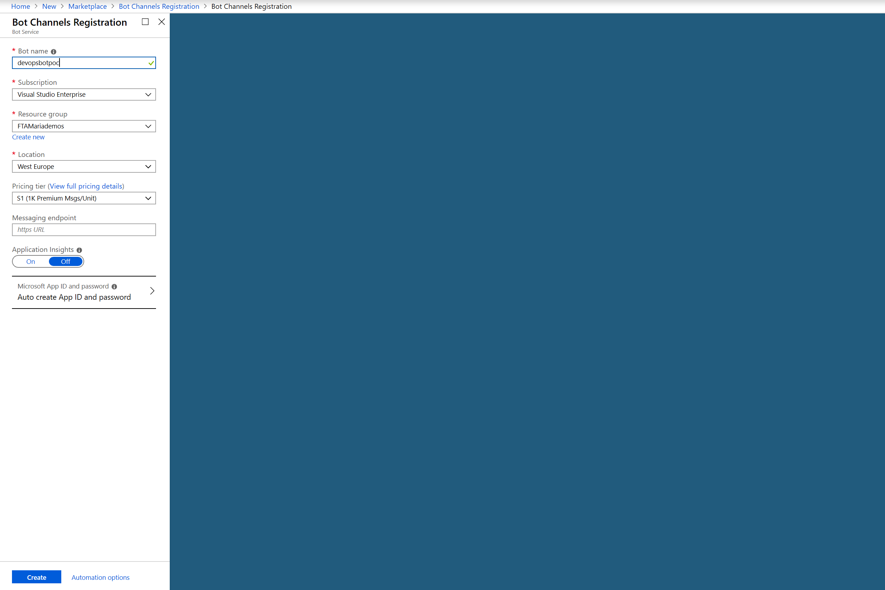

### The bot logic

Our infrastructure and software can be defined as code and co-located in the same repository.

The application itself is a fairly simple chatbot designed to work in the Microsoft Teams channel. The chatbot will reply to anyone writing "VSTS" with the phrase << You mentioned "VSTS" above, but I think you meant Azure DevOps >>. 

The focus of this document is the DevOps side of building and deploying a chatbot application, rather than the code building side.

For this particular example, there are four main sections to our repository:

* The **application** folder which contains the bot logic
* The **arm-templates** folder which stores our Infrastructure as Code
* The **pipelines** folder which contains the definition for our build pipeline.

> This is just one example of a structure. This is simply to demonstrate that we have application, infrastructure and pipeline code all stored in the same repository.

Now that we have our source code set up, we can begin our first build.

## Debugging the Bot

You can test and debug your chatbot whilst developing it using the [Bot Framework emulator](https://github.com/Microsoft/BotFramework-Emulator). The Bot Framework Emulator is a desktop application that allows bot developers to test and debug bots built using the BotBuilder SDK. You can download it from the [GitHub releases page](https://github.com/Microsoft/BotFramework-Emulator/releases/tag/v4.2.1) 

Once installed you can either start talking to your bot by connecting to an endpoint or by opening a bot saved locally.
The emulator gives information in JSON, which is handy to read and comprehend.

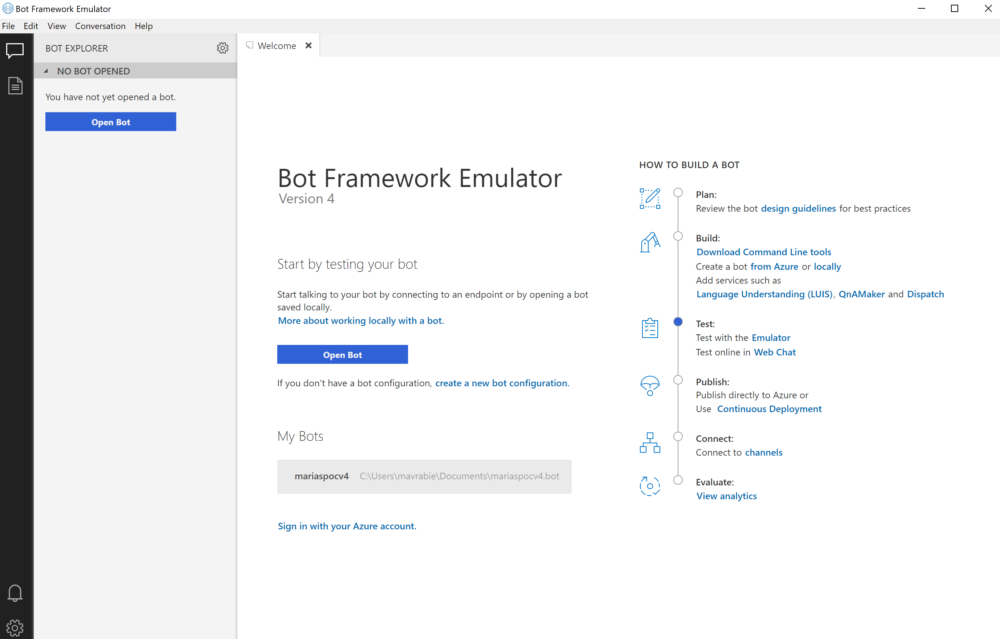

## Building the Bot

[Azure Pipelines](https://docs.microsoft.com/en-us/azure/devops/pipelines/get-started/index?view=vsts) is the service inside of Azure DevOps that helps you implement a build, test, and deployment pipeline for your applications.

In this stage of your pipeline, you will typically run tests to validate the code is functioning as expected, and build the appropriate parts of the software. The number and types of tests, and additional tasks that you run will depend on your wider build and release strategy.

### Setting up the Bot Infrastructure

1. Navigate to the Builds section of Azure Pipelines in your Azure DevOps organization.
2. Create a New Build Pipeline.

    

3. You have two options to create your Build pipeline;

    a. [Using the Visual Designer](https://docs.microsoft.com/en-us/azure/devops/pipelines/get-started-designer?view=vsts&tabs=new-nav). To use this approach click "Use the visual designer" on the New pipeline page.

    b. [Using YAML Builds](https://docs.microsoft.com/en-us/azure/devops/pipelines/get-started-yaml?view=vsts). You can create a new YAML pipeline by clicking the Azure Repos or GitHub option on the New pipeline page. Alternatively, you can store the example below in your source control and reference an existing yaml file by clicking on Visual Designer, and then using the YAML template.

```yaml
steps:
# Ensure that an appropriate version of the SDK is installed to 
# build the test project.
- task: DotNetCoreInstaller@0
  displayName: 'Use .NET Core sdk 2.1.504'
  inputs:
    version: 2.1.504
# Restore those dependencies required for the Bot Logic
- task: NuGetCommand@2
  displayName: 'NuGet restore'
  inputs:
    restoreSolution: 'application/*.sln'
# Build the bot logic, packaging it as a zip file.
# The reason we want a zip file is because we will
# push the end result to Azure App Service.
- task: VSBuild@1
  displayName: 'Build solution application/*.sln'
  inputs:
    solution: 'application/*.sln'
    msbuildArgs: '/p:DeployOnBuild=true /p:WebPublishMethod=Package /p:PackageAsSingleFile=true /p:SkipInvalidConfigurations=true /p:PackageLocation="$(Build.ArtifactStagingDirectory)/package/$(Build.BuildId).zip"'
# Run the .NET Core task to execute the tests from our DevOps
# test project. This version of the task also uploads the 
# results to Azure DevOps, so we do not need the separate
# publish results task. We also put --no-build as it has already 
# been built using the VSBuild task.
- task: DotNetCoreCLI@2
  displayName: 'dotnet test'
  inputs:
    command: test
    projects: application/Devopsbttest/Devopsbttest.csproj
    arguments: '--no-build'
# Push the output of the Build Step (i.e. the zip
# held in the package subdirectory of our staging directory
# so that our release pipeline can access
- task: PublishPipelineArtifact@0
  inputs:
    artifactName: 'applicationpackage'
    targetPath: '$(Build.ArtifactStagingDirectory)/package'
```

4. Once you are happy that the build is configured as needed, you can go ahead and click **Save & Queue**. Alternatively, if you have Continuous Integration enabled (in the Triggers section), the build will automatically trigger when a new commit to the repository is made, which meets the conditions set in the build.

    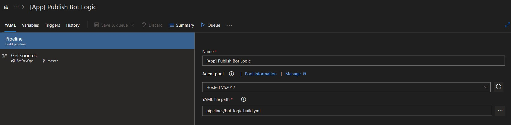

5. You can view live updates on the progress of your build in Azure DevOps. Navigate to the Build section of Azure Pipelines. Select the appropriate Build from your build definition.
    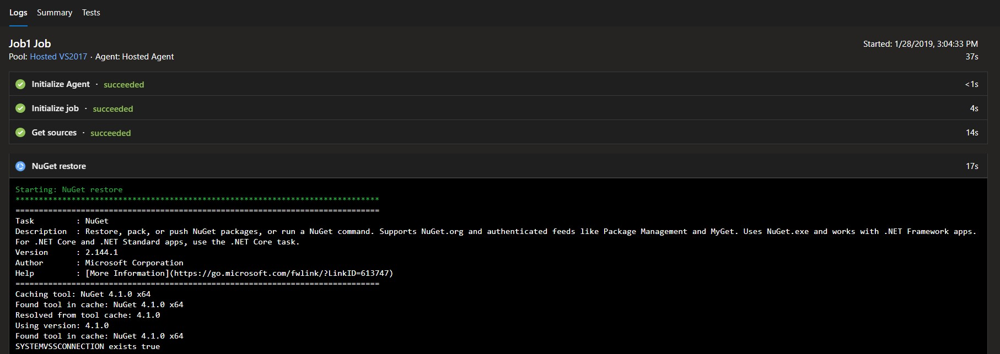

### Unit testing the chatbot

Testing chatbots follows the same principles and best practices of testing any other application. In the section below we will focus on Unit testing the chatbot, and integrating that into a CI/CD pipeline. You can choose between MSTest or XUnit for your test project.

[Unit Testing](https://en.wikipedia.org/wiki/Unit_testing) allows for testing specific parts of the source code based on a desired outcome. You can find more on Unit testing and different approaches [here](https://docs.microsoft.com/en-us/dotnet/core/testing/), and well as [best practices](https://docs.microsoft.com/en-us/dotnet/core/testing/unit-testing-best-practices).

We will focus first on adding Unit tests to the chatbot solution, then integrating Unit tests as part of a pipeline. For the purpose of the document we will only add a couple of tests, but in a real world scenario, you should add as many as necessary 

#### Step 1 - Adding the Unit tests to our chatbot solution

1. Navigate to Visual Studio (or preferred IDE), and right click on the solution

2. Add a New Project and name it as your solution with the "test" extension.


3. Inside the new project created, start defining methods for testing

The first method checks if the chatbot logic detects a certain string in the user's input. 

``` C
public void DoesBotDetectVstsInString()
        {   
            //arrange
            ITextProcessor InputText = new VstsTextProcessor();

            //act
            var result = InputText.DetectVsts("VSTS");

            //assert
            Assert.IsTrue(result);
            
        }
```
> The methods that implement Unit testing need to have a meaningful name that describes the action tested. Method names like "Unitest2" are not a good practice.

> Each Unit test method needs to contain three main steps: **arrange**, **act**, and **assert**. You can emphasize these in your solution by adding comments that decorate the lines of code as in the example above.

The second method verifies if the chatbot logic will detect the same string when the user input is an empty string.

```C
public void DoesBotDetectVstsInEmptyString()
        {  
             //arrange
            ITextProcessor InputText = new VstsTextProcessor();

            //act
            var result = InputText.DetectVsts("");

            //assert
            Assert.IsFalse(result);

        }
```

ITextProcessor represents the implementation of an interface defined in the main project.

You can choose between MSTest or XUnit for your project.


#### Step 2 - Add Live Unit Testing to your solution

To have a live view of the unit tests, you can configure [Live Unit testing](https://docs.microsoft.com/en-us/visualstudio/test/live-unit-testing?view=vs-2017) in Visual Studio by following the steps from the doc. 

If configured rigt, when you run the Unit tests green tick boxes should appear on the right hand side as shown in the snippet below


## Continuous Delivery

[Azure Pipelines](https://docs.microsoft.com/en-us/azure/devops/pipelines/get-started/index?view=vsts) is used to also deploy your application and underlying infrastructure. [Release pipelines](https://docs.microsoft.com/en-us/azure/devops/pipelines/release/what-is-release-management?view=vsts) is the component that enables Continuous Delivery and automate your release process.

### Deploying your bot and underlying infrastructure

There are a number of steps involved in deploying the infrastructure. As we have used [linked templates](https://docs.microsoft.com/en-us/azure/azure-resource-manager/resource-group-linked-templates), those templates will need to be accessible from a public endpoint (HTTPS or HTTPS). This could be a repository on GitHub, or an Azure Blob Storage Account. The uploaded template artifacts can remain secure, as they can be held in a private mode but accessed using some form of SAS token. We will show how this works for a Blob Storage Account in the following example.

1. Firstly, we create a **New Release Definition**, and select an empty definition. We then need to rename the newly created environment, to something meaningful for our pipeline.

    

2. Next, we need to create a dependency on the Build Pipeline where we perform the necessary actions to get the output for our bot logic.

    > Take note of the Source Alias, as this will be needed when the tasks are created inside of the Release Definition.

    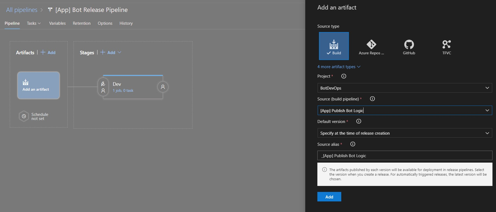

3. Create a link to another artifact, this time, an Azure Repo. This is required to access the ARM templates that are stored in your repository. As ARM templates do not require compilation, we do not need to push them through a build pipeline.

    > Take note of the Source Alias, as this will be needed when the tasks are created inside of the Release Definition.

    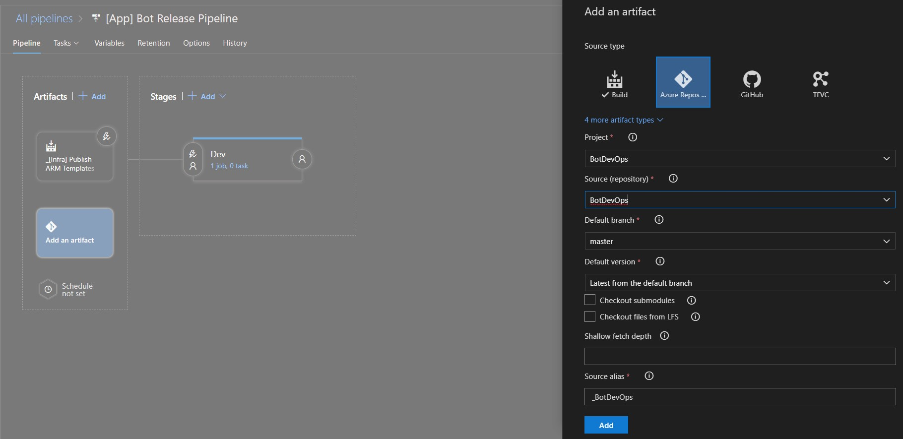

4. Navigate to the **variables** section. You should create a number of variables in your pipeline, so that you are not inputting the same information into multiple tasks. These are the variables used in this example, and how they impact the deployment.

    * **appInsightsName**: Name of the Application Insights resource to log our bot telemetry to
    * **appServiceName**: Name of the Web App. This will also have an impact on our end website name, e.g. **appServiceName**.azurewebsites.net
    * **appServicePlanName**: Name of the underlying App Service Plan (or server farm)
    * **botAppInsightsApiKey**: API Key inside of the Application Insights resource (not to be confused with Instrumentation Key). This is the one-time value that you were asked to set aside earlier.
    * **botMicrosoftAppId**: App ID of from our Microsoft Developer Account
    * **botMicrosoftAppPassword**: Password of the App from our Microsoft Developer Account. You should set the padlock on this, so that other users are unable to see this in the future.
    * **botServiceDisplayName**: Name of the bot when it appears in a channel
    * **botServiceName**: Name of the Azure Bot Service in the Azure Portal
    * **developerAppInsightsApplicationId**: Application ID of the Azure Application Insights resource. This was presented on the API Access blade of the Application Insights resource.
    * **location**: Location for the Azure Resources to be deployed
    * **resourceGroupName**: Name of the Resource Group to be created, and where your resources will be deployed
    * **storageAccountName**: Name of the Storage Account to hold linked ARM templates

     > A common practice is to use the [Azure KeyVault](https://docs.microsoft.com/en-us/azure/key-vault/) task, instead of storing secrets in Azure DevOps. If the Service Principal (connection to your Azure Subscription) has an appropriate access policies to the Azure KeyVault resource, it can download secrets from an Azure KeyVault and be used as variables in your pipeline. The name of the secret will be set with the associated value. For example, a secret in the KeyVault called botMicrosoftAppPassword could be referenced by $(botMicrosoftAppPassword) in the release definition.

    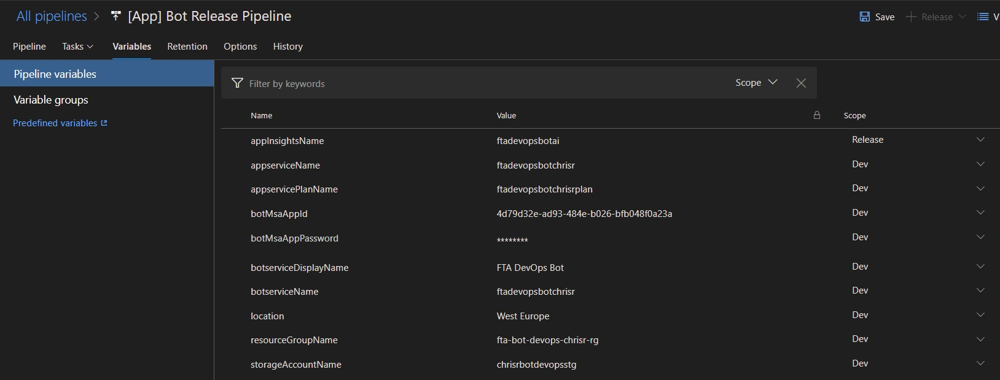

5. The next step is to navigate to the tasks for our Dev environment. In the below snapshot, you can see a number of tasks. These tasks download the bot logic package, deploy a storage account to host the nested ARM templates, copy those ARM templates to the storage account, deploy the App Service and associated dependencies and deploy the bot logic to our newly created App Service.

    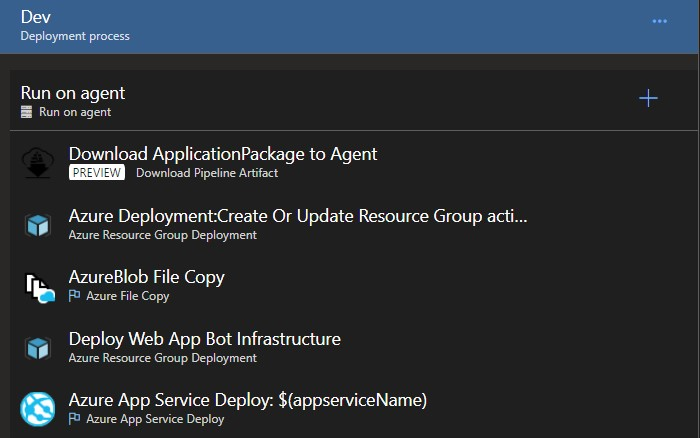

6. Add the **Download Pipeline Artifact (Preview)** task and set the following properties:
    * **Display Name:** Download ApplicationPackage to Agent
    * **The name of the artifact to download:** applicationpackage
    * **Path to download to**: $(System.DefaultWorkingDirectory)

7. First, create a Storage Account to store your artifacts. You could of course reuse an existing storage account in your solution, but for the self-contained sample and isolation of content, we are making a dedicated artifact storage account.

    Add the **Azure Resource Group Deployment** task and set the following properties:
    * **Display Name:** Deploy Storage Account for ARM Templates
    * **Azure Subscription:** Select the appropriate Azure Subscription
    * **Action**: Create or update resource group
    * **Resource Group**: $(resourceGroupName)
    * **Location**: $(location)
    * **Template**: $(System.ArtifactsDirectory)/**{YourAzureRepoArtifactSourceAlias}**/arm-templates/storageAccount.json
    * **Override template parameters**: -accountName $(storageAccountName)

8. Next, upload the artifacts from the Source Control into the Storage Account. There is an Azure Pipeline task to perform this. As part of this task, we can output the Storage Account Container URL and the SAS Token to a variable. This means it can be reused throughout this agent phase.

    Add the **Azure File Copy** task and set the following properties:
    * **Source:** $(System.ArtifactsDirectory)/**{YourAzureRepoArtifactSourceAlias}**/arm-templates/
    * **Azure Connection Type**: Azure Resource Manager
    * **Azure Subscription:** Select the appropriate Azure Subscription
    * **Destination Type**: Azure Blob
    * **RM Storage Account**: $(storageAccountName)
    * **Container Name**: templates
    * **Storage Container URI**: templateContainerUri
    * **Storage Container SAS Token**: templateContainerSasToken

9. The next step is to deploy the orchestrator template. Recall the orchestrator template, you will notice that there were parameters for the Storage Account Container URL, in addition to the SAS token amongst additional information. You will notice that the variables are either held in the variables section of the release definition, or were previously set as part of the Azure Blob Copy task.

    Add the **Azure Resource Group Deployment** task and set the following properties:
    * **Display Name:** Deploy Wep App Bot Infrastructure
    * **Azure Subscription:** Select the appropriate Azure Subscription
    * **Action**: Create or update resource group
    * **Resource Group**: $(resourceGroupName)
    * **Location**: $(location)
    * **Template**: $(System.ArtifactsDirectory)/**{YourAzureRepoArtifactSourceAlias}**/arm-templates/deployment.json
    * **Override template parameters**: ```-templateContainerUri "$(templateContainerUri)" -templateContainerSasToken "$(templateContainerSasToken)" -appservicePlanName "$(appservicePlanName)" -appserviceName "$(appserviceName)" -botserviceName "$(botserviceName)" -botserviceDisplayName "$(botserviceDisplayName)" -botMicrosoftAppId "$(botMicrosoftAppId)" -botMicrosoftAppPassword "$(botMicrosoftAppPassword)" -appInsightsName "$(appInsightsName)" -botAppInsightsApiKey "$(botAppInsightsApiKey)" -developerAppInsightsApplicationId "$(developerAppInsightsApplicationId)"```
10. The final step is to deploy the Bot Logic into the Azure App Service that was just created.

    Add the **Azure App Service Deploy** task and set the following properties:
    * **Display Name:** Azure App Service Deploy: $(appserviceName)
    * **Azure Subscription:** Select the appropriate Azure Subscription
    * **App type**: Web App
    * **App Service Name**: $(appserviceName)
    * **Package or folder**: $(System.DefaultWorkingDirectory)/*.zip

## Next Steps

You have now created an Azure Pipeline to create a bot running inside of Azure App Service leveraging Azure Bot Service. Here are some additional items that you could consider to further enhance the scenario:

* Deploy additional services to enhance your bot, including LUIS
* Deploy a back-end store for your bot to interact with, such as CosmosDB
* Automate the generation of the Application Insights API Key, and consider storing that in an Azure Key Vault which can be referenced during deployment time
