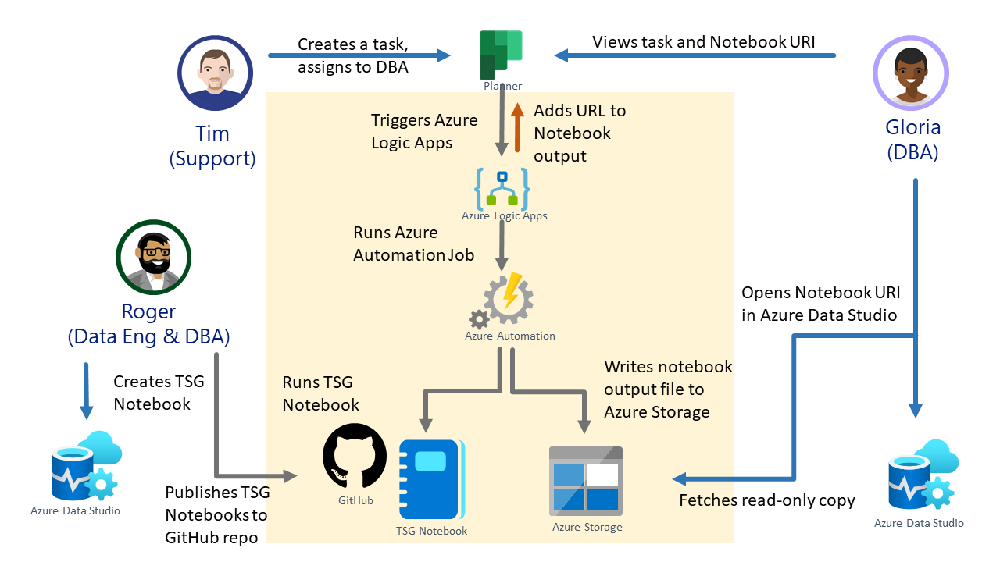

This article applies to businesses or teams that want to reduce their manual processes, also known as *toil*, in troubleshooting or diagnostics. Specifically, this solution shows how customers can write troubleshooting guides or diagnostics steps in Jupyter Notebooks that are reusable, testable, and automatable.

Beyond troubleshooting diagnostics, this methodology can be applied to routine solutions that would benefit from automation with manual execution whenever needed. This includes backup and restoring a database, or creating a tutorial on how to diagnose application health issues.

Users can automate their troubleshooting guides or routine tasks captured in Jupyter Notebook files in Azure Logic Apps and Azure Automation services. Users can create, edit and test their Jupyter Notebooks manually using their favorite client tools, such as VSCode or Azure Data Studio. 

## Potential use cases

- Automating routine tasks such as data extraction, transformation, or data loading
- Trigger mitigation steps for common issues

## Architecture

This scenario covers diagnostic / troubleshooting development and operationalization flow at a high level. 
- Azure Data Studio is used for viewing, writing, and executing the diagnostic notebooks in Jupyter Notebook format. The Diagnostic notebook includes executable code to troubleshoot issues, including the descriptions that promote a better understanding of the troubleshooting steps. The notebook author can decide to write their code in their preferred language(s), such as Python, PowerShell, or .net interactive (C# and other .net languages). Note that .net interactive Jupyter Notebook in VSCode supports polyglot - many languages on the same notebook.  
- Either GitHub or Azure DevOps is used as source control for the reusable diagnostic notebooks. GitHub actions or Azure DevOps actions can also be employed to do additional checks to meet organizational policies, such as cred-scans.  
- A task management system or an incident response system, where issues are logged, assigned, and resolved. Users can even use any task management system such as Microsoft Planner.
- Azure Logic Apps observes if a new issue is created with a certain condition which then triggers the next step including executing Azure Automation Job. 
- Azure Automation Job runbook executes the relevant diagnostic notebooks when a certain condition happens such as when a task is created that contains a "Disk is full" message
  - The runbook can be in Python or PowerShell runtime. 
  - Use papermill to execute notebooks with Python kernel, 
  - Use [Invoke-ExecuteNotebook](https://github.com/dfinke/PowerShellNotebook#executing-a-notebook) commandlet in [PowerShellNotebook](https://github.com/dfinke/PowerShellNotebook) module to execute notebooks with .Net Interactive PowerShell kernel or PowerShell kernel.
  - Use [Invoke-SqlNotebook](https://docs.microsoft.com/powershell/module/sqlserver/invoke-sqlnotebook?view=sqlserver-ps) commandlet in [SqlNotebook](https://docs.microsoft.com/powershell/module/sqlserver/?view=sqlserver-ps) module to execute notebooks with SQL kernel.
- The runbook stores the executed / output notebooks in Azure Blob Storage, retrieves the URI to be posted back to the task description in Planner, and sends an email with the notebook URI to the assigned person. 
- The assigned person reviews the pre-executed notebook in Azure Data Studio from the link posted on the task in Planner or from the email. 

### Components

- [Azure Data Studio](https://azure.microsoft.com/services/developer-tools/data-studio/) or [VSCode](https://code.visualstudio.com/) for viewing, editing, and executing Jupyter Notebooks.
- [VSCode](https://code.visualstudio.com/) for editing Azure Logic App definition (optionally).
- [Azure DevOps](https://azure.microsoft.com/solutions/devops/) or[] GitHub](http://github.com) as a central repository for the troubleshooting notebooks.
- [Azure Logic Apps](https://azure.microsoft.com/services/logic-apps/) for workflow logic definition.
- [Azure Automation](https://azure.microsoft.com/services/automation/) for hosting and executing the Python or PowerShell script(s) that will execute notebooks.
- [Azure Blob Storage](https://azure.microsoft.com/services/storage/blobs/) for storing the output notebooks.
- [Microsoft Planner](https://www.microsoft.com/microsoft-365/business/task-management-software) for simulating tasks assignment / incident response. 

### Alternatives

These are alternative components to the above:
- [Azure Function](https://azure.microsoft.com/services/functions/) to execute notebook instead of Azure Automation. 
  - Specifically for executing PowerShell-based Jupyter Notebook, users can use PowerShell language in Azure Function to call [Invoke-ExecuteNotebook](https://github.com/dfinke/PowerShellNotebook#executing-a-notebook) commandlet  similar to the technique mentioned in Azure Automation Job. See also [Azure Functions PowerShell Developer Guide](
https://docs.microsoft.com/azure/azure-functions/functions-reference-powershell).
  -  Specifically for executing SQL-based Jupyter Notebook, users can use PowerShell language in Azure Function to call [Invoke-SqlNotebook](https://docs.microsoft.com/powershell/module/sqlserver/invoke-sqlnotebook?view=sqlserver-ps) commandlet. See also [Azure Functions PowerShell Developer Guide](
https://docs.microsoft.com/azure/azure-functions/functions-reference-powershell).
  - For executing Python-based Jupyter Notebook, users can use Python language in Azure Function to call papermill. See [Azure Functions Python Developer Guide](https://docs.microsoft.com/en-us/azure/azure-functions/functions-reference-python).

## Considerations

### Scalability

It is better to ensure that each notebook is modular to promote reusability. The logic of execution can be captured in Azure Logic Apps. Balancing what part of the logic is managed by Azure Logic Apps vs managed by Notebook, is something to consider.  

### Security

User-assigned [Managed Identity](https://docs.microsoft.com/azure/active-directory/managed-identities-azure-resources/overview) is ideal to grant Azure Automation runbooks to access the other Azure required resources. 

For example, when the Azure Automation runbook is executing [Invoke-SqlNotebook](https://github.com/dfinke/PowerShellNotebook#executing-a-notebook) against an Azure SQL database, the Azure Automation account requires the appropriate access to the database. This authorization is best managed with User-assigned Managed Identity that corresponds to a user or a role in Azure SQL.

### DevOps

If using Azure DevOps as a host for your repository, ensure you use git as the source control (instead of Team Foundation Version Control). This is because both Azure Data Studio and VSCode support git natively. 

## Pricing

The Pricing estimate is available [here](https://azure.com/e/bffff468f99641009bae1fcd743f05d0). This depends on the size of the notebook output and the workflow definition in Azure Logic Apps such as how often it will trigger or how long. 

## Next steps

Watch [From Oops to Ops: Incident Response with Jupyter Notebooks](https://youtu.be/eVVyWNSxtco?t=10096) to learn more about how to put this solution together and the motivation behind it.
- [Use Jupyter Notebooks in Azure Data Studio](sql/azure-data-studio/notebooks/notebooks-guidance)
- [Jupyter Notebooks in VSCode](https://code.visualstudio.com/docs/datascience/jupyter-notebooks)
- [What is Azure Repos in Azure DevOps?](azure/devops/repos/get-started/what-is-repos?view=azure-devops)
- [What is Azure Logic Apps?](/azure/logic-apps/logic-apps-overview)
- [An introduction to Azure Automation?](/azure/automation/automation-intro)
- [What is Azure Blob Storage?](azure/storage/blobs/storage-blobs-overview)
- [Introduction to Azure Functions](azure/azure-functions/functions-overview)

## Related resources

