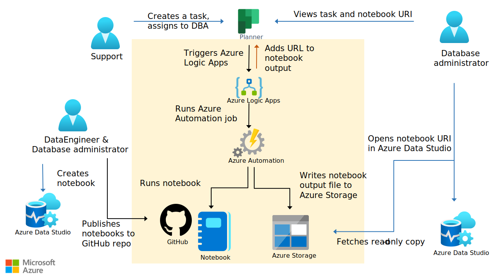

This article can help businesses or teams reduce manual processes, also known as *toil*, in troubleshooting or diagnostics. Specifically, this solution shows how to write troubleshooting guides or diagnostic steps in Jupyter Notebooks that you can reuse, test, and automate.

## Architecture

*Download a [PowerPoint file](https://arch-center.azureedge.net/automate-diagnostic-jupyter-notebook.pptx) of this architecture.*

### Workflow

This scenario covers a diagnostic/troubleshooting development and operations flow at a high level.

- Team members use Azure Data Studio to write, view, and run the diagnostic or troubleshooting notebooks in Jupyter Notebook format. The notebooks include code for troubleshooting issues and descriptions that explain the troubleshooting steps. The notebook author can write the code in languages like Python, PowerShell, or .NET Interactive (C# and other .NET languages). .NET Interactive Jupyter Notebooks in Visual Studio Code support polyglot, which allows you to use  more than one language in a single notebook.  
- GitHub or Azure DevOps is used as source control for the reusable notebooks. You can use GitHub Actions or Azure DevOps Actions to complete additional checks to meet organizational policies, like credential scans.  
- A task management system or an incident response system is used to log, assign, and resolve issues. You can use any task management system, like Microsoft Planner.
- When a new issue is created, a specific condition in Azure Logic Apps triggers the next step: running an Automation job.
- The Automation job runbook runs the relevant diagnostic notebooks when a certain condition occurs. For example, if a task returns a message stating that the disk is full.

   The runbook can be in Python or the PowerShell runtime.
  - Use papermill to run notebooks by using the Python kernel.
  - Use the [Invoke-ExecuteNotebook](https://github.com/dfinke/PowerShellNotebook#executing-a-notebook) cmdlet in the [PowerShellNotebook](https://github.com/dfinke/PowerShellNotebook) module to run notebooks by using the .NET Interactive PowerShell kernel or the PowerShell kernel.
  - Use the [Invoke-SqlNotebook](/powershell/module/sqlserver/invoke-sqlnotebook?view=sqlserver-ps) cmdlet in the [SqlServer](/powershell/module/sqlserver/?view=sqlserver-ps) module to run notebooks by using the SQL kernel.
- The runbook stores the output notebooks in Azure Blob Storage, retrieves the URI to be posted back to the task description in Planner, and sends an email with the notebook URI to the assigned person.
- The assigned person uses the link posted in the task in Planner or included in the email to review the executed notebook in Azure Data Studio.

### Components

- [Azure Data Studio](https://azure.microsoft.com/services/developer-tools/data-studio) or [Visual Studio Code](https://code.visualstudio.com) is used to create, view, edit, and run Jupyter Notebooks. You can optionally also use Visual Studio Code to edit the Logic Apps definition.
- [Azure DevOps](https://azure.microsoft.com/services/devops) or [GitHub](http://github.com) is a central repository for the troubleshooting notebooks.
- [Logic Apps](https://azure.microsoft.com/services/logic-apps) is used to define the workflow logic.
- [Azure Automation](https://azure.microsoft.com/services/automation) is used to host and run the Python or PowerShell scripts that run the notebooks.
- [Blob Storage](https://azure.microsoft.com/services/storage/blobs) is used to store the output notebooks.
- [Planner](https://www.microsoft.com/microsoft-365/business/task-management-software) is used to log, assign, and resolve issues.

### Alternatives

You can use [Azure Functions](https://azure.microsoft.com/services/functions) instead of Automation to run the notebooks.

- To run a PowerShell-based Jupyter Notebook, you can use PowerShell in an Azure function to call the [Invoke-ExecuteNotebook](https://github.com/dfinke/PowerShellNotebook#executing-a-notebook) cmdlet. This is similar to the technique described above for Automation jobs. For more information, see [Azure Functions PowerShell developer guide](/azure/azure-functions/functions-reference-powershell).
- To run a SQL-based Jupyter Notebook, you can use PowerShell in an Azure function to call the [Invoke-SqlNotebook](/powershell/module/sqlserver/invoke-sqlnotebook?view=sqlserver-ps) cmdlet. For more information, see [Azure Functions PowerShell developer guide](/azure/azure-functions/functions-reference-powershell).
- To run a Python-based Jupyter Notebook, you can use Python in an Azure function to call papermill. For more information, see [Azure Functions Python developer guide](/azure/azure-functions/functions-reference-python).

## Scenario details 

You can use Azure Logic Apps and Azure Automation to automate the troubleshooting guides, diagnostic steps, or other tasks that you have in Jupyter Notebooks. You can create, edit, and test Jupyter Notebooks manually by using your favorite client tools, like Visual Studio Code and Azure Data Studio.

Besides troubleshooting and diagnostics, you can apply this methodology to routine scenarios that benefit from automation but that sometimes require manual execution. Examples include backing up and restoring a database or creating a tutorial on how to diagnose application health issues.

### Potential use cases

- Automate routine tasks like data extraction, transformation, or loading.
- Trigger mitigation steps for common problems.

## Considerations

These considerations implement the pillars of the Azure Well-Architected Framework, a set of guiding tenets that you can use to improve the quality of a workload. For more information, see [Microsoft Azure Well-Architected Framework](/azure/architecture/framework).

### Security

Security provides assurances against deliberate attacks and the abuse of your valuable data and systems. For more information, see [Overview of the security pillar](/azure/architecture/framework/security/overview).

User-assigned [managed identity](/azure/active-directory/managed-identities-azure-resources/overview) is a good way to grant Automation runbooks  access to the other required Azure resources. For example, when the Automation runbook runs [Invoke-SqlNotebook](https://github.com/dfinke/PowerShellNotebook#executing-a-notebook) against an Azure SQL database, the Automation account requires the appropriate access to the database. This authorization is best managed via a user-assigned managed identity that corresponds to a user or a role in Azure SQL.

### Cost optimization 

Cost optimization is about reducing unnecessary expenses and improving operational efficiencies. For more information, see [Overview of the cost optimization pillar](/azure/architecture/framework/cost/overview).

A [pricing estimate is available here](https://azure.com/e/bffff468f99641009bae1fcd743f05d0). The price depends on the size of the notebook output and the workflow definition in Logic Apps (for example, how often it triggers and how long it runs).

### Operational excellence

Operational excellence covers the operations processes that deploy an application and keep it running in production. For more information, see [Overview of the operational excellence pillar](/azure/architecture/framework/devops/overview).

If you use Azure DevOps as a host for your repository, be sure to use Git for source control (instead of Team Foundation Version Control). We recommend Azure DevOps because both Azure Data Studio and Visual Studio Code support Git natively.

### Performance efficiency

Performance efficiency is the ability of your workload to scale to meet the demands placed on it by users in an efficient manner. For more information, see [Performance efficiency pillar overview](/azure/architecture/framework/scalability/overview).

As a best practice, make each notebook modular to promote reusability. You can store execution logic in Logic Apps. Think about how much of the logic you want to manage in Logic Apps and how much you want to manage in notebooks.  

## Contributors

*This article is maintained by Microsoft. It was originally written by the following contributors.*

Principal author:

- [Julie Koesmarno](https://www.linkedin.com/in/juliekoesmarno) | Principal Program Manager

*To see non-public LinkedIn profiles, sign in to LinkedIn.*

## Next steps

Watch [From Oops to Ops: Incident Response with Jupyter Notebooks](https://youtu.be/eVVyWNSxtco?t=10096) to learn more about how to put this solution together and the motivation behind it.

See these resources:

- [Use Jupyter Notebooks in Azure Data Studio](/sql/azure-data-studio/notebooks/notebooks-guidance)
- [Jupyter notebooks in Visual Studio Code](https://code.visualstudio.com/docs/datascience/jupyter-notebooks)
- [What is Azure Repos in Azure DevOps?](/azure/devops/repos/get-started/what-is-repos)
- [What is Azure Logic Apps?](/azure/logic-apps/logic-apps-overview)
- [An introduction to Azure Automation](/azure/automation/automation-intro)
- [What is Azure Blob Storage?](/azure/storage/blobs/storage-blobs-overview)
- [Introduction to Azure Functions](/azure/azure-functions/functions-overview)

## Related resources

- [Event-based cloud automation](../../reference-architectures/serverless/cloud-automation.yml)
- [Data integration with Logic Apps and SQL Server](../../example-scenario/integration/logic-apps-data-integration.yml)
- [Automate multistage Azure pipelines with Azure Pipelines](../../example-scenario/devops/automate-azure-pipelines.yml)
