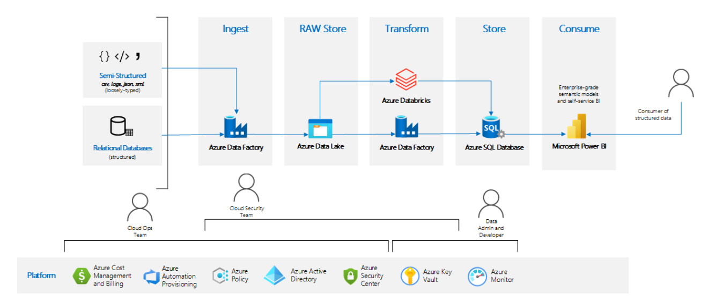
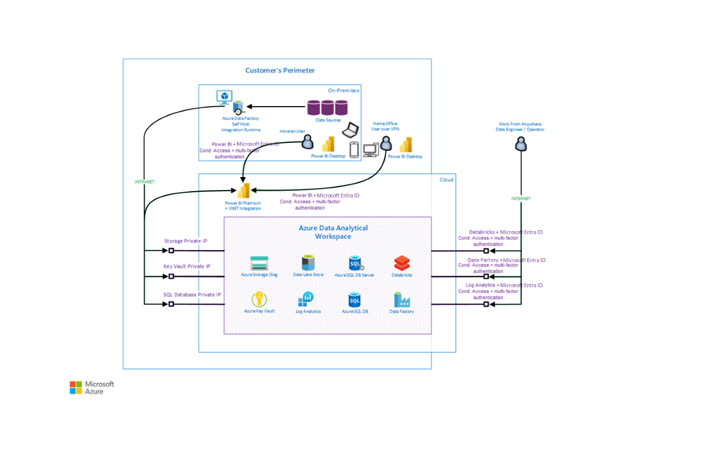

In recent years, the demand for business users to be able to consume, transform, model, and visualize large amounts of complex data from multiple heterogeneous sources has increased dramatically. To meet this demand in a cost-effective, scalable way, many large companies have benefitted from moving to cloud-based data platforms. This move allows companies to take advantage of the economy of scale the cloud provides to achieve lower total cost of ownership and faster time to value from data. Regulated industries are no exception to this. These companies need to store and process vast amounts of highly sensitive data (for example, protected health information) every day. However, because of the sensitive nature of this data, there are many regulations (like HIPAA) in place that constrain the methods for storing, transporting, and processing the data. As a result of this, regulated industries are hesitant to adopt cloud-based data platforms because of the large financial penalties for regulatory violations and the perceived loss of control that comes from moving to a cloud-based platform.

The worldwide COVID-19 pandemic changed all of this as the on-premises data platforms of many regulated industries were largely unable to cope with the increased workload resulting from the pandemic. These companies are now embracing cloud-based data platforms, but they're typically doing so in two extreme ways. Either with highly complex and detailed security requirements or with limited knowledge of cloud security capabilities and practices. This makes rapid deployment of services and solutions challenging because many security options can be disabled, overlooked, or simply ignored, leaving these companies open to regulatory action (like financial penalties) if left unchecked. 

The Infrastructure Accelerator pattern is designed to resolve this issue by tackling data analysis workloads in regulated industries. This pattern is designed to help ensure that the detailed security and privacy requirements of different regulated industries are met. It uses configurable, template-based service-deployment automation. And it's all built on Azure managed services to reduce management overhead. Specifically, the pattern focuses on high-quality security standards, auditing, monitoring key protection, encryption capabilities, and tight integration with security perimeters (when applicable). You can consider this guidance an enterprise-ready, pluggable infrastructure building block for data analytics workloads. It incorporates Microsoft best practices for landing zones.

In using this pattern, you can choose which data processing services (Azure Data Factory, Azure Databricks, Azure Synapse Analytics) you want to use. You'll know that the services will be deployed using Microsoft best practices for landing zones and any company-specific policy requirements. In short, we believe that all customers from regulated industries can benefit from this pattern and from infrastructure deployment accelerator tools.

The goal of this pattern isn't to automatically implement a regulated solution. It's to give the infrastructure and security teams an easily configurable set of tools for implementing a repeatable baseline for regulated enterprise systems. That's because most regulations are written in a way that requires interpretation when it comes to building a system that meets them. 

For example, one of the requirements of a HIPAA-compliant system is that all data at rest and in motion needs to be encrypted. This is easy to interpret for data being transmitted or data on disk. But what about data that's sitting in memory as part of an in-memory database? It could be considered to be at rest if the database is a long-running database. But encrypting memory adds significant overhead, so it's not feasible for many use cases.

Because of these ambiguities, companies working with regulated data typically have a security team that develops company-specific policies for the use and implementation of systems that use regulated data. These policies are usually enforced via services that audit running services (for example, Azure Policy) and notify product owners of any violations they find. Finding and fixing these violations can be time consuming and can require the redeployment of a service. This is problematic when data/code development is already started, and can lead to longer development cycles.

Some of the key benefits of this pattern are:

- Speed of deployment and consistency among projects and environments (dev, test, staging, production).
- Coverage of major data analysis use cases for ETL/ELT and Power BI (ingestion, transformation, storage, data lake, SQL).
- Focus on automated support of enterprise-grade security standards.
- Strong support for auditing, monitoring, and diagnostics data.
- Constraint of network communication to network or security perimeters when applicable.
- Easy consumption of data sources from inside the perimeter, together with cloud-based data analysis.
- Cloud-managed services with reduced management and operation overhead.
- Seamless integration with cloud-native tools, like Power Platform.
- Automated improved protection and encryption of storage that contains potentially sensitive data.
- Improved security of keys and credentials.
- Design that supports easy customization.
- Seamless integration, with no Azure landing zone needed, even in hub-and-spoke network topologies.

*Apache®, Apache Ignite, Ignite, and the flame logo are either registered trademarks or trademarks of the Apache Software Foundation in the United States and/or other countries. No endorsement by The Apache Software Foundation is implied by the use of these marks.*

## Potential use cases

This architecture can benefit organizations that require a solution that has these qualities:
- A platform as a service (PaaS) solution for data and AI workloads 
- Visualization (ETL/ELT and Power BI)
- Integration with a network perimeter 
- A focus on high security, highly protected data, auditing, and monitoring

Here are some example industries:
- Regulated industries generally
- Financial sector
- Healthcare clinical trials
- Financial reporting and financial departments
- Supply chain management
- Manufacturing

## Architecture

The following diagram shows a high-level overview of the architecture for the Infrastructure Accelerator for data analysis workloads in regulated industries. This pattern is targeted for use in highly regulated industries, so the primary focus is to provide a high degree of security at all levels, from storage to transport to use. 

You can see the capabilities of the pattern in the upper part of the diagram. These capabilities include elements like target data sources (cloud or on-premises), ingestion areas, snapshot data, transformed data, optimized data storage, metadata storage, and front-end consumption.

The bottom section shows the responsibilities of the various IT roles that are typically involved with cloud-data analysis workloads.

The architecture provides state-of-the-art data analysis without sacrificing governance or security.

Implementation of this pattern requires these skills:

- An understanding of how to configure, monitor, and operate solutions in the Azure cloud. This includes governance models, security, policies, landing zones, and automation.
- An understanding of how to configure and monitor cloud networking, private links, DNS, routing, access control lists, firewalls, and VPN integrations.
- An understanding of how to monitor cloud security and security incidents and constantly evaluate security threads.
- An understanding of Azure data tools like Data Factory, Azure Databricks, Azure Data Lake Storage, and Azure SQL Database. 
- The ability to integrate data components (ETL/ELT), create semantic models, and use different data formats, like Parquet, Avro, and CSV.
- For end users, familiarity with using Power BI for self-service reporting.

### Dataflow

- Infrastructure and governance model:
  - The cloud ops team provisions, in a repeatable and consistent way, the data analysis environment. The team uses existing optimized security
  settings for regulated industries and an automated, parametrized process. Scripts that have optional modifications for enterprise-specific standards and policies are available for this task. After deploying the environment, the team starts to see security compliance reports and billing information for the environment.
  - The network team typically integrates the environment with the enterprise network, ideally following the hub-and-spoke model with an enterprise firewall. This team also enables private links for endpoints and starts network traffic monitoring. We strongly recommend that you integrate Power BI with the virtual network, to use private traffic.
  - The cloud security team reviews the infrastructure through built-in or enterprise-specific Azure policies. This team reviews the security score of the environment in Azure Advisor or Azure Security Center. The security team also owns and maintains credentials to specific data source systems that are stored in Azure Key Vault, along with any encryption keys. Finally, the security team can start to monitor audit information that's stored in the central Log Analytics workspace.
- Usage and data analysis capabilities:
  - Data administrators and data developers develop ETL/ELT pipelines and semantic models for self-service BI. This step covers the complete data preparation lifecycle: ingest, store, transform, serve.
  - Business users can start to consume and present data through business-focused semantic models prepared by data developers. This consumption is typically done through front-end applications like Power BI or custom applications, but you can use third-party applications as well.

### Components

- [Data Lake Store Gen2](https://azure.microsoft.com/services/storage/data-lake-storage). Provides storage for business data, with snapshots, in raw and versioned format.
- [SQL Database](https://azure.microsoft.com/products/azure-sql/database). A relational database service built for the cloud. In this architecture, it provides the data source that's consumed by Power BI clients.
- [Azure Databricks](https://azure.microsoft.com/services/databricks). A data transformation engine. You can use it to spin up clusters and build quickly in a fully managed Apache Spark environment.
- [Data Factory](https://azure.microsoft.com/services/data-factory). Provides the data integration and transformation ETL/ELT layer.
- [Azure Blob Storage](https://azure.microsoft.com/services/storage/blobs). Provides storage for diagnostics, infrastructure logs, and audit data. (Business data shouldn't be stored in Blob Storage.)
- [Azure Key Vault](https://azure.microsoft.com/services/key-vault). Used to store and protect keys and credentials in a secure place and monitor operations and access to it.
- [Azure Monitor and Log Analytics Workspace](https://azure.microsoft.com/services/monitor). Used to monitor the environment, diagnostics, performance, audit logs, vulnerability scans, and traffic flows and enable the platform to send events for critical issues.
- [Power BI, or Power BI Premium with VNet integration](/data-integration/vnet/use-data-gateways-sources-power-bi). (Optional.) Allows import or direct query datasets to connect to data services in an Azure virtual network without requiring an on-premises data gateway.
- [Data Factory self-hosted integration runtime](/azure/data-factory/create-self-hosted-integration-runtime). (Optional.) Used to run activities between a cloud data store and a data store in a private network. It can also dispatch transform activities against compute resources in an on-premises network or an Azure virtual network.

### Alternatives

The functionality provided by this pattern overlaps with functionality that's available in Azure Synapse Analytics. We recommend that you use Azure Synapse whenever you can. However, in regulated industries in particular, some organizations can't use Azure Synapse for various reasons. In those cases, you might want to implement this pattern rather than manually deploying a custom data-analytics stack.

See [Enterprise data warehouse architecture](/azure/architecture/solution-ideas/articles/enterprise-data-warehouse) for an alternative solution to this pattern.

## Details for business users

The following diagram shows a component-based view, along with a sample integration with an enterprise environment:

Business users need to present, consume, and slice and dice data quickly, from multiple places and on multiple devices. Ideally on a data model that's optimized (transformed) for the data domain that the data is aligned to.

To achieve this goal, you typically need a scalable, heterogeneous data ingestion process to ingest data from multiple data sources in raw format, usually from an on-premises source. This data needs to be stored cost effectively, frequently with multiple versions and historical snapshots. Next, the data needs to be cleaned, combined, pre-aggregated, and stored for downstream consumption. The final version of the data is typically stored in a serving layer with indexing capabilities for speed of access. You can also use non-indexed storage. Finally, data security mechanisms like masking and encryption are applied to data that shouldn't be seen by users from other geographic regions or departments. Specifically, the security team needs to understand who can view or consume data in various ways and ensure that data is filtered for users based on roles. We strongly recommend that you do this by using automated security mechanisms like role-based access control (RBAC) and Row-Level Security rather than by manually filtering data. 

These concepts are described more thoroughly in the following sections.  

_**Business users need to present, consume, and slice and dice data quickly, from multiple places and on multiple devices**._

You can achieve this goal by using the Power BI reporting tool. Power BI is easy to use, and you can use it from anywhere and on multiple platforms and devices.

Power BI runs in the cloud as a managed service. You can integrate the service with your perimeter for access from devices. It can also access data sources that are part of the perimeter (on-premises or in the cloud via private link). 

> [!NOTE]
>
> We don't recommend using the Power BI gateway for perimeter access because it typically multiplexes users to one service identity, which can undermine the security model of the data serving tier.

Power BI also supports integration with Azure Active Directory (cloud identity) and advanced security features. You can propagate both identity and security context through Power BI to the database engine. This propagation allows the engine to use native filtering capabilities based on the role of the accessing user.

For example, assume users on mobile devices outside the perimeter need to run predefined, optimized reports that access and render sensitive data from data sources hosted inside the perimeter. In this implementation, users first establish VPN connectivity, if necessary. They're then prompted to authenticate to the Power BI service. After they're verified via multi-factor authentication, the Power BI rendering engine passes the user's identity to the target database that's hosted inside the perimeter. The database can then verify the accessing user. It also has information about the user's role / security group, so it can apply query and data filtering as required by the security policy of that user.

_**Need to get high volumes of data in a scalable way from multiple data sources in raw format (typically from on-premises). Need to store it, together with multiple versions and history, in a scalable way, in inexpensive storage**._

Ideally, Power BI needs to consume optimized data models for a specific data domain to improve the user experience, reduce waiting time, and improve data model maintenance. To produce these models, users typically need to run a process that ingests data from multiple data sources in raw format and store that data for further processing. Although there are many ways to do this processing, this approach uses Data Factory. 

Data Factory is a managed PaaS service that allows users to connect to many data sources by using more than 90 (and the number is growing) supported connectors in multiple file formats. The main interface for Data Factory is the workspace. In the workspace, you can design and run the ETL process at scale by using a drag-and-drop interface. The workspace can be accessed from anywhere the access policy, specified by security administrators, allows. Finally, Data Factory provides access to data sources outside of Azure (for example, on-premises) without crossing the enterprise firewall. It provides this access by using the self-hosted integration runtime. This component is installed on a physical or virtual machine in the on-premises environment. It's deployed in a location that's allowed to send outgoing communication to Azure. After you install this component, Data Factory can use the self-hosted integration runtime to ingest data from valid data sources inside your organization and process it in Azure.

Azure Data Lake Storage is a cost-effective, cloud-native storage service that stores data in various formats with improved security. Data Lake Storage supports RBAC and storing multiple versions of data (for example, daily snapshots). It's optimized to support massive parallel processing of data, for example, via Spark. Finally, Data Lake Storage supports private endpoints, which allow data to be stored and retrieved without traveling over a public endpoint.

In this pattern, cloud storage (Data Lake Storage) isn't typically accessed directly by Power BI. (Direct access is technically possible and supported.) Instead, storage is both long-term storage and a short-term staging area for data transformation tools like Spark. Power BI usually accesses the transformed data that's created from these tools by using a service better suited to serving and indexing large amounts of data, like Azure dedicated SQL pool.

_**Store data in a structured way, with indexing to improve access speed. The data model is optimized (transformed) for the data domain that the data is aligned to.**_

After the data, along with any snapshots, is available in cost-effective object storage (like Data Lake Storage), you need to transform it to the desired form. Typically, all raw data is stored, as opposed to only the final version and form of the data. This approach differs from earlier approaches to ETL/ELT. It allows existing data models to be updated quickly as requirements change, without requiring a reload from the initial source system.

This architecture supports transformation of data primarily via Data Factory, Azure Databricks, and Azure Synapse Analytics. Each service is scalable and provides a rich transformational environment with adapters.

This solution is designed to read data from Data Lake Storage through a private endpoint in the perimeter and perform these actions on data, at scale: 
- Clean and normalize 
- Transform 
- Aggregate, merge, and combine 

It completes these actions with cost control. That is, fast transformations can be done with more compute power at a higher cost, but slower transformations can be done with less compute power at a lower cost. Finally, storage of the cleaned, transformed, aggregated, domain-optimized data is done via a highly structured database with indexed data and a business- or domain-specific vocabulary, like SQL Database.

You should use the Premium SKU of Azure Databricks to enable advanced security features like RBAC for clusters, jobs, and notebooks and Azure Active Directory (Azure AD) Pass-through. Also, the Azure Databricks virtual network needs to be integrated with the data sources, the perimeter, and the firewall. 

Users can access Data Factory and the Azure Databricks workspace (but not the data) through a public endpoint via Azure AD authentication if conditional access is enabled.

 SQL Database plays a key role in this solution as a data source consumed by Power BI clients. The model is optimized for the business domain, for Power BI reports, with the correct business terminology and attributes. Security trimming is done at the database-engine level with native capabilities. In addition, Power BI is configured to consume data over private endpoints from SQL Database, point-to-point, and to ingest data from the Azure Databricks / Data Factory self-hosted integration runtime to improve security.

_**Mask data and secure or hide data that shouldn't be seen by users from other geographic regions or departments.**_

Data stored in the business domain database (the SQL database) probably contains sensitive data. It's important to allow users to access only a subset of data based on the user's role. And data typically crosses regions from different units in different geographic locations. 

Manually filtering in code is error prone. Filtering in reports can also be problematic. Instead, you should filter based on security context, at the database level. This method forces all consuming tools, including reporting tools, to receive data that's already filtered. For this model to work, accessing tools need to pass the identity of the viewing user instead of service accounts. This configuration allows the system to stay compliant with auditing and traceability requirements.

SQL Database implements Row-Level Security at the database-engine level, which makes it easier to implement a centralized security filtering and auditing model. This model requires propagating the security context from the viewing user to the database level. But Power BI can understand and propagate the security context (the user's cloud identity) to the business domain database. That database can use that identity to authenticate, authorize, and filter data for the user based on the identity or roles the user belongs to.

## Considerations

In general, avoid configuring Azure policies to prevent creating resources when Azure Policy rules aren't met. Instead, use Azure Policy audit mode to monitor resources that aren't compliant, or use Azure policies with automatic remediation steps.

Provide users enough autonomy. Specifically, users should be able to be productive and demonstrate value quickly instead of dealing with troubleshooting permissions, network connectivity, blocked network ports, Azure endpoints, and so on.

### Availability

This architecture pattern is based on managed Azure services that have built-in high availability based on specific SLAs. Use zone redundancy options where available (with storage, for example). This architecture doesn't incorporate geo-redundancy.
Consider how mission critical the ingestion and consumption processes are. You might need to balance criticality requirements against cost options.

### Operations

Here's a typical list of operations teams for this pattern:

- **Identity team.** Monitors Azure AD Identity Protection, multi-factor authentication, and Conditional Access.
- **Cloud operations team.** Monitors and operates Azure, the governance model, billing, security, Azure policies, and landing zones.
- **Cloud network team.** Monitors cloud networking, routing, access control lists, the firewall, and network traffic.
- **Cloud security team.** Monitors cloud security and security incidents, the key vault, credentials, and the security score. Constantly evaluates security threads. Makes security recommendations. Enforces security standards.
- **Solution owner team.** Monitors the performance of the solution and diagnostics logs. Performs troubleshooting.

### Performance

This architecture pattern is based on managed Azure services that have built-in, flexible performance options. These options allow you to find the right balance between speed and cost.

You might encounter performance challenges related to:
- Azure VMs used by Azure Databricks. Be sure to use appropriate SKU sizes. 
- Network throughput. 
- Bandwidth.
- Latency.
- Limits of the host of the Data Factory self-hosted integration runtime.

SQL Database has some artificial performance and scalability limits. These limits depend on the SKU. You can change the SKU later based on utilization.

### Scalability

This architecture pattern is based on managed Azure services that have built-in scalability features that you can use to find right the balance between speed and cost.

The solution can work with petabytes of data.

If you perform data ingestion from on-premises data sources (for example, through the Data Factory self-hosted integration runtime), bandwidth might be a limiting factor. The latency of the VPN network and the compute power of the self-hosted integration runtime machine might also be limiting factors.

The address range or size of the virtual network for the Data Analytical Workspace can limit the number of VMs that Azure Databricks can use.

### Security

Consider following security practices:

- Use Azure AD Identity Protection, configure multi-factor authentication and Conditional Access, and monitor Azure AD.
- Use Azure Security Center to monitor environments, recommendations, your security score, and potential issues and incidents.
- Use Azure Policy to monitor and enforce security standards.
- Use and monitor diagnostic settings, vulnerability scans, traffic flows, and auditing logs. Forward logs to Security Information and Event Management (SIEM).
- Monitor network traffic, routing, the firewall, and the access control list. For traffic in the perimeter, use private link and VPN.
- Store credentials, keys, and secrets in Key Vault. Limit access to Key Vault. Rotate keys, and monitor operations and access to Key Vault.

### Resiliency

This pattern uses Azure PaaS services that are hosted in one region. You might want to use additional Azure regions to increase resiliency, but that also increases complexity. Geo-redundancy is currently out of scope for this pattern.

## Deploy this scenario

To implement this pattern, start at the project page: [Azure/ADAW](https://github.com/Azure/ADAW). That page includes deployment scripts to help you deploy the workspace for data analysis based on Azure services.

You can automatically deploy the Data Analytical Workspace by using the provided cloud-native scripts. This deployment provides a consistent experience and a focus on high-quality security standards. 

## Pricing

Most of the components in this architecture are based on Azure services that use a pay-as-you-go model.
Services like Azure Databricks, Data Factory, Key Vault, Azure Virtual Network, and Azure Monitor incur no cost or negligible costs until you start certain operations.

The costs for Data Lake Store and Blob Storage depend on how much data you store. Typically, the storage cost isn't a major factor unless you have more than tens of terabytes of data.

The cost for SQL Database depends on the SKU, whether you use flat cost or cost per use, and the amount of data.

Log Analytics Workspace can incur significant costs for data collected and stored in the workspace. Consider enabling retention policies for data stored in a workspace to control this cost.

Traffic leaving an Azure datacenter incurs a cost. There's no cost for ingress.

VPN connectivity, like Azure ExpressRoute or site-to-site connectivity, is typically a shared infrastructure cost.

The Data Factory self-hosted integration runtime is typically hosted in a private datacenter, so it's separate from the Azure costs.

Consider Azure reservations options for compute and storage to optimize the cost of the solution.

The Power BI cost is separate from the Azure cost. Power BI Premium has a different pricing model and is also separate from the Azure costs.

## Next steps

To implement this pattern, start at the project page: [Azure/ADAW](https://github.com/Azure/ADAW).
That page includes deployment scripts to help you deploy the workspace for data analysis based on Azure services.

Here are some additional resources:
  - [Enterprise data warehouse architecture](/azure/architecture/solution-ideas/articles/enterprise-data-warehouse)
  - [Modern data warehouse for small and medium business](/azure/architecture/example-scenario/data/small-medium-data-warehouse)
  - [Data warehousing and analytics](/azure/architecture/example-scenario/data/data-warehouse)

## Related resources

- [Microsoft Azure Well-Architected Framework](/azure/architecture/framework)
- [Microsoft Cloud Adoption Framework for Azure](/azure/cloud-adoption-framework)
- [Cloud Adoption Framework enterprise-scale landing zone architecture](/azure/cloud-adoption-framework/ready/enterprise-scale/architecture)
- [Hub-spoke network topology in Azure](/azure/architecture/reference-architectures/hybrid-networking/hub-spoke)
