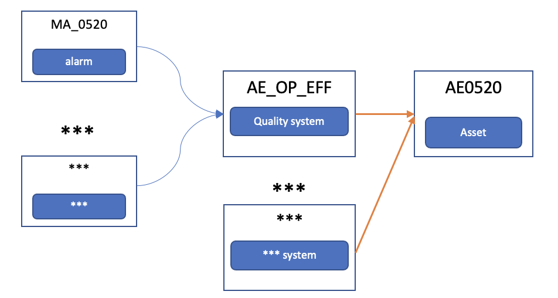
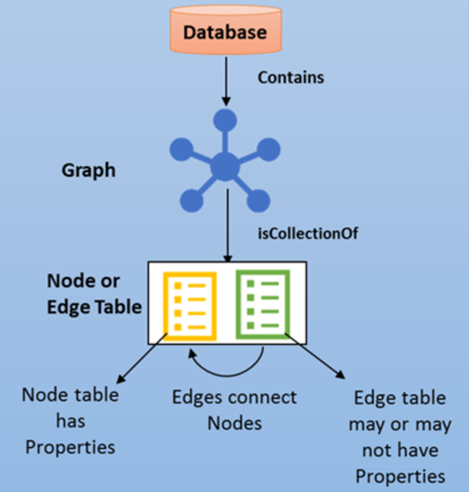
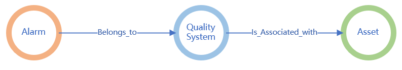
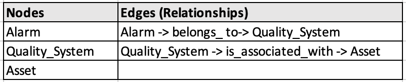
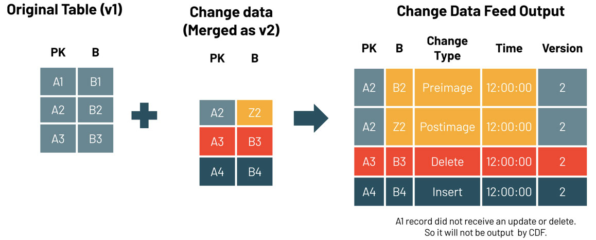

*Data contextualization* is the process of adding contextual information to raw data in order to enhance its meaning and relevance. It involves the use of additional information like metadata, annotations, and other relevant details to provide a better understanding of the data. Contextualization can help analysts understand the relationships between data points and the environment in which they were collected. For example, contextualization can provide information about the time, location, and other environmental factors that might have influenced the data. In data processing, contextualization is becoming increasingly important as datasets become larger and more complex. Without proper contextualization, it can be difficult to interpret data accurately and make informed decisions based on it.

This article demonstrates how to contextualize data by looking up relevant context that's stored in a graph database in Azure SQL Database.

## Architecture


*Download a [Visio file](https://arch-center.azureedge.net/[file-name].vsdx) of this architecture.*

In this architecture, data stored in Delta Lake in the silver layer is read incrementally, contextualized based on a graph lookup, and merged into Azure SQL Database and another Delta Lake instance in the gold layer.

### Dataflow

The following dataflow corresponds to the preceding diagram:

1. The incoming data that needs to be contextualized is appended into the Delta table in the silver layer.
2. The incoming data is incrementally loaded to Azure Databricks.
3. Contextual information is retrieved from a graph database.
4. The incoming data is contextualized.
5. The contextualized data is merged into the corresponding table in SQL Database.
6. Optionally, the contextualized data is appended into the corresponding Delta table in the gold layer.

### Components

* [Azure Data Lake Storage](https://azure.microsoft.com/products/storage/data-lake-storage) is a scalable data lake for high-performance analytics workloads. In this solution, it stores input data and contextualized data in Delta tables.
* [Azure Databricks](https://azure.microsoft.com/products/databricks) is a unified set of tools for building, deploying, sharing, and maintaining enterprise-grade data solutions at scale. In this solution, it provides the platform on which Python notebook files are used to contextualize data.
* [SQL Database](https://azure.microsoft.com/products/azure-sql/database) is an always-up-to-date, fully managed relational database service that's built for the cloud. In this solution, it stores a graph database and contextualized data.

### Alternatives

Many graph databases are available. For more information, see:

- [Graph processing with SQL Database](/sql/relational-databases/graphs/sql-graph-overview?view=sql-server-ver16)
- [Azure Cosmos DB for Apache Gremlin](/azure/cosmos-db/gremlin/)
- [Neo4J](https://neo4j.com/docs/operations-manual/current/introduction/)
- [RedisGraph](https://redis.io/docs/stack/graph/)
- [Apache Age for PostgreSQL](https://age.apache.org/age-manual/master/intro/overview.html)

There are pros and cons associated with each of these products and services. Some of them are Azure managed services, and some aren't. This architecture uses SQL Database, because:

* It's an Azure-managed relational database service that has graph capabilities.
* It's easy to get started if you're familiar with SQL Server or SQL Database.
* Solutions often benefit from the use of Transact-SQL in parallel. SQL Database graph relationships are integrated into Transact-SQL.

## Scenario details

### Data layers

This solution is based on the Databricks [medallion architecture](https://www.databricks.com/glossary/medallion-architecture). In this design pattern, data is logically organized in various layers. The goal is to incrementally and progressively improve the structure and quality of the data as it moves from one layer to the next.

For simplicity, this architecture has only two layers: 

- The silver layer stores the input data.
- The gold layer stores the contextualized data.

The data in the silver layer is stored in [Delta Lake](https://docs.databricks.com/delta/index.html) and exposed as Delta tables.

### Incremental data load 

This solution implements incremental data processing, so only data that has been modified or added since the previous run is processed. Incremental data load is typical in batch processing because it helps keep data processing fast and economical. 

For more information, see [incremental data load](#incremental-data-load-1).

### Data contextualization

Data contextualization can be applied in various ways. In this architecture, contextualization is the process of performing a graph lookup and retrieving matching values.

The solution assumes that a graph has already been created in a graph database. The internal complexity of the graph isn't a concern because the graph query is passed via a configuration and executed dynamically with passed input values.

The solution uses Azure Databricks for the data contextualization process.

### Graph database

The graph database is the database that stores the graph models. As noted earlier, there are many graph databases available. In this solution, the [graph capabilities of SQL Server](/sql/relational-databases/graphs/sql-graph-overview?view=sql-server-ver16) are used to create the graph.

### SQL Database

In this architecture, [SQL database](/azure/azure-sql/database/sql-database-paas-overview) is used to store the contextualized data, but you can use any storage option. To ensure idempotent processing, the data is merged into the system rather than appended.

### Contoso scenario

The solution in this article is based on the scenario that's described in this section.

Gary is an operations engineer at Contoso, Ltd. One of his responsibilities is to provide a weekly health report for the assets in Contoso factories within a specific city.

First, Gary needs to fetch all the asset IDs that he's interested in from the company's asset system. He then looks for all the attributes that belong to the assets to use as input for the health report. For example, the operational efficiency data of the asset with ID AE0520.

The following diagram illustrates some Contoso data relationships:



Contoso has many applications that help factory managers monitor processes and operations. Operational efficiency data is recorded in the quality system, another stand-alone application.

Gary signs in to the quality system and looks up the asset ID AE0520 in the `AE_OP_EFF` table. That table contains the all the key attributes for operational efficiency data.

There are many columns in the `AE_OP_EFF` table. Gary is especially interested in the alarm status. However, the details for the most critical alarms of the asset are kept in another table called `alarm`. Therefore, Gary needs to record that the key ID MA_0520 of the `alarm` table corresponds to the asset AE0520, because they use different naming conventions.  
 
The relationship is actually much more complicated. Gary needs to search for more than one attribute of the asset and sign in to many tables in different systems to get all the data for a complete report. He uses queries and scripts to perform his work, but the queries are complicated and hard to maintain. Even worse, the systems are growing, and more data needs to be added to the report for different decision makers.

One of the main problems for Gary is that the IDs of a given asset in various systems are different. The systems were developed and are maintained separately, and they even use different protocols. Gary needs to manually query the various tables to get data for a single asset. The queries are complex and difficult to understand. As a result, Gary spends a lot of time training new operations engineers and explaining the relationships in the data.

Gary needs a mechanism to link the various names that belong to a single asset across systems. This mechanism will make report queries simpler and make Gary's job easier.

### Graph design

SQL Database provides graph database capabilities for modeling many-to-many relationships. The graph relationships are integrated into Transact-SQL.

A graph database is a collection of nodes (or *vertices*) and edges (or *relationships*). A node represents an entity, like a person or an organization. An edge represents a relationship between the two nodes that it connects, for example, *likes* or *friends*. 



#### Graph model for the scenario

This is the graph model for the Contoso scenario:

* `alarm` is one of the metrics that belong to `quality system`.
* `quality system` is associated with an `asset`.



This is what the data looks like:

:::image type="content" source="media/contextualization-data.png" alt-text="Screenshot that shows the data used in the sample scenario." lightbox="media/contextualization-data.png":::

In the graph model, the nodes and edges need to be defined. Azure SQL graph uses edge tables to represent relationships. In this scenario, there are two edge tables. They record the relationships between `alarm` and `quality system` and `quality system` and `asset`.



To create these nodes and edges in SQL Database, you can use the following SQL commands: 

```SQL
…
CREATE TABLE Alarm (ID INTEGER PRIMARY KEY, Alarm_Type VARCHAR(100)) AS NODE; 
CREATE TABLE Asset (ID INTEGER PRIMARY KEY, Asset_ID VARCHAR(100)) AS NODE;
CREATE TABLE Quality_System (ID INTEGER PRIMARY KEY, Quality_ID VARCHAR(100)) AS NODE;
CREATE TABLE belongs_to AS EDGE;
CREATE TABLE is_associated_with AS EDGE;
…
```

These commands create the following graph tables:

* dbo.Alarm
* dbo.Asset
* dbo.belongs.to
* dbo.is_associated_with
* dbo.Quality_System

To query the graph database, you can use the [MATCH](/sql/t-sql/queries/match-sql-graph?view=sql-server-ver16) clause to match patterns and traverse the graph:

``` SQL
SELECT [dbo].[Alarm].Alarm_Type, [dbo].[Asset].Asset_ID
FROM [dbo].[Alarm], [dbo].[Asset], [dbo].[Quality_System], [dbo].[belongs_to], [dbo].[is_associated_with]
WHERE MATCH (Alarm-(belongs_to)->Quality_System -(is_associated_with)-> Asset)
```

You can then use the query result to join the incoming raw data for contextualization.

## Incremental data load

As the architecture diagram shows, the solution contextualizes only new incoming data, not the entire dataset in the Delta table. To meet this requirement, it uses an incremental data loading solution.

In Delta Lake, [change data feed](/azure/databricks/delta/delta-change-data-feed) is a feature that simplifies the architecture for implementing change data capture. The following diagram illustrates how it works. When change data feed is enabled, the system records data changes, which, in this case, include inserted rows and two rows that represent the pre-image and post-image of an updated row. If you need to, you can use the pre-image and post-image information to evaluate the changes. There's also a delete change type that represents deleted rows. To query the change data, you can use the `table_changes` function.



In this solution, change data feed is enabled for Delta tables that store the source data. You can enable it by using this command:

```SQL
CREATE TABLE tbl_alarm 
  (alarm_id INT, alarm_type STRING, alarm_desc STRING, valid_from TIMESTAMP, valid_till TIMESTAMP)
	USING DELTA
	TBLPROPERTIES (delta.enableChangeDataFeed = true)
```

The following query gets the changed rows in the table. `2` is the commit version number.

```SQL
SELECT *
FROM table_changes('tbl_alarm', 2)
```

If you only need information about newly inserted data, you can use this query:

```SQL
SELECT *
FROM table_changes('tbl_alarm', 2)
WHERE _change_type = 'insert'
```

For more samples, see [Change data feed demo](https://docs.databricks.com/_extras/notebooks/source/delta/cdf-demo.html).

You can use change data feed to load data incrementally. To do that, you need the version number of the most recent commit. You can create a Delta table to store that version number:

```sql
CREATE TABLE table_commit_version
	(table_name STRING, last_commit_version LONG)
	USING DELTA
```

Every time you load new data in `tbl_alarm`, you need to complete these steps:

1. Get the `last_commit_version` for the `tbl_alarm` table from `table_commit_version`.
1. Query and load the data added since the version that's stored in `last_commit_version`.
1. Get the highest commit version number of the `tbl_alarm` table.
1. Update `last_commit_version` in the `table_commit_version` table to prepare it for the next query.

Enabling change data feed doesn't have a significant effect on system performance or cost. The change data records are generated inline during the query execution process and are much smaller than the total size of the rewritten files.

### Potential use cases

* A manufacturing solution provider wants to continuously contextualize the data and events that are provided by its customers. Because the context information is too complicated to represent in relational tables, the company uses graph models for data contextualization.
* A process engineer in a factory needs to troubleshoot a problem with factory equipment. The graph model stores all data, directly or indirectly related, from troubleshooting equipment to get information for root cause analysis. 

## Considerations

These considerations implement the pillars of the Azure Well-Architected Framework, which is a set of guiding tenets that you can use to improve the quality of a workload. For more information, see [Microsoft Azure Well-Architected Framework](/azure/architecture/framework).

### Security

Security provides assurances against deliberate attacks and the abuse of your valuable data and systems. For more information, see [Overview of the security pillar](/azure/architecture/framework/security/overview).

For this scenario, you need to consider the security of data at rest (that is, data that's stored in Data Lake Storage, SQL Database, and Azure Databricks) and data that's in transit between the storage solutions.

For Data Lake Storage:

* Azure Storage service-side encryption (SSE) is enabled to help protect data at rest.
* You should use shared access signature (SAS) to restrict access and permissions to data. Use HTTPS to protect data in transit.

For SQL Database:

* Use role-based access control (RBAC) to limit access to specific operations and resources within a database.
* Use strong passwords to access SQL Database. Save passwords in Azure Key Vault.
* Enable TLS to help secure in-transit data between SQL Database and Azure Databricks.

For Azure Databricks:

* Use RBAC.
* Enable Azure Monitor to monitor your Azure Databricks workspace for unusual activity. Enable logging to track user activity and security events.
* To provide a layer of protection for data in transit, enable TLS for the JDBC connection to SQL Database.

In your production environment, put these resources into an Azure virtual network that isolates them from the public internet to reduce the attack surface and help protect against data exfiltration.

### Cost optimization

Cost optimization is about reducing unnecessary expenses and improving operational efficiencies. For more information, see [Overview of the cost optimization pillar](/azure/architecture/framework/cost/overview).

Cost optimization for SQL Database:

* Because solution performance isn't a goal for this architecture, it uses the lowest pricing tier that meets requirements.
* You should use the serverless compute tier, which is billed per second based on the number of compute cores that are used.

Cost optimization for Azure Databricks:

* Use the All-Purpose Compute workload and the Premium tier. Choose the instance type  that meets your workload requirements while minimizing costs.
* Use autoscaling to scale the number of nodes based on workload demand.
* Turn off clusters when they aren't in use.

For more information about the cost of this scenario, see [this monthly cost estimate](https://azure.com/e/f7db655c6bcf402caee6e8528e146d7a).

## Contributors

*This article is maintained by Microsoft. It was originally written by the following contributors.* 

Principal authors: 

- [Hong Bu](https://www.linkedin.com/in/hongbu/) | Senior Program Manager
- [Chenshu Cai](https://www.linkedin.com/in/chenshu-cai-703481170/) | Software Engineer
- [Anuj Parashar](https://www.linkedin.com/in/promisinganuj/) | Senior Data Engineer
- [Bo Wang](https://www.linkedin.com/in/bo-wang-67755673/) | Software Engineer
- [Gary Wang](https://www.linkedin.com/in/gang-gary-wang/) | Principal Software Engineer

Other contributor:

- [Mick Alberts](https://www.linkedin.com/in/mick-alberts-a24a1414/) | Technical Writer

*To see non-public LinkedIn profiles, sign in to LinkedIn.*

## Next steps

* [What is Azure Cosmos DB for Apache Gremlin?](/azure/cosmos-db/gremlin/introduction)
* [The Leading Graph Data Platform on Microsoft Azure](https://neo4j.com/partners/microsoft/)
* [Graph processing with SQL Server and Azure SQL Database](/sql/relational-databases/graphs/sql-graph-overview?view=sql-server-ver16)
* [Use Delta Lake change data feed on Azure Databricks](/azure/databricks/delta/delta-change-data-feed) 
* [How to Simplify CDC With Delta Lake's Change Data Feed](https://www.databricks.com/blog/2021/06/09/how-to-simplify-cdc-with-delta-lakes-change-data-feed.html)
* [PostgreSQL Graph Search Practices - 10 Billion-Scale Graph with Millisecond Response](https://www.alibabacloud.com/blog/postgresql-graph-search-practices---10-billion-scale-graph-with-millisecond-response_595039)

## Related resources

- [Azure security baseline for Azure Databricks](/security/benchmark/azure/baselines/azure-databricks-security-baseline?toc=https%3A%2F%2Freview.learn.microsoft.com%2Fen-us%2Fazure%2Farchitecture%2Ftoc.json&bc=https%3A%2F%2Freview.learn.microsoft.com%2Fen-us%2Fazure%2Farchitecture%2Fbread%2Ftoc.json&branch=main)
- [Databases architecture design](/azure/architecture/data-guide/databases-architecture-design?branch=main)