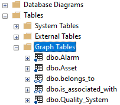

Data contextualization is the process of putting the information relevant to the data based on the context information. It can improve the efficiency of big data processing and make the data useful and easier for interpretation. This article demonstrates how to contextualize data by looking up the relevant context that has been stored in the graph model in Azure SQL database. 

## Architecture

The following diagram shows the high-level architecture for our sample solution for data contextualization.


*Download a [Visio file](https://arch-center.azureedge.net/[file-name].vsdx) of this architecture.*

In this architecture, the data from a delta lake (silver layer) is read incrementally, contextualized based on a graph lookup, and finally merged into an Azure SQL database and another delta lake (gold layer).

Here are the details about the terminologies that have been used and processes definitions:

### Silver layer

The solution is based on Databricks' [Medallion Architecture](https://www.databricks.com/glossary/medallion-architecture) where the data is logically organized in different layers with the goal of incrementally and progressively improving the structure and quality of data.

For simplicity, the architecture uses only two layers; silver layer representing the input data and gold layer representing the contextualized data.

The data in the silver layer has been stored in [Delta Lake](https://docs.databricks.com/delta/index.html) and exposed as delta tables.

### Incremental data load 

The solution performs incremental data processing, thus only the data that has been modified or added since the last run is processed. It is a typical requirement for batch processing so that the data can be processed quickly and economically. 

For more information, refer to the [incremental data load](#incremental-data-load-1).

### Data contextualization

Data contextualization is quite a broad term. In context of the architecture, contextualization is defined as the process of performing a graph lookup based on one or many input columns and retrieving one or many matching values.

The solution assumes that the graph has already been created in a graph database. The internal complexity of the graph isn't a concern here as the graph query is passed via a configuration and executed dynamically by passing the input values.

Also, the solution uses Azure Databricks for this data contextualization process.

### Graph database

The graph database is the database that holds the actual graph models. There are many options to choose for the graph database choice such as Neo4j, Redis Graph, GraphQL over CosmosDB and so on. In this case, the [graph capabilities of SQL Server](/sql/relational-databases/graphs/sql-graph-overview?view=sql-server-ver16) has been used for the creation of the graph.

### Azure SQL Database

For storing the contextualized data, [Azure SQL database](https://azure.microsoft.com/products/azure-sql/database/) has been used, but it can be any other storage option. To ensure idempotent processing, the data has been "merged" into the source system rather than been appended.

### Dataflow

As shown in the architecture diagram, the data flow goes through the following steps:

1. The incoming to-be-contextualized data is appended in the delta table in the 'silver layer'
2. The incoming data is incrementally loaded to Azure Databricks
3. Look up the graph database to get the context information
4. Contextualize the incoming data
5. Append the contextualized data into the corresponding table in the SQL database
6. (Optionally) append the contextualized data into the corresponding delta table in the 'gold layer'

### Components

* [Azure Data Lake Storage Gen 2](https://azure.microsoft.com/products/storage/data-lake-storage) stores input data and contextualized data in delta tables.
* [Azure Databricks](https://azure.microsoft.com/products/databricks) is the platform where we run python notebook files to contextualize data.
* [Azure SQL Database](https://azure.microsoft.com/products/azure-sql/database) stores graph models and contextualized data.

### Alternatives

In the market, there are many graph databases to choose. Here is a Graph Database Comparison Spreadsheet to show the differences of some of the popular products.

| Name      | Azure Cosmos DB for Apache Gremlin| Neo4j | Azure Database for PostgreSQL| Azure SQL Database Graph| RedisGraph|
| ----------- | ----------- | ----------- | ----------- | ----------- | ----------- |
| Description |NoSQL JSON database for rapid, iterative app development.|Neo4j stores data in nodes connected by directed, typed relationships with properties on both,also known as a Property Graph|PostgreSQL is an object-relational database management system (ORDBMS) based on POSTGRES. CTE mechanism provides graph search (N-depth, shortest path etc.) capabilities, and Apache AGE, which is a PostgreSQL extension also provides graph database functionality.|SQL Server offers graph database capabilities to model many-to-many relationships. The graph relationships are integrated into Transact-SQL and receive the benefits of using SQL Server as the foundational database management system.|RedisGraph is based on a unique approach and architecture that translates Cypher queries to matrix operations executed over a GraphBLAS engine.A high-performance graph database implemented as a Redis module.|
| [Workload Type](https://csefy19.visualstudio.com/CSE_Engineer_for_Reuse/_git/Data-GraphDB?path=%2Fanalysis.md&anchor=asset-modeling-%28manufacturing%2Fenergy%29&_a=preview)| OLTP|OLTP|OLTP|OLTP|OLTP|
| [Design Type](https://csefy19.visualstudio.com/CSE_Engineer_for_Reuse/_git/Data-GraphDB?path=%2Fanalysis.md&anchor=asset-modeling-%28manufacturing%2Fenergy%29&_a=preview)|Multi-modal|Dedicated|SQL Plugin|SQL Plugin|Multi-modal|
| Azure Managed Service|Yes|In Azure Marketplace, Neo4j offers the single and causal cluster versions of the Enterprise Edition|Graph extension--Apache Age is not supported for Azure| Yes |No |
|Query Language|[Gremlin query language](https://learn.microsoft.com/en-us/azure/cosmos-db/gremlin/tutorial-query)|[CypherQL](https://neo4j.com/docs/cypher-manual/5/introduction/)|[CypherQL, SQL (allow Recursive CTEs)](https://age.apache.org/age-manual/master/intro/overview.html)|[Transact-SQL](https://learn.microsoft.com/en-us/sql/relational-databases/graphs/sql-graph-architecture?view=sql-server-ver16#transact-sql-reference)|[Subset of OpenCypher](https://redis.io/docs/stack/graph/cypher_support/)|
|Performance|low latency, fast queries and traversals|Not as performant as some of the competitors|Graph schema can be easily and customized to include your requirements without affecting performance. Outstanding query performance in multiple joins via graph model|High availability|Claims high performance owing to using adjacency matrices|
|[MapReduce](https://db-engines.com/en/system/Microsoft+Azure+Cosmos+DB%3BMicrosoft+SQL+Server%3BNeo4j%3BPostgreSQL%3BRedis)|with Hadoop integration|No|No|No|through RedisGears|
|Scale|automatic horizontal [partitioning](https://learn.microsoft.com/en-us/azure/cosmos-db/partitioning-overview)|scale writes vertically and reads horizontally|horizontal and vertical scaling|horizontal and vertical scaling|horizontal and vertical scaling|
|[Partitioning methods](https://db-engines.com/en/system/Microsoft+Azure+Cosmos+DB%3BMicrosoft+SQL+Server%3BNeo4j%3BPostgreSQL%3BRedis)|Sharding|Neo4j Fabric|Partitioning by range, list and by hash|Sharding|Sharding|
|[Multi-Tenancy](https://learn.microsoft.com/en-us/azure/architecture/guide/multitenant/overview)|Container per tenant, Database per tenant, Database account per tenant|Database per tenant(Community edition limited to single database)|Schema per tenant, Database per tenant|Database per tenant|Graph Per Tenant|
|Filter|Perform filters using Gremlin's has and hasLabel|CypherQL for filtering|Hybrid Querying|using T-SQL|A query can filter out entities by creating predicates like using where argument|
|[Benchmark](https://github.com/RedisGraph/graph-database-benchmark)|[For a 1-KB document: a read costs 1 RU, a write costs 5 RU](https://learn.microsoft.com/en-us/azure/cosmos-db/request-units)|Cypher O(1) access using fixed-size array|12,000TPS/2.1ms per query with 5 billion nodes|-|[RedisGraph is able to create over 1 million nodes under half a second and form 500-K relations within 0.3 of a second, inserting a new relationship is done in O(1)](https://redis.io/docs/stack/graph/design/)|
|Support Shortest path|[Yes](https://tinkerpop.apache.org/docs/current/recipes/#shortest-path)|[Yes](https://neo4j.com/docs/graph-data-science/current/algorithms/pathfinding/)|Not provide any such function|[SHORTEST_PATH](https://learn.microsoft.com/en-us/sql/relational-databases/graphs/sql-graph-shortest-path?view=sql-server-ver16) function can only be used inside MATCH, which finds an unweighted shortest path|[Yes](https://redis.io/commands/graph.query/#path-functions)|
|Support Page ranking|[Yes](https://tinkerpop.apache.org/docs/current/recipes/#pagerank-centrality)|[Yes](https://neo4j.com/docs/graph-data-science/current/algorithms/page-rank/)|Not provide any such function|Not provide any such function|[Yes](https://redis.io/commands/graph.query/#path-functions)|
|[Deployment Options](https://cycode.engineering/blog/aws-neptune-neo4j-arangodb-or-redisgraph-how-we-at-cycode-chose-our-graph-database/)|Cloud Offering|Cloud & Self-Hosted (Enterprise Edition requires commercial license)|Cloud Offering, but Apache AGE (AGE) Extension is not supported on Azure database for PostgreSQL|Cloud Offering|Cloud & Self-Hosted|

Reference Links:
1. [Graph Database Analysis](https://csefy19.visualstudio.com/CSE_Engineer_for_Reuse/_git/Data-GraphDB?path=%2Fanalysis.md&anchor=asset-modeling-%28manufacturing%2Fenergy%29&_a=preview)
2. [Azure Cosmos DB for Apache Gremlin](https://learn.microsoft.com/en-us/azure/cosmos-db/gremlin/)
3. [Azure SQL Database Graph](https://learn.microsoft.com/en-us/sql/relational-databases/graphs/sql-graph-overview?view=sql-server-ver16)
4. [Neo4J](https://neo4j.com/docs/operations-manual/current/introduction/)
5. [Redis Graph](https://redis.io/docs/stack/graph/)
6. [PostgreSQL Apache Age](https://age.apache.org/age-manual/master/intro/overview.html)

Azure SQL Database was selected for this architecture, because:

* It's an Azure managed relational database service with graph capabilities.
* It's easy to get started since many are familiar with SQL Server or Azure SQL Database.
* Solutions often benefit from using Transact-SQL in parallel, since the graph database is based on SQL Database.

## Scenario details

### Sample scenario

The sample solution in this article is derived from the scenario described in this section.

Let's imagine Gary is an operation engineer from Contoso company and one of his responsibilities is to provide a weekly health check report for the enterprise assets from Contoso's factories within a specific city. 

First, Gary has to fetch all the asset IDs he is interested in from the company's 'asset' system. Then he looks for all the attributes belong to the asset as the input for the health check report, for example, the operation efficiency data of the asset with ID 'AE0520'.


Contoso has many market leading products and applications to help factory owners to monitor the processes and operations. Its operation efficiency data is recorded in their 'quality system', another stand-alone application.

So, Gary logged in the 'quality system' and used the asset ID 'AE0520' to look up the table from AE_OP_EFF, which contains the all the key attributes for operation efficiency data.

There are many columns in the AE_OP_EFF table and Gary is especially interested in the alarm status. However, the details for the most critical alarms of the asset are kept in another table called 'alarm'. Gary needs to record the key ID 'MA_0520' of 'alarm' table corresponding to the asset 'AE0520', as they are using different naming conventions.  
 
In the reality, the relationship is much more complicated than this one. Gary has to search for more than one attribute of the asset and has to log in many tables from different systems to get all the data for a complete report. Gary used queries and scripts to perform his work, but the queries become complicated and hard to maintain. Even worse, the systems are growing, and the demand of the report is changing, that more data needs to be added to the report for different decision makers' perspectives.

One of the major pain points for Gary is, the ID of one asset in different system are different, as these systems have been developed and maintained separately and even using different protocols. He has to manually query the different tables to get the data for the same asset that caused his query not only complex but also difficult to understand without domain expertise. He uses a lot of time to recruit to the newly onboarded operation engineer and explain the relationships behind.

If there is a mechanism to *link* the different names that belong to the same asset across systems, Gary’s life will be easier, and his report query will be simpler.

### Graph design

Azure SQL Database offers graph database capabilities to model many-to-many relationships. The graph relationships are integrated into Transact-SQL and receive the benefits of using SQL Database as the foundational database management system.

A graph database is a collection of nodes (or vertices) and edges (or relationships). A node represents an entity (for example, a person or an organization) and an edge represents a relationship between the two nodes that it connects (for example, likes or friends). 


#### Design the graph model for the scenario

For the scenario described previously, the graph model can be described as:

* 'Alarm' is one of the metrics that belong to the 'quality system'
* The 'quality system' is associated with an 'asset'


The data is prepared as:


In the graph model, the nodes and edges (relationships) need to be defined. As Azure SQL graph uses Edge tables to represent relationships, in this scenario, there are two edge tables to record the relationships between 'alarm' & 'quality system' and 'quality system' & 'asset'.


After creating the graph model by using the [scripts](#create-sql-graph), you'll be able to find the graph tables shown as:



To look up this graph database with nodes and edges, we use the [MATCH](/sql/t-sql/queries/match-sql-graph?view=sql-server-ver16) clause to match some patterns and traverse through the graph.

``` SQL
SELECT [dbo].[Alarm].Alarm_Type, [dbo].[Asset].Asset_ID
FROM [dbo].[Alarm], [dbo].[Asset], [dbo].[Quality_System], [dbo].[belongs_to], [dbo].[is_associated_with]
WHERE MATCH (Alarm-(belongs_to)->Quality_System -(is_associated_with)-> Asset)
```

### Incremental data load

As the architecture diagram shows, the system should only contextualize the new incoming data, not the whole data set in the delta table. Therefore, an incremental data loading solution is needed.

In delta lake, [Change Data Feed](/azure/databricks/delta/delta-change-data-feed) (CDF) is a feature to simplify the architecture for implementing change data capture (CDC). Once CDF is enabled, as shown in the diagram, the system records data change that includes inserted rows and two rows that represent the pre- and post-image of an updated row. So that we can evaluate the differences in the changes if needed. There is also a delete change type that is returned for deleted rows. Then to query the change data, you use the table_changes operation.


In this solution, the change data feed feature is enabled for delta tables that store the source data, by using the following command:
```SQL
CREATE TABLE tbl_alarm_master 
  (alarm_id INT, alarm_type STRING, alarm_desc STRING, valid_from TIMESTAMP, valid_till TIMESTAMP)
	USING DELTA
	TBLPROPERTIES (delta.enableChangeDataFeed = true)
```
And running the following query can get the newly changed rows in the table (‘2’ is the commit version number):

```SQL
SELECT *
FROM table_changes('tbl_alarm_master', 2)
```

If only newly inserted data is needed, we can use:

```SQL
SELECT *
FROM table_changes('tbl_alarm_master', 2)
WHERE _change_type = 'insert'
```

For more samples, please refer to [Change Data Feed demo](https://docs.databricks.com/_extras/notebooks/source/delta/cdf-demo.html).

As you can see, you can use Change Data Feed feature to load the data incrementally. In order to get the last commit version number, you can store the relevant information into another delta table.

```
CREATE TABLE table_commit_version
	( table_name STRING, last_commit_version LONG)
	USING DELTA
```

Every time you load the newly added data in raw_system_1, you'll take the following steps:

1. Get the last_commit_version in table_commit_version for table tbl_alarm_master
1. Query and load the newly added data since last_commit_version
1. Get the largest commit version number of table tbl_alarm_master
1. Update last_commit_version in table table_commit_version for the next query

Enabling CDF will not make significant impact for the system performance and cost. The change data records are generated inline during the query execution process and are much smaller than the total size of rewritten files.

### Potential use cases

* A manufacturing solution provider would like to contextualize the master data and event data provided by its customers continuously. Since the context information is too complicated to be represented by relational tables, graph models are used for data contextualization.
* A process engineer in the factory needs to troubleshoot for an issue of the factory equipment. The graph model stores the all the related data, direct or indirect, of the troubleshooting equipment that can provide an overall information for root cause analysis. 

## Considerations

These considerations implement the pillars of the Azure Well-Architected Framework, which is a set of guiding tenets that can be used to improve the quality of a workload. For more information, see [Microsoft Azure Well-Architected Framework](/azure/architecture/framework).

### Security

Security provides assurances against deliberate attacks and the abuse of your valuable data and systems. For more information, see [Overview of the security pillar](/azure/architecture/framework/security/overview).

Securing the Azure SQL database is crucial to protect the data and prevent unauthorized access. Here are some best practices we can follow to secure the Azure SQL database:
* Use strong passwords and enable multifactor authentication (MFA).
* Implement network security by using virtual network service endpoints and firewall rules.
* Enable Transparent Data Encryption (TDE) to encrypt data at rest, and use Always Encrypted to encrypt sensitive data in transit.
* Use role-based access control (RBAC) to limit access to specific operations and resources within the database.
* Implement data masking to hide sensitive data from unauthorized users.
* Enable auditing and logging.
* Regularly backup your Azure SQL database.

Securing Azure Databricks involves implementing a comprehensive security strategy that covers different aspects of the platform, such as data access, network security, authentication, and authorization. Here are some best practices for securing Azure Databricks:
* Implement Role-Based Access Control (RBAC)
* Enable network security by using Azure Virtual Networks to isolate your Databricks workspace from the internet and restrict inbound and outbound traffic to only necessary sources.
* Configure your Databricks clusters to use secure communication protocols like HTTPS, and use network security groups to restrict access to the Databricks workspace.
* Implement Authentication and Authorization.
* Enable Azure Monitor to monitor your Databricks workspace for unusual activity, and enable logging to track user activity and security events.

### Cost optimization


Cost optimization is about looking at ways to reduce unnecessary expenses and improve operational efficiencies. For more information, see [Overview of the cost optimization pillar](/azure/architecture/framework/cost/overview).

In order to optimize the cost for using Azure SQL Database, you should consider the following items:

* Choose the right pricing tier that meets your requirements and budget.
* Scale up and down as needed.
* Use serverless compute.
* Optimize queries.
* Use data compression.

To enhance cost efficiency while utilizing Azure Databricks, the subsequent factors could be taken into consideration:


* Choose the right instance type that meets your workload requirements while minimizing costs.
* Use autoscaling to scale up or down the number of nodes based on the workload demand.
* Turn off clusters when not in use.
* Use monitoring and logging to optimize performance.

For both Azure SQL Database and Azure Databricks, you can also use Azure Advisor and review its personalized recommendations and identify the opportunities to optimize the costs.

### Performance efficiency

Performance efficiency is the ability of your workload to scale to meet the demands placed on it by users in an efficient manner. For more information, see [Performance efficiency pillar overview](/azure/architecture/framework/scalability/overview).

Here are some tips to improve the performance efficiency of using an Azure SQL Database:


* Choose the right service tier.
* Optimize database design, including creating appropriate indexes, partitioning large tables, and using appropriate data types.
* Use Query Performance Insight: Use Query Performance Insight to identify slow running queries and tune them for better performance.
* Use Elastic pools: If you have multiple databases with varying workloads, consider using elastic pools to share resources and reduce costs.
* Enable automatic tuning to optimize the database configuration based on workload patterns.
* Monitor database performance.
* Use Azure Cache for Redis: Consider using Azure Cache for Redis to improve database performance by caching frequently accessed data.  

To improve performance efficiency when using Azure Databricks, we can consider the following aspects:
* Optimize cluster configuration: Make sure you have the right number of worker nodes and the right amount of resources allocated to each node.
* Use autoscaling: Enable autoscaling to automatically add or remove worker nodes based on cluster utilization. 
* Use Delta Lake: Delta Lake is a highly performant data lake that can significantly improve query times. It supports ACID transactions, data versioning, and schema enforcement.
* Use caching: Caching frequently accessed data can significantly reduce query times. You can use Databricks’ caching APIs to cache RDDs, DataFrames, and other data structures.
* Use efficient data formats: Choose data formats that are efficient for your use case. 
* Use partitioning: Partition your data by the column that is most frequently used in queries.
* Optimize queries: Write efficient queries that use indexes and avoid unnecessary data scans. Use the Databricks query profiler to identify performance bottlenecks.

## Deploy this scenario

### Create SQL Graph
In Azure SQL Database, Use the following SQL script to build the graph model.
```
DROP TABLE IF EXISTS Alarm;
DROP TABLE IF EXISTS Asset;
DROP TABLE IF EXISTS Quality_System;

CREATE TABLE Alarm(ID INTEGER PRIMARY KEY, Alarm_Type VARCHAR(100)) AS NODE; 
CREATE TABLE Asset (ID INTEGER PRIMARY KEY,  Asset_ID VARCHAR(100)) AS NODE;
CREATE TABLE Quality_System (ID INTEGER PRIMARY KEY, Quality_ID VARCHAR(100)) AS NODE;

INSERT INTO Alarm (ID, Alarm_Type)
    VALUES  (1, 'Fire Warning'),
            (2, 'Flood Warning'),
            (3, 'Carbon Monoxide Warning');

INSERT INTO Asset (ID, Asset_ID)
    VALUES  (1, 'AE0520'),
            (2, 'AE0530'),
            (3, 'AE0690');

INSERT INTO Quality_System (ID, Quality_ID)
    VALUES  (1, 'MA_0520_001'),
            (2, 'MA_0530_002'),
            (3, 'MA_0690_003');

DROP TABLE IF EXISTS belongs_to;
CREATE TABLE belongs_to AS EDGE;

INSERT INTO [dbo].[belongs_to]
    VALUES  ((SELECT $node_id FROM Alarm WHERE ID = '1'), (SELECT $node_id FROM Quality_System WHERE Quality_ID = 'MA_0520_001')),
            ((SELECT $node_id FROM Alarm WHERE ID = '2'), (SELECT $node_id FROM Quality_System WHERE Quality_ID = 'MA_0530_002')),
            ((SELECT $node_id FROM Alarm WHERE ID = '3'), (SELECT $node_id FROM Quality_System WHERE Quality_ID = 'MA_0690_003'));

DROP TABLE IF EXISTS is_associated_with; 
CREATE TABLE is_associated_with AS EDGE;

INSERT INTO [dbo].[is_associated_with]
    VALUES  ((SELECT $node_id FROM Quality_System WHERE Quality_ID = 'MA_0520_001'), (SELECT $node_id FROM Asset WHERE ID = '1')),
            ((SELECT $node_id FROM Quality_System WHERE Quality_ID = 'MA_0530_002'), (SELECT $node_id FROM Asset WHERE ID = '2')),
            ((SELECT $node_id FROM Quality_System WHERE Quality_ID = 'MA_0690_003'), (SELECT $node_id FROM Asset WHERE ID = '3'));
```
### Create tbl_alarm_master Table and Insert Dummy Data
In Azure Databricks, create a delta table ```tbl_alarm_master``` that is the source data to be contextualized, and enable change data feed feature, so that we can load data incrementally.
```
%sql
CREATE TABLE tbl_alarm_master (alarm_id INT, alarm_type STRING, alarm_desc STRING, valid_from TIMESTAMP, valid_till TIMESTAMP) 
USING DELTA
LOCATION '/mnt/contoso/raw/tbl_alarm_master'
TBLPROPERTIES (delta.enableChangeDataFeed = true)
```
Insert sample data into this table.
```
%sql
INSERT INTO tbl_alarm_master VALUES 
(1, "Carbon Monoxide Warning", "TAG_1", "2023-01-01 00:00:00.0000", "2999-12-31 23:59:59.0000"),
(2, "Fire Warning", "TAG_2", "2023-01-01 00:00:00.0001", "2999-12-31 23:59:59.0000"),
(3, "Flood Warning", "TAG_3",  "2023-01-01 00:00:00.0002", "2999-12-31 23:59:59.0000")
```

### Create Table_commit_version
In Azure Databricks, create a delta table named ```table_commit_version``` so that we can record last commit version for each table.
```
%sql
CREATE TABLE table_commit_version (table_name STRING, last_commit_version LONG, updated_at TIMESTAMP)
USING DELTA
LOCATION '/mnt/contoso/table_commit_version'
```
Insert one record into this table to set last_commit_version to 1.
```
%sql
INSERT INTO table_commit_version VALUES('tbl_alarm_master', 1, current_timestamp())
```

### Connect Azure SQL Database by Using JDBC
Azure Databricks supports connecting to external databases using JDBC. It is necessary to connect Azure SQL Graph with Azure Databricks for further operations.
```
jdbcUsername = "<Username>"
jdbcPassword = "<Password>"
jdbcHostname = "<Hostname>.database.windows.net"
jdbcPort = 1433
jdbcDatabase ="<DatabaseName>"

jdbc_url = f"jdbc:sqlserver://{jdbcHostname}:{jdbcPort};database={jdbcDatabase};user={jdbcUsername};password={jdbcPassword};encrypt=true;trustServerCertificate=false;hostNameInCertificate=*.database.windows.net;"
```

You must configure many settings to read data using JDBC, and then get expected data by T-SQL query.

```
pushdown_query = "(SELECT a.Alarm_Type, b.Asset_ID\
                   FROM Alarm a, belongs_to, Asset b, is_associated_with, Quality_System c\
                   WHERE MATCH (a-(belongs_to)->c-(is_associated_with)->b)) as new_tbl2"

ala2ass = spark.read \
        .format("jdbc") \
        .option("url", jdbc_url) \
        .option("dbtable", pushdown_query).load()
```
Using this T-SQL query, we can query the knowledge graph model to get the relationship between Asset and Alarm.

### Contextualize the Source Data
Using ```process_data``` method to contextualize source data from table ```tbl_alarm_master```, adding information about asset.
```
def process_data(system): 
     # Get last_commit_version in table_commit_version for the data source table
    last_commit_version = spark.sql(f"select max(last_commit_version) as last_commit_version from table_commit_version where table_name='{system}'").collect()[0].asDict()['last_commit_version']

    # Get the max(_commit_version) from the table_changes
    max_commit_version = spark.sql(f"select max(_commit_version) as max_commit_version from table_changes('{system}',1)").collect()[0].asDict()['max_commit_version']
    
    # Query and process the newly added data since the last_commit_version
    df_tlb_change = spark.sql(f"select * from table_changes('{system}',{last_commit_version})")
    
    if(last_commit_version == max_commit_version + 1):
        return None
    
    df = spark.sql(f"select raw.alarm_id, raw.alarm_type, raw.alarm_desc, raw.valid_from, raw.valid_till,a.asset_id context_asset from table_changes('{system}',{last_commit_version}) raw left join ala2ass a on raw.alarm_type = a.alarm_type")
    
    max_commit_version = max_commit_version + 1
    
    # Update last_commit_version in table_commit_version for the data source table
    spark.sql(f"update table_commit_version set last_commit_version={max_commit_version} where table_name='{system}'")
    
    return df, df_tlb_change
```

### Write Data to the Relational Data Store
After being contextualized, the data can be saved to another store for later consumption. For simplicity, in this sample, we save the contextualized data to the corresponding table in the SQL database.
```
df_alarm_master.write \
               .format("jdbc") \
               .option("url", jdbc_url) \
               .option("dbtable", "Tbl_Alarm_Master") \
               .mode("append") \
               .save()
```
Now, from end to end, we have incrementally loaded the incoming data, queried the conext information from Azure SQL Graph and contextualized the data, and then save it to Azure SQL Database.

## Contributors
*This article is maintained by Microsoft. It was originally written by the following contributors.* 

Principal authors: 
 - [Anuj Parashar](https://www.linkedin.com/in/promisinganuj/) | Senior Data Engineer
 - [Chenshu Cai](https://www.linkedin.com/in/chenshu-cai-703481170/) | Software Engineer
 - [Bo Wang](https://www.linkedin.com/in/bo-wang-67755673/) | Software Engineer
 - [Hong Bu](https://www.linkedin.com/in/hongbu/) | Senior Program Manager
 - [Gary Wang](https://www.linkedin.com/in/gang-gary-wang/) | Principal Software Engineer

*To see non-public LinkedIn profiles, sign in to LinkedIn.*

## Next steps

* [What is Azure Cosmos DB for Apache Gremlin](/azure/cosmos-db/gremlin/introduction)
* [The Leading Graph Data Platform on Microsoft Azure](https://neo4j.com/partners/microsoft/)
 
## Related resources
* [Graph processing with SQL Server and Azure SQL Database](https://learn.microsoft.com/en-us/sql/relational-databases/graphs/sql-graph-overview?view=sql-server-ver16)
* [Use Delta Lake change data feed on Azure Databricks](https://learn.microsoft.com/en-us/azure/databricks/delta/delta-change-data-feed) 
* [How to Simplify CDC With Delta Lake's Change Data Feed](https://www.databricks.com/blog/2021/06/09/how-to-simplify-cdc-with-delta-lakes-change-data-feed.html)
* [PostgreSQL Graph Search Practices - 10 Billion-Scale Graph with Millisecond Response](https://www.alibabacloud.com/blog/postgresql-graph-search-practices---10-billion-scale-graph-with-millisecond-response_595039)
