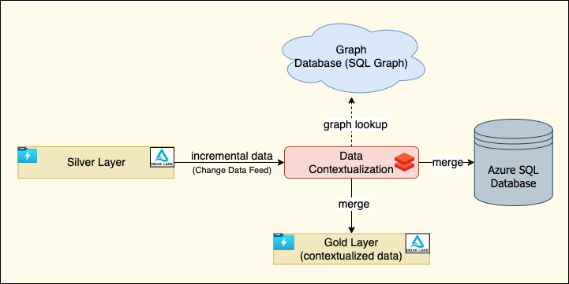

Data contextualization refers to the process of adding contextual information to raw data in order to enhance its meaning and relevance. It involves the use of additional information such as metadata, annotations, and other relevant details to provide a better understanding of the data. Contextualization can help analysts to better understand the relationships between data points and the environment in which they were collected. For example, contextualization can provide information on the time, location, and other environmental factors that may have influenced the data. In data processing, contextualization is becoming increasingly important as data sets become larger and more complex. Without proper contextualization, it can be difficult to interpret data accurately and make informed decisions based on it.

This article demonstrates how to contextualize data by looking up the relevant context that has been stored in the graph model in Azure SQL database. 

## Architecture

The following diagram shows the high-level architecture for our sample solution for data contextualization.



*Download a [Visio file](https://arch-center.azureedge.net/[file-name].vsdx) of this architecture.*

In this architecture, the data from a delta lake (silver layer) is read incrementally, contextualized based on a graph lookup, and finally merged into an Azure SQL database and another delta lake (gold layer).

Here are the details about the terminologies that have been used and processes definitions:

### Silver layer

The solution is based on Databricks' [Medallion Architecture](https://www.databricks.com/glossary/medallion-architecture) where the data is logically organized in different layers with the goal of incrementally and progressively improving the structure and quality of data.

For simplicity, the architecture uses only two layers; silver layer representing the input data and gold layer representing the contextualized data.

The data in the silver layer has been stored in [Delta Lake](https://docs.databricks.com/delta/index.html) and exposed as delta tables.

### Incremental data load 

The solution performs incremental data processing, thus only the data that has been modified or added since the last run is processed. It is a typical requirement for batch processing so that the data can be processed quickly and economically. 

For more information, see the [incremental data load](#incremental-data-load-1).

### Data contextualization

Data contextualization is quite a broad term. In context of the architecture, contextualization is defined as the process of performing a graph lookup based on one or many input columns and retrieving one or many matching values.

The solution assumes that the graph has already been created in a graph database. The internal complexity of the graph isn't a concern here as the graph query is passed via a configuration and executed dynamically by passing the input values.

Also, the solution uses Azure Databricks for this data contextualization process.

### Graph database

The graph database is the database that holds the actual graph models. There are many options to choose for the graph database choice such as Neo4j, Redis Graph, GraphQL over CosmosDB and so on. In this case, the [graph capabilities of SQL Server](/sql/relational-databases/graphs/sql-graph-overview?view=sql-server-ver16) has been used for the creation of the graph.

### Azure SQL Database

For storing the contextualized data, [Azure SQL database](https://azure.microsoft.com/products/azure-sql/database/) has been used, but it can be any other storage option. To ensure idempotent processing, the data has been "merged" into the source system rather than been appended.

### Dataflow

As shown in the architecture diagram, the data flow goes through the following steps:

1. The incoming to-be-contextualized data is appended in the delta table in the 'silver layer'
2. The incoming data is incrementally loaded to Azure Databricks
3. Look up the graph database to get the context information
4. Contextualize the incoming data
5. Append the contextualized data into the corresponding table in the SQL database
6. (Optionally) append the contextualized data into the corresponding delta table in the 'gold layer'

### Components

* [Azure Data Lake Storage Gen 2](https://azure.microsoft.com/products/storage/data-lake-storage) stores input data and contextualized data in delta tables.
* [Azure Databricks](https://azure.microsoft.com/products/databricks) is the platform where we run python notebook files to contextualize data.
* [Azure SQL Database](https://azure.microsoft.com/products/azure-sql/database) stores graph models and contextualized data.

### Alternatives
In the market, there are many graph databases such as Azure Cosmos DB, Azure Database for PostgreSQL, Neo4j and RedisGraph etc.

Refer to the following links for more information:
1. [Azure SQL Database Graph](https://learn.microsoft.com/en-us/sql/relational-databases/graphs/sql-graph-overview?view=sql-server-ver16)
2. [Azure Cosmos DB for Apache Gremlin](https://learn.microsoft.com/en-us/azure/cosmos-db/gremlin/)
3. [Neo4J](https://neo4j.com/docs/operations-manual/current/introduction/)
4. [Redis Graph](https://redis.io/docs/stack/graph/)
5. [PostgreSQL Apache Age](https://age.apache.org/age-manual/master/intro/overview.html)

These products and services have pros and cons. Some of them are Azure managed services, some are not. Finally we choose to use Azure SQL Database, because:
* It's an Azure managed relational database service with graph capabilities.
* It's easy to get started since many are familiar with SQL Server or Azure SQL Database.
* Solutions often benefit from using Transact-SQL in parallel, since the graph database is based on SQL Database.

## Scenario details

### Sample scenario

The sample solution in this article is derived from the scenario described in this section.

Let's imagine Gary is an operation engineer from Contoso company and one of his responsibilities is to provide a weekly health check report for the enterprise assets from Contoso's factories within a specific city. 

First, Gary has to fetch all the asset IDs he is interested in from the company's 'asset' system. Then he looks for all the attributes belong to the asset as the input for the health check report, for example, the operation efficiency data of the asset with ID 'AE0520'.


Contoso has many market leading products and applications to help factory owners to monitor the processes and operations. Its operation efficiency data is recorded in their 'quality system', another stand-alone application.

Gary logged in the 'quality system' and used the asset ID 'AE0520' to look up the table from AE_OP_EFF. That table contains the all the key attributes for operation efficiency data.

There are many columns in the AE_OP_EFF table and Gary is especially interested in the alarm status. However, the details for the most critical alarms of the asset are kept in another table called 'alarm'. Gary needs to record the key ID 'MA_0520' of 'alarm' table corresponding to the asset 'AE0520', as they are using different naming conventions.  
 
In the reality, the relationship is much more complicated than this one. Gary has to search for more than one attribute of the asset and has to log in many tables from different systems to get all the data for a complete report. Gary used queries and scripts to perform his work, but the queries become complicated and hard to maintain. Even worse, the systems are growing, and the demand of the report is changing, that more data needs to be added to the report for different decision makers' perspectives.

One of the major pain points for Gary is, the ID of one asset in different system are different, as these systems have been developed and maintained separately and even using different protocols. He has to manually query the different tables to get the data for the same asset that caused his query not only complex but also difficult to understand without domain expertise. He uses a lot of time to recruit to the newly onboarded operation engineer and explain the relationships behind.

If there is a mechanism to *link* the different names that belong to the same asset across systems, Gary’s life will be easier, and his report query will be simpler.

### Graph design

Azure SQL Database offers graph database capabilities to model many-to-many relationships. The graph relationships are integrated into Transact-SQL and receive the benefits of using SQL Database as the foundational database management system.

A graph database is a collection of nodes (or vertices) and edges (or relationships). A node represents an entity (for example, a person or an organization) and an edge represents a relationship between the two nodes that it connects (for example, likes or friends). 


#### Design the graph model for the scenario

For the scenario described previously, the graph model can be described as:

* 'Alarm' is one of the metrics that belong to the 'quality system'
* The 'quality system' is associated with an 'asset'


The data is prepared as:


In the graph model, the nodes and edges (relationships) need to be defined. As Azure SQL graph uses Edge tables to represent relationships, in this scenario, there are two edge tables to record the relationships between 'alarm' & 'quality system' and 'quality system' & 'asset'.


In order to create these nodes and edges in Azure SQL Database, we can use the following SQL scripts: 
```
...
CREATE TABLE Alarm(ID INTEGER PRIMARY KEY, Alarm_Type VARCHAR(100)) AS NODE; 
CREATE TABLE Asset (ID INTEGER PRIMARY KEY,  Asset_ID VARCHAR(100)) AS NODE;
CREATE TABLE Quality_System (ID INTEGER PRIMARY KEY, Quality_ID VARCHAR(100)) AS NODE;
CREATE TABLE belongs_to AS EDGE;
CREATE TABLE is_associated_with AS EDGE;
...
```

The SQL scripts created a list of 'graph tables' as:
* dbo.Alarm
* dbo.Asset
* dbo.belongs.to
* dbo.is_associated_with
* dbo.Quality_System

To query this graph database with nodes and edges, we use the new [MATCH](https://learn.microsoft.com/en-us/sql/t-sql/queries/match-sql-graph?view=sql-server-ver16) clause to match some patterns and traverse through the graph.

``` SQL
SELECT [dbo].[Alarm].Alarm_Type, [dbo].[Asset].Asset_ID
FROM [dbo].[Alarm], [dbo].[Asset], [dbo].[Quality_System], [dbo].[belongs_to], [dbo].[is_associated_with]
WHERE MATCH (Alarm-(belongs_to)->Quality_System -(is_associated_with)-> Asset)
```
Later the query result can be used to join the incoming raw data for contextualization.

## Incremental Data Load

As the architecture diagram shows, the system should only contextualize the new incoming data, not the whole data set in the delta table. Therefore, an incremental data loading solution is needed.

In delta lake, [Change Data Feed](/azure/databricks/delta/delta-change-data-feed) (CDF) is a feature to simplify the architecture for implementing change data capture (CDC). Once CDF is enabled, as shown in the diagram, the system records data change that includes inserted rows and two rows that represent the pre- and post-image of an updated row. So that we can evaluate the differences in the changes if needed. There is also a delete change type that is returned for deleted rows. Then to query the change data, you use the table_changes operation.


In this solution, the change data feed feature is enabled for delta tables that store the source data, by using the following command:
```SQL
CREATE TABLE tbl_alarm_master 
  (alarm_id INT, alarm_type STRING, alarm_desc STRING, valid_from TIMESTAMP, valid_till TIMESTAMP)
	USING DELTA
	TBLPROPERTIES (delta.enableChangeDataFeed = true)
```
And running the following query can get the newly changed rows in the table (‘2’ is the commit version number):

```SQL
SELECT *
FROM table_changes('tbl_alarm_master', 2)
```

If only newly inserted data is needed, we can use:

```SQL
SELECT *
FROM table_changes('tbl_alarm_master', 2)
WHERE _change_type = 'insert'
```

For more samples, please refer to [Change Data Feed demo](https://docs.databricks.com/_extras/notebooks/source/delta/cdf-demo.html).

As you can see, you can use CDF feature to load the data incrementally. In order to get the last commit version number, you can store the relevant information into another delta table.

```
CREATE TABLE table_commit_version
	( table_name STRING, last_commit_version LONG)
	USING DELTA
```

Every time you load the newly added data in raw_system_1, you need to take the following steps:

1. Get the last_commit_version in table_commit_version for table tbl_alarm_master
1. Query and load the newly added data since last_commit_version
1. Get the largest commit version number of table tbl_alarm_master
1. Update last_commit_version in table table_commit_version for the next query

Enabling CDF will not make significant impact for the system performance and cost. The change data records are generated inline during the query execution process and are much smaller than the total size of rewritten files.

### Potential use cases

* A manufacturing solution provider would like to contextualize the master data and event data provided by its customers continuously. Since the context information is too complicated to be represented by relational tables, graph models are used for data contextualization.
* A process engineer in the factory needs to troubleshoot for an issue of the factory equipment. The graph model stores the all the related data, direct or indirect, of the troubleshooting equipment that can provide an overall information for root cause analysis. 

## Considerations

These considerations implement the pillars of the Azure Well-Architected Framework, which is a set of guiding tenets that can be used to improve the quality of a workload. For more information, see [Microsoft Azure Well-Architected Framework](/azure/architecture/framework).

### Security

Security provides assuradnces against deliberate attacks and the abuse of your valuable data and systems. For more information, see [Overview of the security pillar](/azure/architecture/framework/security/overview).

For this use case, we need to consider how to secure the data at rest ( that is, the data stored in Azure Data Lake Storage Gen 2, Azure SQL Database and Azure Databricks ) and data in transit between them.

For Azure Data Lake Storage Gen 2:
* Azure Storage service-side encryption (SSE)'s been enabled to protect the data at rest
* We use shared access signature (SAS) to not only provide restricted access and limited permission to the data, but also use HTTPS to protect the data in transit.

For Azure SQL Database:
* We use role-based access control (RBAC) to limit access to specific operations and resources within the database.
* Strong password's been used for accessing Azure SQL Database. The password's been saved in Azure Key Vault.
* TLS' been enabled to secure the transit data between Azure SQL Database and Azure Databricks.

For Azure Databricks:
* Role-Based Access Control (RBAC)'s been implemented.
* We've enabled Azure Monitor to monitor your Databricks workspace for unusual activity, and enabled logging to track user activity and security events.
* In order to protect the data in transit, TLS's been enabled for the JDBC connection to Azure SQL Database.

In the production environment, we may put these resources into an Azure Virtual Network that isolates the them from the public internet to reduce the attack surface and data exfiltration.

### Cost optimization


Cost optimization is about looking at ways to reduce unnecessary expenses and improve operational efficiencies. For more information, see [Overview of the cost optimization pillar](/azure/architecture/framework/cost/overview).

In our sample solution, Azure SQL Database and Azure Databricks are the services that generate the major cost. 

In order to optimize the cost for using Azure SQL Database:
* Since the solution performance is not our focus, we choose the lowest pricing tier that meets our requirements and budget.
* We use serverless compute tier (billed per second based on compute cores used).

To improve cost efficiency while utilizing Azure Databricks:
* We choose the right instance type (all-purpose compute workload and premium tier) that meets your workload requirements while minimizing costs.
* We use autoscaling to scale up or down the number of nodes based on the workload demand.
* Clusters are turned off when they are not in use.

## Contributors
*This article is maintained by Microsoft. It was originally written by the following contributors.* 

Principal authors: 
 - [Anuj Parashar](https://www.linkedin.com/in/promisinganuj/) | Senior Data Engineer
 - [Chenshu Cai](https://www.linkedin.com/in/chenshu-cai-703481170/) | Software Engineer
 - [Bo Wang](https://www.linkedin.com/in/bo-wang-67755673/) | Software Engineer
 - [Hong Bu](https://www.linkedin.com/in/hongbu/) | Senior Program Manager
 - [Gary Wang](https://www.linkedin.com/in/gang-gary-wang/) | Principal Software Engineer

*To see non-public LinkedIn profiles, sign in to LinkedIn.*

## Next steps

* [What is Azure Cosmos DB for Apache Gremlin](/azure/cosmos-db/gremlin/introduction)
* [The Leading Graph Data Platform on Microsoft Azure](https://neo4j.com/partners/microsoft/)
 
## Related resources
* [Graph processing with SQL Server and Azure SQL Database](https://learn.microsoft.com/en-us/sql/relational-databases/graphs/sql-graph-overview?view=sql-server-ver16)
* [Use Delta Lake change data feed on Azure Databricks](https://learn.microsoft.com/en-us/azure/databricks/delta/delta-change-data-feed) 
* [How to Simplify CDC With Delta Lake's Change Data Feed](https://www.databricks.com/blog/2021/06/09/how-to-simplify-cdc-with-delta-lakes-change-data-feed.html)
* [PostgreSQL Graph Search Practices - 10 Billion-Scale Graph with Millisecond Response](https://www.alibabacloud.com/blog/postgresql-graph-search-practices---10-billion-scale-graph-with-millisecond-response_595039)
