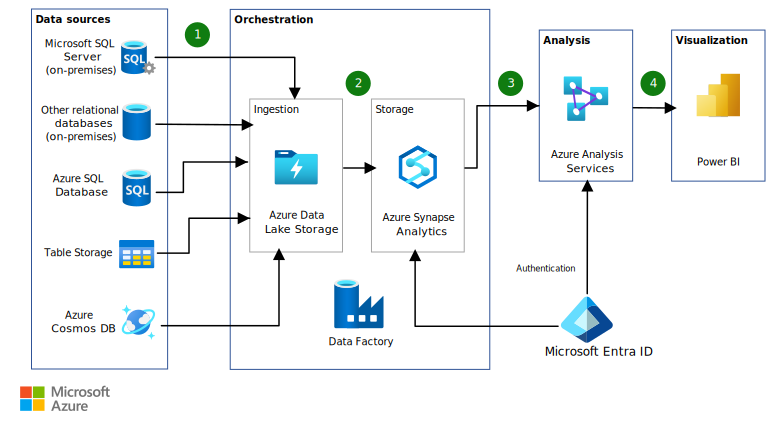

This example scenario demonstrates a data pipeline that integrates large amounts of data from multiple sources into a unified analytics platform in Azure. This specific scenario is based on a sales and marketing solution, but the design patterns are relevant for many industries requiring advanced analytics of large datasets such as e-commerce, retail, and healthcare.

## Architecture

*Download a [Visio file](https://arch-center.azureedge.net/architecture-data-warehousing.vsdx) of this architecture.*

### Dataflow

The data flows through the solution as follows:

1. For each data source, any updates are exported periodically into a staging area in Azure Data Lake Storage.
2. Azure Data Factory incrementally loads the data from Azure Data Lake Storage into staging tables in Azure Synapse Analytics. The data is cleansed and transformed during this process. PolyBase can parallelize the process for large datasets.
3. After loading a new batch of data into the warehouse, a previously created Azure Analysis Services tabular model is refreshed. This semantic model simplifies the analysis of business data and relationships.
4. Business analysts use Microsoft Power BI to analyze warehoused data via the Analysis Services semantic model.

### Components

The company has data sources on many different platforms:

- SQL Server on-premises
- Oracle on-premises
- Azure SQL Database
- Azure table storage
- Azure Cosmos DB

Data is loaded from these different data sources using several Azure components:

- [Data Lake Storage](/azure/storage/blobs/data-lake-storage-introduction) is a scalable data storage service for structured and unstructured data. In this architecture, it stages source data before Azure Synapse Analytics loads the data. It serves as the initial landing zone for raw data.
- [Azure Data Factory](/azure/data-factory/introduction) is a cloud-based data integration service. In this architecture, it orchestrates the transformation of staged data into a common structure in Azure Synapse Analytics. Azure Data Factory [uses PolyBase when it loads data into Azure Synapse Analytics](/azure/data-factory/connector-azure-sql-data-warehouse#use-polybase-to-load-data-into-azure-sql-data-warehouse) to maximize throughput.
- [Azure Synapse Analytics](/azure/synapse-analytics/overview-what-is) is a distributed analytics system that combines big data and data warehousing. In this architecture. it stores and analyzes large datasets by using massive parallel processing (MPP). It serves as the core analytical engine. Azure Synapse Analytics can use [PolyBase](/sql/relational-databases/polybase/polybase-guide) to rapidly load data from Data Lake Storage.
- [Analysis Services](/azure/analysis-services/analysis-services-overview) is a fully managed platform for building semantic data models. In this architecture, it provides a tabular semantic model that simplifies data analysis and improves query performance. It can be configured to refresh after each data load into Azure Synapse Analytics to ensure up-to-date insights.
- [Power BI](/power-bi/fundamentals/power-bi-overview) is a suite of business analytics tools to analyze data and share insights. In this architecture, Power BI enables business analysts to explore and visualize data. It connects to Analysis Services for semantic querying or directly to Azure Synapse Analytics for raw data access.
- [Microsoft Entra ID](/entra/fundamentals/whatis) is a cloud-based identity and access management service. In this architecture, it authenticates users who connect to the Analysis Services server through Power BI. Azure Data Factory can also use Microsoft Entra ID to authenticate to Azure Synapse Analytics via a service principal or [managed identity for Azure resources](/entra/identity/managed-identities-azure-resources/overview).

### Alternatives

- The example pipeline includes several different kinds of data sources. This architecture can handle a wide range of relational and non-relational data sources.
- Data Factory orchestrates the workflows for your data pipeline. If you want to load data only one time or on demand, you could use tools like SQL Server bulk copy (bcp) and AzCopy to copy data into Azure Data Lake Storage. You can then load the data directly into Azure Synapse using PolyBase.
- If you have large-scale datasets, consider using [Data Lake Storage](/azure/storage/data-lake-storage/introduction), which provides limitless storage for analytics data.
- Azure Synapse isn't a good fit for OLTP workloads or data sets smaller than 250 GB. For those cases you should use Azure SQL Database or SQL Server.
- For comparisons of other alternatives, see:

  - [Choosing a data pipeline orchestration technology in Azure](../../data-guide/technology-choices/pipeline-orchestration-data-movement.md)
  - [Choosing a batch processing technology in Azure](../../data-guide/technology-choices/batch-processing.md)
  - [Choosing an analytical data store in Azure](../../data-guide/technology-choices/analytical-data-stores.md)
  - [Choosing a data analytics technology in Azure](../../data-guide/technology-choices/analysis-visualizations-reporting.md)

## Scenario details

This example demonstrates a sales and marketing company that creates incentive programs. These programs reward customers, suppliers, salespeople, and employees. Data is fundamental to these programs, and the company wants to improve the insights gained through data analytics using Azure.

The company needs a modern approach to analyze data, so that decisions are made using the right data at the right time. The company's goals include:

- Combining different kinds of data sources into a cloud-scale platform.
- Transforming source data into a common taxonomy and structure, to make the data consistent and easily compared.
- Loading data using a highly parallelized approach that can support thousands of incentive programs, without the high costs of deploying and maintaining on-premises infrastructure.
- Greatly reducing the time needed to gather and transform data, so you can focus on analyzing the data.

### Potential use cases

This approach can also be used to:

- Establish a data warehouse to be a single source of truth for your data.
- Integrate relational data sources with other unstructured datasets.
- Use semantic modeling and powerful visualization tools for simpler data analysis.

## Considerations

These considerations implement the pillars of the Azure Well-Architected Framework, which is a set of guiding tenets that you can use to improve the quality of a workload. For more information, see [Well-Architected Framework](/azure/well-architected/).

The technologies in this architecture were chosen because they met the company's requirements for scalability and availability, while helping them control costs.

- The [massively parallel processing architecture](/azure/sql-data-warehouse/massively-parallel-processing-mpp-architecture) of Azure Synapse provides scalability and high performance.
- Azure Synapse has [guaranteed service-level agreements (SLAs)](https://azure.microsoft.com/support/legal/sla/sql-data-warehouse) and [recommended practices for achieving high availability](/azure/sql-data-warehouse/sql-data-warehouse-best-practices).
- When analysis activity is low, the company can [scale Azure Synapse on demand](/azure/sql-data-warehouse/sql-data-warehouse-manage-compute-overview), reducing or even pausing compute to lower costs.
- Azure Analysis Services can be [scaled out](/azure/analysis-services/analysis-services-scale-out) to reduce response times during high query workloads. You can also separate processing from the query pool, so that client queries aren't slowed down by processing operations.
- Azure Analysis Services also has [guaranteed SLAs](https://azure.microsoft.com/support/legal/sla/analysis-services) and [recommended practices for achieving high availability](/azure/analysis-services/analysis-services-bcdr).
- The [Azure Synapse security model](/azure/sql-data-warehouse/sql-data-warehouse-overview-manage-security) provides connection security, [authentication and authorization](/azure/sql-data-warehouse/sql-data-warehouse-authentication) via Microsoft Entra ID or SQL Server authentication, and encryption. [Azure Analysis Services](/azure/analysis-services/analysis-services-manage-users) uses Microsoft Entra ID for identity management and user authentication.

### Cost Optimization

Cost Optimization focuses on ways to reduce unnecessary expenses and improve operational efficiencies. For more information, see [Design review checklist for Cost Optimization](/azure/well-architected/cost-optimization/checklist).

Review a [pricing sample for a data warehousing scenario][calculator] via the Azure pricing calculator. Adjust the values to see how your requirements affect your costs.

- [Azure Synapse](https://azure.microsoft.com/pricing/details/sql-data-warehouse/gen2) allows you to scale your compute and storage levels independently. Compute resources are charged per hour, and you can scale or pause these resources on demand. Storage resources are billed per terabyte, so your costs will increase as you ingest more data.
- [Data Factory](https://azure.microsoft.com/pricing/details/data-factory) costs are based on the number of read/write operations, monitoring operations, and orchestration activities performed in a workload. Your data factory costs will increase with each additional data stream and the amount of data processed by each one.
- [Analysis Services](https://azure.microsoft.com/pricing/details/analysis-services) is available in Developer, Basic, and Standard tiers. Instances are priced based on query processing units (QPUs) and available memory. To keep your costs lower, minimize the number of queries you run, how much data they process, and how often they run.
- [Power BI](https://powerbi.microsoft.com/pricing) has different product options for different requirements. [Power BI Embedded](https://azure.microsoft.com/pricing/details/power-bi-embedded) provides an Azure-based option for embedding Power BI functionality inside your applications. A Power BI Embedded instance is included in the pricing sample above.

## Contributors

*This article is maintained by Microsoft. It was originally written by the following contributor.*

Principal author:

* [Alex Buck](https://www.linkedin.com/in/alex-buck-0161575) | Senior Content Developer

*To see non-public LinkedIn profiles, sign in to LinkedIn.*

## Next steps

- Review [Databases architecture design](../../databases/index.yml).

- Learn more about the services used in this scenario:
   - [Introduction to Azure Data Lake Storage Gen2](/azure/storage/blobs/data-lake-storage-introduction)
   - [Azure Data Factory documentation](/azure/data-factory)
   - [What is dedicated SQL pool in Azure Synapse Analytics?](/azure/sql-data-warehouse/sql-data-warehouse-overview-what-is)
   - [Azure Analysis Services documentation](/azure/analysis-services)
   - [Power BI documentation](/power-bi)
   - [Microsoft Entra documentation](/entra/identity)

<!-- links -->

[calculator]: https://azure.com/e/b798fb70c53e4dd19fdeacea4db78276