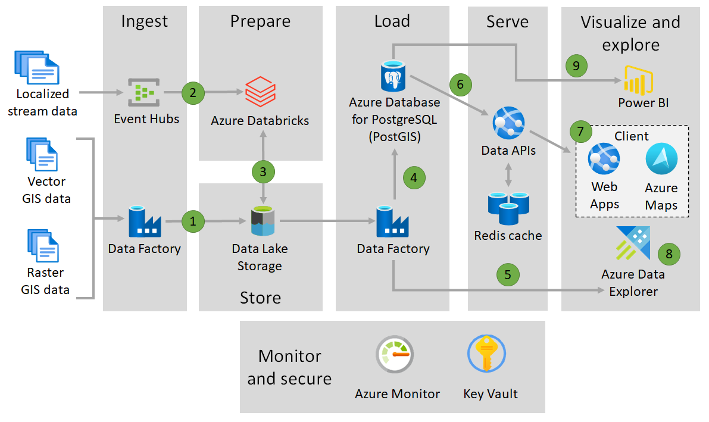

# GIS Data Processing and Serving

The more advanced our capabilities to create digital twins of our world become, the more important it is to localize data assests, combine it with real-world reference data and to be able to perform spatial analytics.

There are many GIS software vendors and standards to store, process and serve geospatial data. However, configuration and maintenance of those systems is complex and integration with other systems requires a lot of expert knowledge.

This architecture to process and serve massive amounts of geospatial data is a derivative from the [Advanced Analytics Reference Architecture](https://docs.microsoft.com/en-us/azure/architecture/solution-ideas/articles/advanced-analytics-on-big-data) and builds on native Azure services: Databricks with GIS Spark libraries is used to preprocess data, Azure PostgreSQL is used to serve data through APIs and Azure Data Explorer is our recommended solution for blazing fast exploratory queries. This architecture uses Azure Maps for visualization of geospatial data in web applications and PowerBI (with [Azure Maps Power BI visual](https://docs.microsoft.com/en-us/azure/azure-maps/power-bi-visual-getting-started)) for custom reports.

Sample use cases include:

- Process, store and serve large amounts of raster data, such as maps or climate data.
- Localize your entities from ERP systems and combine it with GIS reference data.
- Store IoT telemetry from moving devices and perform analytical geospatial queries.
- Embed your curated and contextualized geospatial data in web applications.

# Architecture

1. Geographic information system (GIS) data enters the system:

   - Azure Data Factory ingests raster GIS data and vector GIS data of any format.
   - Azure Data Factory stores the data in Azure Data Lake Storage.

1. IoT data enters the system:
   - Event Hubs ingests streams of IoT data. The data contains coordinates or other information that identifies locations of devices.
   - Event Hubs uses Databricks for initial stream processing.
   - Event Hubs stores the data in Azure Data Lake Storage.

1. Databricks uses geospatial libraries to transform and standardize the data.

1. Data Factory loads the prepared vector and raster data into Azure Database for PostgreSQL. The solution uses the PostGIS extension with this database.

1. Data Factory loads the prepared vector and raster data into Azure Data Explorer.

1. APIs make GIS data available in standardized formats:

   - [GeoJSON][GeoJSON format] is based on JavaScript Object Notation (JSON). GeoJSON represents simple geographical features and their non-spatial properties.
   - [Well-known text (WKT)][Well Known Text Module] is a text markup language that represents vector geometry objects.
   - [Vector tiles][Vector tiles] are packets of geographic data. Their lightweight format improves mapping performance.

   A Redis cache improves performance by providing quick access to data.

1. The Web Apps feature of Azure App Service works with Azure Maps to visualize the data.

1. Azure Data Explorer analyzes the large volumes of data. GIS features of this tool create insightful ad-hoc visualizations. Examples include creating scatterplots from geospatial data.

1. Power BI provides customized reports and business intelligence (BI). The Azure Maps visual for Power BI highlights the role of location data in business results.

Throughout the process:

- Azure Monitor collects information on events and performance.
- The Azure portal tool Log Analytics runs queries on Monitor logs and analyzes the results.
- Key Vault keeps secrets, passwords, and connection strings secure.

## Components

- [Azure Data Factory for data movement and orchestration](https://docs.microsoft.com/en-us/azure/data-factory/introduction).

- [Databricks](https://docs.microsoft.com/en-us/azure/databricks/getting-started/concepts) Azure Databricks is a data analytics platform. Its fully managed Spark clusters process large streams of data from multiple sources. Azure Databricks can transform geospatial data at large scale for use in analytics and data visualization.

- [PostgreSQL with PostGIS extension](https://docs.microsoft.com/en-us/azure/postgresql/concepts-extensions) as main data store to host and serve Geospatial data for downstream applications; also integrates with actual GIS servers.
- [PostGIS][PostGIS] is an extension for the PostgreSQL database. By using the PostGIS extension, you can run location queries in SQL that involve geographic objects.

[About Azure Key Vault]: /azure/key-vault/general/overview
[Azure Data Explorer extends geospatial functionality]: https://azure.microsoft.com/updates/adx-geo-updates/
[Azure Monitor Logs overview]: /azure/azure-monitor/logs/data-platform-logs
[Azure Monitor Metrics overview]: /azure/azure-monitor/essentials/data-platform-metrics
[Azure Monitor overview]: /azure/azure-monitor/overview
[GeoJSON format]: https://tools.ietf.org/html/rfc7946
[Getting started with the Azure Maps Power BI visual]: /azure/azure-maps/power-bi-visual-getting-started
[PostGIS]: https://www.postgis.net/
[Vector tiles]: https://wikipedia.org/wiki/Vector_tiles
[Well Known Text Module]: /bingmaps/v8-web-control/modules/well-known-text-module

- [WebApps](https://docs.microsoft.com/en-us/azure/app-service/) in combination with [Azure Maps to provide GIS data APIs](https://docs.microsoft.com/en-us/azure/azure-maps/create-data-source-web-sdk#geojson-data-source) in a variety or formats and build client web applications.

- [Azure Data Explorer](https://azure.microsoft.com/en-us/updates/adx-geo-updates/) for ad-hoc and blazing fast analysis.

- Power BI and [Azure Maps Power BI visual](https://docs.microsoft.com/en-us/azure/azure-maps/power-bi-visual-getting-started) for BI with geospatial data.

- The [Azure Maps visual for Power BI][Getting started with the Azure Maps Power BI visual] provides a rich set of data visualizations for spatial data on top of a map. The visual offers insights into how location data relates to and influences business data.

- [Azure Key Vault][About Azure Key Vault] stores and controls access to secrets such as tokens, passwords, and API keys. Key Vault also creates and controls encryption keys and manages security certificates.

- [Azure Monitor][Azure Monitor overview] collects data on environments and Azure resources. This information is helpful for maintaining availability and performance. Other Azure services, such as Azure Storage and Azure Event Hubs, can also use this diagnostics data. Two data platforms make up Monitor:

  - [Azure Monitor Logs][Azure Monitor Logs overview] records and stores log and performance data. For Logic Apps, this data includes information on trigger events, run events, and action events.
  - [Azure Monitor Metrics][Azure Monitor Metrics overview] collects numerical values at regular intervals. For Logic Apps, this data includes the run latency, rate, and success percentage.

## Alternatives

An alternative to writing custom APIs for exposing vector tiles is Martin, an open source tile server written in RUST : [GitHub - urbica/node-martin: Mapbox Vector Tiles Server 🐦](https://github.com/urbica/node-martin) Martin can be deployed as container, connects to PostgreSQL tables and exposes web services to consume vector tiles.

The most common way to serve GIS data is to use an actual geoserver and expose web features services: [Web Feature Service - Wikipedia](https://en.wikipedia.org/wiki/Web_Feature_Service) There is a popular open framework: [GeoServer](http://geoserver.org/), which can be deployed as container / VM and serve the data. This is a great alternative if the main purpose of the solution is providing a standardized interface for GIS data and custom web applications and exploratory queries are secondary.

- add to alternatives: can use IoT Hubs instead of Event Hubs

# Considerations

There is a variety of Spark libraries available to process geospatial data on Azure Databricks: [Processing Geospatial Data at Scale With Databricks](https://databricks.com/blog/2019/12/05/processing-geospatial-data-at-scale-with-databricks.html). In our reference implementation, we used Apache Sedona (GeoSpark) and GeoPandas:

  - [GeoPandas 0.8.0 — GeoPandas 0.8.0 documentation](https://geopandas.org/)
  - [Apache Sedona (incubating)](http://sedona.apache.org/)

Azure Data Explorer (ADX) was originally designed for time series and log analytics. The product has been established as a powerful, general-purpose analytics and compute engine. The recent addition of Geospatial Functions ([Azure Data Explorer extends geospatial functionality | Azure updates | Microsoft Azure](https://azure.microsoft.com/en-us/updates/adx-geo-updates/)). The generic functionality of ADX is described here: [Azure Data Explorer Kusto EngineV3 (preview) | Microsoft Docs](https://docs.microsoft.com/en-us/azure/data-explorer/engine-v3)

## Availability considerations

- [Event Hubs spreads failure risk across clusters][Azure Event Hubs - Geo-disaster recovery]. Using a namespace with availability zones turned on spreads that risk across three physically separated facilities. The Geo-Disaster recovery feature of Event Hubs replicates the entire configuration of a namespace from a primary to a secondary namespace.

- [Azure Database for PostgreSQL provides business continuity features][Overview of business continuity with Azure Database for PostgreSQL - Single Server] that cover a range of recovery objectives.

- [App Services diagnostics][Azure App Service diagnostics overview] alerts you to problems in apps, such as downtime. This service helps you troubleshoot and resolve issues like outages.

- [App Service can back up application files][Basic web app availability considerations]. But the backed-up files include app settings in plain text, which may include secrets like connection strings.

## Scalability considerations

The [autoscale feature of Monitor][Overview of autoscale in Microsoft Azure] adds resources to handle increases in load. This feature also removes resources to save money.

Most Azure components also offer built-in scalability:

- Event Hubs automatically scales up to meet usage needs. But take steps to [manage throughput units][Throughput units] and [optimize partitions][Scaling with Event Hubs partitions].

- Data Factory handles large amounts of data. Its [serverless architecture supports parallelism at different levels][Copy performance and scalability achievable using ADF].

- [Data Lake Storage is scalable by design][Introduction to Azure Data Lake Storage Gen2 scalability].

- Azure Database for PostgreSQL offers [high-performance horizontal scaling][Quickstart: create a Hyperscale (Citus) server group in the Azure portal].

- [Azure Databricks clusters resize as needed][Introducing Databricks Optimized Autoscaling on Apache Spark].

- [Azure Data Explorer can elastically scale to terabytes of data in minutes][Azure Data Explorer].

- [App Services web apps scale up and out][Basic web application scalability considerations]

- Original content:

(Maybe say Perform capacity planning)

The advantage of this architecture is that all components (data preparation, data serving) can be scaled independently by assessing the following questions:

- How often do we ingest and prepare data? What is the volume?
- What is the volume of our queries? How many parallel queries do we need to support?

Depending on the answers to those questions, performance explorations or tests indicate the most appropriate scale for Azure Databricks, the PostgreSQL database, the Azure Data Explorer cluster and the App Service plans. The reference architecture assumes:

- Processing and preparation of up to 10M datasets (batch or streaming events) every day.
- Storing 100M datasets in the PostgreSQL database.
- Querying no more than 1M datasets at the same time by a maximum of 30 users.

Performant operations have been tested with:

- A Databricks cluster with 4 F8s v2 worker nodes
- A memory-optimized PostgreSQL database
- Azure App Service with 2 Standard S2 instances

## Security considerations

- Something about using Key Vault with:

  - App Services (see notes)
  - Data Factory (to access database and lake) (see notes)
  - Event Hubs (see notes)

- See Basic web app for one or two links on App Service security.

- A special attention is necessary for protecting data that are exposed as vector tiles. The vector tiles embed coordinates and attributes for multiple entities in one file. If vector tiles are pre-generated and if there are per-user restrictions on data, then there must be a dedicated set of vector tiles for each permission in the access control concept.

## Performance considerations

Vector tiles are a very performant way to visualize GIS data on maps: [Mapbox Vector Tile specification](https://github.com/mapbox/vector-tile-spec). This solution dynamically queries vector tiles using the built-in support for vector tiles generation of PostGIS. This works very well for simpler queries and result sets of less than 1M records. For more computationally expensive queries, if data does not change frequently or for really large datasets that must be visualized, vector tiles can be pre-generated using Tippecanoe: [GitHub - mapbox/tippecanoe](https://github.com/mapbox/tippecanoe) Tippecanoe can be run as an Azure Function or a Container as part of your data processing flow and the resulting tiles can be exposed as APIs.

# Pricing

The pricing for a deployment with a sizing mentioned in the considerations section can be found here: [Pricing: Azure Architecture for GIS data processing and serving](https://azure.com/e/dcb9fc8b3dba4785aa93eb1e9871528f). Note that Azure Pricing Calculator does currently not support Azure Data Explorer and those costs come on top of the price listed in the calculator. The price indication is for 1 deployment or environment only.

# Next Steps

- Query PostGIS for vector tiles (built-in): [ST\_AsMVT (postgis.net)](https://postgis.net/docs/ST_AsMVT.html)
- Load PostGIS with raster (built-in): [Chapter 4. PostGIS Usage](https://postgis.net/docs/postgis_usage.html#RT_Loading_Rasters)
- Leverage Azure Data Explorer geospatial functions: [geo\_distance\_2points() - Azure Data Explorer | Microsoft Docs](https://docs.microsoft.com/en-us/azure/data-explorer/kusto/query/geo-distance-2points-function)
- Add vector tiles to Azure Maps: [Create a data source for a map in Microsoft Azure Maps | Microsoft Docs](https://docs.microsoft.com/en-us/azure/azure-maps/create-data-source-web-sdk#vector-tile-source)
- Learn options to process geospatial data on Databricks: [Processing Geospatial Data at Scale With Databricks](https://databricks.com/blog/2019/12/05/processing-geospatial-data-at-scale-with-databricks.html)

# Related Resources

- Connect a Web Map Service to Azure Maps: [Connect to a Web Feature Service (WFS) service | Microsoft Docs](https://docs.microsoft.com/en-us/azure/azure-maps/spatial-io-connect-wfs-service)
- Process open street maps data with Spark: [Frameworks - OpenStreetMap Wiki](https://wiki.openstreetmap.org/wiki/Frameworks)
- Inspirations for visualizing data with Azure maps: [Azure Maps Web SDK Samples (azuremapscodesamples.azurewebsites.net)](https://azuremapscodesamples.azurewebsites.net/)

[Azure App Service diagnostics overview]: /azure/app-service/overview-diagnostics
[Azure Data Explorer]: https://azure.microsoft.com/services/data-explorer/
[Azure Event Hubs - Geo-disaster recovery]: /azure/event-hubs/event-hubs-geo-dr
[Basic web app availability considerations]: /azure/architecture/reference-architectures/app-service-web-app/basic-web-app#availability-considerations
[Basic web app scalability considerations]: /azure/architecture/reference-architectures/app-service-web-app/basic-web-app?tabs=cli#scalability-considerations
[Copy performance and scalability achievable using ADF]: /azure/data-factory/copy-activity-performance#copy-performance-and-scalability-achievable-using-adf
[Introducing Databricks Optimized Autoscaling on Apache Spark]: https://databricks.com/blog/2018/05/02/introducing-databricks-optimized-auto-scaling.html
[Introduction to Azure Data Lake Storage Gen2 scalability]: /azure/storage/blobs/data-lake-storage-introduction#scalability
[Overview of autoscale in Microsoft Azure]: /azure/azure-monitor/autoscale/autoscale-overview
[Overview of business continuity with Azure Database for PostgreSQL - Single Server]: /azure/postgresql/concepts-business-continuity
[Quickstart: create a Hyperscale (Citus) server group in the Azure portal]: /azure/postgresql/quickstart-create-hyperscale-portal
[Scaling with Event Hubs partitions]: /azure/event-hubs/event-hubs-scalability#partitions
[Throughput units]: /azure/event-hubs/event-hubs-scalability#throughput-units