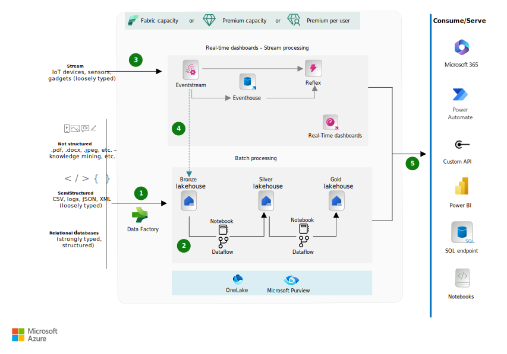

This example workload illustrates a greenfield solution for creating a scalable data platform by using Microsoft Fabric and the lakehouse design paradigm. Fabric is a platform that integrates data storage, processing, and analytics. A greenfield lakehouse provides a clean start for designing an efficient, future-proof data ecosystem.

## Architecture

*Download a [Visio file](https://arch-center.azureedge.net/greenfield-lakehouse-fabric.vsdx) of this architecture.*

### Dataflow

This design reflects the Lambda architecture, which separates data processing into two layers:

- A high-volume batch processing layer that's processed periodically for historical analysis
- A low-latency, high-throughput stream processing layer for real-time analytics

The stream processing path ingests and processes data in near real-time, which makes it ideal for dashboards and anomaly detection. The batch processing path handles the complete dataset, ensuring data consistency and enabling complex historical analysis. This two-pronged approach offers real-time insights while maintaining a reliable record for later exploration.

#### Cold path: Batch analytics

Data warehouses, which rely on relational SQL semantics, are the conventional approach for historical data analysis. However, this pattern has evolved over time, and lakehouses are the current industry standard for batch data analysis. A lakehouse is built on top of open source file formats and, unlike traditional data warehouses, caters to all types of data: structured, semi-structured, and unstructured. The compute layer in a lakehouse is typically built on top of the Apache Spark framework, which is the preferred engine for processing big data because of its distributed computing capability and high performance. Fabric offers a native lakehouse experience that's based on the open source Delta Lake file format and a managed Spark runtime.

A lakehouse implementation typically uses the [medallion architecture](/azure/databricks/lakehouse/medallion). In this architecture, the bronze layer contains the raw data, the silver layer contains the validated and deduplicated data, and the gold layer contains highly refined data that's suitable for supporting business-facing use cases. This approach works across all organizations and industries. Although this is the general approach, you can customize it for your requirements. This architecture shows how to create a lakehouse by using native Fabric components.

##### Data ingestion via Data Factory

(See step 1 in the diagram.)

The [Azure Data Factory](/fabric/data-factory/data-factory-overview) feature in Fabric provides the capabilities of the Azure Data Factory service, which is a widely used data integration service. Although the Data Factory service mainly provides orchestration capabilities via pipelines, the feature in Fabric provides both pipelines and dataflows.

- Data pipelines enable you to apply out-of-the-box rich data orchestration capabilities to compose flexible data workflows that meet your enterprise needs.
- Dataflows enable you to use more than 300 transformations in the dataflows designer. You can use these transformations to transform data by using a graphical interface that's similar to the one in Power Query. These transformations include smart AI-based data transformations. Dataflows can also write data to native data stores in Fabric, such as lakehouse, warehouse, Azure SQL, and Kusto databases.

Depending on your requirements, you can use either or both of these capabilities to create a rich metadata-driven ingestion framework. You can onboard data from various source systems on a defined schedule or by using event triggers.

##### Data transformations

(See step 2 in the diagram.)

There are two approaches to data preparation and transformation. If you prefer a code-first experience, you can use Spark notebooks. If you prefer a low-code or no-code experience, you can use dataflows.

[Fabric notebooks](/fabric/data-engineering/how-to-use-notebook) are an important tool for developing Apache Spark jobs. They provide a web-based interactive surface that data engineers use to write code. They also provide rich visualizations and enable the use of Markdown text. Data engineers write code for data ingestion, data preparation, and data transformation. Data scientists use notebooks to create machine learning solutions. For example, they use them to create experiments and models and to track and deploy models.

Every workspace in Fabric comes with a Spark [starter pool](/fabric/data-engineering/configure-starter-pools), which is used for default Spark jobs. With starter pools, you can expect rapid Apache Spark session initialization, typically within 5 to 10 seconds, without any manual setup. You also get the flexibility to customize Apache Spark pools according to your data engineering requirements. You can size the nodes, autoscale, and dynamically allocate executors based on your Spark job requirements. For Spark runtime customizations, you can use [environments](/fabric/data-engineering/create-and-use-environment). In an environment, you can configure compute properties, select different runtimes, and set up library package dependencies based on your workload requirements.

[Dataflows](/fabric/data-factory/create-first-dataflow-gen2) allow you to extract data from various sources, transform it by using a wide range of operations, and optionally load it into a destination. Traditionally, data engineers spend significant time extracting, transforming, and loading data into a consumable format for downstream analytics. Dataflow Gen2 provides a reusable way to perform extract, transform, load (ETL) tasks by using visual cues in Power Query Online. The dataflow preserves all transformation steps. To perform other tasks or load data to a different destination after transformation, create a Data Pipeline and add the Dataflow Gen2 activity to your pipeline orchestration.

#### Hot path: Real-time analytics

Real-time data processing helps businesses make timely decisions and act on recent insights to improve operations and customer experiences. In Fabric, this capability is provided by the Real-Time Intelligence service. It comprises several Fabric features that are bundled together and accessible via [Real-Time hub](/fabric/real-time-hub/real-time-hub-overview). Real-Time hub provides a single place for streaming data-in-motion across your organization.

Real-Time Intelligence in Fabric enables analysis and data visualization for event-driven scenarios, streaming data, and data logs. It connects time-based data from various sources by using a catalog of no-code connectors and provides an end-to-end solution for data ingestion, transformation, storage, analytics, visualization, tracking, AI, and real-time actions. Although the service name uses the phrase "Real-Time," your data doesn't need to stream at high rates and volumes. Real-Time Intelligence provides event-driven, rather than schedule-driven, solutions.

##### Real-time ingestion

(See step 3 in the diagram.)

[Event streams](/fabric/real-time-intelligence/event-streams/overview?tabs=enhancedcapabilities) is a Fabric feature that enables a no-code method for ingesting real-time events from various sources and sending them to different destinations. It allows data filtering, transformation, aggregation, and routing based on content. You can also use it to create new streams from existing ones and share them across the organization by using Real-Time hub. Eventstreams support multiple data sources and data destinations. You can use a wide range of connectors to external sources like Apache Kafka clusters, database Change Data Capture feeds, AWS streaming sources (Kinesis), and Google (GCP Pub/Sub).

You create an eventstream, add event data sources to the stream, optionally add transformations to transform the event data, and then route the data to supported [destinations](/fabric/real-time-intelligence/event-streams/overview?tabs=enhancedcapabilities#route-events-to-destinations). Fabric lakehouse is one of the supported destinations, so you can transform your real-time events before ingesting them into your lakehouse. Real-time events are converted into Delta Lake format and then stored in the designated lakehouse tables. This pattern enables data warehousing scenarios and historical analysis of your fast-moving data.

##### Real-time analytics

(See step 4 in the diagram.)

When you use Real-Time Intelligence in Fabric, depending on your use cases, there are two typical pathways for streaming data: [Reflex](/fabric/data-activator/data-activator-get-started#create-a-reflex-item) items and [eventhouses](/fabric/real-time-intelligence/eventhouse).

A reflex is a Fabric item that allows you to react to the occurrence of a data condition as it happens. That reaction can be a simple alert message via email or Microsoft Teams, or it can involve invoking a custom action by triggering a Power Automate flow. You can also trigger any Fabric item from your reflexes. Many observability use cases are supported by reflexes, one of which is reacting to streaming data as it arrives in eventstreams.

An eventhouse is a collection of one or more Kusto Query Language (KQL) databases. KQL databases are engineered for time-based, streaming events of structured, semi-structured, and unstructured data. Data is automatically indexed and partitioned based on ingestion time, which provides fast and complex analytic querying capabilities, even as the data streams in. Data stored in eventhouses can be made available in OneLake for use by other Fabric processes. You can query this data by using various code, low-code, or no-code options in Fabric, including native [KQL](/fabric/real-time-intelligence/kusto-query-set?tabs=kql-database) and T-SQL in the KQL queryset.

[Real-Time Dashboards](/fabric/real-time-intelligence/dashboard-real-time-create) are designed to provide immediate insights from data streaming into your eventhouses. You can add various types of visuals to a dashboard, such as charts and graphs, and customize them to fit your needs. Real-Time Dashboards are intended to help identify trends and anomalies in high-velocity data that arrives in an eventhouse. They're different from Power BI dashboards, which are suitable for enterprise BI reporting workloads.

##### Data serving

(See step 5 in the diagram.)

There are various low-code or pro-code options available for consuming data from Fabric lakehouses and eventhouses.

###### SQL analytics endpoint

A [SQL analytics endpoint](/fabric/data-engineering/lakehouse-overview#lakehouse-sql-analytics-endpoint) is automatically generated for every lakehouse in Fabric. A SQL analytics endpoint is read-only. To modify data, you need to switch to lakehouse mode and use Spark. You can use the SQL analytics endpoint directly in the Fabric portal to query data by switching from the lakehouse mode to the SQL mode of the lakehouse. Alternatively, you can use the SQL connection string of a lakehouse to connect by using client tools like Power BI, Excel, and SQL Server Management Studio. This option is suitable for data and business analysts on a data team.

###### Spark notebooks

Notebooks are a popular way to interact with lakehouse data. Fabric provides a web-based interactive surface that data workers can use to write code. These workers can apply rich visualizations and Markdown text. Data engineers write code for data ingestion, data preparation, and data transformation. Data scientists use notebooks for data exploration, for creating machine learning experiments and models, and for tracking and deploying models. This option is suitable for professional data engineers and data scientists.

###### Power BI

Every lakehouse in Fabric comes with a prebuilt default semantic model. It's automatically created when you set up a lakehouse and load data into it. These models inherit business logic from the lakehouse to simplify creating Power BI reports and dashboards from directly within the lakehouse experience. You can also create custom semantic models, based on specific business requirements, on lakehouse tables. When you create Power BI reports on a lakehouse, you can use [Direct Lake mode](/fabric/get-started/direct-lake-overview), which doesn't require you to import data separately. This mode allows you to get in-memory performance on your reports without moving your data out of the lakehouse.

###### Custom APIs

Fabric provides a rich API surface across its items. OneLake provides open access to all Fabric items through Azure Data Lake Storage APIs and SDKs. You can access your data in OneLake through any API, SDK, or tool that's compatible with Data Lake Storage by just using a OneLake URI instead. You can upload data to a lakehouse by using Azure Storage Explorer or read a delta table via a shortcut from Azure Databricks. OneLake also supports the [Azure Blob Filesystem (ABFS) driver](/azure/storage/blobs/data-lake-storage-abfs-driver) for more compatibility with Data Lake Storage and Azure Blob Storage. To consume streaming data in downstream apps, you can push eventstream data to a custom API endpoint. You can then consume this streaming output from Fabric by using Azure Event Hubs or the AMQP or Kafka protocol.

###### Power Automate

Power Automate is a low-code application platform that you can use to automate repetitive tasks and also manipulate your data. The reflex item in Fabric supports Power Automate flows as a destination. This [integration](/fabric/data-activator/data-activator-trigger-power-automate-flows) unlocks many use cases and allows you to trigger downstream actions by using a wide range of connectors, for both Microsoft and non-Microsoft systems.

### Components

This solution uses the following components:

- [Fabric](/fabric/get-started/microsoft-fabric-overview) is a cloud-based data analytics platform that unifies data ingestion, transformation, analysis, and visualization for enterprises. In this architecture, Fabric serves as the foundation for building and managing the lakehouse, which enables integration across all data tasks.

  - [OneLake](/fabric/onelake/onelake-overview) is the central data hub in Fabric, designed as an open data lake. It stores structured and unstructured data in its native format and serves as the unified storage layer for all components in the lakehouse architecture.

  - [Azure Data Factory](/fabric/data-factory/data-factory-overview) is a cloud-based ETL and orchestration service. In this architecture, it automates data movement and transformation across diverse sources, which supports both scheduled and event-driven ingestion.

  - [Data engineering](/fabric/data-engineering/data-engineering-overview) is a workload in Microsoft Fabric that provides tools to collect, store, process, and analyze large datasets. It powers the transformation and preparation of data within the lakehouse by using Spark notebooks and pipelines.
  
  - [Data Science](/fabric/data-science/data-science-overview) is a workload in Fabric that provides tools to build machine learning models and generate insights. It supports experimentation, model tracking, and deployment within the lakehouse environment.

  - [Real-Time Intelligence](/fabric/real-time-intelligence/overview) is a service that provides stream ingestion and processing capabilities. In this architecture, it enables real-time analytics by capturing and analyzing data-in-motion through eventstreams and reflexes.

  - [Copilot](/fabric/get-started/copilot-fabric-overview) is a natural language interface that generates insights and visualizations. In this architecture, it helps users interact with data in Fabric and Power BI.

- [Power BI](/power-bi/fundamentals/power-bi-overview) is a business intelligence tool for creating dashboards and reports. In this architecture, it visualizes lakehouse data by using semantic models and Direct Lake mode for fast, in-memory performance.

### Alternatives

Fabric offers a comprehensive set of tools, but, depending on your specific needs, you might benefit from functionality provided by alternative services in the Azure ecosystem.

- [Azure Databricks](/azure/databricks/introduction/) can replace or complement the native Fabric data engineering capabilities. Azure Databricks offers an alternative for large-scale data processing by providing a cloud-based Apache Spark environment. Azure Databricks also provides common governance across your entire data estate and capabilities to enable key use cases like data science, data engineering, machine learning, AI, and SQL-based analytics.

- [Azure Machine Learning](/azure/machine-learning/overview-what-is-azure-machine-learning) can replace or complement the native Fabric Data Science tools. Machine Learning goes beyond the model experimentation and management capabilities in Fabric by adding capabilities for enabling you to host models for online inference use cases, monitor models for drift, and create custom Generative AI applications.

## Scenario details

This architecture is applicable to the following scenarios:

- Organizations that are starting fresh without legacy system constraints.
- Organizations that anticipate data volumes between 0.5 TB and 1.5 TB.
- Organizations that prefer a simple and streamlined pattern that balances cost, complexity, and performance considerations.
- Organizations that need a simple, cost-effective, and high-performance data platform that addresses reporting, analytics, and machine learning requirements.
- Organizations that want to integrate data from multiple sources for a unified view.

This solution isn't recommended for:

- Teams with a SQL or relational database background that have limited skills in Apache Spark.
- Organizations that are migrating from a legacy system or data warehouse to a modern platform.

## Considerations

These considerations implement the pillars of the Azure Well-Architected Framework, which is a set of guiding tenets that can be used to improve the quality of a workload. For more information, see [Microsoft Azure Well-Architected Framework](/azure/well-architected/).

### Reliability

Reliability ensures your application can meet the commitments you make to your customers. For more information, see [Design review checklist for Reliability](/azure/well-architected/reliability/checklist).

Fabric automatically replicates resources across availability zones without requiring any configuration. For example, during a zone-wide outage, no action is required to recover a zone. In [Supported regions](/azure/reliability/reliability-fabric#supported-regions), Fabric can self-heal and rebalance automatically to take advantage of a healthy zone.

### Security

Security provides assurances against deliberate attacks and the abuse of your valuable data and systems. For more information, see [Design review checklist for Security](/azure/well-architected/security/checklist).

You can use Fabric to manage, control, and audit your security settings according to your changing needs and demands. Key security recommendations for using Fabric include:

- Authentication. Configure single sign-on (SSO) in Microsoft Entra ID to provide access from various devices and locations.

- Role-based access control (RBAC). Implement workspace-based access control to manage who can access and interact with specific datasets.

- Network security. Use the Fabric inbound and outbound network security controls when you connect to data or services within or outside your network. Key features include [Conditional Access](/fabric/security/security-conditional-access), [private links](/fabric/security/security-private-links-overview), [trusted workspace access](/fabric/security/security-trusted-workspace-access), and [managed private endpoints](/fabric/security/security-managed-private-endpoints-overview).

- Audit logs. Use the detailed audit logs provided by Fabric to track user activities and ensure accountability across the platform.

For more information, see [Security in Microsoft Fabric](/fabric/security/security-overview).

### Cost Optimization

Cost Optimization is about looking at ways to reduce unnecessary expenses and improve operational efficiencies. For more information, see [Design review checklist for Cost Optimization](/azure/well-architected/cost-optimization/checklist).

Fabric offers [capacity reservations](/azure/cost-management-billing/reservations/fabric-capacity) for a given number of capacity units (CUs). Capacity reservations can help you save costs when you commit to a reservation for your Fabric capacity usage for one year.

To maximize the utilization of your Fabric capacity, consider the following recommendations:

- Rightsize F SKUs. To determine the right capacity size, you can provision [trial capacities](/fabric/get-started/fabric-trial) or [pay-as-you-go F SKUs](/fabric/enterprise/buy-subscription#azure-skus) to measure the actual capacity size that you need before you buy an F SKU reserved instance. We recommend that you perform a scoped proof of concept with a representative workload, monitor CU usage, and then extrapolate to arrive at an estimate of CU usage for production. Fabric supports scaling. You can start with a conservative capacity size and scale up if you need more capacity.
- Monitor usage patterns. Regularly track and analyze your usage to identify peak and off-peak hours. Doing so can help you understand when your resources are most utilized so that you can schedule non-critical tasks during off-peak times to avoid spikes in CU usage.
- Optimize queries and workloads. Ensure that your queries and workloads are optimized to reduce unnecessary compute usage. Optimize DAX queries, Python code, and other operations.
- Use bursting and smoothing. Use the bursting and smoothing features of Fabric to handle CPU-intensive activities without requiring a higher SKU. Doing so can help you manage costs while still maintaining performance. For more information, see [Evaluate and optimize your Fabric capacity](/fabric/enterprise/optimize-capacity).
- Set up alerts and notifications. Configure proactive alerts so that capacity admins can monitor and manage high compute usage. Doing so can enable them to take timely actions to prevent cost overruns.
- Implement workload management. Schedule log-running jobs at staggered times based on resource availability and system demand to optimize capacity usage. For more information, see [Workload management](/fabric/data-warehouse/workload-management).

Keep these considerations in mind as well:

- [Data Lake Storage](https://azure.microsoft.com/pricing/details/storage/data-lake/) pricing depends on the amount of data you store and how often you use the data. The sample pricing includes 1 TB of data stored and other transactional assumptions. The 1 TB refers to the size of the data lake, not the original legacy database size.
- [Fabric](https://azure.microsoft.com/pricing/details/microsoft-fabric/) pricing is based on the Fabric F SKU capacity price or Premium Per User price. Serverless capacities consume CPU and memory from purchased dedicated capacity.
- [Event Hubs](https://azure.microsoft.com/pricing/details/event-hubs/) bills based on tier, provisioned throughput units, and received ingress traffic. The example assumes one throughput unit in Standard tier over one million events for a month.

### Operational Excellence

Operational Excellence covers the operations processes that deploy an application and keep it running in production. For more information, see [Design review checklist for Operational Excellence](/azure/well-architected/operational-excellence/checklist).

Fabric provides many components to help you manage your data platform. Each of these components supports unique operations that you can view in the [Microsoft Fabric Capacity Metrics app](/fabric/enterprise/metrics-app). Use the Fabric Capacity Metrics app to monitor your capacity consumption and make informed decisions on how to use your capacity resources.

### Performance Efficiency

Performance Efficiency is the ability of your workload to meet the demands placed on it by users in an efficient manner. For more information, see [Design review checklist for Performance Efficiency](/azure/well-architected/performance-efficiency/checklist).

Fabric provides several features to optimize performance across its components. These tools and practices can help you manage compute resources effectively, prevent overloading, and make informed decisions about scaling and optimizing workloads.

Some key performance efficiency capabilities in Fabric include:

- [Bursting and smoothing](https://blog.fabric.microsoft.com/blog/fabric-capacities-everything-you-need-to-know-about-whats-new-and-whats-coming?ft=All#BurstSmooth), to ensure that CPU-intensive activities are completed quickly without requiring a higher SKU. Schedule these activities at any time of the day.

- [Throttling](/fabric/enterprise/throttling), to delay or reject operations when capacity experiences sustained CPU demand that's above the SKU limit.

- The [Fabric Capacity Metrics app](/fabric/enterprise/metrics-app), to visualize capacity usage, optimize the performance of artifacts, and optimize high-compute items. The app differentiates between interactive operations (like DAX queries) and background operations (like semantic model refreshes) for targeted optimizations.

## Contributors

*This article is maintained by Microsoft. It was originally written by the following contributors.*

Principal authors:

- [Amit Chandra](https://www.linkedin.com/in/amitchandra2005/) | Cloud Solution Architect
- [Nicholas Moore](https://www.linkedin.com/in/nicholas-moore/) | Cloud Solution Architect

*To see non-public LinkedIn profiles, sign in to LinkedIn.*

## Next steps

- [What is OneLake?](/fabric/onelake/onelake-overview)
- [What is Data Factory?](/fabric/data-factory/data-factory-overview)
- [What is data engineering?](/fabric/data-engineering/data-engineering-overview)
- [What is Data science?](/fabric/data-science/data-science-overview)
- [What is Real-Time Intelligence?](/fabric/real-time-intelligence/overview)
- [What is Power BI?](/power-bi/fundamentals/power-bi-overview)
- [Introduction to Copilot in Fabric](/fabric/get-started/copilot-fabric-overview)

## Related resources

- [Data lakes](../../data-guide/scenarios/data-lake.md)
- [Data warehousing and analytics](data-warehouse.yml)
- [Enterprise business intelligence](../../example-scenario/analytics/enterprise-bi-synapse.yml)
