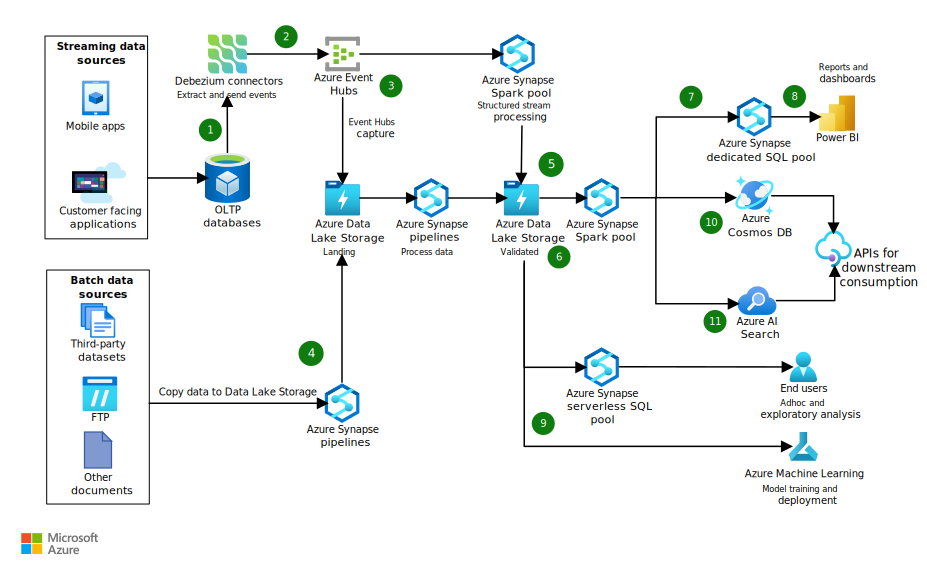

Data-driven enterprises need to keep their back end and analytics systems in near real-time sync with customer-facing applications. The impact of transactions, updates, and changes must reflect accurately through end-to-end processes, related applications, and online transaction processing (OLTP) systems. The tolerable latency for changes in OLTP applications to reflect in the downstream systems that use the data might be just a few minutes.

This article describes an end-to-end solution for near real-time data processing to keep lakehouse data in sync. The solution uses Azure Event Hubs, Azure Synapse Analytics, and Azure Data Lake Storage for data processing and analytics.

*Apache® and [Apache Spark](https://spark.apache.org) are either registered trademarks or trademarks of the Apache Software Foundation in the United States and/or other countries. No endorsement by The Apache Software Foundation is implied by the use of these marks.*

## Architecture

*Download a [Visio file](https://arch-center.azureedge.netazure-near-realtime-data-processing.vsdx) of this architecture.*

### Dataflow

1. Change data capture is a prerequisite for source systems to listen to changes. [Debezium connectors](https://debezium.io/documentation/reference/stable/connectors/index.html) can connect to different source systems and tap into changes as they happen. The connectors can capture changes and produce events from various relational database management systems (RDBMS). Installing a Debezium connector requires a Kafka connect system.

1. The connectors extract change data and send the captured events to Azure Event Hubs. Event Hubs can receive large amounts of data from multiple sources.

1. Event Hubs directly streams the data to Azure Synapse Analytics Spark pools, or can send the data to an Azure Data Lake Storage landing zone in raw format.

1. Other batch data sources can use Azure Synapse pipelines to copy data to Data Lake Storage and make it available for processing. An end-to-end extract, transform, and load (ETL) workflow might need to chain different steps or add dependencies between steps. Azure Synapse pipelines can orchestrate workflow dependencies within the overall processing framework.

1. Azure Synapse Spark pools use fully supported Apache Spark structured streaming APIs to process data in the Spark streaming framework. The data processing step incorporates data quality checks and high-level business rule validations.

1. Data Lake Storage stores the validated data in the open [Delta Lake](https://docs.delta.io/latest/delta-intro.html) format. Delta Lake provides atomicity, consistency, isolation, and durability (ACID) semantics and transactions, scalable metadata handling, and unified streaming and batch data processing for existing data lakes.

   Using indexes for query acceleration augments Delta with further performance enhancements. Data from the Data Lake Storage validated zone can also be a source for further advanced analytics and machine learning.

1. Data from the Data Lake Storage validated zone, transformed and enriched with more rules into its final processed state, loads to a dedicated SQL pool for running large scale analytical queries.

1. Power BI uses the data exposed through the dedicated SQL pool to build enterprise-grade dashboards and reports.

1. You can also use captured raw data in the Data Lake Store landing zone and validated data in the Delta format for:

   - Further ad-hoc and exploratory analysis through Azure Synapse SQL serverless pools.
   - Machine learning through Azure Machine Learning.

1. For some low-latency interfaces, data must be denormalized for single-digit server latencies. This usage scenario is mainly for API responses. This scenario queries documents in a NoSQL datastore such as Azure Cosmos DB for single-digit millisecond responses.

1. The Azure Cosmos DB partitioning strategy might not lend itself to all query patterns. If that's the case, you can augment the solution by indexing the data that the APIs need to access with Azure Cognitive Search. Azure Cosmos DB and Cognitive Search can fulfill most scenarios that require low latency query responses.

### Components

This solution uses the following Azure components:

- [Event Hubs](https://azure.microsoft.com/services/event-hubs) is a managed, distributed ingestion service that can scale to ingest large amounts of data. With the Event Hubs subscriber-publisher mechanism, different applications can send messages to topics in Event Hubs, and downstream consumers can connect to and process messages. The Event Hubs Capture feature can write messages to Data Lake Storage in AVRO format as they arrive. This ability enables easy micro-batch processing and long-term retention scenarios. Event Hubs also offers a Kafka-compatible API and supports schema registry.

- [Data Lake Storage](https://azure.microsoft.com/services/storage/data-lake-storage) forms the storage subsystem that stores all data in raw and validated formats. Data Lake Storage can handle transactions at scale, and supports different file formats and sizes. Hierarchical namespaces help organize data into a familiar folder structure and support Portable Operating System Interface for UniX (POSIX) permissions. The Azure Blob Filesystem (ABFS) driver offers a Hadoop-compatible API.

- [Azure Synapse Analytics](https://azure.microsoft.com/services/synapse-analytics) is a limitless analytics service that brings together data integration, enterprise data warehousing, and big data analytics. This solution uses the following features of the Azure Synapse Analytics ecosystem:

  - [Azure Synapse Spark pools](/azure/synapse-analytics/spark/apache-spark-overview) offer an on-demand Spark runtime that adds built-in performance enhancements to open-source Spark. Customers can configure flexible autoscale settings, submit jobs remotely through the Apache Livy endpoint, and use the Synapse Studio notebook interface for interactive experiences.

  - [Azure Synapse SQL serverless pools](/azure/synapse-analytics/sql/on-demand-workspace-overview) provide an interface to query lakehouse data by using a familiar T-SQL syntax. There's no infrastructure to set up, and Azure Synapse workspace deployment automatically creates the endpoint. Azure Synapse SQL serverless pools enable basic discovery and exploration of data in place, and are a good option for user ad-hoc query analysis.

  - [Azure Synapse dedicated SQL pools](/azure/synapse-analytics/sql-data-warehouse/sql-data-warehouse-overview-what-is) store data in relational tables with columnar storage. Dedicated SQL pools use a scale-out architecture to distribute data processing across multiple nodes. PolyBase queries bring the data into SQL pool tables. The tables can connect to Power BI for analysis and reporting.

- [Power BI](https://powerbi.microsoft.com) provides a visual interface to create and access reports and dashboards. Power BI Desktop can connect to various data sources, combine the sources into a data model, and build reports or dashboards. With Power BI, you can transform data based on business requirements, and share visuals and reports with others through the Power BI service.

- [Azure Cosmos DB](https://azure.microsoft.com/services/cosmos-db) is a managed, multi-modal NoSQL database that supports open APIs such as MongoDB and Cassandra. This solution uses Azure Cosmos DB for applications that require single-digit millisecond response times and high availability. Azure Cosmos DB offers multi-region writes across all Azure regions. You can use [Azure Synapse Link for Azure Cosmos DB](/azure/cosmos-db/synapse-link) to derive insights and run analytics over data in real time.

- [Azure Cognitive Search](https://azure.microsoft.com/services/search) is a cloud search service that can index the data your applications and APIs need. Cognitive Search has optional AI enrichment features that help with text extraction and infer text from non-text files. Cognitive Search integrates with services like Azure Data Lake Storage and Azure Cosmos DB to easily access and index data. You can query the indexed data by using a REST API or the .NET SDK. To get data from two separate indexes, you can combine them into a single index or use [complex data types](/azure/search/search-howto-complex-data-types).

## Scenario details

The end-to-end workflow to process changes in near real-time requires:

- A change data capture (CDC) technology. The OLTP applications might have different back-end data stores, such as SQL Server, MySQL, and Oracle. The first step is to listen to changes as they happen, and propagate them forward.
- An ingestion buffer to publish the change events at scale. This service should have the ability to handle large amounts of data as messages arrive. Individual subscribers can connect to this system and process the data.
- Distributed and scalable storage for data as-is in a raw format.
- A distributed, efficient stream processing system that lets users restart and manage state.
- An analytics system that runs at scale to power business decisions.
- A self-serve analytics interface.
- For low-latency API responses, a NoSQL database to store denormalized representation of the data.
- For some cases, a system to index data, refresh the index at regular intervals, and make the latest data available for downstream consumption.

All the preceding technologies should use relevant security constructs for perimeter security, authentication, authorization, and data encryption.

### Potential use cases

This solution is well-suited for:

- Industries that need to propagate changes from OLTP to online analytics processing (OLAP).
- Applications that require data transformation or enrichment.

The real-time data processing scenario is especially important for financial services industries. For example, if an insurance, credit card, or bank customer makes a payment and then immediately contacts customer service, the customer support agent needs to have the latest information.

Similar scenarios apply to retail, commerce, and healthcare sectors. Enabling these scenarios streamlines operations, leading to greater organizational productivity and increased customer satisfaction.

## Considerations

These considerations implement the pillars of the Azure Well-Architected Framework, which is a set of guiding tenets that can be used to improve the quality of a workload. For more information, see [Microsoft Azure Well-Architected Framework](/azure/architecture/framework).

### Reliability

Reliability ensures your application can meet the commitments you make to your customers. For more information, see [Overview of the reliability pillar](/azure/architecture/framework/resiliency/overview).

- Event Hubs offers 90-day data retention on the premium and dedicated tiers. For failover scenarios, you can set up a secondary namespace in the paired region and activate it during failover.

- Azure Synapse Spark pool jobs are recycled every seven days as nodes are taken down for maintenance. Consider this activity as you work through the service level agreements (SLAs) tied to the system. This limitation isn't an issue for many scenarios where recovery time objective (RTO) is around 15 minutes.

### Cost optimization

Cost optimization is about looking at ways to reduce unnecessary expenses and improve operational efficiencies. For more information, see [Overview of the cost optimization pillar](/azure/architecture/framework/cost/overview).

- You can select from different Event Hubs tiers based on workload characteristics. Event Hubs bills Capture storage separately, based on the amount of data being stored on Data Lake Storage.

- Consider object lifecycle management through tiers on Azure Data Lake Storage. As data ages, you can move data from a hot tier, where you need to access recent data for analytics, to a cold storage tier that is priced much lower. The cold storage tier is a cost-effective option for long-term retention.

- You can pause the dedicated SQL pool when you're not using it in your development or test environments. You can schedule a script to pause the pool as needed, or you can pause the pool manually through the portal.

- Azure Cosmos DB offers different provisioning models, such as serverless, manual provisioned throughput, and autoscale. Consider using serverless provisioning for your development and test workloads. You can also use autoscale, where you can set maximum request units per second (RU/s) on the container. The throughput on the container scales automatically between 10% of maximum RU/s as a lower threshold and the maximum configured RU/s.

### Performance efficiency

Performance efficiency is the ability of your workload to scale to meet the demands placed on it by users in an efficient manner. For more information, see [Performance efficiency pillar overview](/azure/architecture/framework/scalability/overview).

- You can scale Event Hubs through partitioning. Consider partitioning your data to preserve the order of events through a commit log. Partitioning lets you create multiple parallel logs by maximizing the available throughput capacity.

- You can set up Azure Synapse Spark pools with small, medium, or large virtual machine (VM) SKUs, based on the workload. You can also configure autoscale on Azure Synapse Spark pools to account for spiky workloads. If you need more compute resources, the clusters automatically scale up to meet the demand, and scale down after processing is complete.

- Use best practices for designing tables in the dedicated SQL pool. Associated performance and scalability limits apply, based on the tier that the SQL pool is running on.

- Azure Cosmos DB uses partitions to scale containers, based on a partition key. All data based on a partition key forms a logical partition. Make sure to choose the correct partitioning strategy based on workload requirements. You can also use indexes for faster data retrieval.

## Contributors

*This article is maintained by Microsoft. It was originally written by the following contributors.*

Principal author:

- [Pratima Valavala](https://www.linkedin.com/in/pratimavalavala) | Cloud Solution Architect

Other contributor:

- [Rajesh Mittal](https://www.linkedin.com/in/rajeshmittalpmp) | Cloud Solution Architect

*To see non-public LinkedIn profiles, sign in to LinkedIn.*

## Next steps

- [Azure Event Hubs connector for Apache Spark](https://github.com/Azure/azure-event-hubs-spark)
- [Scalability with Event Hubs](/azure/event-hubs/event-hubs-scalability)
- [Index data from Azure Cosmos DB](/azure/search/search-howto-index-cosmosdb)
- [What is Azure Synapse Link for Azure Cosmos DB?](/azure/cosmos-db/synapse-link)
- [Best practices for dedicated SQL pool](/azure/synapse-analytics/sql/best-practices-dedicated-sql-pool)
- [Best practices for serverless SQL pool](/azure/synapse-analytics/sql/best-practices-serverless-sql-pool)
- [Model, query, and explore data in Azure Synapse](/training/paths/model-query-explore-data-for-azure-synapse)
- [Build data analytics solutions using Azure Synapse serverless SQL pools](/training/paths/build-data-analytics-solutions-using-azure-synapse-serverless-sql-pools)
## Related resources

- [High throughput stream ingestion to Azure Synapse](stream-ingestion-synapse.yml)
- [Secure a data lakehouse with Azure Synapse Analytics](../analytics/secure-data-lakehouse-synapse.yml)
- [Query a data lake or lakehouse by using Azure Synapse serverless](synapse-exploratory-data-analytics.yml)
- [Automated enterprise BI](../../reference-architectures/data/enterprise-bi-adf.yml)
- [Demand forecasting for shipping and distribution](../../solution-ideas/articles/demand-forecasting-for-shipping-and-distribution.yml)
- [Big data analytics with enterprise grade security using Azure Synapse](../../solution-ideas/articles/big-data-analytics-enterprise-grade-security.yml)
