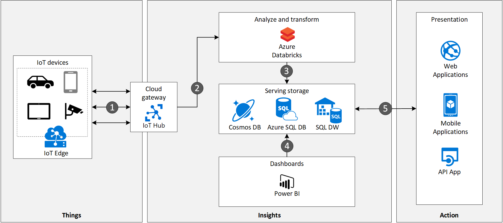
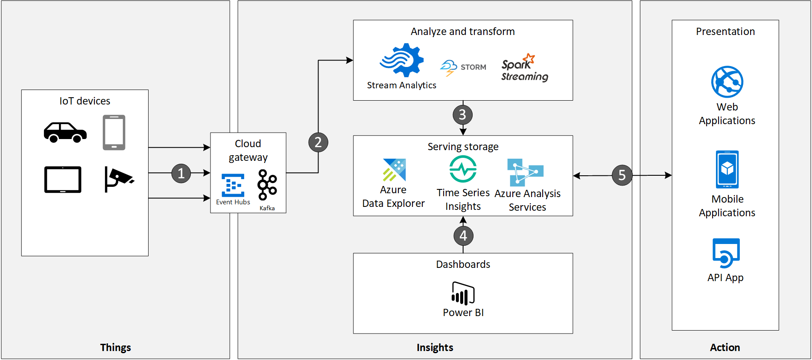

# Ingestion and processing of real-time automotive IoT data

This example scenario builds a real-time data ingestion and processing pipeline to ingest and process messages from IoT devices (in general sensors) into a big data analytic platform in Azure. Vehicle telematics ingestion and processing platforms are the key to create connected car solutions. This specific scenario is motivated by the car telematics ingestion and processing systems. However, the design patterns are relevant for many industries using sensors to manage and monitor complex systems in industries such as smart buildings, communications, manufacturing, retail, and healthcare.

This example demonstrates a real-time data ingestion and processing pipeline for messages from IoT devices installed in vehicles. Thousands and millions of messages (or events) are generated by the IoT devices and sensors. By capturing and analyzing these messages, we can decipher valuable insights and take appropriate actions. For example, with cars equipped telematics devices, if we can capture the device (IoT) messages in real time, we would be able to monitor the live location of vehicles, plan optimized routes, provide assistance to drivers, and support telematics-related industries such as auto insurance.

For this example demonstration, imagine a car manufacturing company that wants to create a real-time system to ingest and process messages from telematics devices. The company's goals include:

- Ingest and store data in real time from vehicles sensors and devices.
- Analyze the messages to understand vehicle location, and other information emitted through different types of sensors (such as engine-related sensors and environment-related sensors).
- Store the data after analysis for other downstream processing to provide actionable insights (For example, in accident scenarios, insurance agencies may be interested to know what happened during an accident etc.)

## Relevant use cases

Other relevant use cases include:

- Vehicle maintenance reminders and alerting.
- Location-based services for the vehicle passengers (that is, SOS).
- Autonomous (self-driving) vehicles.

## Architecture

In a typical big data processing pipeline implementation, the data flows from left to right. In this real-time big data processing pipeline, the data flows through the solution as follows:

1. Events generated from the IoT data sources are sent to the stream ingestion layer through Azure HDInsight Kafka as a stream of messages. HDInsight Kafka stores streams of data in topics for a configurable amount of time.
2. Kafka consumer, Azure Databricks, picks up the message in real time from the Kafka topic, to process the data based on the business logic and can then send to Serving layer for storage.
3. Downstream storage services, like Azure Cosmos DB, Azure SQL Data warehouse, or Azure SQL DB, will then be a data source for presentation and action layer.
4. Business analysts can use Microsoft Power BI to analyze warehoused data. Other applications can be built on the serving layer as well. For example, we can expose APIs based on the service layer data for third-party uses.

### Components

IoT device-generated events (data or messages) are ingested, processed, and then stored for further analysis, presentation, and action, using the following Azure components:

- [Apache Kafka on HDInsight](/azure/hdinsight/kafka/apache-kafka-introduction) is in the ingestion layer. The data is written into the Kafka topic using a Kafka producer API.
- [Azure Databricks](https://azure.microsoft.com/services/databricks) is located in the transformation and analytics layer. Databricks notebooks implement a Kafka consumer API to read the data from the Kafka topic.
- [Azure Cosmos DB](https://azure.microsoft.com/services/cosmos-db), [Azure SQL Database](/azure/sql-database/sql-database-technical-overview), and Azure Synapse Analytics are in the Serving storage layer, where Azure Databricks can write the data via data connectors.
- [Azure Synapse](/azure/sql-data-warehouse/sql-data-warehouse-overview-what-is) is a distributed system for storing and analyzing large datasets. Its use of massive parallel processing (MPP) makes it suitable for running high-performance analytics.
- [Power BI](/power-bi) is a suite of business analytics tools to analyze data and share insights. Power BI can query a semantic model stored in Analysis Services, or it can query Azure Synapse directly.
- [Azure Active Directory (Azure AD)](/azure/active-directory) authenticates users, when connecting to [Azure Databricks](https://azure.microsoft.com/services/databricks). If we would build a cube in [Analysis Services](/azure/analysis-services) based on the model based on Azure Synapse data, we could use Azure AD to connect to the Analysis Services server through Power BI. Data Factory can also use Azure AD to authenticate to Azure Synapse via a service principal or Managed Service Identity (MSI).
- [Azure App Services](/azure/app-service/app-service-web-overview), in particular [API App](https://azure.microsoft.com/services/app-service/api) can be used to expose data to third parties, based on the data stored in the Serving Layer.

## Alternatives

A more generalized big data pipeline could be implemented using other Azure components.

- In the stream ingestion layer, we could use [IoT Hub](https://azure.microsoft.com/services/iot-hub) or [Event Hub](https://azure.microsoft.com/services/event-hubs), instead of [HDInsight Kafka](/azure/hdinsight/kafka/apache-kafka-introduction) to ingest data.
- In the transformation and analytics layer, we could use [HDInsight Storm](/azure/hdinsight/storm/apache-storm-overview), [HDInsight Spark](/azure/hdinsight/spark/apache-spark-overview), or [Azure Stream Analytics](https://azure.microsoft.com/services/stream-analytics).
- [Analysis Services](/azure/analysis-services) provides a semantic model for your data. It can also increase system performance when analyzing your data. You can build the model based on Azure DW data.

## Considerations

The technologies in this architecture were chosen based on the scale needed to process events, the SLA of the services, the cost management and ease of management of the components.

- Managed [HDInsight Kafka](/azure/hdinsight/kafka/apache-kafka-introduction) comes with a 99.9% SLA is integrated with Azure managed disks.
- [Azure Databricks](/azure/azure-databricks/what-is-azure-databricks) is optimized from the ground up for performance and cost-efficiency in the cloud. The Databricks Runtime adds several key capabilities to Apache Spark workloads that can increase performance and reduce costs by as much as 10-100x when running on Azure, including:
- Azure Databricks integrates deeply with Azure databases and stores: [Azure Synapse](/azure/sql-data-warehouse), [Azure Cosmos DB](https://azure.microsoft.com/services/cosmos-db), [Azure Data Lake Storage](https://azure.microsoft.com/services/storage/data-lake-storage), and [Azure Blob Storage](https://azure.microsoft.com/services/storage/blobs)
  - Autoscaling and autotermination for Spark clusters to automatically minimize costs.
  - Performance optimizations including caching, indexing, and advanced query optimization, which can improve performance by as much as 10-100x over traditional Apache Spark deployments in cloud or on-premises environments.
  - Integration with Azure Active Directory enables you to run complete Azure-based solutions using Azure Databricks.
  - Role-based access in Azure Databricks enables fine-grained user permissions for notebooks, clusters, jobs, and data.
  - Comes with Enterprise-grade SLAs.
- Azure Cosmos DB is Microsoft’s globally distributed, multi-model database. Azure Cosmos DB was built from the ground up with global distribution and horizontal scale at its core. It offers turnkey global distribution across any number of Azure regions by transparently scaling and replicating your data wherever your users are. You can elastically scale throughput and storage worldwide, and pay only for the throughput and storage you need.
- The massively parallel processing architecture of Azure Synapse provides scalability and high performance.
- Azure Synapse has guaranteed SLAs and recommended practices for achieving high availability.
- When analysis activity is low, the company can scale Azure Synapse on demand, reducing or even pausing compute to lower costs.
- The Azure Synapse security model provides connection security, authentication, and authorization via Azure AD or SQL Server authentication, and encryption.

## Pricing

Review [Azure Databricks pricing](https://azure.microsoft.com/pricing/details/databricks), [Azure HDInsight pricing](https://azure.microsoft.com/pricing/details/hdinsight), [pricing sample for a data warehousing scenario](https://azure.com/e/b798fb70c53e4dd19fdeacea4db78276) via the Azure pricing calculator. Adjust the values to see how your requirements affect your costs.

- [Azure HDInsight](/azure/hdinsight) is a fully managed cloud service that makes it easy, fast, and cost-effective to process massive amounts of data
- [Azure Databricks](https://azure.microsoft.com/services/databricks) offers two distinct workloads on several [VM Instances](https://azure.microsoft.com/pricing/details/databricks/#instances) tailored for your data analytics workflow &mdash; the Data Engineering workload makes it easy for data engineers to build and execute jobs, and the Data Analytics workload makes it easy for data scientists to explore, visualize, manipulate, and share data and insights interactively.
- [Azure Cosmos DB](https://azure.microsoft.com/services/cosmos-db) guarantees single-digit-millisecond latencies at the 99th percentile anywhere in the world, offers [multiple well-defined consistency models](/azure/cosmos-db/consistency-levels) to fine-tune performance, and guarantees high availability with multi-homing capabilities &mdash; all backed by industry leading comprehensive [service level agreements](https://azure.microsoft.com/support/legal/sla/cosmos-db) (SLAs).
- [Azure Synapse](https://azure.microsoft.com/pricing/details/sql-data-warehouse/gen2) allows you to scale your compute and storage levels independently. Compute resources are charged per hour, and you can scale or pause these resources on demand. Storage resources are billed per terabyte, so your costs will increase as you ingest more data.
- [Analysis Services](https://azure.microsoft.com/pricing/details/analysis-services) is available in developer, basic, and standard tiers. Instances are priced based on query processing units (QPUs) and available memory. To keep your costs lower, minimize the number of queries you run, how much data they process, and how often they run.
- [Power BI](https://powerbi.microsoft.com/pricing) has different product options for different requirements. [Power BI Embedded](https://azure.microsoft.com/pricing/details/power-bi-embedded) provides an Azure-based option for embedding Power BI functionality inside your applications. A Power BI Embedded instance is included in the pricing sample above.

## Next Steps

- Review the [Real-time analytics](https://azure.microsoft.com/solutions/architecture/real-time-analytics) reference architecture that includes big data pipeline flow.
- Review the [Advanced analytics on big data](https://azure.microsoft.com/solutions/architecture/advanced-analytics-on-big-data) reference architecture to get a peek on how different Azure components can help build a big data pipeline.
- Read the [Real time processing](/azure/architecture/data-guide/big-data/real-time-processing) Azure documentation to get a quick view of how different Azure components help in processing streams of data in real time.
- Find comprehensive architectural guidance on data pipelines, data warehousing, online analytical processing (OLAP), and big data in the [Azure Data Architecture Guide](/azure/architecture/data-guide).
