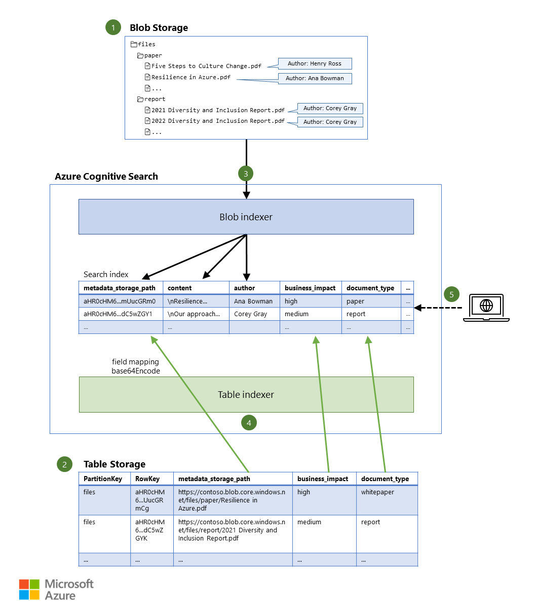

This article demonstrates how to create a search experience that enables users to search for documents based on document content in addition to any metadata that's associated with the files.

You can achieve this by using [multiple indexers](/azure/search/search-indexer-overview#indexer-scenarios-and-use-cases) in [Azure Cognitive Search](/azure/search/search-what-is-azure-search). This example workload shows how to create a single [search index](/azure/search/search-what-is-an-index) that's based on files in [Azure Blob Storage](/azure/storage/blobs/storage-blobs-overview). The file metadata is stored in [Azure Table Storage](/azure/storage/tables/table-storage-overview).

## Architecture

*Download a [PowerPoint file](https://arch-center.azureedge.net/search-blob-metadata.pptx) of this architecture.*

### Dataflow

1. Files are stored in Blob Storage, possibly together with a limited amount of metadata (for example, the document's author).
2. Additional metadata is stored in Table Storage, which allows the storage of significantly more information for each document.
3. An indexer reads the contents of each file, together with any blob metadata, and stores the data in the search index.
4. Another indexer reads the additional metadata from the table and stores it in the same search index.
5. A search query is sent to the search service. The query returns matching documents, based on both document content and document metadata.

### Components

- [Blob Storage](https://azure.microsoft.com/products/storage/blobs/) provides cost-effective cloud storage for file data, including data in formats like PDF, HTML, and CSV, and Microsoft Office files.
- [Table Storage](https://azure.microsoft.com/products/storage/tables/) provides storage for non-relational structured data. In this scenario, it's used to store the metadata for each document.
- [Azure Cognitive Search](https://azure.microsoft.com/products/search/) is a fully managed search service that provides infrastructure, APIs, and tools for building a rich search experience.

### Alternatives

This scenario uses [indexers in Azure Cognitive Search](/azure/search/search-indexer-overview) to automatically discover new content in supported data sources (like blob and table storage) and add it to the search index. Alternatively, you can use the APIs provided by Azure Cognitive Search to [push data to the search index](/azure/search/search-what-is-data-import#pushing-data-to-an-index). If you do, however, you need to write code to push the data into the search index and also to parse and extract text from the binary documents that you want to search through. The [Blob Storage indexer supports many document formats](/azure/search/search-howto-indexing-azure-blob-storage#supported-document-formats), which significantly simplifies the text extraction and indexing process.

Also, if you use indexers, you can optionally [enrich the data as part of an indexing pipeline](/azure/search/cognitive-search-concept-intro). For example, you can inject cognitive services to perform [optical character recognition (OCR)](/azure/search/cognitive-search-skill-ocr) or [visual analysis](/azure/search/cognitive-search-skill-image-analysis) of the images in documents, [detect the language](/azure/search/cognitive-search-skill-language-detection) of documents, [translate](/azure/search/cognitive-search-skill-text-translation) them, or define your own [custom skills](/azure/search/cognitive-search-create-custom-skill-example) to enrich the data in any way that's relevant to your business scenario.

This architecture uses blob and table storage because they're cost-effective and efficient. This design also enables combined storage of the documents and metadata in a single storage account. Alternative supported data sources for the documents themselves include [Azure Data Lake Storage](/azure/search/search-howto-index-azure-data-lake-storage) and [Azure Files](/azure/search/search-file-storage-integration). Document metadata can be stored in any other supported data source that holds structured data, like [Azure SQL Database](/azure/search/search-howto-connecting-azure-sql-database-to-azure-search-using-indexers) and [Azure Cosmos DB](/azure/search/search-howto-index-cosmosdb).

## Scenario details

### Searching file content

This solution enables users to search for documents based on both file content and additional metadata that's stored separately for each document. In addition to searching the text content of a document, a user might want to search for the document's author, the document type (like *paper* or *report*), or its business impact (like *high*, *medium*, or *low*).

[Azure Cognitive Search](/azure/search/search-what-is-azure-search) is a fully managed search service that can create [search indexes](/azure/search/search-what-is-an-index) that contain the information that you want to allow users to search for.

Because the files being searched in this scenario are binary documents, you can store them in [Blob Storage](/azure/storage/blobs/storage-blobs-overview). If you do, Azure Cognitive Search can use its built-in [Blob Storage indexer](/azure/search/search-howto-indexing-azure-blob-storage) to automatically extract text from them and add their content to the search index.

### Searching file metadata

To include additional information on these files, blobs can have [metadata](/azure/storage/blobs/storage-blob-properties-metadata) directly associated with them, without the need for a separate data store. The built-in [Azure Blob Storage search indexer can even read this metadata](/azure/search/search-howto-indexing-azure-blob-storage#indexing-blob-metadata) and place it in the search index as well. This allows us to not only search for the file contents, but also for their metadata. However, [the total size of metadata is limited to 8KB per blob](/rest/api/storageservices/Setting-and-Retrieving-Properties-and-Metadata-for-Blob-Resources#Subheading1), which means the amount of information that can be placed on each blob is fairly small. For example, we could choose to store only the most critical information on the blobs directly, such as the document's *author* in our case.

To overcome this storage size limitation, we can place additional metadata in another [data source with a supported indexer](/azure/search/search-indexer-overview#supported-data-sources), such as [Table storage](/azure/storage/tables/table-storage-overview). We can add the *document type*, *business impact* and many other metadata values as separate columns in the table. By configuring the built-in [Azure Table Storage indexer](/azure/search/search-howto-indexing-azure-tables) to target the same search index, both the Blob and Table storage metadata is combined for each document within the search index.

### Using multiple data sources for a single search index

We ensure that both indexers point at the same document in the search index by configuring the [document key in the search index](/azure/search/search-what-is-an-index#field-attributes) to be a unique identifier of the file. We then refer to the file using this unique identifer from both data sources. The [Blob indexer uses the `metadata_storage_path` as the document key by default](/azure/search/search-howto-indexing-azure-blob-storage#add-search-fields-to-an-index). The `metadata_storage_path` property is the full URL of the file in Blob storage, such as `https://contoso.blob.core.windows.net/files/paper/Resilience in Azure.pdf`. The indexer will also Base64-encode it to ensure that there are no invalid characters in the document key, so that it results in a unique document key such as `aHR0cHM6...mUucGRm0`.

If we add the `metadata_storage_path` as a column in Table storage, we know exactly which blob the metadata belongs to in the other columns. This leaves us free to use any `PartitionKey` and `RowKey` in the table for our use case. For example, we could use the container name of the blobs as the `PartitionKey` and the Base64-encoded full URL of the blob as the `RowKey` - ensuring that there are no [invalid characters in these keys](/rest/api/storageservices/understanding-the-table-service-data-model#characters-disallowed-in-key-fields) either.

We can then use a [field mapping](/azure/search/search-indexer-field-mappings) in the Table indexer to map the `metadata_storage_path` column in Table storage (or another column name if we choose) to the `metadata_storage_path` document key field in the search index. By applying the [base64Encode function](/azure/search/search-indexer-field-mappings#base64EncodeFunction) on the field mapping, we end up with the same document key (such as `aHR0cHM6...mUucGRm0` from the example above) and the metadata from Table storage will be added to the same document that was extracted from Blob storage.

> [!NOTE]
> The Table indexer documentation recommends that you [don't define a field mapping to alternative unique string field in your table](/azure/search/search-howto-indexing-azure-tables#add-search-fields-to-an-index:~:text=Do%20not%20define%20a%20field%20mapping%20to%20alternative%20unique%20string%20field%20in%20your%20table). This is because it concatenates the `PartitionKey` and `RowKey` as the document key, by default. Since we're already relying on the document key as configured by the Blob indexer (which is the Base64-encoded full URL of the blob), creating a field mapping to ensure both indexers refer to the same document in the search index is appropriate and supported for this scenario.

Alternatively, the `RowKey` (which we had set to the Base64-encoded full URL of the blob) could also have been mapped to the `metadata_storage_path` document key directly, without having to store it separately and Base64-encode it as part of the field mapping. However, keeping the unencoded URL as a separate column makes it obvious which blob it refers to, and allows the partition and row keys to be decided without impact to the search indexer.

### Potential use cases

This scenario applies to any application in any industry which requires the ability to search for documents based on their file contents and additional metadata.

## Considerations

These considerations implement the pillars of the Azure Well-Architected Framework, which is a set of guiding tenets that can be used to improve the quality of a workload. For more information, see [Microsoft Azure Well-Architected Framework](/azure/architecture/framework).

### Reliability

Reliability ensures your application can meet the commitments you make to your customers. For more information, see [Overview of the reliability pillar](/azure/architecture/framework/resiliency/overview).

Azure Cognitive Search provides a [99.9% availability SLA](https://go.microsoft.com/fwlink/?LinkId=716855) for *reads* (that is, querying) if you have at least two [replicas](/azure/search/search-capacity-planning#concepts-search-units-replicas-partitions-shards), and for *updates* (that is, updating the search indexes) if you have at least three replicas. Therefore, you should provision at least two replicas if you want your users to be able to *search* reliably, and three if actual *changes to the index* should also be considered high availability operations.

[Azure Storage always stores multiple copies of your data](/azure/storage/common/storage-redundancy) so that it's protected from planned and unplanned events, and it has additional redundancy options to replicate data across regions. This includes the data in Blob and Table storage.

### Security

Security provides assurances against deliberate attacks and the abuse of your valuable data and systems. For more information, see [Overview of the security pillar](/azure/architecture/framework/security/overview).

Azure Cognitive Search provides [robust security controls](/azure/search/search-security-overview) that span network security, authentication/authorization, data residency and protection, and administrative controls to maintain security, privacy, and compliance.

Whenever possible, you should use [Azure AD authentication](/azure/search/search-security-rbac) for accessing the search service itself, and [connect your search service to other Azure resources (like Blob and Table storage in this scenario) using a managed identity](/azure/search/search-howto-managed-identities-data-sources).

Furthermore, you can [connect from the search service to the storage account through a private endpoint](/azure/search/search-indexer-howto-access-private?tabs=portal-create%2Cportal-status). This allows the indexers to use a private connection, without requiring the blob and table storage to be accessible publicly.

### Cost optimization

Cost optimization is about looking at ways to reduce unnecessary expenses and improve operational efficiencies. For more information, see [Overview of the cost optimization pillar](/azure/architecture/framework/cost/overview).

To explore the cost of running this scenario, all the services mentioned above are [pre-configured in the Azure pricing calculator](https://azure.com/e/375d2b930db14fbe90537421331f41de) for an example with a total document size of 20 GB in Blob storage and 1 GB of additional metadata in Table storage. We've chosen two search units to satisfy the SLA for read purposes, as explained in the [reliability](#reliability) section above. To see how the pricing would change for your particular use case, change the appropriate variables to match your expected usage.

As you can see from the pricing calculator, Blob and Table storage make up only a fraction of the cost; the majority is spent on Azure Cognitive Search as it performs the actual indexing and compute for running search queries.

## Deploy this scenario

To deploy this example workload, see the [Indexing file contents and metadata in Azure Cognitive Search](https://github.com/Azure-Samples/azure-cognitive-search-blob-metadata) repository in the Azure Samples. The sample allows you to easily:
- create the necessary Azure services
- upload a few sample documents to Blob storage
- populate the *author* metadata value on the blob
- store the *document type* and *business impact* metadata values in Table storage
- create the indexers which maintain the search index

## Contributors

*This article is maintained by Microsoft. It was originally written by the following contributors.*

- [Jelle Druyts](https://www.linkedin.com/in/jelle-druyts-0b76823) | Principal Customer Experience Engineer

## Next steps

To learn more, see these resources:

- [Get started with Azure Cognitive Search](/azure/search/search-what-is-azure-search#how-to-get-started)
- [Increase relevancy using Semantic search in Azure Cognitive Search](/azure/search/semantic-search-overview)
- [Security filters for trimming results in Azure Cognitive Search](/azure/search/search-security-trimming-for-azure-search)

## Related resources

- [Choose a search data store in Azure](/azure/architecture/data-guide/technology-choices/search-options)
- [Intelligent product search engine for e-commerce](/azure/architecture/example-scenario/apps/ecommerce-search)
- For another example of using multiple indexers, see [Tutorial: Index from multiple data sources using the .NET SDK](/azure/search/tutorial-multiple-data-sources)
