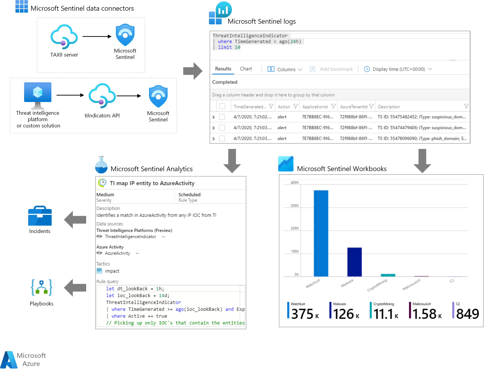

This article describes how a cloud-based *Security Information and Event Management (SIEM)* solution like [Microsoft Sentinel](/azure/sentinel/overview) can use *threat indicators* to detect, provide context, and inform responses to existing or potential cyber threats.

## Architecture



*Download a [Visio file](https://arch-center.azureedge.net/sentinel-threat-intelligence.vsdx) of this architecture.*

### Workflow

You can use Microsoft Sentinel to:

- Import threat indicators from [Structured Threat Information Expression (STIX) and Trusted Automated Exchange of Intelligence Information (TAXII)](https://oasis-open.github.io/cti-documentation) servers, or any *threat intelligence platform (TIP)* solution
- View and query threat indicator data
- Create analytics rules to generate security alerts, incidents, and automated responses from CTI data
- Visualize key CTI information in workbooks

#### Threat indicator data connectors

Microsoft Sentinel imports threat indicators, like all other event data, using data connectors. The two Microsoft Sentinel data connectors for threat indicators are **Threat Intelligence – TAXII** and **Threat Intelligence Platforms**. Depending on where your organization gets its threat indicator data, you can use either or both data connectors. Enable the data connectors in each workspace where you want to receive the data.

##### Threat Intelligence – TAXII data connector

The most widely adopted industry standard for CTI transmission is the [STIX data format and TAXII protocol](https://oasis-open.github.io/cti-documentation). Organizations that get threat indicators from current STIX/TAXII version 2.x solutions can import their threat indicators into Microsoft Sentinel using the **Threat Intelligence – TAXII** data connector. The built-in Microsoft Sentinel TAXII client imports threat intelligence from TAXII 2.x servers.

For detailed instructions for importing STIX/TAXII threat indicator data into Microsoft Sentinel, see [Import threat indicators with the TAXII data connector](#import-threat-indicators-with-the-taxii-data-connector).

##### Threat Intelligence Platforms data connector

Many organizations use TIP solutions like MISP, Anomali ThreatStream, ThreatConnect, or Palo Alto Networks MineMeld to aggregate threat indicator feeds from various sources. Organizations use the TIP to curate the data, and then choose which threat indicators to apply to security solutions like network devices, advanced threat protection solutions, or SIEMs like Microsoft Sentinel. The **Threat Intelligence Platforms** data connector lets organizations use their integrated TIP solution with Microsoft Sentinel.

The Threat Intelligence Platforms data connector uses the [Microsoft Graph Security tiIndicators API](/graph/api/resources/tiindicator?view=graph-rest-beta). Any organization that has a custom TIP can use this data connector to leverage the **tiIndicators** API and send indicators to Microsoft Sentinel and other Microsoft security solutions like [Defender ATP](https://www.microsoft.com/microsoft-365/windows/microsoft-defender-atp).

For detailed instructions for importing TIP data into Microsoft Sentinel, see [Import threat indicators with the Platforms data connector](#import-threat-indicators-with-the-platforms-data-connector).

#### Threat indicator logs

After you import threat indicators into Microsoft Sentinel by using the **Threat Intelligence – TAXII** or **Threat Intelligence Platforms** data connectors, you can view the imported data in the **ThreatIntelligenceIndicator** table in **Logs**, where all Microsoft Sentinel event data is stored. Microsoft Sentinel features like **Analytics** and **Workbooks** also use this table.

For detailed instructions for working with the threat indicators log, see [Work with threat indicators in Microsoft Sentinel](/azure/sentinel/work-with-threat-indicators).

#### Microsoft Sentinel Analytics

The most crucial use for threat indicators in SIEM solutions is to power analytics that matches events with threat indicators to produce security alerts, incidents, and automated responses. Microsoft Sentinel Analytics creates analytics rules that trigger on schedule to generate alerts. You express rule parameters as queries, and configure how often the rule runs, what query results generate security alerts and incidents, and any automated responses to the alerts.

You can create new analytics rules from scratch or a set of built-in Microsoft Sentinel rule templates that you can use or modify to meet your needs. The analytics rule templates that match threat indicators with event data are all titled starting with **TI map**, and all work similarly. The differences are which type of threat indicators to use: domain, email, file hash, IP address, or URL, and which event types to match against. Each template lists the required data sources for the rule to function, so you can see if you have the necessary events already imported in Microsoft Sentinel.

For detailed instructions for creating an analytics rule from a template, see [Create an Analytics rule from a template](#create-an-analytics-rule-from-a-template).

In Microsoft Sentinel, enabled analytics rules are on the **Active rules** tab of the **Analytics** section. You can edit, enable, disable, duplicate, or delete active rules.

Generated security alerts are in the **SecurityAlert** table in the **Logs** section of Microsoft Sentinel. The security alerts also generate security incidents in the **Incidents** section. Security operations teams can triage and investigate the incidents to determine appropriate responses. For more information, see [Tutorial: Investigate incidents with Microsoft Sentinel](/azure/sentinel/tutorial-investigate-cases).

You can also designate automation to trigger when the rules generate security alerts. Automation in Microsoft Sentinel uses **Playbooks**, powered by Azure Logic Apps. For more information, see [Tutorial: Set up automated threat responses in Microsoft Sentinel](/azure/sentinel/tutorial-respond-threats-playbook).

#### Microsoft Sentinel Threat Intelligence Workbook

Workbooks provide powerful interactive dashboards that give you insights into all aspects of Microsoft Sentinel. You can use a Microsoft Sentinel workbook to visualize key CTI information. The provided templates provide a starting point, and you can easily customize the templates for your business needs, create new dashboards that combine many different data sources, and visualize your data in unique ways. Microsoft Sentinel workbooks are based on [Azure Monitor workbooks](/azure/azure-monitor/app/usage-workbooks), so extensive documentation and templates are available.

For detailed instructions on viewing and editing the Microsoft Sentinel Threat Intelligence Workbook, see [View and edit the Threat Intelligence Workbook](#view-and-edit-the-threat-intelligence-workbook).

### Alternatives

- Threat indicators provide useful context in other Microsoft Sentinel experiences like **Hunting** and **Notebooks**. For more information about using CTI in **Notebooks**, see [Jupyter Notebooks in Sentinel](https://techcommunity.microsoft.com/t5/azure-sentinel/using-threat-intelligence-in-your-jupyter-notebooks/ba-p/860239).

- Any organization that has a custom TIP can use the [Microsoft Graph Security tiIndicators API](/graph/api/resources/tiindicator?view=graph-rest-beta) to send threat indicators to other Microsoft security solutions like [Defender ATP](https://www.microsoft.com/microsoft-365/windows/microsoft-defender-atp).

- Microsoft Sentinel provides many other built-in data connectors to Microsoft solutions like Microsoft Threat Protection, Microsoft 365 sources, and Microsoft Defender for Cloud Apps. There are also built-in connectors to the broader security ecosystem for non-Microsoft solutions. You can also use common event format, Syslog, or REST API to connect your data sources with Microsoft Sentinel. For more information, see [Connect data sources](/azure/sentinel/connect-data-sources).

## Scenario details

*Cyber threat intelligence (CTI)* can come from many sources, such as open-source data feeds, threat intelligence sharing communities, paid intelligence feeds, and security investigations within organizations. CTI can range from written reports on a threat actor's motivations, infrastructure, and techniques, to specific observations of IP addresses, domains, and file hashes. CTI provides essential context for unusual activity, so security personnel can act quickly to protect people and assets.

The most utilized CTI in SIEM solutions like Microsoft Sentinel is threat indicator data, sometimes called *Indicators of Compromise (IoCs)*. Threat indicators associate URLs, file hashes, IP addresses, and other data with known threat activity like phishing, botnets, or malware. This form of threat intelligence is often called *tactical threat intelligence* because security products and automation can use it on a large scale to protect and detect potential threats. Microsoft Sentinel can help detect, respond to, and provide CTI context for malicious cyber activity.

### Potential use cases

- Connect to open-source threat indicator data from public servers to identify, analyze, and respond to threat activity.
- Use existing threat intelligence platforms or custom solutions with the Microsoft Graph **tiIndicators** API to connect and control access to threat indicator data.
- Provide CTI context and reporting for security investigators and stakeholders.

## Considerations

- The Microsoft Sentinel Threat Intelligence data connectors are currently in public preview. Certain features might not be supported or might have constrained capabilities.

- Microsoft Sentinel uses *Azure role-based access control (Azure RBAC)* to assign built-in roles **Contributor**, **Reader**, and **Responder** to users, groups, and Azure services. These can interact with Azure roles (Owner, Contributor, Reader) and Log Analytics roles (Log Analytics reader, Log Analytics contributor). You can create custom roles and use advanced Azure RBAC on the data you store in Microsoft Sentinel. For more information, see [Permissions in Microsoft Sentinel](/azure/sentinel/roles).

- Microsoft Sentinel is free for the first 31 days on any Azure Monitor Log Analytics workspace. Afterwards, you can use Pay-As-You-Go or Capacity Reservations models for the data you ingest and store. For details, see [Microsoft Sentinel pricing](https://azure.microsoft.com/pricing/details/azure-sentinel).

## Deploy this scenario

The following sections provide detailed steps on how to:

- Enable the [Threat Intelligence – TAXII](#import-threat-indicators-with-the-taxii-data-connector) and [Threat Intelligence Platforms](#import-threat-indicators-with-the-platforms-data-connector) data connectors.
- Create an example Microsoft Sentinel [Analytics rule](#create-an-analytics-rule-from-a-template) to generate security alerts and incidents from CTI data.
- View and edit the Microsoft Sentinel [Threat Intelligence Workbook](#view-and-edit-the-threat-intelligence-workbook).

### Import threat indicators with the TAXII data connector

> [!WARNING]
> The following instructions use Limo, Anomali's free STIX/TAXII feed. This feed has [reached end-of-life and is no longer being updated](https://www.anomali.com/resources/limo). The following instructions cannot be completed as written. You can substitute this feed with another API-compatible feed you can access.

TAXII 2.x servers advertise API Roots, which are URLs that host threat intelligence collections. If you already know the TAXII server **API Root** and **Collection ID** you want to work with, you can skip ahead and just enable the TAXII connector in Microsoft Sentinel.

If you don't have the API Root, you can usually get it from the threat intelligence provider's documentation page, but sometimes the only information available is the discovery endpoint URL. You can find the API Root using the discovery endpoint. The following example uses the discovery endpoint of the [Anomali Limo](https://www.anomali.com/community/limo) ThreatStream TAXII 2.0 server.

1. From a browser, navigate and sign in to the ThreatStream TAXII 2.0 server discovery endpoint, `https://limo.anomali.com/taxii`, using the username *guest* and password *guest*. After you sign in, you see the following information:

   ```json
   {
      "api_roots":
      [
          "https://limo.anomali.com/api/v1/taxii2/feeds/",
          "https://limo.anomali.com/api/v1/taxii2/trusted_circles/",
          "https://limo.anomali.com/api/v1/taxii2/search_filters/"
      ],
      "contact": "info@anomali.com",
      "default": "https://limo.anomali.com/api/v1/taxii2/feeds/",
      "description": "TAXII 2.0 Server (guest)",
      "title": "ThreatStream Taxii 2.0 Server"
   }
   ```

1. To browse collections, enter the API Root you got from the previous step into your browser: `https://limo.anomali.com/api/v1/taxii2/feeds/collections/`. You see information like:

   ```json
   {
    "collections":
    [
        {
            "can_read": true,
            "can_write": false,
            "description": "",
            "id": "107",
            "title": "Phish Tank"
        },
            ...
        {
            "can_read": true,
            "can_write": false,
            "description": "",
            "id": "41",
            "title": "CyberCrime"
        }
    ]
   }
   ```

You now have the information you need to connect Microsoft Sentinel to one or more TAXII server collections provided by Anomali Limo. For example:

| API Root                       | Collection ID |
|--------------------------------|-----------------------------------------------|
| Phish Tank                     | 107                                           |
| CyberCrime                     | 41                                            |

To enable the **Threat Intelligence – TAXII** data connector in Microsoft Sentinel:

1. In the [Azure portal](https://portal.azure.com), search for and select **Microsoft Sentinel**.
2. Select the workspace where you want to import threat indicators from the TAXII service.
3. Select **Data connectors** from the left navigation, search for and select **Threat Intelligence – TAXII (Preview)**, and select **Open connector page**.
4. On the **Configuration** page, enter a **Friendly name (for server)** such as the collection title, the **API root URL** and **Collection ID** you want to import, and **Username** and **Password** if required, and then select **Add**.

   

You see your connection under **List of configured TAXII 2.0 servers**. Repeat the configuration for each collection you want to connect from the same or different TAXII servers.

### Import threat indicators with the Platforms data connector

The **tiIndicators** API needs the **Application (client) ID**, **Directory (tenant) ID**, and **client secret** from your TIP or custom solution to connect and send threat indicators to Microsoft Sentinel. You get this information by registering the TIP or solution app in Azure Active Directory (Azure AD) and granting it the needed permissions.

To do this, refer to [Connect your threat intelligence platform to Microsoft Sentinel](azure/sentinel/connect-threat-intelligence-tip).

### Create an Analytics rule from a template

This example uses the rule template called **TI map IP entity to AzureActivity**, which compares any IP address-type threat indicators with all your Azure Activity IP address events. Any match generates a security alert and a corresponding incident for investigation by your security operations team.

The example assumes you have used one or both threat intelligence data connectors to import threat indicators and the Azure Activity data connector to import your Azure subscription-level events. You need both data types to use this analytics rule successfully.

1. In the [Azure portal](https://portal.azure.com), search for and select **Microsoft Sentinel**.
1. Select the workspace where you've imported threat indicators with either threat intelligence data connector.
1. In the left navigation, select **Analytics**.
1. On the **Rule templates** tab, search for and select the rule **(Preview) TI map IP entity to AzureActivity**, and then select **Create rule**.
1. On the first **Analytic rule wizard - Create a new rule from the template** page, make sure the rule **Status** is set to **Enabled**, and change the rule name or description if you like. Select **Next: Set rule logic**.

   

   The rule logic page contains the query for the rule, entities to map, rule scheduling, and the number of query results that generate a security alert. The template settings run once an hour, identifies any IP address IoCs that match any IP addresses from Azure events, and generates security alerts for all matches. You can keep these settings or change any of them to meet your needs. When you're finished, select **Next: Incident settings (Preview)**.

1. Under **Incident settings (Preview)**, make sure that **Create incidents from alerts triggered by this analytics rule** is set to **Enabled**, and select **Next: Automated response**.

   This step lets you configure automation to trigger when the rule generates a security alert. Automation in Microsoft Sentinel uses **Playbooks**, powered by Azure Logic Apps. For more information, see [Tutorial: Set up automated threat responses in Microsoft Sentinel](/azure/sentinel/tutorial-respond-threats-playbook). For this example, just select **Next: Review**, and after reviewing the settings, select **Create**.

Your rule activates immediately when created and then triggers on the regular schedule.

### View and edit the Threat Intelligence Workbook

1. In the [Azure portal](https://portal.azure.com), search for and select **Microsoft Sentinel**.
1. Select the workspace where you've imported threat indicators with either threat intelligence data connector.
1. In the left navigation, select **Workbooks**.
1. Search for and select the workbook titled **Threat Intelligence**.
1. Make sure you have the necessary data and connections as shown, and then select **Save**.

   

   In the popup window, select a location, and then select **OK**. This step saves the workbook so you can modify it and save your changes.

1. Select **View saved workbook** to open the workbook and see the default charts the template provides.

To edit the workbook, select **Edit** in the toolbar at the top of the page. You can select **Edit** next to any chart to edit the query and settings for that chart.

To add a new chart that shows threat indicators by threat type:

1. Select **Edit** at the top of the page, scroll to the bottom of the page and select **Add**, and then select **Add query**.
1. Under **Log Analytics workspace Logs Query**, enter the following query:

   ```

   ThreatIntelligenceIndicator
   | summarize count() by ThreatType
   ```

1. Select **Bar chart** in the **Visualization** dropdown, and then select **Done editing**.
1. At the top of the page, select **Done editing** and then select the **Save** icon to save your new chart and workbook.

   

## Next steps

Visit Microsoft Sentinel on [GitHub](https://github.com/Azure/Azure-Sentinel) to see contributions by both the community at large and by Microsoft. Here you'll find new ideas, templates, and conversations about all the feature areas of Microsoft Sentinel.

Microsoft Sentinel workbooks are based on Azure Monitor workbooks, so extensive documentation and templates are available. A great place to start is [Create interactive reports with Azure Monitor workbooks](/azure/azure-monitor/app/usage-workbooks). There is a rich community of Azure Monitor workbook users on [GitHub](https://github.com/microsoft/Application-Insights-Workbooks), where you can download additional templates and contribute your own templates.

To learn more about the featured technologies, see the following articles:

- [What is Microsoft Sentinel?](/azure/sentinel/overview)
- [Quickstart: On-board Microsoft Sentinel](/azure/sentinel/quickstart-onboard)
- [Microsoft Graph Security tiIndicators API](/graph/api/resources/tiindicator)
- [Tutorial: Investigate incidents with Microsoft Sentinel](/azure/sentinel/tutorial-investigate-cases)
- [Tutorial: Set up automated threat responses in Microsoft Sentinel](/azure/sentinel/tutorial-respond-threats-playbook)

## Related resources

- [Automate Sentinel integration with Azure DevOps](/azure/architecture/example-scenario/devops/automate-sentinel-integration)
- [Monitor hybrid security using Microsoft Defender for Cloud and Microsoft Sentinel](/azure/architecture/hybrid/hybrid-security-monitoring)
- [Azure security solutions for AWS](/azure/architecture/guide/aws/aws-azure-security-solutions)
- [Monitor hybrid security using Microsoft Defender for Cloud and Microsoft Sentinel](/azure/architecture/hybrid/hybrid-security-monitoring)
