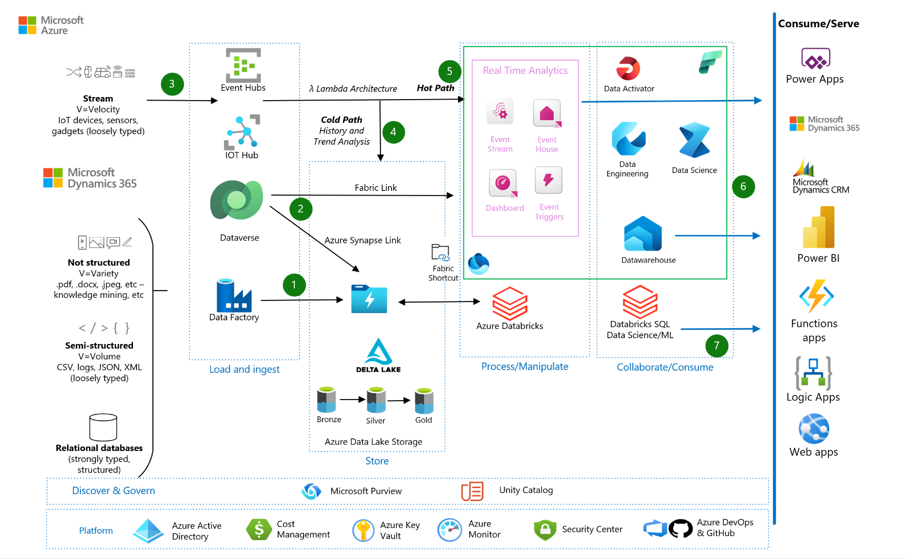

## Introduction
Modern data platform for small and medium business from Azure Databricks to Fabric
 [Laurent and Ames]
 Give details on the scenario
 - Size Lakehouse ~ 600 Gb
 - Databricks for Lakehouse
 - ADF for orchestration
 - Potential reason to incorporate Fabric (keep only the relevant ones for SMB-SMC)
   - Direct Lake Usage
   - Reduce the number of services used
   - SaaS Plaform
   - Graph API call on top of Lakehouse
   - Data Sharing between tenants (https://learn.microsoft.com/en-us/fabric/governance/external-data-sharing-overview)
   - etc
 - Current Customer Architecture (find a simplest diagram)
 

### 1 - Steps to migrate to Read approach in Fabric

- Introduction on the approach
 - Keep ADB for the compute (write)
 - Potential Fabric Notebook for reading scenario
- Focus on One Lake Shortcuts
- Diagram on how to make current lakehouse built on ADB available in Fabric
- Automate/schedule One Lake shortcuts creation
- Orchestration change
Read Approach in Fabric Result (add a link to scenario 3A)
 

### 2 -  Steps to Write approach in Fabric

- Evaluate Batch Approach
  - Leverage Microsoft Spark Utilities
  - Identify any ADB specificities
  - Evaluate the Spark Pool size
- Evaluate Streaming approach
  - Leverage Real Time Analytics for streaming
  - Spark job could be also an option?
- Evaluate Data Governance
  - Leverage Purview in Fabric
- Evaluate Security
  - Leverage One Lake Security
- Build Delta Tables in One Lake using Fabric Notebook
  - Read Delta Tables created by ADB and save them in a OneLake location 
- Fabric Notebook (read/write) to point to OneLake
- Notebook to migrate Data to one OneLake (We don't have 2 different Spark engine to write to the same delta tables)
Write Approach in Fabric Result (Add a link to scenario 5)
 

### Components
- Fabric Data Factory
- Fabric Data Engineering
- MSSpark Utils
- One Lake Shortcuts
- Real Time Analytics
- Direct Lake
- Purview in Fabric
  
### Alternatives
- Keep ADF
- Use Fabric only for Gold Layer to leverage Direct Lake
## Scenario details
### Potential use cases
## Considerations
- ADB notebook migration
### Availability
### Operations
### Cost optimization
- Link to cost optimization in Fabric
- Spark pool size ==> Move to small one
## Contributors
## Next steps

- [Synchronize one Lake with Unity Catalog](https://learn.microsoft.com/en-us/fabric/onelake/onelake-unity-catalog)
- [Spark compute size](https://learn.microsoft.com/en-us/fabric/data-engineering/capacity-settings-management)
- [Microsoft Spark Utilities](https://learn.microsoft.com/en-us/fabric/data-engineering/microsoft-spark-utilities)
- [Real Time in Fabric](https://learn.microsoft.com/en-us/fabric/real-time-intelligence/overview)
- [Purview in Fabric](https://learn.microsoft.com/en-us/fabric/governance/microsoft-purview-fabric)
- [Purview and Unity Catalog](https://learn.microsoft.com/en-us/purview/register-scan-azure-databricks-unity-catalog)
- [One Lake Security](https://learn.microsoft.com/en-us/fabric/onelake/security/get-started-security)
## Related resources
