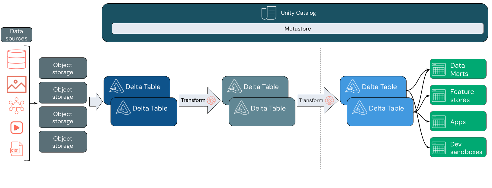

## Introduction
This article outlines the possible steps to migrate your Lakehouse platform from Azure Databricks to Microsoft Fabric, or to use both services in tandem. 

The migration can be split into two steps:
 - Transition to Azure Databricks and Fabric
 - Transition fully to Fabric

The following architecture might be your current state
 

### 1 -  Transitioning read compute from Azure Databricks to Microsoft Fabric

It is recommended to first migrate the Read operations from Azure DataBricks to Fabric. 

To build a bridge between Azure Databricks and Fabric OneLake, we can create shortcuts that allow any Fabric entities such as Lakehouses to access tables created by Azure Databricks without copying them into OneLake. Shortcuts can be created using a notebook: [Integrate Databricks Unity Catalog with OneLake - Microsoft Fabric | Microsoft Learn](https://learn.microsoft.com/fabric/onelake/onelake-unity-catalog) This will make Azure DataBricks Unity Catalog tables available as shortcuts in lakehouses, SQL endpoints, and semantic models. 

You can schedule the notebook or use it in a data pipeline to sync the shortcuts periodically, so that you don’t need to sync tables manually if the metadata changes. New Azure DataBricks tables will be automatically added as shortcuts. 

Orchestration can be migrated to Fabric Data Factory from Azure Data Factory for better integration with Fabric – you will have access to the full range of Data Engineering and other transformation tasks in Fabric. A migration guide can be found here: [Migrate to Data Factory - Microsoft Fabric | Microsoft Learn](https://learn.microsoft.com/fabric/data-factory/upgrade-paths)

Now you can leverage read functionalities for your external data: using a notebook to read from your gold layer, or doing exploratory data analysis using the SQL endpoint for a Lakehouse. You can also query this data from Power BI using Direct Lake mode without copying data into the Power BI engine. More information here: [Direct Lake - Microsoft Fabric | Microsoft Learn](https://learn.microsoft.com/en-us/fabric/get-started/direct-lake-overview)

Your architecture could look like this after adding Fabric:
 

### 2 -  Transitioning write compute from Azure Databricks to Microsoft Fabric

Migrating your data analytics platform from Azure Databricks to Microsoft Fabric involves several key considerations and steps. 
The following guide outlines the main steps, but please note that this list is not exhaustive.

#### Step 1: Evaluate Notebook Migration
- Microsoft Spark Utilities vs. Databricks Utilities (dbutils):
  - Check if [Microsoft Spark Utilities](https://learn.microsoft.com/en-us/fabric/data-engineering/microsoft-spark-utilities) can fulfill your specific requirements.
  - Identify any Azure Databricks-specific features or dependencies outside of [dbutils](https://learn.microsoft.com/en-us/azure/databricks/dev-tools/databricks-utils) that you are currently using.

#### Step 2: Evaluate Real-Time Scenario Migration
- Real-Time Analytics:
 - Determine if Real-Time Analytics in Fabric suits your scenario, especially if you prefer a low-code approach.
- Spark Streaming Jobs:
  - Assess if Fabric's Spark Streaming Jobs meet the needs of more advanced real-time data processing scenarios.
#### Step 3: Evaluate Governance, Monitoring, and Security in Fabric
 - Ensure your requirements for governance, monitoring, and security are covered by Microsoft Fabric.
   You can refer to [the governance and compliance overview provided by Microsoft](https://learn.microsoft.com/en-us/fabric/governance/governance-compliance-overview)
#### Step 4: Confirm the Migration Feasibility
- After evaluating the above aspects, confirm that you can migrate the compute part of your workload to Fabric.
- It's important to re-write your data using Fabric Spark compute to avoid limitations related to having two separate Spark computes writing to Delta Tables. 
For more details, refer to [the OneLake Unity Catalog considerations](https://learn.microsoft.com/en-us/fabric/onelake/onelake-unity-catalog#other-considerations).
#### Step 5: Data Migration
Migrate your data to a new OneLake location. 
Given the scenario involves a volume of 600 GB maximum, performance issues during migration are unlikely.
#### Step 6: Update Your Notebooks
- Replace your Azure Databricks Notebooks with Fabric Notebooks.
- Point the Fabric Notebooks to the new OneLake location for both reading and writing data.

By following these steps, you can  transition from Azure Databricks to Microsoft Fabric, ensuring that your data analytics platform remains efficient and effective. 

Your architecture could look like this after following the guidance:
 

### Components
- [Fabric Data Factory](https://learn.microsoft.com/en-us/fabric/data-factory/)
- [Fabric Data Engineering](https://learn.microsoft.com/en-us/fabric/data-engineering/)
- [One Lake Shortcuts](https://learn.microsoft.com/en-us/fabric/onelake/onelake-shortcuts)
- [Real Time Analytics](https://learn.microsoft.com/en-us/fabric/real-time-intelligence/overview)
- [Purview in Fabric](https://learn.microsoft.com/en-us/fabric/governance/microsoft-purview-fabric)
- [Azure Databricks](https://learn.microsoft.com/en-us/azure/databricks/introduction/)
- [Unity Catalog](https://learn.microsoft.com/en-us/azure/databricks/data-governance/unity-catalog/)
  
### Alternatives
- Orchestration: You can choose to keep Azure Data Factory for orchestration instead of switching to Fabric’s orchestration capabilities.
- Selective Migration: You may opt to migrate only specific layers of your Lakehouse to Fabric, based on your business needs and workload requirements.
## Scenario details
Your enterprise might be considering reducing the number of services you use, leveraging a SaaS platform or specific functionalities of Microsoft Fabric. 
 
It targets small businesses (SMBs) with about 600 GB of data.

## Potential use cases

Here are several scenarios where this transition can be beneficial:

- Enabling Direct Lake scenario: Transitioning now will enable the future use of Direct Lake, setting the stage for advanced capabilities.
- Integration with Fabric personas: By making this transition, you open your lakehouse to personas already using Fabric, ensuring seamless integration and collaboration.
- Streamlined architecture: Reducing the number of services used in your architecture can simplify management and increase efficiency.

## Considerations
These considerations implement the pillars of the Azure Well-Architected Framework, which is a set of guiding tenets that can be used to improve the quality of a workload. For more information, see Microsoft [Azure Well-Architected Framework](https://learn.microsoft.com/en-us/azure/well-architected/).

The following considerations apply to this scenario.
- Link to Scenarios 3a and 5 consideations
### Availability
Whatever the options you decide to take you can rely on Databricks and/or Fabric availability guidance:
- [Fabric availability](https://learn.microsoft.com/en-us/azure/reliability/reliability-fabric)
- [Databricks availability](https://learn.microsoft.com/en-us/azure/databricks/lakehouse-architecture/reliability/best-practices)
### Operations
Whatever the options you decide to take you can rely on Databricks and/or Fabric operations guidance:
- [Fabric operations](https://learn.microsoft.com/en-us/fabric/cicd/cicd-overview)
- [Databricks operations](https://learn.microsoft.com/en-us/azure/databricks/dev-tools/ci-cd/ci-cd-azure-devops)
### Cost optimization
- Based on the size of your data and requirements, consider using a small starter pool for an efficient and cost-effective transition. For more information, refer to [the small starter pool configuration guide](https://learn.microsoft.com/en-us/fabric/data-engineering/configure-starter-pools).
- Link to Scenarios 3a and 5 cost optimization
## Contributors
## Next steps
- [Integrate Unity Catalog with One Lake](https://learn.microsoft.com/en-us/fabric/onelake/onelake-unity-catalog#other-considerations)
- [Fabric Data Pipelines with notebooks](https://learn.microsoft.com/en-us/fabric/data-factory/notebook-activity)
- [Notebooks in Fabric](https://learn.microsoft.com/en-us/fabric/data-engineering/author-execute-notebook)

## Related resources
- [Spark Streaming in Fabric](https://learn.microsoft.com/en-us/fabric/data-engineering/get-started-streaming)
- [Synchronize one Lake with Unity Catalog](https://learn.microsoft.com/en-us/fabric/onelake/onelake-unity-catalog)
- [Spark compute size](https://learn.microsoft.com/en-us/fabric/data-engineering/capacity-settings-management)
- [Microsoft Spark Utilities](https://learn.microsoft.com/en-us/fabric/data-engineering/microsoft-spark-utilities)
- [Monitoring in Fabric](https://learn.microsoft.com/en-us/fabric/admin/monitoring-hub)
- [Real Time in Fabric](https://learn.microsoft.com/en-us/fabric/real-time-intelligence/overview)
- [Purview in Fabric](https://learn.microsoft.com/en-us/fabric/governance/microsoft-purview-fabric)
- [Purview and Unity Catalog](https://learn.microsoft.com/en-us/purview/register-scan-azure-databricks-unity-catalog)
- [One Lake Security](https://learn.microsoft.com/en-us/fabric/onelake/security/get-started-security)
- [Governance in Fabric](https://learn.microsoft.com/en-us/fabric/governance/governance-compliance-overview)
- [Direct Lake](https://learn.microsoft.com/en-us/fabric/get-started/direct-lake-overview)
